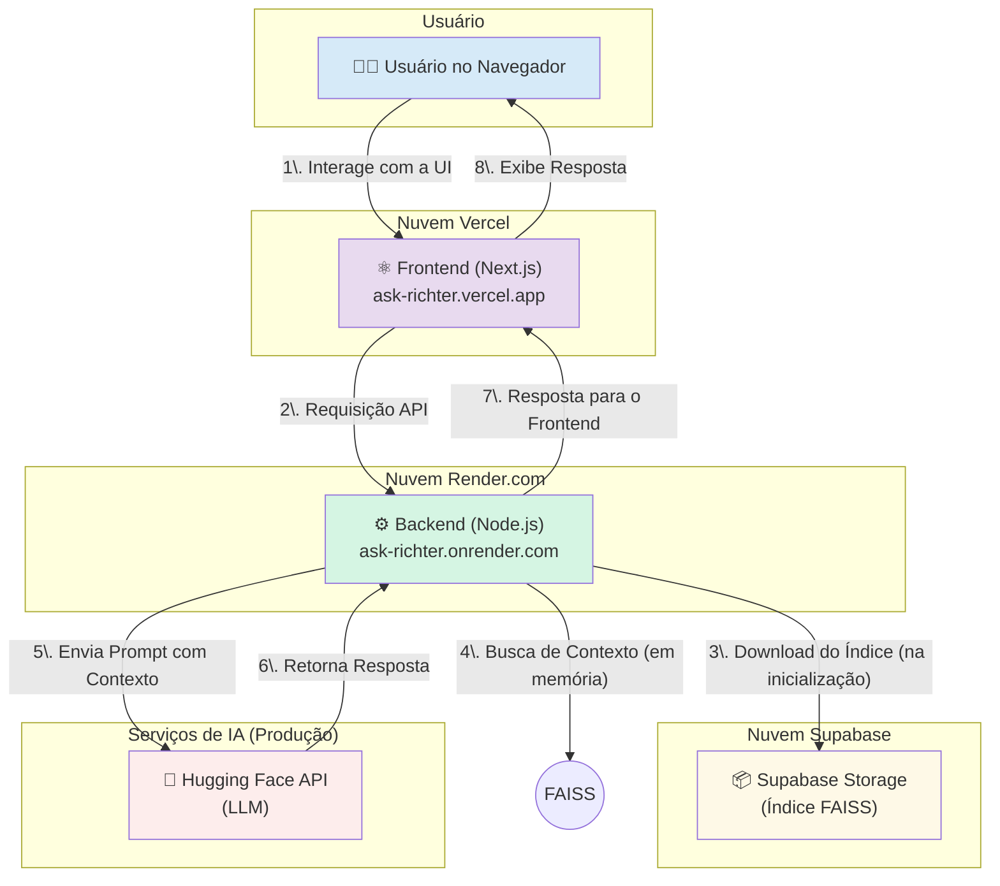
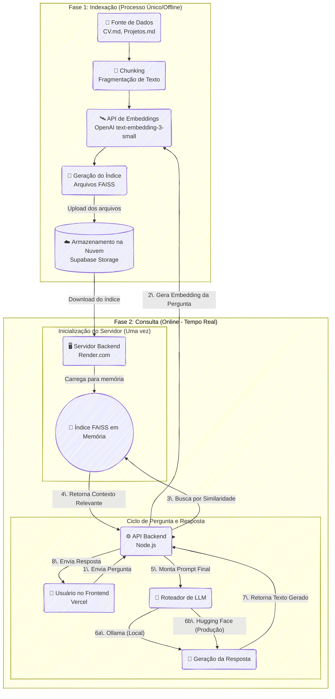

# Ask Richter - Meu CV Interativo com IA

[](https://nodejs.org/)
[](https://www.typescriptlang.org/)
[](https://expressjs.com/)
[](https://nextjs.org/)
[](https://reactjs.org/)
[](https://ollama.com/)
[](https://turbo.build/)
[](https://www.docker.com/)
[](https://vercel.com/)


Este projeto transforma um currículo tradicional em uma experiência de diálogo. O **Ask Richter** é um chatbot especialista na minha trajetória profissional, permitindo que recrutadores e líderes técnicos façam perguntas em linguagem natural e recebam respostas inteligentes e contextuais, baseadas nos meus dados profissionais consolidados.

Mais do que um portfólio, é uma ferramenta de marketing profissional e uma demonstração prática de competências em arquitetura de software moderna, desenvolvimento full-stack e integração com IA.

## 🚀 Principais Features

- **Interface de Chat Conversacional:** Uma UI limpa e reativa para um diálogo fluido.
- **Respostas Contextuais com RAG:** Utiliza a técnica de Retrieval-Augmented Generation, buscando informações em um banco vetorial **FAISS** para gerar respostas precisas.
- **Suporte a LLMs Locais com Ollama:** Configurado por padrão para rodar com modelos de linguagem locais (ex: Llama 3), permitindo testes e uso sem custo e com total privacidade.
- **Arquitetura Full-Stack Moderna:** Backend em Node.js/Express e Frontend em Next.js, ambos com TypeScript.
- **Estrutura em Monorepo:** Organizado com Turborepo para um desenvolvimento integrado e eficiente.


## ☁️ Arquitetura na Nuvem

Este diagrama é uma visão geral, mostrando a interação entre os principais serviços de nuvem.



O frontend hospedado na Vercel se comunica com o backend rodando no Render. O backend utiliza um índice FAISS armazenado no Supabase Storage para busca semântica e interage com modelos de linguagem (Ollama localmente, Hugging Face em produção) para gerar respostas contextuais.

## 🚀 Deploy na Nuvem

### Vercel (Frontend)

O frontend é implantado na Vercel, aproveitando seus recursos de CI/CD contínuo diretamente do repositório GitHub.

* **Deploy Automático:** Qualquer push para a branch principal (ou conforme configurado) aciona um novo build e deploy na Vercel.
* **Variáveis de Ambiente:** A URL base da API do backend (Render) é configurada como uma variável de ambiente (`NEXT_PUBLIC_API_BASE_URL`) nas configurações do projeto na Vercel.
* **Build Ignorado (Opcional):** Para otimizar os builds, você pode configurar a Vercel para ignorar builds se apenas arquivos do backend forem modificados, usando as configurações de "Ignored Build Step".

### Render (Backend)

O backend é implantado no Render.com, uma plataforma de hospedagem de aplicações e APIs.

* **Deploy Contínuo do Git:** O Render está configurado para monitorar a branch principal do repositório e realizar um deploy automático em cada push.
* **Variáveis de Ambiente:** Variáveis de ambiente cruciais como `OPENAI_API_KEY`, `HUGGINGFACE_API_KEY`, `SUPABASE_URL`, `SUPABASE_SERVICE_ROLE_KEY`, `SUPABASE_BUCKET_NAME` e `AI_PROVIDER` são configuradas nas configurações do serviço no Render.
* **Health Check:** Um endpoint `/api/health` foi implementado para que o Render possa verificar a saúde da aplicação.
* **Escalabilidade:** O Render oferece opções de escalabilidade vertical e horizontal conforme a necessidade da sua aplicação.

### Supabase (Armazenamento)

O Supabase é utilizado para hospedar o banco de dados PostgreSQL e, crucialmente, o Supabase Storage para armazenar o índice FAISS.

* **Supabase Storage:** Um bucket específico (`faiss-index`) é usado para armazenar os arquivos do índice vetorial. Políticas de Row Level Security (RLS) foram configuradas para proteger o acesso aos arquivos, garantindo que apenas o backend autenticado possa interagir com eles.
* **Variáveis de Ambiente:** As credenciais de conexão com o Supabase (URL e chave de serviço) são armazenadas como variáveis de ambiente no backend (Render) para acesso seguro.


### 🛠️ Stack Tecnológica Completa

| Camada                        | Tecnologia           | Descrição                                                                                                                                               |
| :---------------------------- | :------------------- | :------------------------------------------------------------------------------------------------------------------------------------------------------ |
| **🏗️ Arquitetura e Estrutura** | Turborepo            | Orquestrador de monorepo para otimizar os scripts de build, teste e desenvolvimento entre os workspaces.                                                |
|                               | npm Workspaces       | Gerenciamento de pacotes e dependências de forma isolada para cada aplicação (`frontend`, `backend`) dentro do monorepo.                                |
| **⚙️ Backend**                 | Node.js              | Ambiente de execução para o servidor, utilizando seu sistema de módulos ESM (`"type": "module"`).                                                       |
|                               | Express.js           | Framework minimalista para a construção da nossa API RESTful, incluindo as rotas `/api/chat` e `/api/health`.                                           |
|                               | TypeScript           | Linguagem principal do backend, garantindo segurança de tipos e um código mais robusto e manutenível.                                                   |
|                               | tsx                  | Executor de TypeScript moderno e de alta performance, usado para rodar os scripts e o servidor em modo de desenvolvimento.                              |
| **⚛️ Frontend**                | Next.js (App Router) | Framework React para a construção da interface de usuário reativa, otimizada para performance e SEO.                                                    |
|                               | React (`useState`)   | Gerenciamento de estado manual e explícito para a interface do chat, garantindo controle total sobre o fluxo de dados.                                  |
|                               | Tailwind CSS         | Framework de CSS utility-first para a estilização rápida e responsiva de toda a interface.                                                              |
|                               | Shadcn/ui            | Coleção de componentes de UI modernos, acessíveis e customizáveis, utilizados para construir o layout do chat.                                          |
|                               | markdown-to-jsx      | Biblioteca utilizada para renderizar com segurança as respostas da IA, convertendo o texto Markdown em componentes React.                               |
| **🧠 IA & Dados**              | FAISS (`faiss-node`) | Banco de dados vetorial em-memória para buscas por similaridade semântica de alta velocidade no contexto do CV.                                         |
|                               | OpenAI Embeddings    | Modelo `text-embedding-3-small` utilizado para converter os textos do CV em vetores numéricos (embeddings).                                             |
|                               | LangChain.js         | Utilizada para orquestrar o carregamento e a manipulação do índice vetorial FAISS.                                                                      |
|                               | Ollama               | Provedor de LLM padrão para o ambiente de desenvolvimento, rodando modelos como `mistral:7b` localmente.                                                |
|                               | Hugging Face API     | Provedor de LLM alternativo para o ambiente de produção, permitindo o uso de modelos como o `Llama-3.1`.                                                |
| **☁️ Nuvem & DevOps**          | Vercel               | Plataforma de CI/CD e hospedagem para o deploy do frontend Next.js, com builds automáticos a cada `git push`.                                           |
|                               | Render.com           | Plataforma de CI/CD e hospedagem para o deploy do backend Node.js, configurado via `render.yaml` (Infrastructure as Code).                              |
|                               | Supabase Storage     | Serviço de armazenamento de objetos (S3-compatível) utilizado para persistir o índice FAISS na nuvem, garantindo que ele não se perca entre os deploys. |
|                               | GitHub               | Repositório central do código-fonte e gatilho para os pipelines de CI/CD da Vercel e do Render.                                                         |

## Arquitetura de Indexação e Consulta

O fluxo de dados é projetado para ser simples e desacoplado, garantindo uma comunicação eficiente entre o usuário e o serviço de IA.



## ⚙️ Rodando o Projeto Localmente

Para executar o projeto no seu ambiente de desenvolvimento, siga os passos abaixo.

#### 1\. Pré-requisitos

  * **Node.js:** Versão LTS (recomenda-se usar um gerenciador como `nvm`).
  * **npm:** Versão compatível com Node.js.
  * **Ollama:** A aplicação requer o [Ollama](https://ollama.com/) instalado e rodando localmente.
      * Após instalar, puxe o modelo de linguagem que usaremos por padrão:
        ```bash
        ollama pull mistral:7b
        ```

#### 2\. Instalação

Clone o repositório e instale todas as dependências do monorepo a partir da raiz. Usamos a flag `--legacy-peer-deps` para resolver conflitos de sub-dependências.

```bash
git clone https://github.com/lfrichter/ask-richter.git
cd ask-richter
npm install --legacy-peer-deps
```

#### 3\. Variáveis de Ambiente

O projeto precisa de dois arquivos de ambiente separados.

**Para o Backend:**
Navegue até a pasta do backend e crie seu arquivo `.env` a partir do exemplo.

```bash
cd apps/backend
cp .env.example .env
```

Agora, edite o arquivo `.env` e preencha **todas** as chaves obrigatórias:

```env
# Chave da OpenAI (obrigatória para gerar os embeddings)
OPENAI_API_KEY="sk-..."

# Provedor de IA padrão. Mude para 'huggingface' se quiser usar a API externa.
AI_PROVIDER="ollama"

# Modelos a serem usados
OLLAMA_MODEL="mistral:7b"
HUGGINGFACE_MODEL="meta-llama/Llama-3.1-8B-Instruct:novita"

# URL da sua instância Ollama
OLLAMA_BASE_URL="http://localhost:11434"

# (Opcional) Chave da Hugging Face
HUGGINGFACE_API_KEY="hf_..."

# Credenciais do Supabase (obrigatórias para o armazenamento do índice)
SUPABASE_URL="https://[SEU-ID-DO-PROJETO].supabase.co"
SUPABASE_SERVICE_ROLE_KEY="sua-chave-service-role-secreta-aqui"
SUPABASE_BUCKET_NAME="faiss-index"
```

**Para o Frontend:**
Volte para a raiz do projeto e navegue até a pasta do frontend para criar o arquivo `.env.local`.

```bash
cd ../../apps/frontend
cp .env.example .env.local
```

O conteúdo do `.env.local` já deve estar correto para o ambiente local:

```env
NEXT_PUBLIC_API_BASE_URL=http://localhost:3001
```

#### 4. Geração do Banco Vetorial

Antes de iniciar a aplicação pela primeira vez, você precisa gerar o índice FAISS e fazer o upload dele para o Supabase. A partir da **raiz do projeto**, execute:

```bash
npm run build-index --workspace=backend
```

O processo de indexação será executado de duas formas, dependendo do seu ambiente.

**Modo 1: Geração Apenas Local (para Desenvolvimento)**

Neste modo, o índice é criado na sua máquina e usado diretamente pelo backend. É ideal para rodar o projeto localmente sem dependências externas.


Certifique-se de que as variáveis de ambiente do Supabase (`SUPABASE_URL`, `SUPABASE_SERVICE_ROLE_KEY`) **não** estejam definidas no seu arquivo `apps/backend/.env`.

O script criará o índice no diretório `/tmp/faiss_index` e exibirá um erro ao tentar fazer o upload para o Supabase, o que é esperado. O servidor local usará esse índice automaticamente.

**Modo 2: Geração Local com Upload para o Supabase (para Produção/Deploy)**

Este modo é usado para gerar o índice e enviá-lo para um armazenamento persistente (Supabase Storage), de onde ele pode ser baixado por um ambiente de produção (ex: Render, Vercel).


Adicione as variáveis `SUPABASE_URL`, `SUPABASE_SERVICE_ROLE_KEY` e `SUPABASE_BUCKET_NAME` ao seu arquivo `apps/backend/.env`.

O script criará o índice localmente e, em seguida, fará o upload dos arquivos para o seu bucket no Supabase, tornando-os disponíveis para download em ambientes de produção.

#### 5\. Execução

Com tudo configurado, inicie o ambiente de desenvolvimento completo a partir da **raiz do projeto**:

```bash
npm run dev
```

  * O frontend estará disponível em `http://localhost:3000`.
  * O backend estará disponível em `http://localhost:3001`.

## 🤝 Como Contribuir

Este é um projeto pessoal, mas estou aberto a sugestões e melhorias. Para garantir a qualidade e a consistência do código, por favor, siga as diretrizes detalhadas no nosso **[Guia de Contribuição](https://www.google.com/search?q=CONTRIBUTING.md)**.

## 📄 Licença

Este projeto está sob a licença MIT. Veja o arquivo `LICENSE` para mais detalhes.
