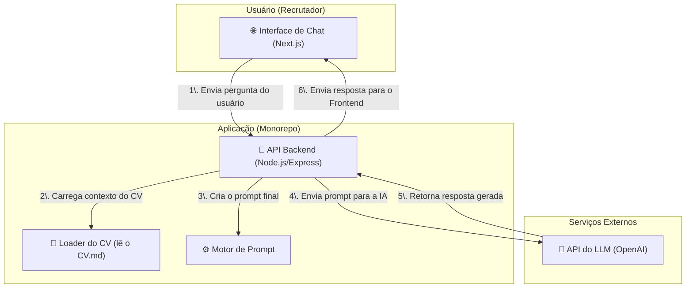

# Ask Richter - Meu CV Interativo com IA

[](https://nodejs.org/)
[](https://www.typescriptlang.org/)
[](https://expressjs.com/)
[](https://nextjs.org/)
[](https://reactjs.org/)
[](https://turbo.build/)
[](https://www.docker.com/)
[](https://vercel.com/)

Este projeto transforma um currículo tradicional em uma experiência de diálogo. O **Ask Richter** é um chatbot especialista na minha trajetória profissional, permitindo que recrutadores e líderes técnicos façam perguntas em linguagem natural e recebam respostas inteligentes e contextuais, baseadas nos meus dados profissionais consolidados.

Mais do que um portfólio, é uma ferramenta de marketing profissional e uma demonstração prática de competências em arquitetura de software moderna, desenvolvimento full-stack e integração com IA.

## 🚀 Principais Features

- **Interface de Chat Conversacional:** Uma UI limpa e reativa para um diálogo fluido.
- **Respostas Contextuais com IA:** Utiliza um modelo de linguagem (LLM) da OpenAI para interpretar perguntas e formular respostas com base no meu CV.
- **Arquitetura Full-Stack Moderna:** Backend em Node.js/Express e Frontend em Next.js, ambos com TypeScript.
- **Desenvolvimento Type-Safe:** Código 100% tipado, com tipos e interfaces compartilhados entre o cliente e o servidor para máxima robustez.
- **Estrutura em Monorepo:** Organizado com Turborepo para um desenvolvimento integrado e eficiente.

## 🛠️ Stack Tecnológica

| Camada               | Tecnologia                        | Descrição                                                                                                  |
| :------------------- | :-------------------------------- | :--------------------------------------------------------------------------------------------------------- |
| **Backend**          | Node.js, Express.js, TypeScript   | API RESTful responsável pela lógica de negócio e comunicação com o serviço de IA.                          |
| **Frontend**         | Next.js, React, Tailwind CSS      | Interface de usuário reativa e moderna, utilizando o Vercel AI SDK para a gestão do estado do chat.        |
| **DevOps & Tooling** | Turborepo, Docker, Vercel, Render | Monorepo para gestão do código, Docker para conteinerização do backend e deploy em plataformas otimizadas. |

## 🏗️ Arquitetura do Sistema

O fluxo de dados é projetado para ser simples e desacoplado, garantindo uma comunicação eficiente entre o usuário e o serviço de IA.



## ⚙️ Rodando o Projeto Localmente

Para executar o projeto no seu ambiente de desenvolvimento, siga os passos abaixo.

1.  **Clone o repositório:**

    ```bash
    git clone [https://github.com/seu-usuario/ask-richter.git](https://github.com/seu-usuario/ask-richter.git)
    cd ask-richter
    ```

2.  **Instale as dependências:**
    Na raiz do monorepo, o Turborepo gerencia a instalação para todos os `apps` e `packages`.

    ```bash
    npm install
    ```

3.  **Configure as Variáveis de Ambiente:**
    Você precisará de uma chave de API da OpenAI. Crie um arquivo `.env` na raiz da aplicação do backend (`apps/backend/.env`) a partir do exemplo:

    ```
    # Em apps/backend/.env
    OPENAI_API_KEY="sua_chave_aqui"
    ```

4.  **Execute o Ambiente de Desenvolvimento:**
    Este comando iniciará o backend e o frontend simultaneamente.

    ```bash
    npm run dev
    ```

      - O frontend estará disponível em `http://localhost:3000`.
      - O backend estará disponível em `http://localhost:3001`.

## 🤝 Como Contribuir

Este é um projeto pessoal, mas estou aberto a sugestões e melhorias. Para garantir a qualidade e a consistência do código, por favor, siga as diretrizes detalhadas no nosso **[Guia de Contribuição](https://www.google.com/search?q=CONTRIBUTING.md)**.

## 📄 Licença

Este projeto está sob a licença MIT. Veja o arquivo `LICENSE` para mais detalhes.
