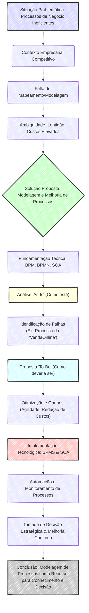

## Basic CV

**Luis Fernando Richter**
Senior Software Developer | Tech Lead
+55 15 981308235 | ✉ fernando.richter@gmail.com | linkedin.com/in/lfrichter

---

**Profile**

Self-taught full-stack developer with over 15 years of experience in software development and architecture. Proven expertise in technical leadership, building scalable and high-performance applications, and integrating modern AI tools into the development process. Consistent track record of optimizing performance and reducing technical debt in complex systems. Well-organized and proactive, with excellent communication, interpersonal, and leadership skills. Open to opportunities as a Senior Developer or Tech Lead.

---

**Skills & Technologies**

*   **Languages & Frameworks:** PHP, Laravel (Dusk, Horizon), Lumen, Vue.js, React, JavaScript, TypeScript, Python, TDD, GraphQL, Gitflow, Jest.
*   **Databases:** MySQL, SQLite, SQL Server, MongoDB, PL/SQL, SaaS.
*   **Deployment & DevOps:** CI/CD, AWS, GCP, Bitbucket Pipelines, GitHub Actions, Docker, Dockerize, Kubernetes.
*   **Other Competencies:** Technical leadership, System architecture, Performance optimization, Application security, Automated testing, Code refactoring.
*   **Artificial Intelligence & Tools:**
    *   AI-assisted development (GitHub Copilot, Cursor, Trae, Gemini Code Assist).
    *   Implementation of generative AI solutions in commercial and personal projects.
    *   Optimization of development workflows using AI tools.
    *   Integration of AI into team development processes.

---

**Work Experience**

Claro! Abaixo está a versão consolidada da sua experiência profissional em **português do Brasil (pt-BR)**, combinando as duas fontes de forma clara, coesa e sem perda de informações relevantes:

---

### **Experiência Profissional**

#### **Engenheiro de Software Líder**  
**Turno (anteriormente TurnoverBnB)** — Remoto (Honolulu, Havaí, EUA)  
**Nov 2022 – Mar 2025**  
*   Liderou uma equipe de 6 desenvolvedores, assumindo a liderança técnica em domínios críticos do sistema (Contas, Propriedades, Checklists), garantindo escalabilidade, confiabilidade e elevando o desempenho do sistema e a satisfação do usuário.  
*   Arquitetou e implementou a iniciativa estratégica **“Mid-Stay Projects”**, que **aumentou em 30% a retenção de usuários**, aprimorou significativamente a experiência do cliente e agregou valor ao produto.  
*   Corrigiu vulnerabilidades críticas identificadas em testes de penetração de terceiros, reforçando a segurança de autenticação e o gerenciamento de sessões simultâneas contra ameaças cibernéticas.  
*   **Reduziu em 40% o tempo de resposta de endpoints** por meio de refatoração estratégica de código e otimização de consultas ao banco de dados, minimizando dívida técnica e melhorando a eficiência geral do sistema.  
*   Refatorou e corrigiu mais de **100 testes automatizados falhos**, aumentando a confiabilidade do pipeline de CI/CD (Jenkins) e reduzindo significativamente o tempo de execução dos testes.  
*   Utilizou **New Relic** para identificar e resolver gargalos de desempenho e **Bugsnag** para monitoramento de erros em tempo real.  
*   Integrou ferramentas de IA (como **GitHub Copilot**) ao fluxo de trabalho da equipe, aumentando a eficiência no desenvolvimento, testes e documentação.

---

#### **Head de Desenvolvimento Full-Stack**  
**Full Comms / Keaze** — Remoto (Manchester, Reino Unido)  
**Abr 2021 – Nov 2022**  
*   Desenvolveu aplicações CMS com **Laravel**, otimizando processos internos de gestão de conteúdo.  
*   Criou um aplicativo baseado em **Vue.js** para gerenciamento de widgets, melhorando a experiência do usuário final.  
*   Construiu e manteve um sistema de **API escalável com Lumen**, garantindo alto desempenho e estabilidade.  
*   Colaborou com uma pequena equipe na implementação do novo **módulo de Pós-Venda para o Kpro**.  
*   Gerenciou atualizações de versões de **PHP e Laravel**, assegurando compatibilidade, segurança e longevidade do sistema.  
*   Implementou testes automatizados com **Laravel Dusk** (navegadores headless via Selenium), aumentando a confiabilidade das entregas.  
*   Utilizou **DeployHQ, Vercel e Laravel Forge** para implantação contínua e pipelines de entrega ágeis.  

**Principais Projetos:**  
*   **Kpro AfterSales:** Desenvolveu uma API backend para otimizar processos imobiliários de pós-venda, integrando checklists, artigos, documentos e gestão de eletrodomésticos.  
*   **Shosales Website Revamp:** Melhorou o desempenho das páginas em **10x**, paralelizou testes automatizados entre navegadores e otimizou consultas para reduzir tempos de resposta.

---

#### **Head de Desenvolvimento de Software**  
**Evoke Mobile** — Remoto (Liverpool, Reino Unido)  
**Mar 2019 – Abr 2021**  
*   Liderou uma pequena equipe no desenvolvimento de **dashboards administrativos internos com React**, resolvendo um gargalo crítico de renderização de mapas com mais de **200 mil registros geoespaciais** — **melhoria de até 30x no tempo de carregamento** com uso de Superfetch.  
*   Atuou no desenvolvimento full-stack de **CMS e APIs backend** para aplicativos móveis (iOS/Android).  
*   Aprimorou drasticamente o desempenho do sistema com uso de filas (**Laravel Horizon**), alcançando **processamento até 500x mais rápido** em serviços de compartilhamento de viagens.  
*   Projetou e manteve **APIs escaláveis** consumidas por plataformas web e móveis.  
*   Integrou diversos serviços de terceiros, incluindo **Firebase, Google Geocoding, Overpass API, OPTA e Mailgun**.  

**Principais Projetos:**  
*   **Toot:** Desenvolveu funcionalidades de análise de rastreamento de viagens, implementou monitoramento de filas com Laravel Horizon e criou testes de API executados via **GitHub Actions**.  
*   **Toot Market Intelligence Platform:** Construiu integrações de API para alimentar dashboards no **Power BI**.  
*   **Fanoty:** Migrou um aplicativo iOS legado de futebol para **Laravel 5.1**, refatorou importações de dados da API OPTA e implementou pipelines de CI/CD.

---

#### **Engenheiro de Desenvolvimento de Software**  
**Alfasoft** — Híbrido (Lisboa, Portugal)  
**Abr 2018 – Nov 2018**  
*   Realizou análise, estimativa e desenvolvimento de software com **PHP, Laravel, WordPress e Python**.  
*   Idealizou e implementou soluções performáticas para **importação diária de grandes volumes de dados**, utilizando sistemas de filas para otimizar a carga do servidor.  
*   Desenvolveu múltiplas aplicações web com Laravel e criou temas/plugins personalizados para WordPress.  
*   Implementou atualizações de gráficos no **NinjaTrader** utilizando C#.  

**Principais Projetos:**  
*   **Sisporta:** Integrou sistemas legados usando **Python e Laravel**, melhorou a carga do servidor com **Laravel Horizon** e implementou CI/CD via **Bitbucket Pipelines**.  
*   **MyLabel:** Desenvolveu um site corporativo para cosméticos com customizações avançadas em WordPress.

---

#### **Desenvolvedor Sênior de Software**  
**Plugae** — Presencial (Barueri, Brasil)  
**Nov 2017 – Fev 2018**  
*   Liderou uma integração complexa de **múltiplos marketplaces** (Mercado Livre, B2W, Via Varejo) em uma única plataforma unificada.  
*   Desenvolveu um sistema para **importação de pedidos** de plataformas Magento para um sistema proprietário (Spider), armazenando os dados em **MongoDB**.  
*   Implementou atualizações de pedidos integradas ao **ERP Bling** por meio de **webhooks e jobs em fila (Redis/Laravel Horizon)**.  

**Projeto Principal:**  
*   **Spider – Hub de Integração de E-commerce:** Arquitetou e implementou um hub centralizado em **PHP/Laravel** para orquestrar o fluxo de pedidos, estoque e preços entre marketplaces (Plugg.to, Skyhub, B2W) e ERPs (Bling, sistemas customizados). Utilizou **filas em Redis** para processamento assíncrono, **webhooks reativos** para sincronização em tempo real e **MongoDB** como fonte única da verdade. Superou desafios críticos de **overselling** e **inconsistência de dados** com lógica de enriquecimento de pedidos baseada em SKUs e rotinas de normalização automatizadas. A solução permitiu onboarding ágil de novos clientes e processamento resiliente de alto volume, com infraestrutura em **Docker** e armazenamento em **AWS S3**.

---
#### **Software Developer 👩‍💻**
**Pilha Digital · Contract**
Feb 2017 - Sep 2017 · 8 mos
Sorocaba e Região, Brasil · On-site
**Skills:** Integration · Notification · Laravel · Event Driven Programming

* **Criou uma plataforma para registro de websites e envio de notificações web push**, desenvolvida em Laravel com abordagem orientada a eventos e estrutura modular.
* **Integrou a plataforma com OnSignal e o sistema de pagamentos Pagar.me**.

---
#### **Full Stack Developer 👩‍💻**
**ASO · Full-time**
Jan 2016 - Jan 2017 · 1 yr 1 mo
Sorocaba Area, Brazil

* **Construiu uma ampla aplicação PHP OOP** para gerenciamento de hospitais, profissionais de saúde e pacientes.

---

#### **Coach 👨‍🏫**
**Promoedu.com**
Sep 2015 - Mar 2016 · 7 mos
Sorocaba Area, Brazil · On-site

* **Desenvolveu e ministrou cursos de Liderança e Coaching de 14 horas** para pequenos grupos, combinando experiência de liderança com técnicas de coaching para desenvolvimento integral.
* **Capacitou líderes em diversas competências**, incluindo compreensão de subordinados, contratação e delegação eficaz, promoção de desenvolvimento contínuo (com foco em neuroplasticidade e segurança psicológica), feedback construtivo e análise de desempenho.
* **Agregou valor ao aprimorar habilidades de liderança**, construir confiança, motivar equipes, otimizar delegação e avaliar resultados com ferramentas aplicáveis em diversas áreas.

---

#### **Web Designer 👨‍🎨**
**EDITORA FTD S/A · Full-time**
Jan 1998 - Nov 2011 · 13 yrs 11 mos
São Paulo Area, Brazil

* **Participou de múltiplos projetos** e **desenvolveu diversas aplicações web**, incluindo um portal corporativo principal, website de e-commerce e plataforma de intranet.
* **Utilizou tecnologias como Coldfusion (Servlet Java) CBD, ASP, SQL Server, Atlassian Jira, Windows Server e IIS**.

---

**Education**

*   **Postgraduate Degree in Software Engineering with a focus on Component-Based Design and Distributed Systems**
    *   UNIBTA Centro Universitário, Brazil | 2007 – 2008
*   **Bachelor's Degree in E-Commerce Management**
    *   Anhembi Morumbi University, Brazil | 2000 – 2002

---

**Languages**

*   **Portuguese:** Native speaker
*   **English:** Full professional proficiency
*   **Spanish:** Limited working proficiency

---
## Education Details

- [     
    ](https://www.linkedin.com/company/30345/)
    ## UNIBTA - Centro Universitário
    
Postgraduate 👨‍🎓, Software Engineering with a focus on Component-Based Design and Distributed Systems 2007 - 2008

Especialização focada em **Arquitetura de Software Moderna** (Microserviços, APIs RESTful, Sistemas Distribuídos) e **Engenharia de Software de Componentes**. Abrangeu **metodologias ágeis** (Scrum, XP), **DevOps, CI/CD**, gestão da qualidade, **automação de testes**, e **design patterns**, com ênfase na **governança e escalabilidade** de sistemas.
    
- Modern Software Architecture (Microservices, RESTful APIs, Systems Integration)  
- Requirements Analysis and Modeling  
- Software Design with UML and Class Modeling  
- Software Quality Assurance and Automated Testing  
- Configuration Management and Change Control  
- Object-Oriented and Aspect-Oriented Programming  
- Design Patterns and Code Refactoring  
- Component-Based Development (CBD)  
- Business Process Management (BPM)  
- Agile Methodologies (Scrum, XP)  
- DevOps, CI/CD, and Deployment Automation  
- Governance and Scalability in Distributed Systems
    
- [
    
    ](https://www.linkedin.com/company/166621/)
    ## Universidade Anhembi Morumbi
    
    Foundation degree 🎓, E-commerce Manager 1999 - 2002
    
    - Activities and societies: Participated in technical visits, including a study tour of Carrefour's Distribution Center in Brazil, gaining practical insights into large-scale logistics and supply chain operations.
        
    - Coursework included:  
              
		- E-commerce and Digital Business Models  
		- Marketing and Digital Strategy  
		- Project Management  
		- Network and Systems Administration  
		- Data Warehouse and Business Intelligence  
		- Logistics and Supply Chain Management  
		- Customer Relationship Management (CRM)  
		- Web Technologies and Online Security  
		  
	- Developed a solid foundation in managing online businesses, digital operations, and customer-centric strategies in the context of a rapidly evolving internet economy.
	  
### **Documento de Expertise Acadêmica: TCC - Uma Abordagem de Processo de Negócio Utilizando BPMN**

Este documento sumariza a contribuição e os conhecimentos adquiridos durante a elaboração do Trabalho de Conclusão de Curso (TCC) de Pós-Graduação, que se concentrou na otimização de processos de negócio através da modelagem e análise.

-----

#### ✅ **Tema Central: Otimização de Processos de Negócio com BPMN**

O TCC explorou a relevância da gestão e modelagem de processos como estratégia fundamental para a eficiência e competitividade empresarial. A Notação de Modelagem de Processos de Negócio (BPMN) foi o pilar central para a representação e análise desses processos.

-----

#### 🌟 **Conhecimentos e Habilidades Demonstradas:**

  * **Compreensão Aprofundada de BPM:**
      * Definição e importância do Business Process Management (BPM) como conjunto de metodologias e tecnologias para integrar e otimizar as operações empresariais.
      * Reconhecimento da necessidade de uma visão holística e integrada do ambiente interno e externo da organização.
  * **Domínio da Notação BPMN:**
      * Capacidade de utilizar o BPMN como padrão gráfico aberto para desenhar e modelar processos de negócio.
      * Habilidade para criar diagramas de processo claros e compreensíveis para diferentes stakeholders (negócio, TI).
      * Aplicação prática dos elementos BPMN (Objetos de Fluxo, Objetos de Conexão, Raias e Artefatos).
  * **Metodologia de Análise de Processos:**
      * Execução da análise "As-Is" (processo atual) para identificação de gargalos, ineficiências e custos desnecessários.
      * Desenvolvimento de propostas "To-Be" (processo futuro) focadas na melhoria da agilidade, satisfação do cliente e redução de custos operacionais.
  * **Visão Estratégica e Tecnológica:**
      * Entendimento da importância da Arquitetura Orientada a Serviço (SOA) e Business Process Management Suites (BPMS) como catalisadores para a automação e monitoramento em tempo real dos processos modelados.
      * Percepção da interconexão entre as decisões de negócio e o suporte da tecnologia para a otimização contínua.
  * **Resolução de Problemas no Contexto Real:**
      * Aplicação dos conhecimentos teóricos em um estudo de caso prático (editora), demonstrando a capacidade de diagnosticar problemas e propor soluções concretas em um ambiente de negócio.

-----

#### 📊 **Diagrama Conceitual da Abordagem do TCC:**

-----

#### 🎯 **Contribuição para a Expertise Profissional:**

A elaboração deste TCC solidificou uma base de conhecimento robusta em gestão e otimização de processos de negócio, qualificando-me para atuar em projetos que visam:

  * Analisar e redesenhar fluxos de trabalho.
  * Implementar soluções de automação de processos.
  * Apoiar a tomada de decisões estratégicas baseadas em dados de processo.
  * Promover a eficiência operacional e a satisfação do cliente em diversos setores.
	  

---
### Experiência Details

#### **Software Engineer**
**Turno, formerly TurnoverBnB · Contract**
Jan 2023 - Mar 2025 · 2 yrs 3 mos
Honolulu, Hawaii, United States · Remote
**Skills:** Laravel · Vue.js · React Native · New Relic · Jenkins · Team Leadership

* **Led** a cross-functional team, assumindo a liderança técnica em domínios críticos (Accounts, Properties, Checklists) para garantir escalabilidade e confiabilidade, elevando o desempenho do sistema e a satisfação do usuário.
* **Arquitetou e implementou** a iniciativa "Mid-Stay Projects", que **aumentou em 30%** a retenção de usuários e aprimorou a experiência geral do cliente.
* **Corrigiu vulnerabilidades críticas** de segurança identificadas em testes de penetração, fortalecendo a autenticação e a gestão de sessões para robustez contra ameaças cibernéticas.
* **Reduziu em 40%** o tempo de resposta de endpoints e minimizou dívida técnica, refatorando código e otimizando queries de banco de dados, resultando em maior eficiência e melhor experiência do usuário.
* **Refatorou mais de 100 testes falhos**, aumentando a confiabilidade do pipeline CI/CD (Jenkins) e **reduzindo o tempo de execução de testes automatizados**, garantindo entregas mais estáveis.
* **Utilizou New Relic e Bugsnag** para detectar e resolver gargalos de desempenho e monitorar erros em tempo real.

---

#### **Head of Full-stack Development**
**Full Comms · Full-time**
Apr 2021 - Nov 2022 · 1 yr 8 mos
Manchester Area, United Kingdom · Remote
**Skills:** Vue.js · Vuetify · TypeScript · Lumen · DevOps · PHP

* **Desenvolveu aplicações CMS com Laravel** e um aplicativo de gerenciamento de widgets baseado em Vue.js, otimizando a gestão de conteúdo e a experiência do usuário.
* **Construiu e manteve um sistema API escalável** com Lumen, garantindo alto desempenho.
* **Colaborou com uma pequena equipe para implementar o novo módulo de Pós-Venda** para Kpro.
* **Otimizou o desempenho de projetos** por meio de avaliações e melhorias contínuas, e gerenciou atualizações de PHP e Laravel para segurança e compatibilidade.
* **Implementou testes automatizados com Dusk** (Selenium) para melhorar a confiabilidade e utilizou DeployHQ, Cercel e Laravel Forge para implantação contínua.

---

#### **Head of Software Development**
**Evoke Mobile · Full-time**
Mar 2019 - Apr 2021 · 2 yrs 2 mos
Liverpool, United Kingdom · Remote
**Skills:** Laravel · React.js · Laravel Horizon

* **Liderou uma pequena equipe** no desenvolvimento de dashboards administrativos internos com React, **resolvendo uma questão crítica de performance** em renderização de mapas (mais de 200 mil registros geoespaciais) ao implementar Superfetch, **melhorando o tempo de carregamento em até 30x**.
* **Colaborou no desenvolvimento full-stack** de CMS e APIs de backend para aplicativos móveis (iOS/Android).
* **Aprimorou o desempenho do sistema de backend** ao utilizar filas (queues), alcançando um **processamento até 500x mais rápido** para serviços de compartilhamento de viagens.
* **Projetou e manteve APIs escaláveis** consumidas por plataformas web e móveis.
* **Integrou diversos serviços de terceiros**, incluindo Firebase, Google Geocoding, Overpass API, OPTA e Mailgun.

---

#### **Software Development Engineer**
**ALFASOFT.PT · Full-time**
Apr 2018 - Nov 2018 · 8 mos
Lisbon, Portugal · Hybrid
**Skills:** Laravel Horizon · WordPress · DevOps · Laravel · Python (Programming Language)

* **Idealizou e criou uma solução performática** para importação diária de extensas bases de dados utilizando filas, otimizando o processamento do servidor.
* **Desenvolveu múltiplas aplicações web com Laravel** e criou temas/plugins em WordPress.
* **Implementou a atualização de gráficos no NinjaTrader** usando C#.
* **Realizou análise e estimativa de projetos** com a ferramenta Target Process, e atuou no desenvolvimento de software com PHP, Laravel, WordPress e Python.

---

#### **Senior Software Developer**
**Plugae · Contract**
Nov 2017 - Feb 2018 · 4 mos
Barueri · On-site
**Skills:** MongoDB · Integration · Redis · Laravel · Horizon · OpenRefine

* **Liderou uma desafiadora integração de múltiplos marketplaces** (Mercadolivre, B2W, Via Varejo) em uma única aplicação.
* **Desenvolveu um sistema para importar pedidos** de plataformas Magento para um sistema exclusivo (Spider), armazenando dados em MongoDB.
* **Implementou a atualização de pedidos** integrada com ERP Bling via webhooks e queue jobs.

---

#### **Software Developer 👩‍💻**
**Pilha Digital · Contract**
Feb 2017 - Sep 2017 · 8 mos
Sorocaba e Região, Brasil · On-site
**Skills:** Integration · Notification · Laravel · Event Driven Programming

* **Criou uma plataforma para registro de websites e envio de notificações web push**, desenvolvida em Laravel com abordagem orientada a eventos e estrutura modular.
* **Integrou a plataforma com OnSignal e o sistema de pagamentos Pagar.me**.

---

#### **Full Stack Developer 👩‍💻**
**ASO · Full-time**
Jan 2016 - Jan 2017 · 1 yr 1 mo
Sorocaba Area, Brazil

* **Construiu uma ampla aplicação PHP OOP** para gerenciamento de hospitais, profissionais de saúde e pacientes.

---

#### **Coach 👨‍🏫**
**Promoedu.com**
Sep 2015 - Mar 2016 · 7 mos
Sorocaba Area, Brazil · On-site

* **Desenvolveu e ministrou cursos de Liderança e Coaching de 14 horas** para pequenos grupos, combinando experiência de liderança com técnicas de coaching para desenvolvimento integral.
* **Capacitou líderes em diversas competências**, incluindo compreensão de subordinados, contratação e delegação eficaz, promoção de desenvolvimento contínuo (com foco em neuroplasticidade e segurança psicológica), feedback construtivo e análise de desempenho.
* **Agregou valor ao aprimorar habilidades de liderança**, construir confiança, motivar equipes, otimizar delegação e avaliar resultados com ferramentas aplicáveis em diversas áreas.

---

#### **Web Designer 👨‍🎨**
**EDITORA FTD S/A · Full-time**
Jan 1998 - Nov 2011 · 13 yrs 11 mos
São Paulo Area, Brazil

* **Participou de múltiplos projetos** e **desenvolveu diversas aplicações web**, incluindo um portal corporativo principal, website de e-commerce e plataforma de intranet.
* **Utilizou tecnologias como Coldfusion (Servlet Java) CBD, ASP, SQL Server, Atlassian Jira, Windows Server e IIS**.

---

## Courses and Certificates
### AI & Machine Learning

#### Hypno Methodology for Advanced Evaluation and Robustness Testing of AI Models

**Outlier** | Issued Jun 2025
**Credential ID:** 683dccd9382ba43d3970c9b9
**Skills:** Prompt Engineering

### Software Development & Architecture

#### SOLID Express

**Full Cycle** | Issued Sep 2023
**Credential ID:** [d97e149e-e515-4dc4-9103-094163204584](https://fullcycle.com.br/certificado/d97e149e-e515-4dc4-9103-094163204584)

#### Introduction to OpenTelemetry

**Full Cycle** | Issued Dec 2022
**Credential ID:** [741d2979-b4cd-4edd-8a94-142fac00627c](https://fullcycle.com.br/certificado/741d2979-b4cd-4edd-8a94-142fac00627c)

#### Advanced Patterns and Techniques with Git and Github

**Full Cycle** | Issued Feb 2022
**Credential ID:** [e0ba885f-aa8c-46d9-a917-39016b31c557](https://fullcycle.com.br/certificado/e0ba885f-aa8c-46d9-a917-39016b31c557)

### Domain Driven Design - DDD

**Full Cycle** | Issued Nov 2021
**Credential ID:** [6cee6606-7b1c-4977-9f04-d1b21f476d69](https://fullcycle.com.br/certificado/6cee6606-7b1c-4977-9f04-d1b21f476d69)

### Cloud Computing & AWS

#### AWS - S3 and CloudFront - Rev 2

**School of Net** | Issued Nov 2022
**Credential ID:** [b8755b58-b507-49b3-8a9c-42f8ad61b3ca](http://www.schoolofnet.com/validar-certificado/validate/number/b8755b58-b507-49b3-8a9c-42f8ad61b3ca/)

#### AWS Code Deploy

**School of Net** | Issued Nov 2022
**Credential ID:** [1ad63afa-47ea-4994-ac9f-4b00b96f9343](http://www.schoolofnet.com/validar-certificado/validate/number/1ad63afa-47ea-4994-ac9f-4b00b96f9343/)

#### AWS EC2 - Rev 2

**School of Net** | Issued Nov 2022
**Credential ID:** [4f563d7d-88f3-4611-a7ca-f948e1e6581c](http://www.schoolofnet.com/validar-certificado/validate/number/4f563d7d-88f3-4611-a7ca-f948e1e6581c/)

#### AWS Lambda

**School of Net** | Issued Nov 2022
**Credential ID:** [46c40172-69da-4ea8-9b84-04d50c53f2b1](http://www.schoolofnet.com/validar-certificado/validate/number/46c40172-69da-4ea8-9b84-04d50c53f2b1/)

### Laravel & PHP Development

#### Laravel: Blade Component

**School of Net** | Issued Aug 2021
**Credential ID:** [35a39cd4-8d09-4300-922a-4e96a35ae76a](http://www.schoolofnet.com/validar-certificado/?certificate=35a39cd4-8d09-4300-922a-4e96a35ae76a)
#### Laravel Dusk

**School of Net** | Issued May 2021
**Credential ID:** [2609a6a8-0f06-4c26-aeef-b7dd8257627b](http://www.schoolofnet.com/validar-certificado/?certificate=2609a6a8-0f06-4c26-aeef-b7dd8257627b)
#### Laravel Jetstream

**School of Net** | Issued Nov 2020
**Credential ID:** [29ef3a2c-e654-4c8a-97ec-5b9587bc1b17](https://www.evernote.com/shard/s96/sh/34e44d74-e7fa-1878-275d-d2d71e7278b8/bc45d26674e2e65c32567dd76a3e9a19)

#### API RESTFul development with Laravel - Update 2 📕

**School of Net** | Issued Mar 2018
**Credential ID:** [5c1f2e2719d6e4034e9cd6263449e718](https://www.evernote.com/shard/s96/sh/8c23b99a-3c68-4e24-873c-fb0902232c30/5c1f2e2719d6e4034e9cd6263449e718)

#### Laravel 5.5 features 📕

**School of Net** | Issued Sep 2017
**Credential ID:** [aa5319ff93440c9c83e381190b78b180](https://www.evernote.com/shard/s96/sh/ee5889ec-aac5-4f55-846d-540dd76df01f/aa5319ff93440c9c83e381190b78b180)

#### Integrating PayPal with PHP 🐘

**School of Net** | Issued Aug 2017
**Credential ID:** [1f1c6bd0f21227e5c21ae211133e875e](https://www.evernote.com/shard/s96/sh/f305585e-71e8-46f6-91ef-cde776d34ed8/1f1c6bd0f21227e5c21ae211133e875e)

#### Laravel - Multi-Tenancy applications 📕

**School of Net** | Issued Jul 2017
**Credential ID:** [d144e2bb-abb8-48e0-8458-20262e57847d](https://www.evernote.com/shard/s96/sh/acd82b07-a21e-4f57-a165-0add8a8ae76f/125e0472d2efad5743f5ae1f0f2be4e0)

#### Authentication with Laravel and JWT 📕

**School of Net** | Issued Jun 2017
**Credential ID:** [b2a3ac86-19a7-42ad-b814-6c004b0f2e99](https://www.evernote.com/shard/s96/sh/c7f2aaea-8bd0-4e3e-bcb8-ee5434dd4766/ab64e7a493dc3142a272488d36da95c3)

#### Laravel Passport 📕

**School of Net** | Issued Jun 2017
**Credential ID:** [57114fa0ddcca7cb560439689fd0c2a9](https://www.evernote.com/shard/s96/sh/3607dbfd-b103-430c-91f3-697e67344323/57114fa0ddcca7cb560439689fd0c2a9)

#### Test Driven Development (TDD) with PHP 🐘

**School of Net** | Issued Jun 2017
**Credential ID:** [84e0b1eb-de17-4a97-9d89-511fc041d2eb](https://www.evernote.com/shard/s96/sh/fcdd24d0-0859-4c0d-8eba-4288d7a7b7b8/e2e62488155904f4b4ec046d5b30fbf4)

#### Modularization in Laravel 📕

**School of Net** | Issued May 2017
**Credential ID:** [586dcbf093890c677050e0faca468c7b](https://www.evernote.com/shard/s96/sh/7b90f125-3697-41e5-b6e6-bf1bf4111662/586dcbf093890c677050e0faca468c7b)

#### Laravel 5.4 good practices, events and queues 📕

**School of Net** | Issued Apr 2017
**Credential ID:** [d262f669-0893-42a8-b2f4-a2d9a895c8b0](https://www.evernote.com/shard/s96/sh/bedd27a8-8f8a-4cc8-88e2-a9a8f1ac3743/536f414b349d116f1742b8b415c6cab2)

#### API RESTFul development with Laravel 📕

**School of Net** | Issued Mar 2017
**Credential ID:** [5ae50017-a58b-4c94-9804-cd736a59112ec](https://www.evernote.com/shard/s96/sh/9a699fc2-c42d-4942-a0a9-d63758ce6cd9/a0b92e47d2d6a7c4025e3b8c5bc6794c)

#### Laravel Authentication 📕

**School of Net** | Issued Mar 2017
**Credential ID:** [acd628d9-8323-4bfc-af80-465549744ee6](https://www.evernote.com/shard/s96/sh/33066783-5087-4f09-bf4f-677513eb61bc/cb463fc0e3a5c1b11ed9ebd4fe9611be)

#### Laravel Events and Queues 📕

**School of Net** | Issued Mar 2017
**Credential ID:** [5ae50017-a58b-4c94-9804-cd736a5912ec](https://www.evernote.com/shard/s96/sh/2d72e193-124a-4418-b421-5eda5bcd8696/ff075c81d73ecee536e6c0f023fad37b)

#### Laravel - Scout and Realtime Search in Frontend 📕

**School of Net** | Issued Feb 2017
**Credential ID:** [c2ddc94a-00cb-4a9b-922d-9bb6e5b4a4b2](https://www.evernote.com/shard/s96/sh/e441bb09-9b9f-4b13-a8c9-bea438ffee26/c6b869710baf18aad7b87263f39ecfb3)

#### Laravel - Validation and Forms 📕

**School of Net** | Issued Jan 2017
**Credential ID:** [6b93a5dc-294e-4da0-9a74-558947128f18](https://www.evernote.com/shard/s96/sh/a09f331e-6cda-47d2-a0f5-c82506f84291/b000c413fac1eaeb77c479e6fbaec44b)

#### Laravel 5.3 📕

**School of Net** | Issued Jan 2017
**Credential ID:** [e29b9dab-c775-4129-bcb0-f5d4eb9d8cfd](https://www.evernote.com/shard/s96/sh/35391b6c-3974-4680-ab22-053d1a53a49a/a95cc45dff14937651a2297aa57b5d23)

### Frontend Development

#### Vue.js 2 with Laravel 📗+📕

**School of Net** | Issued Mar 2018
**Credential ID:** [5f2ba45adc546bf08437e4e5a8d2a3ec](https://www.evernote.com/shard/s96/sh/1dc6063c-0ff2-4747-9964-00d9c0ccd5af/5f2ba45adc546bf08437e4e5a8d2a3ec)

#### Flexbox CSS

**School of Net** | Issued Jan 2021
**Credential ID:** [d3390bf6-4134-4bd0-964a-413ea6429381](http://www.schoolofnet.com/validar-certificado/?certificate=d3390bf6-4134-4bd0-964a-413ea6429381)
#### Google Material Design Lite 🎨

**School of Net** | Issued Apr 2017
**Credential ID:** [930d1851-df6e-445c-bb80-591e7538b3a1](https://www.evernote.com/shard/s96/sh/5f90720b-d233-476c-af1f-a362fdb6bf2a/48eeb6cd35e2f067699c6ad02da04ce7)
#### HTML5 📙

**School of Net** | Issued Jan 2017
**Credential ID:** [73441be8-5244-4c8d-973e-6a2fbba5d2ea](https://www.evernote.com/shard/s96/sh/94534b2c-ee38-48f2-8645-f8fbc97d5780/093920974efc69c8d4c9de84b09fe556)

#### Javascript Advanced 📗

**School of Net** | Issued Jan 2017
**Credential ID:** [0855916f-351c-43c5-aab9-69301bba5f6e](https://www.evernote.com/shard/s96/sh/8f7bbeeb-f19d-4f9d-99be-fced10bda7da/b299ff9ee71855565208358650302160)
#### Webpack 2 🎒

**School of Net** | Issued Oct 2017
**Credential ID:** [2eeca1a42b01aceba6fcc6265fd22a63](https://www.evernote.com/shard/s96/sh/e33b8b27-5975-4494-b041-f8b53187bc90/2eeca1a42b01aceba6fcc6265fd22a63)
#### Typescript 📱

**School of Net** | Issued Apr 2017
**Credential ID:** [6130af35-dbb2-4d4d-99b4-1d486cafbc29](https://www.evernote.com/shard/s96/sh/da4eb4dd-990b-4c84-8c05-c02c6c35ce96/1888172e09a2205d6382a0baddded169)

### Mobile Development

#### Introduction to Ionic 2 📱

**School of Net** | Issued Apr 2017
**Credential ID:** [c76c90d0-a9fd-488a-9279-c9563536044c](https://www.evernote.com/shard/s96/sh/0396ac4c-37ce-41fc-842c-c933a446ce24/49a8fe18bc3e29a8f320b90013c02852)

### Database & Data Management

#### Database and Eloquent 📕

**School of Net** | Issued Feb 2017
**Credential ID:** [1862a1b7-2213-4b5e-b26e-735999332e10](https://www.evernote.com/shard/s96/sh/bd3a51c6-5a88-48c1-a91d-fdb7b2166db5/8b002cc870ad6449b5ef8696ea0d4b77)

#### MongoDB 🌿

**School of Net** | Issued Oct 2017
**Credential ID:** [e3ef33ad85f7410737f07143604ce0c0](https://www.evernote.com/shard/s96/sh/e6f28fcc-d2ae-4a2d-b758-69d282a24da0/e3ef33ad85f7410737f07143604ce0c0)

#### MySQL Tunning - Part 1

**School of Net** | Issued Jul 2020
**Credential ID:** [21be028b-1ea3-4fde-b049-2683a93395fb](https://www.evernote.com/shard/s96/sh/c87b0ffa-1e92-9ecc-f7e4-b8621e41f783/94e3223779ca4d843ffc672038db2926)

#### Redis 🌰

**School of Net** | Issued Jan 2018
**Credential ID:** [58595811662261ba07fa0ccb27c49ba7](https://www.evernote.com/shard/s96/sh/8039800e-7853-4961-8efa-db0468fe2345/58595811662261ba07fa0ccb27c49ba7)

### DevOps & Infrastructure

#### Docker: Creating containers without headache 🐋

**Alura** | Issued Feb 2018
**Credential ID:** [d88ca56676a27a263dc3e9123151f851](https://www.evernote.com/shard/s96/sh/cc4bf4ab-3400-4ceb-a94c-ae26df799d09/d88ca56676a27a263dc3e9123151f851)

#### Git Flow 🐾

**School of Net** | Issued Jan 2018
**Credential ID:** [3b359834d83e015a8ef54204a20db6ed](https://www.evernote.com/shard/s96/sh/d5c74f92-f8e1-4fa7-95f0-a820e8137ff0/3b359834d83e015a8ef54204a20db6ed)
#### Jenkins ⚙️

**School of Net** | Issued Jun 2017
**Credential ID:** [931458a139eb3dbb138e51338234ec34](https://www.evernote.com/shard/s96/sh/d87add0a-626c-47e2-bdda-01f62282147c/931458a139eb3dbb138e51338234ec34)

#### Laravel Echo 📕

**School of Net** | Issued Oct 2017
**Credential ID:** [d74c900eb27ecca4a70c5f2d22841697](https://www.evernote.com/shard/s96/sh/53d85960-4459-49c8-af13-18f9a83e8a4e/d74c900eb27ecca4a70c5f2d22841697)

### Programming Languages & Frameworks
#### Starting with Python 🐍

**School of Net** | Issued Jun 2018
**Credential ID:** [1b410652385c5bf736379f19e1568227](https://www.evernote.com/shard/s96/sh/e9963dcf-4ac5-46e3-92a7-a78b2224127e/1b410652385c5bf736379f19e1568227)

#### Yii2 Basic 🍃

**School of Net** | Issued Dec 2016
**Credential ID:** [5533149b-158c-4475-98e1-394b8c93763b](https://www.evernote.com/shard/s96/sh/baf91fb1-e681-4348-945f-05e91a5e2160/497021713d6b28e1f4173684dcbe84cd)

### Content Management - CMS

#### Theme Development with Wordpress ✍️

**School of Net** | Issued May 2018
**Credential ID:** [57e6f4c4f5812f986c27ee673caf90a3](https://www.evernote.com/shard/s96/sh/4183fada-9b1f-4b3a-b9ed-1254fd020962/57e6f4c4f5812f986c27ee673caf90a3)

#### Plugin development advanced with Wordpress ✍️

**School of Net** | Issued Apr 2018
**Credential ID:** [c92a461071b4dda4b0e624a159e85d31](https://www.evernote.com/shard/s96/sh/52b2a2b8-7384-49b2-a586-11362d948c4c/c92a461071b4dda4b0e624a159e85d31)

#### Plugin development with Wordpress ✍️

**School of Net** | Issued Apr 2018
**Credential ID:** [b36e1053a61231c75039f0b049794fce](https://www.evernote.com/shard/s96/sh/fa9dc8b4-497e-45a9-a0cd-59c2a992f1ef/b36e1053a61231c75039f0b049794fce)

### System Administration

#### Terminal in Linux 🐧

**School of Net** | Issued Aug 2018
**Credential ID:** [2bca2b71a88fbfe32feace235943d118](https://www.evernote.com/shard/s96/sh/0acc621a-2a7a-42ab-bb09-b2f3b812fbda/2bca2b71a88fbfe32feace235943d118)

### Languages Proficiency

#### English for speakers of other languages

**The City of Liverpool College** | Issued Nov 2020

### Leadership & Coaching

#### Leader Coach

**SBCoaching** | Issued Aug 2012
**Credential ID:** By Behavioral Coaching Institute
**Skills:** Leadership and Team Motivation

### Personal and Professional Coach

**SBCoaching** | Issued Aug 2012

### Agile Project Management

 
#### Certified ScrumMaster (CSM)

**Scrum Alliance** | Issued Aug 2011
**Credential ID:** 000150851

### Enterprise Java Development

#### J2EE (Java 2 Platform, Enterprise Edition)
**Instituto Brasileiro de Tecnologia Avançada - IBTA** | Issued Jul 2005
**Skills:** Servlets and JSP (JavaServer Pages) · Enterprise JavaBeans (EJB) · Java Database Connectivity (JDBC) · Web Application Architecture · Session Management · JNDI (Java Naming and Directory Interface) · Deployment Descriptors and Web Servers

#### Java Fundamentals and Object-Oriented Programming (OOP)
**Instituto Brasileiro de Tecnologia Avançada - IBTA** | Issued Mar 2005  
**Skills:** Basic Java Programming · Object-Oriented Programming (OOP) · Classes and Objects · Data Structures · Exception Handling · Java Standard Library · Debugging and Troubleshooting

### Comprehensive Training

#### All courses completed at School of Net
**School of Net** | Issued Jan 2010
**Credential ID:** [luis-fernando-richter-pereira-dos-santos-2527](http://www.schoolofnet.com/portfolio/luis-fernando-richter-pereira-dos-santos-2527)

---
## Another expertises

#### **Orquestração de Contêineres (Kubernetes)**

Como parte da minha formação contínua e especialização, realizei o curso de **Desenvolvimento de Aplicações Modernas e Escaláveis com Microsserviços da Plataforma Fullcycle**. Nele, tive a oportunidade de aprofundar meus conhecimentos teóricos e práticos em orquestração com Kubernetes, realizando diversos testes e implementações em ambiente local. Embora a aplicação em ambiente produtivo ainda não tenha ocorrido, possuo uma base sólida sobre a arquitetura e os componentes do Kubernetes (Pods, Services, Deployments) e estou preparado para aplicar esse conhecimento em projetos de larga escala.

#### **Infraestrutura como Código (IaC)**

Possuo experiência prática com a implementação de Infraestrutura como Código utilizando **Terraform** em projetos pessoais. Nas minhas experiências corporativas, por haver times de DevOps especialistas dedicados a essa função, meu foco diário sempre foi o uso de **Docker e Docker Compose** para definir a stack da aplicação de forma declarativa e reprodutível, garantindo a consistência entre os ambientes de desenvolvimento, teste e produção.

#### **CI/CD, Qualidade de Código e SonarQube**

Tenho vasta experiência na criação e manutenção de pipelines de CI/CD utilizando diversas ferramentas como **Bitbucket Pipelines, GitHub Actions, GCP Cloud Build e Jenkins**. Na minha passagem pela **Turno**, identifiquei a necessidade de aprimorarmos a análise estática e a qualidade do código em um codebase extenso e complexo. **Recomendei ativamente a introdução do SonarQube** como ferramenta padrão no nosso processo de integração contínua. A ferramenta foi adotada com sucesso enquanto eu estava na empresa, o que permitiu a realização de uma grande análise nos códigos fontes e **desencadeou um importante trabalho de refatoração e melhoria de qualidade** que foi abraçado por todas as Squads da engenharia.

### **Gestão de Projetos, DevOps e Conhecimento com o Ecossistema Atlassian**

Possuo vasta experiência na implementação e utilização estratégica do ecossistema Atlassian (Jira, Confluence, Bitbucket) para otimizar o ciclo de vida de desenvolvimento de software, da concepção ao deploy.

* **Gestão de Projetos e Tarefas (Jira):** Minha experiência com Jira é de longa data, tendo liderado a implementação e customização da ferramenta em ambientes corporativos. Fui responsável pela configuração de dashboards, filtros personalizados e pela gestão de backlogs utilizando os módulos de Kanban e Agile. Tenho proficiência em estruturar fluxos de trabalho que aumentam a visibilidade e a produtividade das equipes, uma habilidade aplicada em diversas empresas, incluindo a Turno. Minha vivência se estende a outras ferramentas de gestão como Targetprocess (Apptio) e Trello.

* **Gestão de Conhecimento e Ativos (Confluence):** Como Tech Lead na Turno, utilizei o Confluence de forma intensiva para construir e manter uma base de conhecimento robusta. Fui autor de documentações técnicas essenciais, incluindo *Spikes* para investigações, planos de desenvolvimento de soluções, *Definition of Done* (DoD), notas de retrospectivas e documentação detalhada de módulos e features, garantindo a disseminação do conhecimento e a redução da dependência de conhecimento tácito.

* **DevOps e CI/CD (Bitbucket Pipelines):** Em múltiplos projetos, utilizei o Bitbucket não apenas para o versionamento de código, mas como peça central da estratégia de DevOps. Desenvolvi e implementei pipelines de CI/CD para automatizar os processos de teste e implantação, garantindo entregas mais rápidas e seguras. Realizei a gestão completa de repositórios, projetos e acessos de usuários, sempre aplicando as melhores práticas de segurança como um pré-requisito fundamental para qualquer configuração ou alteração.