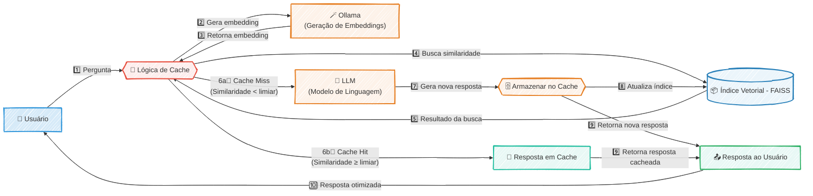

### 🚀 Cache Semântico de Alta Performance para Otimização de LLMs (PoC)

#### 🎯 Visão Geral e Arquitetura da Solução

Em um cenário onde a eficiência e a velocidade das interações com Grandes Modelos de Linguagem (LLMs) são cruciais, este projeto nasceu como uma Prova de Conceito (PoC) para um desafio claro: como reduzir a latência e os custos operacionais sem sacrificar a qualidade das respostas? A solução foi arquitetar um sistema de cache semântico de alta performance, projetado para operar de forma 100% local, garantindo privacidade total dos dados e eliminando dependências de APIs externas.

A arquitetura funciona de maneira elegante: ao receber uma pergunta, o sistema utiliza o **Ollama** para gerar localmente um vetor de embedding, que é uma representação numérica do significado daquela pergunta. Em seguida, esse vetor é usado para consultar um índice **FAISS** em memória, que realiza uma busca por similaridade em velocidade quasi-instantânea. Se uma pergunta semanticamente equivalente é encontrada acima de um limiar de confiança (um "Cache Hit"), a resposta armazenada é devolvida imediatamente. Caso contrário (um "Cache Miss"), a requisição prossegue para o LLM, e a nova resposta é então adicionada ao cache, enriquecendo o sistema para futuras interações.

#### 👨‍💻 Meu Papel no Projeto

Como idealizador e desenvolvedor principal desta Prova de Conceito, minhas responsabilidades foram:

  * **Arquitetura da Solução:** Desenhar o fluxo completo do sistema, desde a entrada do prompt até a decisão de hit/miss do cache.
  * **Implementação do Core:** Desenvolver a lógica central em Python, integrando as bibliotecas para busca vetorial e geração de embeddings.
  * **Integração de Tecnologias:** Orquestrar a comunicação entre o **Ollama** para a vetorização local e o **FAISS** para a busca por similaridade, garantindo uma operação coesa e performática.
  * **Validação e Performance:** Executar testes para validar a eficácia da PoC, comprovando a redução drástica na latência para perguntas recorrentes e o impacto positivo na otimização de recursos.

#### ✨ Pontos Fortes e Desafios Superados

O maior ponto forte desta solução é sua **autonomia e eficiência**. O principal desafio era construir um sistema de cache inteligente que não dependesse de serviços de terceiros para a geração de embeddings, que geralmente representam um gargalo de custo e privacidade.

A superação veio através da combinação estratégica de tecnologias de ponta:

  * **FAISS (Facebook AI Similarity Search):** Garantiu que a busca por similaridade, o coração do cache, fosse realizada em milissegundos, diretamente na memória.
  * **Ollama:** Permitiu a geração de embeddings de alta qualidade de forma totalmente local e gratuita, eliminando chamadas de API externas e assegurando que os dados nunca saíssem do ambiente de execução.

O resultado foi uma PoC que não apenas validou uma tese, mas demonstrou um caminho viável para otimizar sistemas de IA de forma significativa, melhorando a experiência do usuário e a sustentabilidade financeira da operação.

#### 🌱 Pontos para Evolução Futura

Para evoluir esta PoC para um sistema em produção, os próximos passos poderiam incluir a implementação de uma camada de persistência para o índice vetorial (ex: usando um banco de dados vetorial como Milvus ou Weaviate) e a criação de uma API robusta para servir o cache a múltiplas aplicações.

-----

#### 🛠️ Pilha de Tecnologias (Tech Stack)

| Componente | Tecnologia Utilizada | Papel na Arquitetura |
| :--- | :--- | :--- |
| **Linguagem Principal** | **Python** | Orquestra todo o fluxo de dados e a lógica de cache (Hit/Miss). |
| **Busca por Similaridade** | **FAISS** | Cria e gerencia um índice vetorial em memória para buscas semânticas de altíssima velocidade. |
| **Geração de Embeddings** | **Ollama** | Gera os vetores (embeddings) das perguntas de forma 100% local, garantindo privacidade e custo zero. |
| **Computação Numérica** | **NumPy** | Fornece a base para manipulação eficiente de vetores e matrizes, essencial para o FAISS. |

-----

#### 🗺️ Diagrama da Arquitetura

---
### RESUMO TÉCNICO PARA EMBEDDING

Este projeto é uma Prova de Conceito (PoC) de um cache semântico de alta performance para otimização de Grandes Modelos de Linguagem (LLMs), focado em redução de latência e custos. A arquitetura, implementada em Python, opera de forma 100% local para garantir privacidade. O fluxo consiste em receber uma query, gerar um vetor de embedding localmente com Ollama e realizar uma busca por similaridade em um índice vetorial em memória gerenciado por FAISS. A lógica de "Cache Hit" retorna uma resposta pré-existente se a similaridade ultrapassa um limiar, enquanto um "Cache Miss" encaminha a requisição ao LLM, e a nova resposta é vetorizada e adicionada ao índice FAISS. A solução utiliza NumPy para computação numérica e valida a eficácia na otimização de recursos e na melhoria da experiência do usuário, superando o desafio de criar um sistema autônomo sem dependência de APIs externas de embedding.

### CLASSIFICAÇÃO DE TECNOLOGIAS E CONCEITOS

| Categoria | Tecnologias e Conceitos |
| :--- | :--- |
| **AI & Machine Learning** | Cache Semântico, LLMs (Grandes Modelos de Linguagem), Vetor de Embedding, Busca por Similaridade, FAISS (Facebook AI Similarity Search), Ollama, Limiar de Confiança |
| **Software Development** | Python, NumPy |
| **Architecture**| Prova de Conceito (PoC), Sistema de Cache, Cache Hit/Miss, Arquitetura Local, Otimização de Performance, Redução de Latência, Índice em Memória |
| **Cloud Computing** | N/A |
| **API RESTFul development** | N/A |
| **Frontend Development** | N/A |
| **Mobile Development** | N/A |
| **Database** | N/A |
| **Data Management** | Índice Vetorial |
| **Content Management - CMS** | N/A |
| **System Administration** | N/A |
| **DevOps** | N/A |
| **Leadership** | Idealizador, Desenvolvedor Principal |
| **Coaching** | N/A |
| **Agile Project Management** | Prova de Conceito (PoC) |