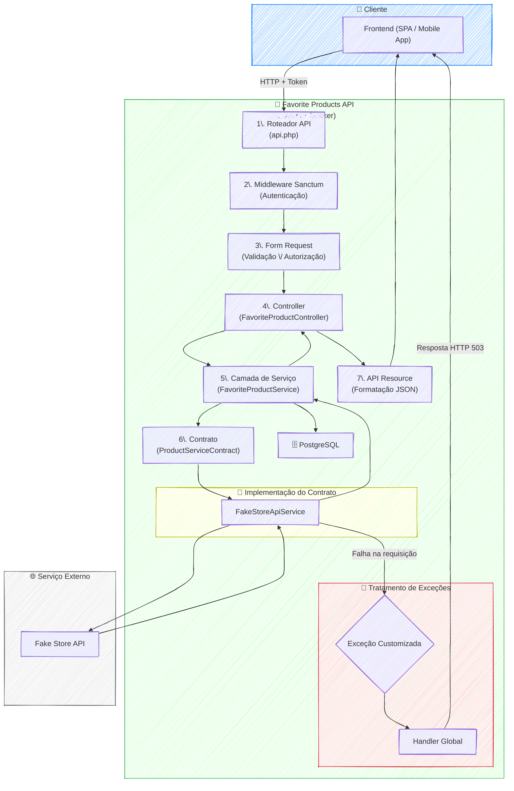
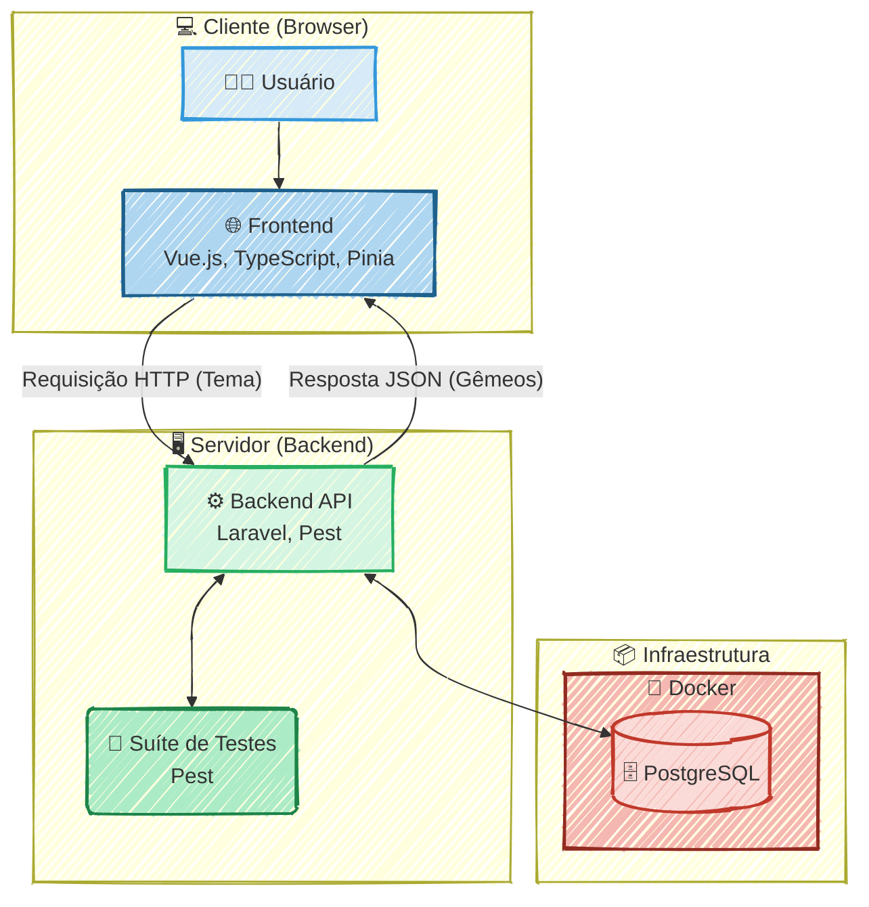
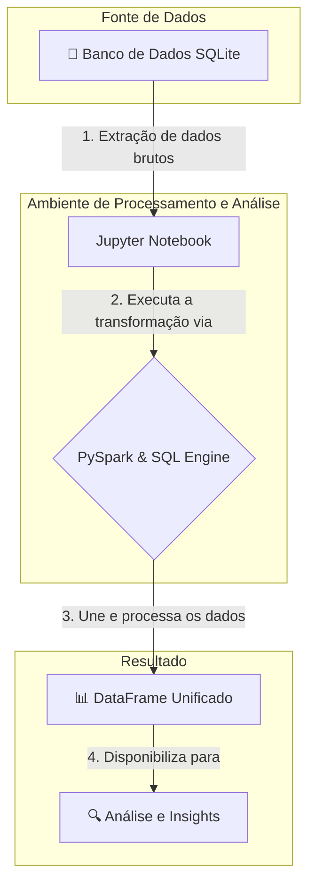
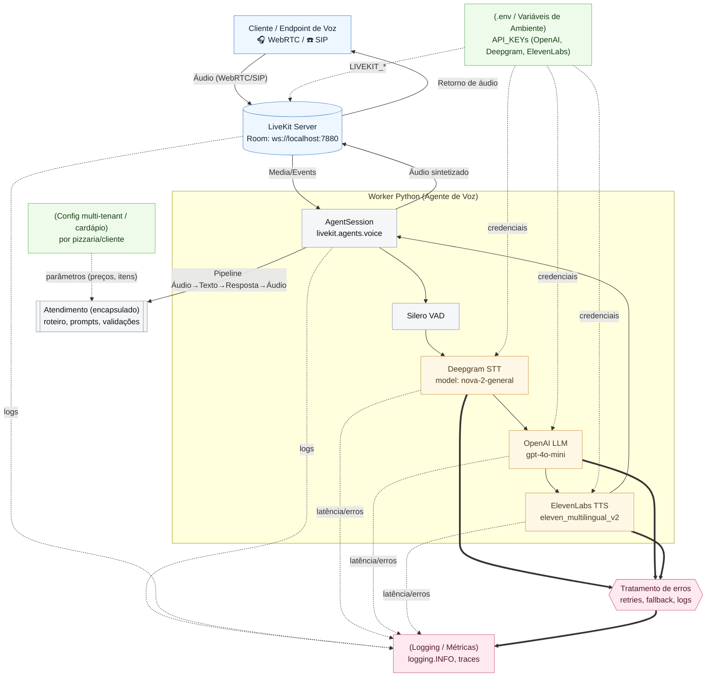
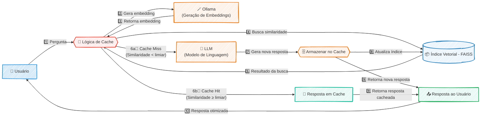
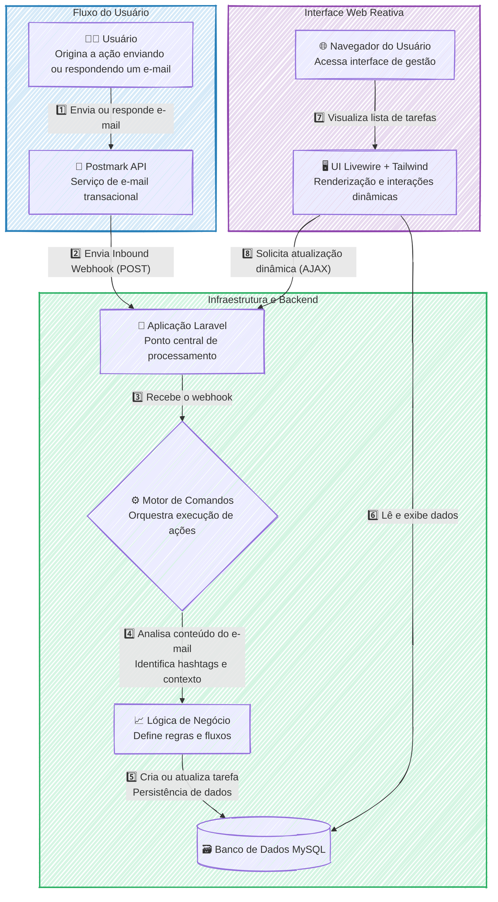

## Side Projects

### 🚀 Projeto: Favorite Products API

#### 🎯 Visão Geral e Arquitetura da Solução

A **Favorite Products API** é uma solução RESTful robusta, desenvolvida em Laravel, que serve como um backend completo para gerenciar usuários e suas listas de produtos favoritos. O principal objetivo foi criar uma API que não apenas fosse funcional, mas que também exemplificasse as melhores práticas de design de software, como **SOLID**, **Clean Architecture** e segurança.

A arquitetura foi desenhada para ser desacoplada, testável e escalável. O fluxo de uma requisição é orquestrado de forma limpa e eficiente:

1.  As requisições chegam aos **Controllers**, que atuam como uma fina camada de entrada, delegando imediatamente a lógica de validação e autorização para classes de **Form Request** dedicadas. Isso mantém os controllers enxutos e focados em sua responsabilidade principal: gerenciar o fluxo HTTP.
2.  Uma vez validada, a requisição é passada para a **Camada de Serviços**, o coração da lógica de negócio. Serviços como `FavoriteProductService` orquestram as operações, como buscar os IDs dos produtos favoritos no banco de dados (PostgreSQL) e, em seguida, solicitar os detalhes completos desses produtos.
3.  A comunicação com a API externa (`FakeStoreAPI`) é abstraída por um **Contrato (Interface)**, o `ProductServiceContract`. Essa inversão de dependência permite que a implementação concreta (`FakeStoreApiService`) seja facilmente trocada ou "mockada" em testes, garantindo flexibilidade e altíssima testabilidade.
4.  Para garantir a consistência e a segurança dos dados, a aplicação utiliza **DTOs (Data Transfer Objects)** para representar os produtos internamente, desacoplando a lógica de negócio da estrutura da API externa.
5.  Finalmente, todas as respostas são padronizadas através de **API Resources**, que garantem um contrato de API consistente e seguro, evitando o vazamento de dados sensíveis do banco de dados.

Todo o sistema é protegido por **Laravel Sanctum**, uma solução de autenticação leve e ideal para SPAs e aplicações móveis. Para completar, a API é auto-documentada usando **OpenAPI (Swagger)**, gerando uma documentação interativa diretamente a partir de anotações no código, o que acelera drasticamente a integração com equipes de frontend.

Este projeto é **open-source** e o código-fonte completo está disponível no GitHub: **[https://github.com/lfrichter/favorite-products-api](https://github.com/lfrichter/favorite-products-api)**.

#### 👨‍💻 Meu Papel no Projeto

Como **Arquiteto de Soluções** e **Desenvolvedor Back-End Sênior**, fui responsável por:

  * **Desenhar a arquitetura da aplicação**, focando em desacoplamento, testabilidade e escalabilidade através da implementação de padrões como Services, Contracts e DTOs.
  * **Implementar a lógica de negócio principal**, incluindo a integração com a API externa e a gestão do ciclo de vida dos produtos favoritos.
  * **Garantir a segurança da API**, implementando autenticação com Sanctum e corrigindo vulnerabilidades críticas como Insecure Direct Object Reference (IDOR).
  * **Otimizar o desempenho da aplicação**, identificando e solucionando gargalos como o problema de requisições N+1.
  * **Estruturar um ambiente de desenvolvimento robusto** com Docker e estabelecer uma suíte de testes automatizados com Pest para garantir a qualidade e a estabilidade do código.

#### ✨ Pontos Fortes e Desafios Superados

O projeto se destaca por sua arquitetura limpa e resiliente, mas o caminho até ela envolveu superar desafios técnicos significativos:

  * **Desafio de Desempenho (N+1 Requisições):** A abordagem inicial para buscar os detalhes dos produtos favoritos era extremamente ineficiente, gerando uma chamada de API externa para cada item na lista de um usuário.

      * **Superação:** Refatorei a camada de serviço para implementar um método de busca em massa (`findProductsByIds`). Essa mudança transformou N requisições HTTP em uma única operação orquestrada, resultando em uma melhoria drástica na latência e na experiência do usuário.

  * **Vulnerabilidade de Segurança (IDOR):** Uma falha crítica de autorização permitia que qualquer usuário autenticado modificasse o perfil de outro usuário, bastando conhecer seu ID.

      * **Superação:** Implementei uma lógica de autorização baseada em propriedade diretamente na `Form Request` correspondente. A regra agora verifica se o ID do usuário autenticado corresponde ao ID do recurso que ele está tentando modificar. Para garantir que a falha não retorne, criei testes de feature que cobrem cenários de sucesso (200), falha de autorização (403) e não autenticado (401), blindando a aplicação contra regressões.

  * **Rigidez e Baixa Testabilidade:** O acoplamento direto com a implementação do cliente HTTP e a classe de serviço concreta dificultava a criação de testes unitários rápidos e isolados.

      * **Superação:** Adotei os princípios da **Inversão de Dependência (SOLID)**, introduzindo uma interface (`ProductServiceContract`) para o serviço de produtos e utilizando injeção de dependência. Isso desacoplou completamente os controllers da implementação, permitindo "mockar" a dependência nos testes e tornando o sistema flexível para futuras mudanças, como trocar a fonte de dados dos produtos.

  * **Falhas Silenciosas em Serviços Externos:** A API mascarava erros de comunicação com o serviço externo, retornando respostas vazias com status `200 OK`, o que confundia o usuário final e dificultava a depuração.

      * **Superação:** Implementei um tratamento explícito de falhas. Agora, o serviço lança uma exceção customizada (`FakeStoreApiException`) quando a integração falha. Um handler global captura essa exceção e retorna uma resposta HTTP semanticamente correta (ex: `503 Service Unavailable`), comunicando a falha de forma transparente para o cliente.

#### 🌱 Pontos para Evolução Futura

Embora a solução atual seja robusta, a arquitetura foi preparada para evoluções futuras, como:

  * **Implementação de Cache com Redis:** O método `findProductsByIds` cria a base perfeita para adicionar uma camada de cache, reduzindo ainda mais a latência e o número de chamadas à API externa.
  * **Paralelização de Requisições:** A lógica de busca em lote pode ser otimizada utilizando `Promise` ou `Pool` para executar as chamadas HTTP à API externa em paralelo, melhorando o tempo de resposta para listas de favoritos muito grandes.

-----

#### 🛠️ Pilha de Tecnologias (Tech Stack)

| Componente | Tecnologia Utilizada | Papel na Arquitetura |
| :--- | :--- | :--- |
| **Linguagem & Framework** | **PHP 8.3 & Laravel 12** | Base da aplicação, fornecendo um ecossistema robusto para roteamento, ORM e injeção de dependência. |
| **Banco de Dados** | **PostgreSQL** | Armazenamento persistente dos dados de usuários e da relação de seus produtos favoritos. |
| **Autenticação** | **Laravel Sanctum** | Prover autenticação segura e leve baseada em tokens de API, ideal para SPAs e clientes móveis. |
| **Ambiente Local** | **Docker & Docker Compose** | Containerização da aplicação, garantindo um ambiente de desenvolvimento consistente e portável. |
| **Testes Automatizados** | **Pest** | Escrita de testes de feature e unitários de forma elegante e eficiente para garantir a qualidade do código. |
| **Documentação da API** | **Swagger (OpenAPI)** | Geração automática de documentação interativa a partir de anotações no código-fonte. |
| **Integração Externa** | **Fake Store API Client** | Comunicação com o serviço de e-commerce externo para obter dados de produtos. |

-----

#### 🗺️ Diagrama da Arquitetura

#### RESUMO TÉCNICO PARA EMBEDDING

Este documento detalha a arquitetura de uma **API RESTful**, a **Favorite Products API**, construída com **PHP 8.3** e **Laravel 12**, utilizando **PostgreSQL** como banco de dados. A arquitetura é fortemente baseada nos princípios **SOLID** e **Clean Architecture**, com uma clara separação de responsabilidades. A lógica de negócio é isolada em uma **Camada de Serviços** (`Services`), desacoplada dos `Controllers` através de **Contratos** (`Interfaces`), promovendo alta testabilidade e flexibilidade. A validação e autorização de requisições são gerenciadas por classes de **Form Request**, que também mitigam vulnerabilidades de segurança como **IDOR (Insecure Direct Object Reference)**. Para garantir a integridade e o desacoplamento dos dados, são utilizados **DTOs (Data Transfer Objects)**, e as respostas da API são padronizadas com **API Resources**. O ambiente de desenvolvimento é containerizado com **Docker** e **Docker Compose**, e a qualidade do código é assegurada por testes automatizados com **Pest**. A documentação da API é gerada automaticamente via **Swagger (OpenAPI)**. Desafios técnicos superados incluem a otimização de performance com a resolução do problema de **requisições N+1** na integração com uma API externa e o tratamento explícito de falhas com exceções customizadas. A autenticação é gerenciada pelo **Laravel Sanctum**.

#### CLASSIFICAÇÃO DE TECNOLOGIAS E CONCEITOS

| Categoria | Tecnologias e Conceitos |
| :--- | :--- |
| 👑 **AI & Machine Learning** | N/A |
| 💻 **Software Development** | PHP 8.3, Laravel 12, SOLID, Clean Code, Pest (Testes Automatizados), cURL |
| 🏛️ **Architecture**| Clean Architecture, RESTful API, Camada de Serviços, Contratos (Inversão de Dependência), DTOs (Data Transfer Objects), Tratamento de Exceções Customizadas, ADRs (Architecture Decision Records) |
| ☁️ **Cloud Computing** | N/A |
| 📡 **API RESTFul development** | Laravel Sanctum, Swagger (OpenAPI), API Resources, Form Requests, Validação de Requisições, Autorização (IDOR Prevention), Integração com APIs Externas (Fake Store API) |
| 🎨 **Frontend Development** | Vite, TailwindCSS, TypeScript |
| 📱 **Mobile Development** | N/A |
| 🗃️ **Database** | PostgreSQL, Migrations & Seeders, Otimização de Queries (N+1) |
| 📊 **Data Management** | N/A |
| 📝 **Content Management - CMS** | N/A |
| ⚙️ **System Administration** | Docker |
| 🚀 **DevOps** | Docker Compose, Testes Automatizados |
| 👨‍💼 **Leadership** | Arquitetura de Soluções |
| 👨‍🏫 **Coaching** | N/A |
|  scrum **Agile Project Management** | N/A |

### 🚀 Projeto: Twin Quest: Desafio Full-Stack 

#### 🎯 Visão Geral e Arquitetura da Solução

O "Twin Quest" nasceu como uma resposta criativa a um desafio, a arquitetura foi desenhada para ser moderna, robusta e reativa. O coração da aplicação é um **backend em Laravel** que serve uma API RESTful segura e eficiente. Ele é o maestro que orquestra a comunicação com a API. No frontend, uma interface limpa e fluida, construída com **Vue 3 (Composition API) e TypeScript**, oferece uma experiência de usuário impecável. O estado da aplicação é gerenciado de forma centralizada pelo **Pinia**, garantindo que os dados fluam de maneira reativa e instantânea da API para a tela do usuário.

#### 👨‍💻 Meu Papel no Projeto

Como idealizador e único desenvolvedor deste projeto, atuei em todas as frentes como **Desenvolvedor Full-Stack**, com as seguintes responsabilidades:

  * **Arquitetura e Desenvolvimento Back-End:** Construí toda a API RESTful com Laravel, definindo os endpoints, a lógica de negócio e a orquestração da comunicação com o serviço de IA.
  * **Desenvolvimento Front-End:** Criei a interface de usuário reativa utilizando Vue 3, TypeScript e a Composition API, focando em uma experiência limpa e intuitiva.
  * **Gestão de Estado:** Implementei o Pinia para um gerenciamento de estado global eficiente e previsível no lado do cliente.
  * **Qualidade de Código e Testes:** Garanti a estabilidade e a confiabilidade da API escrevendo uma suíte de testes completa com Pest, adotando uma abordagem TDD.

#### ✨ Pontos Fortes e Desafios Superados

O maior trunfo do projeto é a sua **execução técnica coesa e moderna**, integrando perfeitamente o frontend e o backend. A utilização de TypeScript de ponta a ponta trouxe uma camada extra de segurança e manutenibilidade ao código.

Um desafio significativo foi implementação de uma **suíte de testes robusta com Pest** foi crucial para garantir que a lógica de negócio da API fosse à prova de falhas, um pilar para a qualidade do projeto.

#### 🌱 Pontos para Evolução Futura

Para o futuro, a aplicação poderia evoluir com a implementação de um **sistema de cache (como Redis)** para temas populares, otimizando custos de API e a velocidade de resposta. Outra melhoria seria adicionar **autenticação de usuários** para que eles possam salvar e revisitar seu histórico de "quests".

-----

#### 🛠️ Pilha de Tecnologias (Tech Stack)

| Componente                  | Tecnologia Utilizada        | Papel na Arquitetura                                                                                                |
| :-------------------------- | :-------------------------- | :------------------------------------------------------------------------------------------------------------------ |
| **Backend (API)**           | **Laravel**                 | Orquestra a lógica de negócio, gerencia as rotas da API e se comunica com o serviço de IA Generativa.               |
| **Frontend (UI)**           | **Vue 3 (Composition API)** | Constrói a interface de usuário reativa e dinâmica, permitindo uma interação fluida com o usuário.                  |
| **Tipagem de Código**       | **TypeScript**              | Garante a segurança de tipos em todo o projeto, tanto no frontend quanto no backend (se aplicável), reduzindo bugs. |
| **Gerenciamento de Estado** | **Pinia**                   | Centraliza e gerencia o estado da aplicação no frontend de forma simples, reativa e eficiente.                      |
| **Testes Automatizados**    | **Pest**                    | Garante a confiabilidade e a qualidade da API do Laravel através de uma suíte de testes elegante e poderosa (TDD).  |

-----

#### 🗺️ Diagrama da Arquitetura

---
#### RESUMO TÉCNICO PARA EMBEDDING

Desenvolvimento de uma aplicação web full-stack, "Twin Quest", a arquitetura da solução é baseada em um backend com Laravel que serve uma API RESTful. O frontend é uma interface de usuário reativa construída com Vue 3, Composition API e TypeScript para garantir tipagem segura. O gerenciamento de estado global no lado do cliente é realizado de forma centralizada pelo Pinia. A qualidade e estabilidade da API foram asseguradas através de uma suíte de testes automatizados com Pest, adotando uma abordagem TDD (Test-Driven Development). A infraestrutura inclui PostgreSQL, com planos de evolução para implementar um sistema de cache com Redis e autenticação de usuários.

#### CLASSIFICAÇÃO DE TECNOLOGIAS E CONCEITOS

| Categoria                    | Tecnologias e Conceitos                                                                                               |
| :--------------------------- | :-------------------------------------------------------------------------------------------------------------------- |
| **Software Development**     | Desenvolvedor Full-Stack, Laravel, Vue 3, TypeScript, Pinia, Pest, Test-Driven Development (TDD), Qualidade de Código |
| **Architecture**             | Arquitetura Full-Stack, API RESTful, Gestão de Estado (Pinia), Sistema de Cache (Redis), Autenticação de Usuários     |
| **Cloud Computing**          | N/A                                                                                                                   |
| **API RESTFul development**  | API RESTful, Laravel, Endpoints, Requisição HTTP, Resposta JSON                                                       |
| **Frontend Development**     | Vue 3 (Composition API), TypeScript, Pinia, Interface de Usuário Reativa                                              |
| **Mobile Development**       | N/A                                                                                                                   |
| **Database**                 | PostgreSQL, Redis                                                                                                     |
| **Data Management**          | N/A                                                                                                                   |
| **Content Management - CMS** | N/A                                                                                                                   |
| **System Administration**    | N/A                                                                                                                   |
| **DevOps**                   | Testes Automatizados, Pest, Docker                                                                                    |
| **Leadership**               | Liderança Técnica (Idealizador e único desenvolvedor)                                                                 |
| **Coaching**                 | N/A                                                                                                                   |
| **Agile Project Management** | N/A                                                                                                                   |

## PoC
### 🚀 Projeto: PoC: Análise de Jobs de Renderização com PySpark

#### 🎯 Visão Geral e Arquitetura da Solução

Este projeto nasceu da necessidade de extrair insights operacionais a partir de dados de renderização de vídeos, que estavam dispersos em um banco de dados SQLite. Como uma Prova de Conceito (PoC), o objetivo foi validar o uso de PySpark para orquestrar um micro-pipeline de ETL, consolidando informações de múltiplas tabelas para viabilizar uma análise de dados coesa.

A solução funciona em um ambiente interativo com Jupyter Notebook, onde um script se conecta à base de dados, executa uma query SQL complexa para unificar dados de jobs, roteiros e seus respectivos segmentos, e por fim, materializa o resultado em um DataFrame enriquecido e pronto para análise.

#### 👨‍💻 Meu Papel no Projeto

Como único desenvolvedor nesta Prova de Conceito, minhas responsabilidades abrangeram todo o ciclo de vida dos dados em pequena escala:

  * **Engenharia de Dados:** Desenvolvi o script ETL para extração, transformação e carga dos dados, utilizando PySpark para o processamento.
  * **Análise de Dados:** Utilizei o Jupyter Notebook para a análise exploratória e validação dos dados transformados.
  * **Otimização de Consulta:** Elaborei a query SQL com múltiplos `LEFT JOINs` para garantir a integridade e a correta união das informações.

#### ✨ Pontos Fortes e Desafios Superados

O principal desafio foi consolidar informações de três tabelas distintas (`render_jobs`, `scripts` e `segments`) em uma visão única, especialmente ao lidar com a relação 1:N entre roteiros e seus segmentos.

A superação veio através da construção de uma query SQL otimizada, que não apenas enriqueceu os dados dos jobs, mas também garantiu que todos os segmentos fossem corretamente associados aos seus respectivos roteiros. Embora seja um PoC, a escolha do PySpark valida a arquitetura para futura escalabilidade, permitindo que o mesmo código processe volumes de dados ordens de magnitude maiores com mínima alteração.

#### 🌱 Pontos para Evolução Futura

  * **Automação:** Agendar a execução do notebook como um job recorrente (utilizando ferramentas como Airflow ou cron).
  * **Escalabilidade:** Migrar a fonte de dados de SQLite para um Data Lake (ex: AWS S3) para testar o pipeline com um volume de dados maior.

-----

#### 🛠️ Pilha de Tecnologias (Tech Stack)

| Componente | Tecnologia Utilizada | Papel na Arquitetura |
| :--- | :--- | :--- |
| **Processamento de Dados** | **PySpark** | Orquestrador principal do ETL, responsável por ler, transformar e processar os dados de forma distribuída. |
| **Ambiente de Análise** | **Jupyter Notebook** | Interface interativa para desenvolvimento, execução do pipeline e análise exploratória dos resultados. |
| **Fonte de Dados** | **SQLite** | Banco de dados relacional que armazena os dados brutos dos jobs, roteiros e segmentos. |
| **Manipulação Auxiliar** | **Pandas** | Utilizado para a conversão final e visualização mais direta do DataFrame resultante no ambiente do notebook. |

-----

#### 🗺️ Diagrama da Arquitetura

### 🚀 Projeto: PoC Robo de Atendimento por Voz - BRNow

#### 🎯 Visão Geral e Arquitetura da Solução

Em um cenário onde a agilidade e a eficiência são cruciais para restaurantes e pizzarias, o "Robo de Atendimento por Voz - BRNow" surge como uma solução inovadora para automatizar o recebimento de pedidos. O objetivo é claro: reduzir custos operacionais e otimizar o tempo, enquanto se oferece uma experiência fluida e acolhedora ao cliente, simulando um atendente humano simpático e eficiente.

A arquitetura foi concebida para ser robusta, escalável e, principalmente, **multi-tenant**. A cada nova chamada, o sistema inicia uma sessão de atendimento personalizada. Através de uma API RESTful, o restaurante envia uma imagem do seu cardápio, que é processada em tempo real com tecnologia OCR (Pytesseract) para extrair os itens e preços. Essa informação é usada para construir um prompt dinâmico que contextualiza o agente de IA (GPT-4o-mini), permitindo que ele conduza o pedido de forma precisa. A comunicação de voz acontece em tempo real através do LiveKit, que gerencia o fluxo de áudio entre o cliente e o agente de IA, garantindo uma interação natural e de baixa latência.

#### 👨‍💻 Meu Papel no Projeto

Como arquiteto e desenvolvedor principal desta solução, minhas responsabilidades abrangeram todo o ciclo de vida do projeto:

  * **Arquitetura da Solução:** Projetei a arquitetura end-to-end, focada em comunicação de voz em tempo real e processamento de IA de baixa latência.
  * **Desenvolvimento Back-End:** Implementei a API RESTful com Flask para gerenciar o ciclo de vida dos agentes, incluindo a orquestração da inicialização e finalização das sessões.
  * **Integração de IA e Serviços:** Fui responsável por integrar e orquestrar o pipeline de serviços de IA, conectando o reconhecimento de fala (Deepgram), a lógica de conversação (OpenAI) e a síntese de voz (ElevenLabs).
  * **Implementação da Lógica Multi-Tenant:** Desenvolvi o sistema de personalização dinâmica que utiliza OCR para adaptar o agente a diferentes cardápios, garantindo que cada restaurante tivesse um atendente virtual exclusivo.

#### ✨ Pontos Fortes e Desafios Superados

O maior ponto forte da solução é sua capacidade de oferecer uma interação de voz natural e quase instantânea. Um dos principais desafios técnicos foi **garantir a baixa latência no ciclo "fala-processamento-resposta"**. Superamos isso ao selecionar um conjunto de tecnologias de ponta e orquestrá-las de forma eficiente: LiveKit para o transporte de mídia via WebRTC, Deepgram para transcrição em tempo real, GPT-4o-mini para respostas rápidas e ElevenLabs para uma síntese de voz natural.

Outro desafio significativo foi **tornar o sistema facilmente adaptável a qualquer restaurante sem a necessidade de configuração manual complexa**. A solução foi a implementação de um fluxo de onboarding automatizado, onde o sistema utiliza OCR para "ler" uma imagem do cardápio e, a partir dela, gerar dinamicamente o roteiro e o contexto para a IA. Isso transformou um processo complexo em uma simples chamada de API, tornando a plataforma extremamente escalável.

#### 🌱 Pontos para Evolução Futura

Embora a solução atual seja robusta, existem caminhos claros para evolução, como a **integração direta com sistemas de PDV (Ponto de Venda)** para automatizar o envio do pedido à cozinha e a implementação de um **sistema de reconhecimento de clientes recorrentes** para oferecer um atendimento ainda mais personalizado.

-----

#### 🛠️ Pilha de Tecnologias (Tech Stack)

| Componente | Tecnologia Utilizada | Papel na Arquitetura |
| :--- | :--- | :--- |
| **Orquestração e Backend** | **Python (Flask)** | Fornece a API RESTful para gerenciar o ciclo de vida do agente de voz. |
| **Comunicação em Tempo Real** | **LiveKit Voice Agents** | Gerencia a conexão WebRTC/SIP e o transporte de mídia entre o cliente e o agente. |
| **Inteligência Artificial (LLM)** | **OpenAI (GPT-4o-mini)** | Gera respostas inteligentes e contextuais para guiar o cliente durante o pedido. |
| **Reconhecimento de Fala (STT)**| **Deepgram** | Transcreve a fala do cliente em texto com alta precisão e baixa latência. |
| **Síntese de Voz (TTS)** | **ElevenLabs** | Converte as respostas de texto do LLM em áudio com voz natural e personalizada. |
| **Detecção de Fala (VAD)** | **Silero VAD** | Detecta quando o usuário está falando, otimizando o fluxo da conversação. |
| **Processamento de Imagem (OCR)**| **Pytesseract & Pillow** | Extrai o texto de imagens de cardápios para personalizar o prompt do agente. |

-----

#### 🗺️ Diagrama da Arquitetura

#### RESUMO TÉCNICO PARA EMBEDDING

Este projeto implementa um robô de atendimento por voz multi-tenant para restaurantes, desenvolvido em Python 3.12 com um backend Flask que expõe uma API RESTful para gerenciamento de sessões. A arquitetura centraliza-se no LiveKit Voice Agents para comunicação em tempo real via WebRTC/SIP. O pipeline de processamento de voz integra Silero VAD para detecção de atividade de fala, Deepgram (modelo nova-2-general) para Speech-to-Text (STT), OpenAI GPT-4o-mini como Large Language Model (LLM) para geração de respostas inteligentes, e ElevenLabs (modelo eleven_multilingual_v2) para Text-to-Speech (TTS) customizável. A solução é multi-tenant, permitindo a personalização de cardápios através de um sistema de OCR com Pytesseract e Pillow, que extrai texto de imagens para construir prompts dinâmicos. A qualidade do código é garantida por uma suíte de DevOps utilizando Makefile para automação de tarefas como linting com `ruff`, verificação de tipos com `mypy` e testes com `pytest`. O sistema é projetado para ser observável, com logging e monitoramento de tráfego SIP via `sngrep` e CLI do LiveKit.

#### CLASSIFICAÇÃO DE TECNOLOGIAS E CONCEITOS

| Categoria | Tecnologias e Conceitos |
| :--- | :--- |
| 🤖 **AI & Machine Learning** | OpenAI GPT-4o-mini, Deepgram (STT), ElevenLabs (TTS), Silero VAD (Voice Activity Detection), Pytesseract (OCR), Pillow (Image Processing), LLM |
| 💻 **Software Development** | Python 3.12, Flask, Makefile, Ruff (linter/formatter), MyPy (type checking), Pytest, virtual environment (venv) |
| 🏗️ **Architecture**| Arquitetura Multi-tenant, Voice Agents, WebRTC, SIP, Worker (Agent Pattern) |
| ☁️ **Cloud Computing** | LiveKit (Real-time voice/video infrastructure) |
| 🌐 **API RESTFul development** | Flask, multipart/form-data, POST /create-voice-support, GET /api/agent-status/, POST /api/stop-agent |
| 🎨 **Frontend Development** | Interação via formulário de navegador (HTML) |
| 📱 **Mobile Development** | N/A |
| 🗃️ **Database** | N/A |
| 📊 **Data Management** | OCR de imagem, Processamento de áudio em tempo real |
| 📰 **Content Management - CMS** | N/A |
| ⚙️ **System Administration** | Tesseract OCR (instalação), sngrep (monitoramento de rede SIP) |
| 🚀 **DevOps** | Makefile (run, fix, lint, type, test, quality, ci), CI/CD pipeline, Gerenciamento de dependências (requirements.txt), Variáveis de Ambiente (.env) |
| 👨‍💼 **Leadership** | N/A |
| 👨‍🏫 **Coaching** | N/A |
| 📈 **Agile Project Management** | N/A |

### 🚀 Projeto: PoC Cache Semântico de Alta Performance para Otimização de LLMs

#### 🎯 Visão Geral e Arquitetura da Solução

Em um cenário onde a eficiência e a velocidade das interações com Grandes Modelos de Linguagem (LLMs) são cruciais, este projeto nasceu como uma Prova de Conceito (PoC) para um desafio claro: como reduzir a latência e os custos operacionais sem sacrificar a qualidade das respostas? A solução foi arquitetar um sistema de cache semântico de alta performance, projetado para operar de forma 100% local, garantindo privacidade total dos dados e eliminando dependências de APIs externas.

A arquitetura funciona de maneira elegante: ao receber uma pergunta, o sistema utiliza o **Ollama** para gerar localmente um vetor de embedding, que é uma representação numérica do significado daquela pergunta. Em seguida, esse vetor é usado para consultar um índice **FAISS** em memória, que realiza uma busca por similaridade em velocidade quasi-instantânea. Se uma pergunta semanticamente equivalente é encontrada acima de um limiar de confiança (um "Cache Hit"), a resposta armazenada é devolvida imediatamente. Caso contrário (um "Cache Miss"), a requisição prossegue para o LLM, e a nova resposta é então adicionada ao cache, enriquecendo o sistema para futuras interações.

#### 👨‍💻 Meu Papel no Projeto

Como idealizador e desenvolvedor principal desta Prova de Conceito, minhas responsabilidades foram:

  * **Arquitetura da Solução:** Desenhar o fluxo completo do sistema, desde a entrada do prompt até a decisão de hit/miss do cache.
  * **Implementação do Core:** Desenvolver a lógica central em Python, integrando as bibliotecas para busca vetorial e geração de embeddings.
  * **Integração de Tecnologias:** Orquestrar a comunicação entre o **Ollama** para a vetorização local e o **FAISS** para a busca por similaridade, garantindo uma operação coesa e performática.
  * **Validação e Performance:** Executar testes para validar a eficácia da PoC, comprovando a redução drástica na latência para perguntas recorrentes e o impacto positivo na otimização de recursos.

#### ✨ Pontos Fortes e Desafios Superados

O maior ponto forte desta solução é sua **autonomia e eficiência**. O principal desafio era construir um sistema de cache inteligente que não dependesse de serviços de terceiros para a geração de embeddings, que geralmente representam um gargalo de custo e privacidade.

A superação veio através da combinação estratégica de tecnologias de ponta:

  * **FAISS (Facebook AI Similarity Search):** Garantiu que a busca por similaridade, o coração do cache, fosse realizada em milissegundos, diretamente na memória.
  * **Ollama:** Permitiu a geração de embeddings de alta qualidade de forma totalmente local e gratuita, eliminando chamadas de API externas e assegurando que os dados nunca saíssem do ambiente de execução.

O resultado foi uma PoC que não apenas validou uma tese, mas demonstrou um caminho viável para otimizar sistemas de IA de forma significativa, melhorando a experiência do usuário e a sustentabilidade financeira da operação.

#### 🌱 Pontos para Evolução Futura

Para evoluir esta PoC para um sistema em produção, os próximos passos poderiam incluir a implementação de uma camada de persistência para o índice vetorial (ex: usando um banco de dados vetorial como Milvus ou Weaviate) e a criação de uma API robusta para servir o cache a múltiplas aplicações.

-----

#### 🛠️ Pilha de Tecnologias (Tech Stack)

| Componente | Tecnologia Utilizada | Papel na Arquitetura |
| :--- | :--- | :--- |
| **Linguagem Principal** | **Python** | Orquestra todo o fluxo de dados e a lógica de cache (Hit/Miss). |
| **Busca por Similaridade** | **FAISS** | Cria e gerencia um índice vetorial em memória para buscas semânticas de altíssima velocidade. |
| **Geração de Embeddings** | **Ollama** | Gera os vetores (embeddings) das perguntas de forma 100% local, garantindo privacidade e custo zero. |
| **Computação Numérica** | **NumPy** | Fornece a base para manipulação eficiente de vetores e matrizes, essencial para o FAISS. |

-----

#### 🗺️ Diagrama da Arquitetura

---
#### RESUMO TÉCNICO PARA EMBEDDING

Este projeto é uma Prova de Conceito (PoC) de um cache semântico de alta performance para otimização de Grandes Modelos de Linguagem (LLMs), focado em redução de latência e custos. A arquitetura, implementada em Python, opera de forma 100% local para garantir privacidade. O fluxo consiste em receber uma query, gerar um vetor de embedding localmente com Ollama e realizar uma busca por similaridade em um índice vetorial em memória gerenciado por FAISS. A lógica de "Cache Hit" retorna uma resposta pré-existente se a similaridade ultrapassa um limiar, enquanto um "Cache Miss" encaminha a requisição ao LLM, e a nova resposta é vetorizada e adicionada ao índice FAISS. A solução utiliza NumPy para computação numérica e valida a eficácia na otimização de recursos e na melhoria da experiência do usuário, superando o desafio de criar um sistema autônomo sem dependência de APIs externas de embedding.

#### CLASSIFICAÇÃO DE TECNOLOGIAS E CONCEITOS

| Categoria                    | Tecnologias e Conceitos                                                                                                                                              |
| :--------------------------- | :------------------------------------------------------------------------------------------------------------------------------------------------------------------- |
| **AI & Machine Learning**    | Cache Semântico, LLMs (Grandes Modelos de Linguagem), Vetor de Embedding, Busca por Similaridade, FAISS (Facebook AI Similarity Search), Ollama, Limiar de Confiança |
| **Software Development**     | Python, NumPy                                                                                                                                                        |
| **Architecture**             | Prova de Conceito (PoC), Sistema de Cache, Cache Hit/Miss, Arquitetura Local, Otimização de Performance, Redução de Latência, Índice em Memória                      |
| **Cloud Computing**          | N/A                                                                                                                                                                  |
| **API RESTFul development**  | N/A                                                                                                                                                                  |
| **Frontend Development**     | N/A                                                                                                                                                                  |
| **Mobile Development**       | N/A                                                                                                                                                                  |
| **Database**                 | N/A                                                                                                                                                                  |
| **Data Management**          | Índice Vetorial                                                                                                                                                      |
| **Content Management - CMS** | N/A                                                                                                                                                                  |
| **System Administration**    | N/A                                                                                                                                                                  |
| **DevOps**                   | N/A                                                                                                                                                                  |
| **Leadership**               | Idealizador, Desenvolvedor Principal                                                                                                                                 |
| **Coaching**                 | N/A                                                                                                                                                                  |
| **Agile Project Management** | Prova de Conceito (PoC)                                                                                                                                              |

## Challenge
### 🚀 Projeto: Gerenciador de Tarefas Conversacional via E-mail 📥 Postmark Challenge

##### 🎯 Visão Geral e Arquitetura da Solução

Este projeto nasceu para solucionar uma dor comum no dia a dia de qualquer profissional: a fricção de transformar e-mails em tarefas acionáveis. Em vez de alternar entre a caixa de entrada e um aplicativo de To-Do, a solução transforma o próprio e-mail em uma poderosa interface de gerenciamento. O usuário pode criar, atualizar, comentar e concluir tarefas simplesmente enviando um e-mail para um endereço dedicado ou respondendo a uma conversa existente, utilizando comandos simples e intuitivos como `#prioridade` ou `#concluir`.

A arquitetura foi desenhada para ser ágil e orientada a eventos. O fluxo se inicia quando o **Postmark API** recebe um e-mail e, através de um **Inbound Webhook**, notifica a aplicação **Laravel** em tempo real. Um motor de comandos customizado entra em ação, analisando o corpo do e-mail em busca de "hashtags" de ação. Cada comando aciona a lógica de negócio correspondente, atualizando o estado da tarefa no banco de dados. Para a visualização, uma interface web reativa, construída com **Livewire** e **Tailwind CSS**, exibe a lista de tarefas, que se atualiza dinamicamente sem a necessidade de recarregar a página, proporcionando uma experiência de usuário fluida e moderna.

#### 👨‍💻 Meu Papel no Projeto

Como idealizador e desenvolvedor da solução, minhas principais responsabilidades foram:

  * **Arquitetura do Processamento de E-mails:** Implementar a lógica de recebimento e interpretação de e-mails em tempo real utilizando Postmark Inbound Webhooks, que servem como gatilho para todo o fluxo da aplicação.
  * **Desenvolvimento do Motor de Comandos:** Criar um processador de comandos em Laravel para analisar o corpo do e-mail, identificar hashtags de ação (ex: `#comentario`, `#concluir`) e executar as operações de negócio correspondentes.
  * **Construção do Frontend Reativo:** Desenvolver a interface de usuário para visualização das tarefas com Livewire e Tailwind CSS, garantindo atualizações dinâmicas e uma experiência moderna sem a complexidade de uma Single Page Application (SPA).
  * **Garantia de Qualidade:** Assegurar a robustez e a confiabilidade do sistema, especialmente do motor de comandos, através de uma suíte de testes completa escrita com Pest.

#### ✨ Pontos Fortes e Desafios Superados

O grande trunfo do projeto é sua simplicidade e elegância: ele se integra a um fluxo de trabalho que o usuário já domina — o e-mail. A solução elimina a necessidade de um novo software, transformando uma ferramenta de comunicação em uma plataforma de produtividade.

O principal desafio técnico foi criar um sistema robusto para "traduzir" o texto não estruturado de um e-mail em comandos de sistema precisos e confiáveis. Superamos isso com o **desenvolvimento de um motor de comandos customizado**, capaz de analisar o conteúdo de forma inteligente. Outra vitória foi a escolha do **Livewire**, que permitiu construir uma interface reativa e performática com a produtividade do ecossistema Laravel, evitando a complexidade de gerenciar um frontend desacoplado.

#### 🌱 Pontos para Evolução Futura

Para o futuro, a solução poderia evoluir com a implementação de um processamento de linguagem natural (PLN) mais avançado, permitindo que os usuários escrevam comandos de forma mais livre, sem a rigidez das hashtags. Outra evolução seria a integração com calendários (Google Calendar, Outlook) para agendar tarefas com datas de vencimento.

-----

#### 🛠️ Pilha de Tecnologias (Tech Stack)

| Componente | Tecnologia Utilizada | Papel na Arquitetura |
| :--- | :--- | :--- |
| **Backend** | **Laravel** | Orquestra toda a lógica de negócio, rotas, processamento de webhooks e interação com o banco de dados. |
| **Frontend Reativo** | **Livewire & Tailwind CSS** | Constrói uma interface de usuário dinâmica e moderna para a visualização das tarefas, com atualizações em tempo real. |
| **Testes Automatizados**| **Pest** | Garante a confiabilidade e a robustez das regras de negócio e do motor de comandos com uma suíte de testes limpa. |
| **Gateway de E-mail** | **Postmark API & Webhooks** | Recebe os e-mails, dispara os eventos via webhook para a aplicação e gerencia o envio de respostas. |
| **Modelo Arquitetural** | **Arquitetura Orientada a Eventos** | Permite que a aplicação reaja de forma assíncrona aos e-mails recebidos, garantindo um fluxo desacoplado e escalável. |

-----

#### 🔗 Links e Recursos
* **🎬 Apresentação em Vídeo:** [Assista no YouTube](https://www.youtube.com/watch?v=NDFgcH2X1ZI)
* **📂 Repositório Open Source:** [Veja o código no GitHub](https://github.com/lfrichter/Interactive-email-management)

---

#### 🗺️ Diagrama da Arquitetura

---
#### RESUMO TÉCNICO PARA EMBEDDING

A solução é um gerenciador de tarefas conversacional implementado em uma arquitetura orientada a eventos, acionada por e-mails. O fluxo é iniciado por um Inbound Webhook da Postmark API, que notifica uma aplicação backend em Laravel. Um motor de comandos customizado, com lógica de negócio robusta validada por testes automatizados em Pest, processa o corpo do e-mail para identificar e executar ações baseadas em hashtags, como `#prioridade` ou `#concluir`. O estado das tarefas é persistido em um banco de dados MySQL. A interface de usuário para visualização é um frontend reativo construído com Livewire e Tailwind CSS, garantindo atualizações dinâmicas da lista de tarefas sem a necessidade de recarregar a página. O principal desafio superado foi a tradução de texto não estruturado de e-mails em comandos de sistema precisos através do motor de comandos, evitando a complexidade de uma SPA desacoplada ao utilizar a stack TALL (Tailwind, Alpine, Livewire, Laravel). Futuras evoluções contemplam o uso de processamento de linguagem natural (PLN).

#### CLASSIFICAÇÃO DE TECNOLOGIAS E CONCEITOS

| Categoria                    | Tecnologias e Conceitos                                                                      |
| :--------------------------- | :------------------------------------------------------------------------------------------- |
| **AI & Machine Learning**    | 🧠 Processamento de Linguagem Natural (PLN)                                                  |
| **Software Development**     | 👨‍💻 Laravel, Pest, Motor de Comandos Customizado                                           |
| **Architecture**             | 🏗️ Arquitetura Orientada a Eventos, Inbound Webhook, Sistema Desacoplado, Sistema Escalável |
| **Cloud Computing**          | ☁️ Postmark API (SaaS)                                                                       |
| **API RESTFul development**  | 🔄 Postmark API, Webhooks                                                                    |
| **Frontend Development**     | 🖥️ Livewire, Tailwind CSS, Interface Reativa                                                |
| **Mobile Development**       | 📱 N/A                                                                                       |
| **Database**                 | 🗃️ MySQL                                                                                    |
| **Data Management**          | 💾 Persistência de Dados                                                                     |
| **Content Management - CMS** | 📄 N/A                                                                                       |
| **System Administration**    | ⚙️ N/A                                                                                       |
| **DevOps**                   | 🔁 Testes Automatizados                                                                      |
| **Leadership**               | 🚀 Idealizador, Desenvolvedor da Solução                                                     |
| **Coaching**                 | 🤝 N/A                                                                                       |
| **Agile Project Management** | scrum N/A                                                                                    |