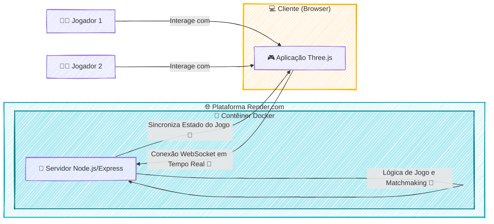

### 🚀 Air Combat 3D: Um Estudo de Caso sobre Produtividade com IAs

#### 🎯 Visão Geral e Arquitetura da Solução

Este projeto nasceu de uma questão estratégica: qual o impacto real de ferramentas de IA generativa na produtividade de um desenvolvedor full-stack? Para responder a isso, conduzi um estudo de caso prático, desenvolvendo do zero um jogo 3D de combate aéreo multiplayer. O objetivo não era apenas criar um jogo, mas sim mensurar a aceleração no ciclo de vida do desenvolvimento.

A solução é uma aplicação web onde jogadores podem entrar em uma arena e pilotar aviões de combate em tempo real. O frontend, construído com **Three.js**, é responsável por toda a renderização 3D, desde os modelos das aeronaves até o ambiente de batalha e os controles interativos. A comunicação em tempo real, coração da experiência multiplayer, é garantida por um backend robusto em **Node.js** e **Express**, utilizando **WebSockets** para sincronizar as ações dos jogadores com latência mínima. Toda a aplicação foi conteinerizada com **Docker**, garantindo a portabilidade e a consistência do ambiente, e implantada na nuvem através do **Render.com**.

O resultado mais expressivo foi a validação da hipótese inicial: o uso de IDEs assistidas por IA (Cursor, Trae) resultou em uma **redução de aproximadamente 40% no tempo total de desenvolvimento**, desde a concepção até a entrega final.

#### 👨‍💻 Meu Papel no Projeto

Como único desenvolvedor e pesquisador neste estudo de caso, atuei de ponta a ponta, assumindo os seguintes papéis:

  * **Arquiteto e Desenvolvedor Full-Stack:** Idealizei a arquitetura, desenvolvi o frontend interativo com Three.js, construí o servidor de backend em Node.js para a lógica de jogo e comunicação em tempo real via WebSockets.
  * **Engenheiro DevOps:** Fui responsável por todo o ciclo de vida da infraestrutura, incluindo a conteinerização da aplicação com Docker e a automação do processo de deploy contínuo na plataforma Render.com.
  * **Pesquisador de Fluxo de Trabalho:** Defini a metodologia para o estudo, integrei as ferramentas de IA generativa no meu fluxo de trabalho diário e mensurei ativamente o ganho de produtividade em comparação com métodos tradicionais.

#### ✨ Pontos Fortes e Desafios Superados

O principal ponto forte do projeto é a demonstração clara e quantificável do poder da IA como uma ferramenta de alavancagem para desenvolvedores. O jogo funcional é a prova de conceito que materializa essa conclusão.

  * **Desafio Superado:** O maior desafio técnico foi garantir a **sincronização de estado em tempo real** entre múltiplos jogadores. Manter a posição e as ações de cada avião consistentes para todos os clientes, com baixa latência, é complexo. Superei isso implementando um loop de jogo eficiente no servidor Node.js que processa as entradas dos jogadores e transmite o estado atualizado do jogo de volta aos clientes através de uma conexão WebSocket estável.
  * **Vitória Estratégica:** A maior vitória, no entanto, foi a **validação bem-sucedida do fluxo de trabalho assistido por IA**. Provar uma redução de 40% no tempo de desenvolvimento transformou uma crença intuitiva em um dado concreto, oferecendo um forte argumento para a adoção moderna de ferramentas no ciclo de desenvolvimento de software.

#### 🌱 Pontos para Evolução Futura

Embora o projeto tenha cumprido seu objetivo principal, ele possui um grande potencial para evolução. Como próximos passos, poderíamos implementar um sistema de **persistência de pontuação e ranking de jogadores**, utilizando um banco de dados como PostgreSQL ou Redis. Outra melhoria seria a criação de **salas de jogo privadas e diferentes modos de batalha** (como "Team Deathmatch"), enriquecendo a experiência multiplayer.

-----

#### 🛠️ Pilha de Tecnologias (Tech Stack)

| Componente | Tecnologia Utilizada | Papel na Arquitetura |
| :--- | :--- | :--- |
| **Renderização e Interação 3D** | **Three.js** | Criação do ambiente 3D, renderização dos aviões e gerenciamento da câmera e controles do jogador no navegador. |
| **Servidor de Aplicação** | **Node.js com Express** | Orquestra a lógica de negócio, gerencia o matchmaking e serve como a base para a comunicação em tempo real. |
| **Comunicação em Tempo Real** | **WebSockets** | Estabelece um canal de comunicação bidirecional e de baixa latência entre o cliente e o servidor para sincronizar as ações. |
| **Conteinerização** | **Docker** | Empacota a aplicação e suas dependências em um contêiner, garantindo consistência entre os ambientes de desenvolvimento e produção. |
| **Hospedagem e Deploy** | **Render.com** | Plataforma de nuvem utilizada para hospedar a aplicação conteinerizada e disponibilizá-la publicamente online. |
| **Aceleração de Código** | **IA Generativa (Cursor, Trae)** | Ferramentas integradas à IDE para acelerar a escrita de código, prototipagem de funcionalidades e resolução de problemas. |

-----

#### 🗺️ Diagrama da Arquitetura

---
### RESUMO TÉCNICO PARA EMBEDDING

Estudo de caso prático sobre o impacto de IA generativa na produtividade, materializado no desenvolvimento de um jogo 3D multiplayer de combate aéreo. A arquitetura da solução emprega um frontend em **Three.js** para renderização 3D e um backend em **Node.js** com **Express** para a lógica de jogo. O principal desafio técnico, a **sincronização de estado em tempo real** entre múltiplos jogadores, foi solucionado com **WebSockets** para comunicação de baixa latência. A aplicação foi conteinerizada com **Docker**, garantindo portabilidade e consistência, com o ciclo de **deploy contínuo** automatizado na plataforma de nuvem **Render.com**. O uso de IDEs assistidas por **IA generativa (Cursor, Trae)** validou uma redução de 40% no tempo de desenvolvimento. Evoluções futuras planejadas incluem a implementação de persistência de dados com **PostgreSQL** ou **Redis** para rankings e pontuações.

### CLASSIFICAÇÃO DE TECNOLOGIAS E CONCEITOS

| Categoria | Tecnologias e Conceitos |
| :--- | :--- |
| **AI & Machine Learning** | IA Generativa, Cursor, Trae |
| **Software Development** | Desenvolvedor Full-Stack, Loop de jogo, Prototipagem, Ciclo de vida do desenvolvimento |
| **Architecture**| Arquitetura de aplicação web, Multiplayer em tempo real, Sincronização de estado, Matchmaking |
| **Cloud Computing** | Render.com, Hospedagem em nuvem |
| **API RESTFul development** | Node.js, Express |
| **Frontend Development** | Three.js, Renderização 3D, Controles interativos |
| **Mobile Development** | N/A |
| **Database** | PostgreSQL, Redis |
| **Data Management** | Persistência de pontuação |
| **Content Management - CMS** | N/A |
| **System Administration** | N/A |
| **DevOps** | Docker, Conteinerização, Deploy Contínuo |
| **Leadership** | N/A |
| **Coaching** | N/A |
| **Agile Project Management** | N/A |