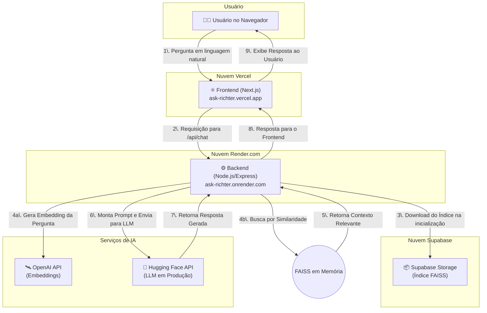

### 🚀 Ask Richter: Meu CV Interativo com IA

#### 🎯 Visão Geral e Arquitetura da Solução

O projeto "Ask Richter" nasceu da ideia de transformar um currículo tradicional em uma experiência de diálogo interativa e inteligente. O objetivo principal é permitir que recrutadores e líderes técnicos explorem minha trajetória profissional de forma conversacional, fazendo perguntas em linguagem natural e recebendo respostas precisas, baseadas em meus dados profissionais consolidados. Mais do que um portfólio, é uma demonstração prática de competências em arquitetura de software moderna e integração com Inteligência Artificial.

A solução foi construída sobre uma arquitetura full-stack robusta e desacoplada:

  * **Frontend:** Uma interface de chat limpa e reativa, desenvolvida com **Next.js** e hospedada na **Vercel**, proporciona um diálogo fluido ao usuário.
  * **Backend:** Uma API em **Node.js/Express**, hospedada no **Render.com**, orquestra a lógica de IA.
  * **Inteligência (RAG):** A técnica de *Retrieval-Augmented Generation* (RAG) é o coração do sistema. Ao iniciar, o backend carrega um índice vetorial **FAISS**, previamente gerado e armazenado no **Supabase Storage**. Quando uma pergunta é recebida, o sistema a converte em um vetor, busca os trechos mais relevantes do meu currículo no índice FAISS e envia esse contexto para um Modelo de Linguagem Ampla (LLM) — como **Ollama** em ambiente local ou **Hugging Face** em produção — para gerar uma resposta precisa e contextual.

Toda a estrutura é organizada em um **Monorepo com Turborepo**, garantindo um desenvolvimento integrado e eficiente entre os diferentes serviços.

#### 👨‍💻 Meu Papel no Projeto

Como idealizador e único desenvolvedor deste projeto, atuei em todas as frentes, assumindo os papéis de:

  * **Arquiteto de Soluções:** Desenhei toda a arquitetura do sistema, desde a interação do usuário no frontend até o fluxo de dados no backend, incluindo a integração com serviços de nuvem como Vercel, Render e Supabase.
  * **Desenvolvedor Full-Stack:** Implementei o frontend em Next.js/React, o backend em Node.js/Express e gerenciei a integração entre eles.
  * **Engenheiro de IA/Dados:** Fui responsável por toda a pipeline de RAG, incluindo a criação e o gerenciamento do banco de dados vetorial FAISS, a integração com a API de embeddings da OpenAI e a orquestração dos LLMs.
  * **Engenheiro de DevOps:** Configurei todo o processo de CI/CD para deploy automatizado na Vercel e no Render, além de gerenciar a infraestrutura de armazenamento no Supabase.

#### ✨ Pontos Fortes e Desafios Superados

A robustez do "Ask Richter" reside na sua arquitetura moderna e na resolução criativa de desafios complexos. O maior trunfo foi transformar uma série de obstáculos técnicos em vitórias que solidificaram a qualidade do projeto.

Entre os **12 a 17 horas de debugging intensivo**, três desafios se destacaram:

1.  **A Saga do Armazenamento no Supabase (RLS):** O desafio era persistir o índice FAISS na nuvem. A tentativa de upload para o Supabase Storage falhava com um enigmático erro de `new row violates row-level security policy`. Após tentativas frustradas com o SDK da AWS e diversas configurações de políticas de segurança (RLS), a solução veio ao criar, via script SQL, uma política de acesso mais abrangente para a `service_role`, permitindo todas as operações (`FOR ALL`) no bucket. Isso revelou que serviços gerenciados possuem limitações não óbvias, e às vezes, a configuração via painel ou uma API direta é mais confiável.

2.  **O Loop Infinito do `useChat`:** No frontend, o hook `useChat` da Vercel AI SDK, que deveria simplificar a interface, causava um loop infinito de requisições. Ele realizava uma chamada automática para uma rota padrão (`/api/chat`) que entrava em conflito com a nossa implementação manual. A superação veio ao abandonar a abstração e retornar aos fundamentos: substituímos o hook por um controle de estado manual com `useState` puro, o que nos deu controle total e previsibilidade sobre as chamadas à API, ensinando a valiosa lição de que abstrações "mágicas" podem esconder comportamentos críticos.

3.  **O Erro Fantasma de Build na Vercel:** O frontend, que funcionava perfeitamente em ambiente local, falhava sistematicamente no build de produção da Vercel com erros de tipo como `Cannot find namespace 'JSX'`. A jornada de depuração foi extensa: troca de versões de bibliotecas, configuração de `tsconfig.json`, `next/dynamic` e até a substituição da biblioteca `react-markdown`. Nenhuma solução convencional funcionou. A vitória pragmática foi instruir o TypeScript a ignorar erros de build (`ignoreBuildErrors: true`), um risco calculado que desbloqueou o deploy e provou que, em cenários complexos de monorepo, problemas podem residir na ferramenta de build, e não no código.

#### 🌱 Pontos para Evolução Futura

Embora a solução atual seja robusta, existem pontos para evolução:

1.  **Cache Inteligente:** Implementar um cache (ex: Redis) para as perguntas mais frequentes, reduzindo a latência e o custo com chamadas às APIs de IA.
2.  **Dashboard de Análise:** Criar um painel administrativo para visualizar as perguntas mais feitas pelos usuários, permitindo refinar a base de conhecimento e entender melhor as necessidades dos recrutadores.

-----

#### 🛠️ Pilha de Tecnologias (Tech Stack)

| Camada | Tecnologia |
| :--- | :--- |
| **Arquitetura** | Turborepo, npm Workspaces |
| **Backend** | Node.js, Express.js, TypeScript, tsx |
| **Frontend** | Next.js (App Router), React (`useState`), Tailwind CSS, Shadcn/ui, markdown-to-jsx |
| **IA & Dados** | FAISS (`faiss-node`), OpenAI Embeddings, LangChain.js, Ollama, Hugging Face API |
| **Nuvem & DevOps** | Vercel, Render.com, Supabase Storage, GitHub |

-----

#### 🗺️ Diagrama da Arquitetura

---

### RESUMO TÉCNICO PARA EMBEDDING

Este projeto, "Ask Richter", implementa um chatbot de CV interativo utilizando uma arquitetura RAG (Retrieval-Augmented Generation) full-stack. O backend, construído com Node.js, Express.js e TypeScript, é responsável pela lógica de IA, incluindo um script para indexação de documentos de conhecimento (`.md`) em um banco de dados vetorial FAISS. Este script usa LangChain.js para carregamento (`DirectoryLoader`), fragmentação de texto (`RecursiveCharacterTextSplitter`) e geração de embeddings com o modelo `text-embedding-3-small` da OpenAI. O índice FAISS gerado é armazenado no Supabase Storage para persistência. Em tempo de execução, o backend carrega o índice em memória, realiza buscas por similaridade semântica nas perguntas do usuário e injeta o contexto relevante em prompts enviados a LLMs através da API da Hugging Face em produção ou Ollama (com modelos como Llama 3 e Mistral 7B) localmente. A API RESTful expõe endpoints para chat (`/api/chat`) e health check (`/api/health`). O frontend é uma SPA reativa construída com Next.js (App Router), React, e TypeScript, estilizada com Tailwind CSS e componentes Shadcn/ui. O gerenciamento de estado é feito com React Hooks (`useState`). A comunicação com o backend é realizada via requisições `fetch` para a API. A renderização de respostas em Markdown é tratada com `markdown-to-jsx` e `react-syntax-highlighter`. O projeto é estruturado como um monorepo gerenciado pelo Turborepo e npm Workspaces. O deploy é automatizado via CI/CD do GitHub, com o frontend na Vercel e o backend conteinerizado com Docker no Render.com, utilizando Infrastructure as Code (`render.yaml`). A segurança no Supabase é garantida por políticas de Row Level Security (RLS).

### CLASSIFICAÇÃO DE TECNOLOGIAS E CONCEITOS

| Categoria | Tecnologias e Conceitos |
| :--- | :--- |
| **AI & Machine Learning** | Retrieval-Augmented Generation (RAG), FAISS, `faiss-node`, LangChain.js, OpenAI Embeddings (`text-embedding-3-small`), LLMs, Ollama, Llama 3, Mistral 7B, Hugging Face API, `DirectoryLoader`, `RecursiveCharacterTextSplitter`, Busca por Similaridade Semântica, Embeddings Vetoriais |
| **Software Development** | Node.js, TypeScript, `tsx`, npm Workspaces, ESM (`"type": "module"`), `markdown-to-jsx`, `react-syntax-highlighter`, `dotenv` |
| **Architecture**| Arquitetura Full-Stack, Monorepo, Microservices (Frontend/Backend desacoplados), RAG (Retrieval-Augmented Generation), Single Page Application (SPA) |
| **Cloud Computing** | Vercel, Render.com, Supabase, Supabase Storage, Hugging Face API |
| **API RESTFul development** | Express.js, Node.js, Health Check Endpoint (`/api/health`) |
| **Frontend Development** | Next.js (App Router), React, React Hooks (`useState`, `useEffect`), Tailwind CSS, Shadcn/ui, Lucide React, Design Responsivo |
| **Mobile Development** | N/A |
| **Database** | FAISS |
| **Data Management** | Chunking (Fragmentação de Texto), Indexação Vetorial, Supabase Storage, Row Level Security (RLS) |
| **Content Management - CMS** | N/A |
| **System Administration** | N/A |
| **DevOps** | Turborepo, Docker, CI/CD, Vercel, Render.com, GitHub, Infrastructure as Code (`render.yaml`), Variáveis de Ambiente |
| **Leadership** | N/A |
| **Coaching** | N/A |
| **Agile Project Management** | N/A |