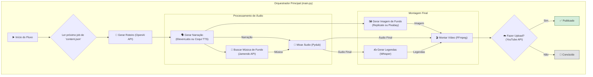
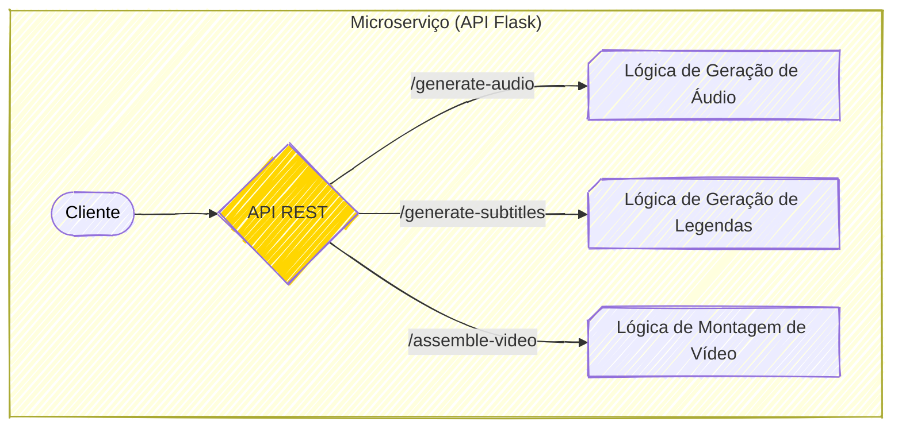
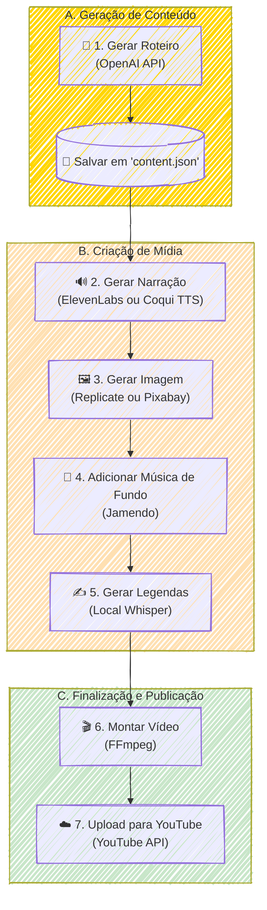

### 🚀 Fábrica de Vídeos Automatizada para YouTube

#### 🎯 Visão Geral e Arquitetura da Solução

Em um cenário onde a criação de conteúdo em vídeo é um processo manual, demorado e caro, este projeto surge como uma solução de automação de ponta a ponta. O objetivo é uma "Fábrica de Vídeos" completa, capaz de gerar conteúdo para o YouTube, tanto em formato curto quanto longo, com intervenção humana mínima.

A arquitetura foi desenhada como um orquestrador em Python que segue um pipeline robusto e flexível:

1.  **Ingestão de Conteúdo**: O fluxo inicia com a leitura de um roteiro ou frase de um banco de dados central em formato `content.json`. Este arquivo gerencia o ciclo de vida de cada vídeo, desde "Pendente" até "Publicado".
2.  **Geração de Mídia**: O sistema se conecta a um ecossistema de APIs e modelos locais para criar os componentes do vídeo. A narração é gerada com vozes de alta qualidade via **ElevenLabs API** ou uma instância local de **Coqui TTS** para personalização total. O visual é criado por modelos de IA como **SDXL (via Replicate)** ou buscado em bancos de imagem como **Pixabay** para maior flexibilidade de custo. Uma trilha sonora é automaticamente adicionada através da **API do Jamendo**.
3.  **Montagem e Finalização**: Com todos os recursos prontos, as legendas são geradas com precisão por uma instância local do **OpenAI Whisper**. A montagem final é orquestrada pelo **FFmpeg**, que combina imagem, narração, música de fundo e legendas, aplicando animações dinâmicas.
4.  **Publicação**: Opcionalmente, o vídeo finalizado é enviado diretamente para o YouTube através da API oficial, completando o ciclo de automação.

Adicionalmente, o projeto expõe suas funcionalidades de geração de mídia através de uma **API REST com Flask**, permitindo que outros sistemas solicitem a criação de narrações ou legendas como um microserviço desacoplado.

#### 👨‍💻 Meu Papel no Projeto

Como **Arquiteto de Soluções e Desenvolvedor Principal**, minhas responsabilidades foram abrangentes, cobrindo todo o ciclo de vida do projeto:

  * **Desenvolvimento End-to-End**: Projetei e implementei o fluxo de automação completo, desde a concepção da ideia até a publicação final no YouTube.
  * **Arquitetura de Software**: Defini a arquitetura modular baseada em "passos" e "utilitários", garantindo a manutenibilidade e escalabilidade do sistema. Criei um gerenciador de conteúdo central (`ContentManager`) para abstrair o acesso aos dados e estruturei o projeto para suportar múltiplos provedores de IA.
  * **Resolução de Desafios Técnicos Complexos**: Investiguei e solucionei problemas críticos de baixo nível, como instabilidade em motores de TTS, e artefatos visuais (tremor e centralização) em vídeos renderizados com FFmpeg.
  * **Integração de APIs**: Orquestrei a integração de diversas APIs externas e modelos locais, incluindo OpenAI, ElevenLabs, Coqui TTS, Replicate, Pixabay, Jamendo e YouTube.
  * **Desenvolvimento de API**: Construí um microserviço com Flask para expor a lógica de geração de mídia, desacoplando as funcionalidades de IA para serem reutilizadas por outras aplicações.
  * **Qualidade e Documentação**: Estabeleci padrões de código, criei testes automatizados com Pytest e documentei extensivamente o projeto, incluindo guias de contribuição e planos de implementação detalhados.

#### ✨ Pontos Fortes e Desafios Superados

A força deste projeto reside em sua **flexibilidade e robustez**. A capacidade de alternar entre provedores de IA (ex: Replicate vs. Pixabay, ElevenLabs vs. Coqui TTS) permite um controle fino sobre custos e qualidade. A arquitetura modular e a API de microserviço tornam o sistema não apenas uma ferramenta, mas uma plataforma de geração de mídia.

Durante o desenvolvimento, enfrentei desafios técnicos significativos que foram transformados em vitórias de engenharia:

  * **Desafio 1: Tremor (Judder) na Animação de Vídeo:** O uso inicial do filtro `zoompan` do FFmpeg causava um tremor visual irritante nas animações.

      * **Superação:** Após uma investigação metódica documentada no plano de ação, a solução foi refatorar a montagem de vídeo em um **processo de duas etapas**. Primeiro, um clipe de vídeo mudo e perfeitamente estável é renderizado usando a combinação dos filtros `scale` e `crop`. Somente depois, em uma segunda etapa, o áudio e as legendas são mesclados (mux). Isso isolou a complexidade da animação da sincronização de áudio, eliminando completamente o tremor.

  * **Desafio 2: Falha na Centralização da Animação:** O efeito de zoom e panorâmica estava sempre se deslocando para o canto superior esquerdo da imagem, em vez de focar no centro.

      * **Superação:** O problema foi diagnosticado como uma falha do FFmpeg em avaliar dinamicamente as coordenadas de corte. A solução foi implementar uma **fórmula de centralização robusta** (`x='(iw-out_w)/2'`) que utiliza variáveis explícitas de saída. Essa lógica foi encapsulada em uma classe `MovementFilterGenerator` para garantir que todas as animações fossem consistentes e fáceis de manter.

  * **Desafio 3: Instabilidade do Motor TTS Local:** A integração com o Coqui TTS apresentava falhas de compatibilidade com suas dependências (especialmente a biblioteca `transformers`), resultando em travamentos.

      * [cite\_start]**Superação:** A estabilidade foi alcançada ao **travar a versão da biblioteca `transformers`** para uma versão anterior e comprovadamente compatível (`4.36.2`). [cite: 1] Além disso, o processo foi otimizado para gerar o áudio em memória (com NumPy) e carregá-lo diretamente no `pydub`, evitando um deadlock de I/O no disco que causava o travamento do script.

- **Desafio 4: Flexibilidade de Provedores (Plug-and-Play)**: Você não apenas integrou serviços, mas criou uma arquitetura que permite escolher entre diferentes provedores para a mesma função. Isso é um diferencial imenso.
	  * **Síntese de Voz**: Mencione que o sistema suporta tanto a **API da ElevenLabs (nuvem)** quanto uma instância local de **Coqui TTS**, permitindo alternar entre uma solução gerenciada e uma solução offline com clonagem de voz personalizada.
	  * **Geração Visual**: Destaque que, além da **Replicate API (SDXL)**, você integrou a **Pixabay API** como uma alternativa gratuita, oferecendo controle de custos e resiliência.
	  * **Trilha Sonora**: Adicione a integração com a **Jamendo API** para buscar e adicionar música de fundo automaticamente, resolvendo a questão dos direitos autorais de forma programática.

- **Desafio 5: API como Microserviço (Reutilização)**: Um dos pontos mais fortes do seu projeto é a API Flask. Isso transforma a solução de um simples script para uma plataforma reutilizável.

    * Adicione um parágrafo mencionando que o projeto também expõe suas capacidades de IA (geração de áudio, legendas e montagem de vídeo) através de uma **API REST com Flask**. Isso demonstra sua habilidade de pensar em termos de serviços desacoplados e reutilizáveis, permitindo que qualquer outra aplicação consuma essas funcionalidades.

- **Desafio 6: Evolução da Arquitetura (Refatoração Estratégica)**: O texto atual menciona os gerenciadores `frases_manager.py` e `reflexao_manager.py`. No entanto, os planos de migração mostram que você evoluiu o projeto.

    * Mencione a refatoração que unificou múltiplos arquivos (`frases.json`, `reflexao.json`) em um único `content.json` gerenciado por um `ContentManager` centralizado. Isso demonstra sua capacidade de identificar débitos técnicos e melhorar a manutenibilidade e a coesão do sistema ao longo do tempo.

### **4. Resultados e Impacto Quantificável**

  * **Redução Drástica do Tempo de Produção**: Automatizou um processo que levaria de **2 a 3 horas** de trabalho manual por vídeo para menos de **5 minutos** de processamento autônomo.
  * **Escalabilidade de Conteúdo**: Capacitou a produção e agendamento de dezenas de vídeos em lote, permitindo uma frequência de publicação diária que seria insustentável manualmente. O projeto inclui scripts para agendamento automático no macOS (`launchd`).
  * **Otimização de Custos**: A implementação de provedores alternativos e gratuitos (Coqui TTS, Pixabay) e a otimização de chamadas de API reduziram significativamente os custos operacionais de geração de conteúdo.

#### 🌱 Pontos para Evolução Futura

Apesar de sua automação completa, o projeto tem potencial para crescer ainda mais:

1.  **Interface de Gerenciamento Web**: Desenvolver uma interface de usuário simples (com Flask ou FastAPI) para gerenciar o `content.json`, permitindo adicionar, editar e agendar vídeos sem interagir diretamente com o arquivo JSON.
2.  **Expansão para Outras Plataformas**: Adaptar o formato de saída do vídeo (ex: 1:1 para Instagram, 16:9 padrão) e criar módulos de upload para outras plataformas como Instagram Reels ou TikTok.

-----

#### 🛠️ Pilha de Tecnologias (Tech Stack)

| Componente                   | Tecnologia Utilizada                          | Papel na Arquitetura                                                                                                                                                                                                    |
| :--------------------------- | :-------------------------------------------- | :---------------------------------------------------------------------------------------------------------------------------------------------------------------------------------------------------------------------- |
| **Backend e Orquestração**   | **Python**, **Flask**                         | Linguagem principal do projeto e framework para a API de microserviço.                                                                                                                                                  |
| **Geração de Conteúdo e IA** | **OpenAI API (GPT)**, **Replicate (SDXL)**    | Geração de roteiros e imagens de fundo a partir de prompts.                                                                                                                                                             |
| **Síntese de Voz (TTS)**     | **ElevenLabs API**, **Coqui TTS**             | Converte texto em narração de áudio, oferecendo opções de nuvem ou local.                                                                                                                                               |
| **Transcrição e Legendas**   | **OpenAI Whisper (Local)**                    | Gera legendas com timestamps precisos a partir do áudio da narração.                                                                                                                                                    |
| **Mídia e Recursos**         | **Pixabay API**, **Jamendo API**              | Fontes alternativas e gratuitas para imagens de fundo e trilhas sonoras.                                                                                                                                                |
| **Manipulação de Mídia**     | **FFmpeg**, **Pydub**, **Pillow**, **OpenCV** | Ferramentas essenciais para montagem de vídeo, manipulação de áudio e processamento de imagem.                                                                                                                          |
| **Automação Web**            | **Playwright**, **Selenium**                  | Utilizados para automação de navegador em scripts de coleta de dados ou imagens.                                                                                                                                        |
| **Testes e Ambiente**        | **Pytest**, **python-dotenv**                 | Framework de testes para garantir a qualidade do código e gerenciamento de variáveis de ambiente.                                                                                                                       |
| **Publicação**               | **YouTube Data API v3**                       | Conclui o fluxo fazendo o upload do vídeo finalizado para um canal específico, incluindo metadados (título, descrição, tags) gerenciados programaticamente.                                                             |

-----

#### 🗺️ Diagrama da Arquitetura

### Diagrama da API

### Fluxo da geração de vídeo

---

### RESUMO TÉCNICO PARA EMBEDDING

Este projeto é uma fábrica de automação de vídeo end-to-end desenvolvida em Python, orquestrando um pipeline que abrange desde a ingestão de conteúdo via `content.json` até a publicação no YouTube. A arquitetura modular suporta múltiplos provedores de IA em um modelo plug-and-play, utilizando ElevenLabs API ou Coqui TTS local para síntese de voz, e Replicate (SDXL) ou Pixabay API para geração de imagens. A solução supera desafios técnicos complexos de manipulação de mídia, como a eliminação de tremor (judder) em animações FFmpeg através de um processo de renderização estável em duas etapas com filtros `scale`/`crop`, e a correção de centralização com fórmulas de coordenadas robustas (`(iw-out_w)/2`). A estabilidade do motor Coqui TTS foi alcançada travando a versão da biblioteca `transformers` (`4.36.2`) e otimizando o processamento de áudio em memória com NumPy e Pydub para evitar deadlocks de I/O. O sistema também inclui transcrição de áudio via OpenAI Whisper local, adição de trilha sonora pela Jamendo API, e expõe suas funcionalidades de IA como um microserviço desacoplado através de uma API RESTful construída com Flask. A gestão de configuração é feita via `python-dotenv` e testes automatizados com Pytest garantem a qualidade do código.

### CLASSIFICAÇÃO DE TECNOLOGIAS E CONCEITOS

| Categoria                    | Tecnologias e Conceitos                                                                                                                                                            |
| :--------------------------- | :--------------------------------------------------------------------------------------------------------------------------------------------------------------------------------- |
| **AI & Machine Learning**    | 🧠 OpenAI API (GPT), Replicate (SDXL), Coqui TTS, OpenAI Whisper, `transformers`, NumPy                                                                                            |
| **Software Development**     | 💻 Python, `subprocess`, Pydub, Pillow, OpenCV, `python-dotenv`, Pytest, SOLID, Clean Code                                                                                         |
| **Architecture**             | 🏛️ Arquitetura Modular, Microserviços, Plug-and-Play (Provedores de IA), `ContentManager` (Repositório Central), Renderização em Duas Etapas, `MovementFilterGenerator` (Factory) |
| **Cloud Computing**          | ☁️ ElevenLabs API, Replicate API, Pixabay API, Jamendo API, YouTube Data API v3, OpenAI API                                                                                        |
| **API RESTFul development**  | 🌐 Flask, Integração de APIs REST                                                                                                                                                  |
| **Frontend Development**     | N/A                                                                                                                                                                                |
| **Mobile Development**       | N/A                                                                                                                                                                                |
| **Database**                 | 🗄️ JSON (utilizado como banco de dados de arquivos)                                                                                                                               |
| **Data Management**          | 📊 `ContentManager` (Abstração de Dados), Gerenciamento de JSON                                                                                                                    |
| **Content Management - CMS** | N/A                                                                                                                                                                                |
| **System Administration**    | ⚙️ `launchd` (Agendamento de tarefas no macOS)                                                                                                                                     |
| **DevOps**                   | 🚀 Gerenciamento de Ambiente (venv), Gerenciamento de Dependências (`requirements.txt`), Testes Automatizados (Pytest), Agendamento de Publicação                                  |
| **Leadership**               | 👨‍🏫 Arquiteto de Soluções, Desenvolvedor Principal, Documentação Técnica                                                                                                         |
| **Coaching**                 | N/A                                                                                                                                                                                |
| **Agile Project Management** | 🔄 Desenvolvimento Incremental, Refatoração Estratégica, Resolução de Débito Técnico                                                                                               |

---
## Documentos
Aqui está uma descrição de cada arquivo:

### 📄 `README.md`
Este é o documento principal do projeto, a "Fábrica de vídeos automatizada". Ele descreve de forma completa o sistema, que automatiza a criação e publicação de vídeos curtos e longos para o YouTube. O `README` detalha:
* **Tecnologias Usadas**: Python, ElevenLabs, Coqui TTS, Replicate, Pixabay, Jamendo, Whisper, FFmpeg e a API do YouTube.
* **Fluxo de Trabalho**: Desde a geração do roteiro até o upload do vídeo finalizado.
* **Estrutura de Pastas**: Uma visão geral da organização modular do código.
* **Integrações**: Explica o papel de cada ferramenta e API no processo.
* **Microserviço API**: Detalha uma API REST (com Flask) que expõe funcionalidades como geração de áudio e legendas para outras aplicações.
* **Instruções de Uso**: Como configurar o ambiente, instalar dependências, usar as chaves de API e executar o projeto com diferentes argumentos de linha de comando.
* **Diagramas**: Inclui um fluxograma e um diagrama de sequência para ilustrar o processo.

### 🧠 `CONTRIBUTING.md`
Este é o guia de contribuição e padrões de código. É um documento essencial para garantir a qualidade e a manutenibilidade do projeto. Ele estabelece regras rígidas sobre:
* **Ambiente de Desenvolvimento**: Exige Python 3.11/3.12 e um ambiente virtual (`venv`).
* **Segurança**: Proíbe o uso de chaves de API diretamente no código, exigindo o uso de arquivos `.env`.
* **Modularidade e Clean Code**: Define o Princípio da Responsabilidade Única, com exemplos de código certo e errado.
* **Robustez**: Como lidar com processos externos (como FFmpeg) de forma segura usando `subprocess`.
* **Testes e Debugging**: Enfatiza a importância de testes incrementais e sistemáticos.
* **Proibições**: Lista práticas estritamente proibidas para manter a consistência.

### 📝 `plano-de-migracao-content-json.md`
Este arquivo detalha um plano de refatoração para centralizar a gestão de conteúdo. O objetivo é substituir dois arquivos (`frases.json` e `reflexao.json`) por um único `content.json` com uma estrutura de dados padronizada. O plano é dividido em etapas claras:
1.  Criação de um novo módulo `ContentManager`.
2.  Refatoração do script principal (`main.py`) para usar o novo gerenciador.
3.  Atualização de todos os scripts dependentes.
4.  Limpeza de arquivos antigos e atualização da documentação.

### 🎶 `plano-de-implementacao-bg-musical.md`
Este documento descreve o plano para adicionar trilhas sonoras aos vídeos. A estratégia é integrar a API do **Jamendo** para buscar e baixar músicas livres de direitos autorais. O plano inclui:
* **Configuração Inicial**: Adicionar chaves de API ao `.env` e criar um módulo `music_manager.py`.
* **Integração com a API**: Funções para buscar e baixar as faixas.
* **Lógica de Mesclagem**: Como usar a biblioteca `pydub` para combinar a narração com a música de fundo.
* **Testes e Documentação**: Etapas para validar a funcionalidade e atualizar o `README.md`.

### 🖼️ `plano-de-integracao-pixabay-imagens.md`
Este é um plano para integrar o **Pixabay** como uma fonte alternativa e gratuita para as imagens de fundo dos vídeos, complementando o gerador de IA (Replicate/SDXL). O plano cobre:
* Implementação da função de busca e download de imagens via API do Pixabay.
* Adição de controle via arquivo `.env` e argumentos de linha de comando.
* Criação de testes automatizados.
* Atualização da documentação para refletir a nova opção.

### 🔧 `video_ajuste.md`
Este é um plano de ação técnico para corrigir um problema de "tremor" (judder) nas animações dos vídeos. É um exemplo excelente de debugging sistemático, detalhando:
* **Estratégia de Teste**: Isolar cada tentativa de solução e reverter o código antes de tentar a próxima.
* **Fases de Implementação**: Desde o diagnóstico até a validação, testando múltiplas soluções com FFmpeg, como renderização em duas etapas, uso do filtro `setpts`, e a troca do instável `zoompan` pela combinação estável de `scale`/`crop`.

### 🎯 `video_centralizar.md`
Similar ao plano de ajuste, este documento foca em resolver um problema específico: o movimento de zoom e panorâmica não estava centralizado na imagem. O plano segue uma estrutura de fases:
* **Diagnóstico**: Adicionar logs para inspecionar variáveis e dimensões.
* **Correção Rápida**: Forçar um movimento central para uma solução imediata.
* **Solução Robusta**: Refatorar o código para uma classe `MovementFilterGenerator`, tornando-o mais limpo e centralizado.
* **Testes e Validação**: Inclui a criação de um script de teste visual com uma imagem de referência para validar a centralização de forma precisa.

### 🔊 `Audio Gen - Fix Plan.md` e `Fix-Plan-TTS.md`
Estes dois documentos abordam problemas de instabilidade com a biblioteca de geração de áudio **Coqui TTS**.
* **`Fix-Plan-TTS.md`**: Diagnostica um erro de validação que impedia o uso da língua portuguesa (`pt`). A solução proposta é aplicar um "patch" no código da biblioteca em tempo de execução para permitir o idioma.
* **`Audio Gen - Fix Plan.md`**: Resolve um problema mais profundo de compatibilidade entre as bibliotecas `TTS` e `transformers`. A solução definitiva encontrada foi travar as versões das bibliotecas no arquivo `requirements.txt`. Além disso, o documento diagnostica e corrige um "deadlock" (travamento) que ocorria ao manipular o áudio, otimizando o processo para ser executado totalmente em memória, o que é mais rápido e seguro.

Em resumo, os arquivos mostram um projeto de automação maduro, com documentação robusta, planejamento cuidadoso de novas funcionalidades e uma abordagem metódica e profissional para a resolução de problemas técnicos.