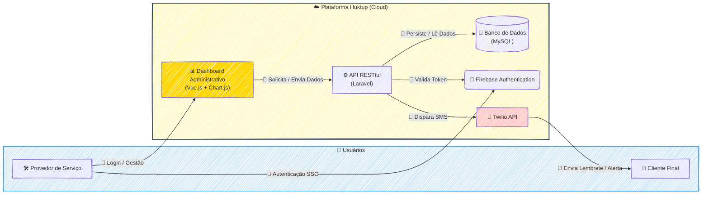

### 🚀 Huktup: Plataforma de Agendamento e Gestão para Provedores de Serviço

#### 🎯 Visão Geral e Arquitetura da Solução

No cenário de serviços, a gestão descentralizada de agendamentos, pagamentos e comunicação com clientes é um grande obstáculo para o crescimento. O Huktup nasceu para resolver exatamente essa dor, oferecendo um ecossistema completo onde provedores de serviço podem centralizar toda a sua operação.

A solução foi arquitetada em torno de uma **API RESTful robusta, construída com Laravel (PHP)**, que serve como o cérebro de toda a plataforma. Esta API orquestra desde a criação de um agendamento até a análise de performance financeira. Para os provedores, desenvolvi um **dashboard analítico interativo com Vue.js e Chart.js**, que transforma dados brutos de faturamento e aquisição de clientes em insights visuais e acionáveis, permitindo filtros dinâmicos para uma análise aprofundada. A comunicação com o cliente final é automatizada e eficiente, graças à integração com a **Twilio API**, que gerencia o envio de lembretes, alertas e a coleta de feedbacks via SMS, reduzindo o não comparecimento e melhorando o engajamento.

#### 👨‍💻 Meu Papel no Projeto

Atuando como o principal desenvolvedor backend, minhas responsabilidades foram cruciais para a fundação e o sucesso da plataforma:

  * **Desenvolvimento do Core:** Construí a API RESTful em Laravel, que centraliza todas as regras de negócio, desde o agendamento até a gestão de ofertas.
  * **Criação do Dashboard Analítico:** Desenvolvi a interface de gestão para os provedores utilizando Vue.js, com foco na visualização de dados com Chart.js para apresentar métricas de negócio de forma clara e objetiva.
  * **Integração de Serviços:** Implementei integrações essenciais com a **Twilio API** para automação da comunicação via SMS e com o **Firebase Authentication** para garantir um processo de onboarding e login seguro (incluindo SSO).
  * **Garantia de Qualidade e Colaboração:** Colaborei ativamente com a equipe de QA para definir cenários de teste e validar a qualidade das entregas. Elaborei a documentação completa da API no padrão **Swagger**, o que foi fundamental para alinhar e acelerar o trabalho da equipe de frontend.

#### ✨ Pontos Fortes e Desafios Superados

O maior trunfo da plataforma é sua capacidade de **unificar a jornada do provedor em um único lugar**. A combinação de uma API sólida com um dashboard intuitivo oferece um controle sem precedentes sobre o negócio.

Um dos principais desafios foi **garantir uma comunicação confiável e automatizada em escala**. Superamos isso ao desenhar fluxos de conversa inteligentes com a Twilio, não apenas enviando lembretes, mas criando um canal de mão dupla para feedback. Outro desafio significativo foi **criar um ambiente seguro e colaborativo para as equipes de desenvolvimento**. A padronização da documentação da API com Swagger foi uma vitória, pois eliminou ambiguidades e permitiu que as equipes de frontend e backend trabalhassem em paralelo com muito mais eficiência.

#### 🌱 Pontos para Evolução Futura

Para o futuro, a plataforma poderia evoluir com a implementação de duas funcionalidades de alto valor:

1.  Um módulo de **notificações push** no aplicativo para complementar a comunicação via SMS.
2.  A integração de um sistema de **Inteligência Artificial** para analisar padrões de agendamento e sugerir horários de maior rentabilidade para os provedores.

-----

#### 🛠️ Pilha de Tecnologias (Tech Stack)

| Componente | Tecnologia Utilizada | Papel na Arquitetura |
| :--- | :--- | :--- |
| **Backend (API Core)** | **Laravel (PHP)** | Orquestra todas as regras de negócio, dados e integrações como o núcleo da plataforma. |
| **Frontend (Dashboard)** | **Vue.js** | Constrói a interface reativa e interativa para os provedores de serviço gerenciarem seus negócios. |
| **Visualização de Dados** | **Chart.js** | Renderiza gráficos dinâmicos no dashboard para análise de faturamento, reservas e clientes. |
| **Banco de Dados** | **MySQL** | Armazena de forma persistente todos os dados relacionais da aplicação (agendamentos, usuários, etc.). |
| **Autenticação de Usuários**| **Firebase Authentication** | Gerencia o onboarding, login e segurança dos usuários (provedores) com suporte a SSO. |
| **Comunicação por SMS** | **Twilio API** | Automatiza o envio de lembretes, alertas transacionais e coleta de feedback dos clientes finais. |
| **Documentação da API** | **Swagger (OpenAPI)** | Padroniza e documenta os endpoints da API para facilitar a integração entre equipes. |
| **Ambiente de Dev** | **Docker** | Garante a consistência e portabilidade do ambiente de desenvolvimento e produção. |

-----

#### 🗺️ Diagrama da Arquitetura

---
### RESUMO TÉCNICO PARA EMBEDDING

Desenvolvimento de uma plataforma de agendamento, Huktup, com arquitetura centrada em uma API RESTful em Laravel (PHP) atuando como core para todas as regras de negócio. O frontend consiste em um dashboard analítico reativo para provedores de serviço, construído com Vue.js e utilizando Chart.js para visualização de dados e métricas de faturamento e aquisição de clientes. A solução integra serviços de terceiros para funcionalidades críticas: Firebase Authentication para onboarding, login e segurança com suporte a SSO, e a Twilio API para automação da comunicação via SMS, incluindo lembretes e coleta de feedback. A persistência de dados é garantida por um banco de dados MySQL. O ambiente de desenvolvimento é padronizado com Docker, garantindo portabilidade. A colaboração entre equipes de backend e frontend foi otimizada pela documentação da API no padrão Swagger (OpenAPI), permitindo o desenvolvimento paralelo e a validação de entregas com a equipe de QA. Desafios superados incluem a criação de fluxos de comunicação escaláveis e a eliminação de ambiguidades no desenvolvimento através de documentação padronizada.

### CLASSIFICAÇÃO DE TECNOLOGIAS E CONCEITOS

| Categoria                    | Tecnologias e Conceitos                                                |
| :--------------------------- | :--------------------------------------------------------------------- |
| **AI & Machine Learning**    | Sugestão de IA para otimização de agendamentos (evolução futura)       |
| **Software Development**     | Laravel, PHP, Vue.js, Docker, Chart.js                                 |
| **Architecture**             | Arquitetura baseada em API, Single Sign-On (SSO)                       |
| **Cloud Computing**          | Firebase Authentication, Plataforma em Nuvem                           |
| **API RESTFul development**  | API RESTful, Laravel, Twilio API, Swagger, OpenAPI                     |
| **Frontend Development**     | Vue.js, Chart.js, Dashboard Analítico, Visualização de Dados           |
| **Mobile Development**       | Notificações Push (evolução futura)                                    |
| **Database**                 | MySQL                                                                  |
| **Data Management**          | Análise de métricas financeiras, Visualização de dados                 |
| **Content Management - CMS** | N/A                                                                    |
| **System Administration**    | N/A                                                                    |
| **DevOps**                   | Docker, Documentação de API (Swagger), Colaboração com QA              |
| **Leadership**               | Desenvolvedor principal, Alinhamento de equipes                        |
| **Coaching**                 | N/A                                                                    |
| **Agile Project Management** | Desenvolvimento paralelo (Backend/Frontend), Colaboração entre equipes |