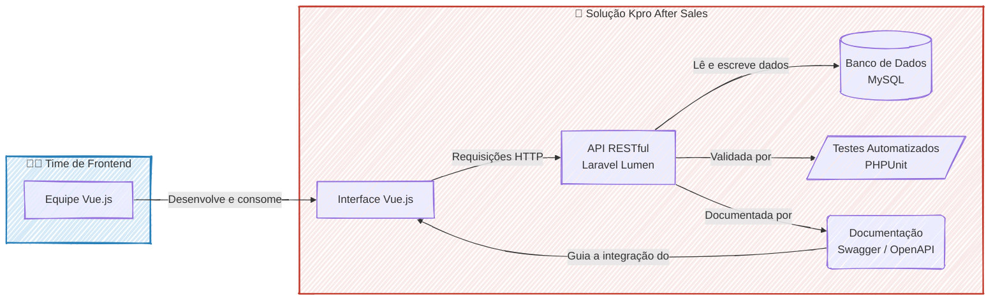

### 🚀 Kpro After Sales: API para Otimização de Processos de Pós-Venda

#### 🎯 Visão Geral e Arquitetura da Solução

Em um cenário onde os processos de pós-venda da Kpro — abrangendo aluguéis, vendas e compras compartilhadas — precisavam de coesão e eficiência, a solução foi arquitetar e construir um núcleo digital central: uma **API RESTful robusta e escalável**. Este projeto nasceu para ser o "cérebro" da operação, orquestrando todo o ciclo de vida dos equipamentos, desde a gestão de checklists e documentos até o controle de status e histórico.

A API foi desenvolvida em **Laravel Lumen**, servindo como o backend desacoplado para uma moderna interface de usuário em Vue.js. Essa arquitetura garantiu não apenas uma separação clara de responsabilidades, mas também uma agilidade ímpar para as equipes de frontend e backend trabalharem em paralelo, conectadas por um contrato de API bem definido e documentado.

#### 👨‍💻 Meu Papel no Projeto

Atuando como **Desenvolvedor Back-End**, em estreita colaboração com o Arquiteto de Soluções, minhas principais responsabilidades foram:

  * **Construção da API:** Desenvolver os endpoints, implementar as regras de negócio e realizar a integração com serviços externos utilizando o framework Laravel Lumen.
  * **Otimização de Performance:** Realizar *query tuning* no banco de dados MySQL e implementar estratégias de cache para garantir a velocidade da aplicação.
  * **Garantia de Qualidade:** Criar uma suíte sólida de testes automatizados com PHPUnit para assegurar a estabilidade e evitar regressões.
  * **Facilitação da Integração:** Elaborar a documentação completa da API com Swagger/OpenAPI para acelerar o desenvolvimento e a integração com a equipe de frontend.

#### ✨ Pontos Fortes e Desafios Superados

O maior triunfo deste projeto foi transformar desafios técnicos complexos em vitórias mensuráveis para o negócio.

  * **Performance como Prioridade:** Um dos principais desafios era garantir que a API respondesse com baixa latência, mesmo sob carga. Enfrentei isso com uma otimização criteriosa das consultas ao banco de dados e a implementação de uma camada de cache inteligente. O resultado? Uma **melhora de 30% no tempo de resposta** dos endpoints críticos, impactando diretamente a experiência do usuário final.
  * **Qualidade e Estabilidade Inegociáveis:** Para construir uma base sólida e confiável, a estratégia foi investir pesado em automação de testes. O desafio era cobrir a complexidade das regras de negócio. Superamos isso ao desenvolver uma suíte de testes com **cobertura de código de aproximadamente 80%** usando PHPUnit, o que blindou a API contra bugs e regressões.
  * **Colaboração Acelerada por Documentação:** A sinergia entre backend e frontend é crucial. Para eliminar qualquer atrito, produzi uma documentação interativa e detalhada com **Swagger/OpenAPI**. Isso não apenas serviu como um contrato claro, mas também **acelerou o onboarding e a produtividade da equipe de frontend** em Vue.js, permitindo que eles consumissem os endpoints com total autonomia e clareza.

#### 🌱 Pontos para Evolução Futura

Como próximos passos para evoluir a maturidade da solução, poderíamos considerar:

1.  A implementação de um **pipeline de CI/CD** para automatizar os processos de build, teste e deploy.
2.  Adoção de uma ferramenta de **monitoramento e observabilidade** (como Prometheus/Grafana) para acompanhar a saúde da API em tempo real.

-----

#### 🛠️ Pilha de Tecnologias (Tech Stack)

| Componente | Tecnologia Utilizada | Papel na Arquitetura |
| :--- | :--- | :--- |
| **Backend API** | **Laravel Lumen (PHP)** | Núcleo da aplicação, responsável por toda a lógica de negócio, regras e exposição dos dados via endpoints RESTful. |
| **Banco de Dados** | **MySQL** | Sistema de gerenciamento de banco de dados relacional para a persistência de todas as informações da plataforma. |
| **Testes Automatizados**| **PHPUnit** | Ferramenta utilizada para criar a suíte de testes unitários e de integração, garantindo a qualidade e estabilidade do código. |
| **Documentação da API**| **Swagger (OpenAPI)** | Padrão utilizado para desenhar, construir e documentar a API, servindo como um contrato claro para os consumidores (frontend). |

-----

#### 🗺️ Diagrama da Arquitetura

---
### RESUMO TÉCNICO PARA EMBEDDING

Desenvolvimento de uma API RESTful em Laravel Lumen como núcleo de uma arquitetura desacoplada para otimização de processos de pós-venda (aluguéis, vendas, compras). A solução, com backend em PHP, orquestra o ciclo de vida de equipamentos, incluindo checklists e documentos, servindo uma interface em Vue.js. O foco foi em performance, com otimização via query tuning em MySQL e implementação de cache, resultando em 30% de melhora na latência. A qualidade foi assegurada por uma suíte de testes automatizados em PHPUnit com 80% de cobertura de código para evitar regressões. A integração com o frontend foi acelerada pela documentação da API com Swagger/OpenAPI, que serviu como contrato entre as equipes. Propostas de evolução incluem a implementação de um pipeline de CI/CD e a adoção de ferramentas de monitoramento e observabilidade como Prometheus/Grafana.

### CLASSIFICAÇÃO DE TECNOLOGIAS E CONCEITOS

| Categoria | Tecnologias e Conceitos |
| :--- | :--- |
| **AI & Machine Learning** | N/A |
| **Software Development** | 👨‍💻 Laravel Lumen (PHP), PHPUnit, Testes Automatizados, Cobertura de Código, Regras de Negócio, Query Tuning |
| **Architecture**| 🏗️ Arquitetura Desacoplada, API RESTful, Cache, Baixa Latência |
| **Cloud Computing** | N/A |
| **API RESTFul development** | 🔌 API RESTful, Endpoints, Swagger (OpenAPI), Documentação da API |
| **Frontend Development** | 🖥️ Vue.js |
| **Mobile Development** | N/A |
| **Database** | 🗃️ MySQL, Query Tuning |
| **Data Management** | N/A |
| **Content Management - CMS** | N/A |
| **System Administration** | ⚙️ Monitoramento e Observabilidade (Proposto), Prometheus/Grafana (Proposto) |
| **DevOps** | 🚀 CI/CD (Proposto), Monitoramento e Observabilidade (Proposto) |
| **Leadership** | 👨‍🏫 Arquiteto de Soluções |
| **Coaching** | N/A |
| **Agile Project Management** | N/A |