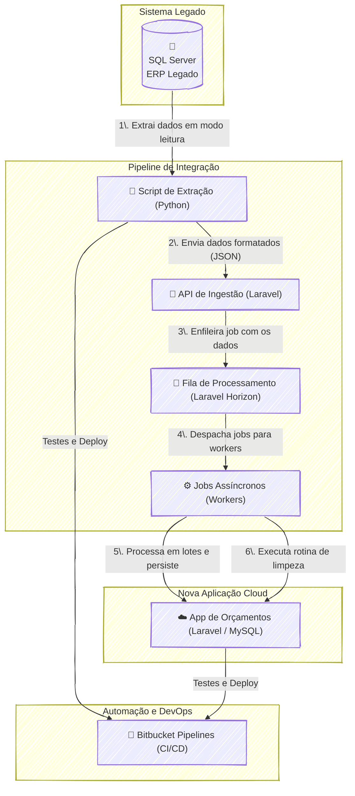

### 🚀 Sisporta: Sincronização Inteligente de Dados

#### 🎯 Visão Geral e Arquitetura da Solução

O projeto Sisporta nasceu de um desafio clássico no mundo do software: a necessidade de modernizar sem poder tocar no legado. Uma empresa especialista em portões de garagem precisava de um sistema ágil para gerar orçamentos personalizados, mas seus dados vitais (produtos, revendedores) residiam em um ERP com um banco de dados SQL Server intocável.

A solução foi arquitetar um **pipeline de dados desacoplado e resiliente**. O coração da operação é um script Python que atua como um agente de extração, lendo os dados do SQL Server e os enviando em formato JSON para uma API na nova aplicação Laravel. Para não sobrecarregar nenhum dos sistemas, a API não processa os dados imediatamente; ela os enfileira usando o **Laravel Horizon**. Essa abordagem assíncrona permite que *workers* em segundo plano processem as informações em lotes, garantindo alto desempenho e escalabilidade. O resultado é um fluxo de dados contínuo e eficiente, que alimenta o novo sistema de orçamentos com informações sempre atualizadas, sem comprometer a performance do ERP legado.

#### 👨‍💻 Meu Papel no Projeto

Neste projeto, atuei como a principal força de engenharia, combinando as funções de **Arquiteto de Soluções e Desenvolvedor Full-Stack**. Minhas responsabilidades incluíram:

  * **Idealizar e desenhar** a arquitetura de integração assíncrona para garantir performance e desacoplamento.
  * **Desenvolver o script de extração** em Python, responsável por coletar e formatar os dados do sistema legado.
  * **Implementar a aplicação Laravel**, incluindo o endpoint da API de ingestão e os jobs de processamento em background com Laravel Horizon.
  * **Garantir a qualidade do código** através da criação de testes unitários e de integração.
  * **Configurar o pipeline de CI/CD** no Bitbucket para automatizar testes e deploys.

#### ✨ Pontos Fortes e Desafios Superados

O maior desafio era a restrição de não poder modificar o sistema ERP. A superação veio com a **arquitetura de processamento assíncrono**, que transformou essa limitação em um ponto forte. A solução se destaca por:

  * **Alto Desempenho e Resiliência:** A utilização de filas (Laravel Horizon) evita gargalos. Se a aplicação de destino ficasse offline, os dados simplesmente aguardariam na fila para serem processados, sem perdas.
  * **Consistência de Dados Inteligente:** Um dos triunfos do projeto foi a criação de um job de "limpeza". Ele remove automaticamente registros que não existem mais no sistema de origem, garantindo que o sistema de orçamentos seja um espelho fiel do ERP, sem acumular dados obsoletos.
  * **Automação e Qualidade:** Com testes automatizados e um pipeline de CI/CD no Bitbucket, o processo de manutenção e evolução tornou-se seguro e ágil.

#### 🌱 Pontos para Evolução Futura

Para evoluir ainda mais a solução, poderíamos implementar um **dashboard de monitoramento avançado** para observar a saúde das filas e o tempo de processamento dos jobs, além de configurar um mecanismo de ***Dead Letter Queue*** para tratar falhas de processamento de forma isolada, sem interromper o fluxo principal.

-----

#### 🛠️ Pilha de Tecnologias (Tech Stack)

  * **Linguagens:** Python, PHP
  * **Framework:** Laravel
  * **Bancos de Dados:** SQL Server, MySQL
  * **Filas e Jobs:** Laravel Horizon
  * **DevOps:** Bitbucket Pipelines

-----

#### 🗺️ Diagrama da Arquitetura

---
### RESUMO TÉCNICO PARA EMBEDDING

O projeto implementa um pipeline de dados desacoplado para integração entre um sistema ERP legado com banco de dados SQL Server e uma aplicação moderna em Laravel (PHP) com MySQL, ambos hospedados em nuvem. A solução resolve o desafio da sincronização de dados sem acesso para modificação do ERP. Um script Python atua como agente de ETL, extraindo dados, formatando-os em JSON e enviando para um endpoint de API RESTful na aplicação Laravel. Para garantir alta performance e evitar gargalos, a ingestão é assíncrona, utilizando Laravel Horizon para enfileirar e gerenciar jobs de processamento. Esses jobs processam os dados em lotes (batches), otimizando a persistência no MySQL. A consistência de dados é mantida através de uma rotina de limpeza que remove registros obsoletos. Todo o ciclo de desenvolvimento é automatizado por um pipeline de CI/CD no Bitbucket Pipelines, que executa testes unitários e de integração para garantir a qualidade e a resiliência da arquitetura.

### CLASSIFICAÇÃO DE TECNOLOGIAS E CONCEITOS

| Categoria | Tecnologias e Conceitos |
| :--- | :--- |
| **AI & Machine Learning** | N/A |
| **Software Development** | 🐍 Python, 🐘 PHP, ✨ Laravel, 📄 JSON, 🧪 Testes Unitários, 🧪 Testes de Integração |
| **Architecture**| 🔗 Arquitetura Desacoplada, 🔄 Processamento Assíncrono, 📦 Processamento em Lotes, 🛡️ Resiliência, 📈 Escalabilidade, ⚙️ Pipeline de Dados, 🎯 Sincronização Unidirecional |
| **Cloud Computing** | ☁️ Aplicação Cloud, ☁️ Banco de dados hospedado na nuvem |
| **API RESTFul development** | 🔌 Endpoint de API, 📩 Ingestão de Dados via API |
| **Frontend Development** | N/A |
| **Mobile Development** | N/A |
| **Database** | 💾 SQL Server, 💾 MySQL |
| **Data Management** | 🚚 ETL (Extração, Transformação e Carga), 🔄 Sincronização de Dados, ✅ Integridade de Dados, ✅ Consistência de Dados, ✨ Limpeza de Dados (Data Cleansing) |
| **Content Management - CMS** | N/A |
| **System Administration** | N/A |
| **DevOps** | 🛠️ Bitbucket Pipelines, 🔄 CI/CD (Integração Contínua, Implantação Contínua), 🚦 Laravel Horizon, ⚙️ Background Workers, 📜 Gerenciamento de Filas (Queueing), 🚀 Automação de Deploy |
| **Leadership** | N/A |
| **Coaching** | N/A |
| **Agile Project Management** | N/A |