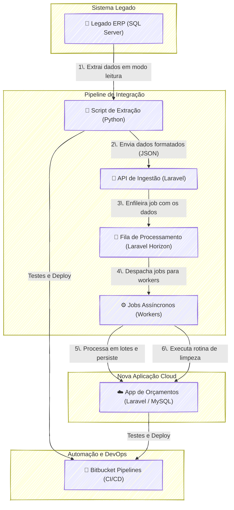

## **Sisporta: Visão Arquitetural da Solução**

O sistema Sisporta foi arquitetado como um **pipeline de dados desacoplado e resiliente**, projetado para resolver o desafio crítico de integrar um ERP legado, com restrições de acesso e performance, a uma aplicação cloud moderna. A arquitetura prioriza a integridade dos dados, a performance e a automação, garantindo que a nova aplicação de orçamentação opere com informações atualizadas sem impactar negativamente os sistemas existentes.

O fluxo de dados pode ser dividido nas seguintes etapas:

1.  **Extração e Transformação (ETL Leve):** O processo é iniciado por um **script Python**, que atua como o agente de extração. Ele se conecta de forma segura e em modo de leitura (*read-only*) ao banco de dados do ERP legado (SQL Server). Após extrair os dados necessários, o script os transforma para um formato de dados leve e universal (JSON), preparando-os para a transmissão.

2.  **Ingestão Segura via API:** O conjunto de dados em JSON é enviado de forma segura para um **endpoint de API dedicado** na aplicação Laravel. Este endpoint foi construído para ser um receptor rápido e eficiente; sua única responsabilidade é validar a requisição e imediatamente enfileirar os dados para processamento posterior.

3.  **Enfileiramento e Processamento Assíncrono:** Ao receber os dados, a aplicação Laravel não os processa de forma síncrona. Em vez disso, ela utiliza o **Laravel Horizon** (sobre um driver de fila como Redis) para criar jobs e colocá-los em uma fila de processamento. Essa abordagem é o pilar da performance da solução, pois libera o servidor web instantaneamente e transfere a carga de trabalho para processos em segundo plano (*background workers*).

4.  **Processamento em Lotes e Persistência:** Os *workers* do Horizon consomem os jobs da fila, processando os registros em lotes de 100. Essa fragmentação garante que cada job seja executado rapidamente, evitando timeouts e picos de consumo de memória/CPU. Durante o processamento, os dados são validados, tratados e finalmente persistidos no banco de dados da nova aplicação (MySQL).

5.  **Garantia de Consistência:** Uma rotina de limpeza inteligente é executada após cada carga de dados. Ela compara os identificadores da carga recente com os registros existentes na aplicação nova e remove aqueles que não vieram na nova carga, garantindo que exclusões no ERP legado sejam refletidas no sistema novo.

6.  **Automação e Qualidade (CI/CD):** Todo o ciclo de vida do código, tanto do script Python quanto da aplicação Laravel, é gerenciado por um pipeline de CI/CD no **Bitbucket**. Isso automatiza a execução de testes unitários e de ponta a ponta a cada alteração, garantindo a confiabilidade da integração e agilizando o deploy de novas versões.

-----

### **Pontos Fortes da Arquitetura**

  * **Desacoplamento e Resiliência:** A arquitetura é inerentemente desacoplada. Uma falha temporária na aplicação cloud ou no banco de dados MySQL não interrompe a extração no ERP. Os jobs simplesmente permanecerão na fila, e o Horizon tentará reprocessá-los automaticamente, aumentando a resiliência geral do sistema.
  * **Performance e Escalabilidade:** O uso de processamento assíncrono com filas e lotes evita gargalos de performance tanto no servidor legado (consultas rápidas e pontuais) quanto na nova aplicação (carga de trabalho distribuída). A solução é escalável horizontalmente: se o volume de dados aumentar, basta adicionar mais *workers* para processar a fila mais rapidamente.
  * **Integridade e Consistência de Dados:** A rotina de limpeza automática é um diferencial crucial, pois resolve um problema comum em sincronizações unidirecionais: o "lixo" de dados obsoletos. Isso garante que a base de dados do sistema de orçamentos seja um espelho fiel e atualizado do ERP.
  * **Segurança e Manutenibilidade:** A comunicação via API segura protege os dados em trânsito. A base de código, coberta por testes automatizados e com um pipeline de deploy estabelecido, é mais fácil de manter, depurar e evoluir com segurança.

-----

### **Diagrama de Arquitetura (Mermaid)**

Aqui está um diagrama que ilustra o fluxo arquitetural do Sisporta, utilizando as configurações que você prefere.

-----

### **Pontos para Evolução Futura**

  * **Monitoramento Avançado e Alertas:** Implementar um dashboard de monitoramento mais robusto (usando ferramentas como Grafana ou Datadog) para observar a saúde das filas, o tempo de processamento dos jobs e criar alertas proativos para falhas.
  * **Mecanismo de *Dead Letter Queue* (DLQ):** Configurar uma fila de "cartas mortas" para onde os jobs que falham repetidamente são enviados. Isso evita que um registro problemático bloqueie o processamento dos demais e permite uma análise manual da causa da falha.
  * **Configuração Dinâmica:** Externalizar configurações como o tamanho do lote, URLs de API e credenciais para variáveis de ambiente ou um serviço de configuração, tornando o pipeline mais flexível e fácil de gerenciar em diferentes ambientes.