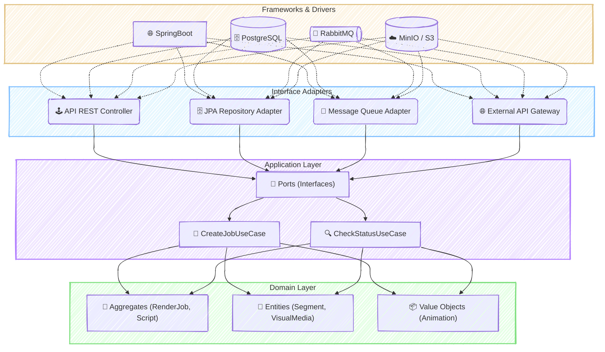

### 🚀 SmartShorts: SaaS de Geração de Vídeos Automatizados

#### 🎯 Visão Geral e Arquitetura da Solução

O SmartShorts nasceu para resolver um desafio central para criadores de conteúdo e agências de marketing: a produção de vídeos para redes sociais em escala. O objetivo é transformar uma simples ideia ou prompt de texto em um vídeo completo e otimizado (curto ou longo), com narração, imagens, legendas e música, de forma totalmente automatizada.

Para construir uma base sólida, escalável e de fácil manutenção, a solução foi projetada sobre os pilares da **Clean Architecture**. Esta abordagem garante que a lógica de negócio — nosso ativo mais valioso — permaneça pura e independente de frameworks e tecnologias externas. Adotamos uma estratégia de **"Monolito Modular"**, que nos oferece a velocidade de desenvolvimento de um monólito, mas com as fronteiras bem definidas dos **Contextos Delimitados (Bounded Contexts)** do DDD, como `Video Generation Core`, `User & Access Management` e `Content Sourcing`. Isso nos dá um caminho claro para evoluir para microserviços no futuro, sem a complexidade prematura.

O fluxo do sistema é orquestrado de forma assíncrona. Ao receber uma requisição, um `RenderJob` é criado e colocado em uma fila. Workers especializados consomem essa fila, interagindo com diversas APIs de IA (OpenAI para roteiros, ElevenLabs para narração, Replicate/Pixabay para imagens) para coletar os "ingredientes" do vídeo. Ao final, o FFmpeg é utilizado para montar todos os ativos em um arquivo de vídeo final, que é armazenado em um object storage (MinIO/S3) e entregue ao usuário.

#### 👨‍💻 Meu Papel no Projeto

Atuei em múltiplas frentes, combinando liderança técnica com desenvolvimento prático, principalmente como **Arquiteto de Soluções e Desenvolvedor Back-End Sênior**. Minhas principais responsabilidades incluíram:

  * **Definição da Arquitetura:** Idealizei e documentei a estrutura do sistema usando Clean Architecture e DDD-Lite, garantindo a separação de responsabilidades e a testabilidade.
  * **Liderança Técnica e Mentoria:** Estabeleci as diretrizes de desenvolvimento, como a estratégia de testes em camadas (TDD, Integração e E2E) e o guia de contribuição para o projeto.
  * **Desenvolvimento do Core:** Implementei os principais casos de uso do sistema em Java e Spring Boot, incluindo o ciclo de vida dos `RenderJobs`, a integração com APIs externas e a configuração de segurança com Spring Security e JWT.
  * **Resolução de Desafios Complexos:** Liderei a investigação e solução de problemas críticos, desde a configuração do ambiente Docker até a resolução de referências circulares e conflitos de dependência no ecossistema Spring.
  * **Cultura de Qualidade:** Fomentei a prática de TDD para o domínio e a utilização de Testcontainers para testes de integração, assegurando que o software fosse robusto e confiável desde o início.

#### ✨ Pontos Fortes e Desafios Superados

A robustez da solução é seu maior ponto forte, fundamentada em uma arquitetura limpa e uma estratégia de testes completa. A utilização do padrão **Adapter** permitiu que o core do sistema se mantivesse isolado das instabilidades de APIs externas, enquanto o uso do padrão **State** no agregado `RenderJob` garantiu a consistência do ciclo de vida da geração de vídeos.

No entanto, a jornada teve seus desafios, que se transformaram em grandes aprendizados:

  * **O desafio era a complexidade da segurança:** Ao implementar a autenticação, enfrentamos erros de `403 Forbidden` em endpoints públicos e uma paralização da aplicação por uma **Referência Circular** na configuração do Spring Security. Superamos isso centralizando toda a configuração de segurança em uma única classe (`SecurityConfig`), ajustando a ordem das regras e quebrando o ciclo de dependência ao instanciar o filtro de JWT manualmente dentro do método de configuração. Isso resultou em uma configuração de segurança mais clara, robusta e manutenível.

  * **O desafio era a "gestão do inferno de dependências":** O build falhava repetidamente devido a conflitos de versão entre Spring Boot e Spring Cloud. A vitória veio ao adotar uma abordagem metódica: pesquisamos a matriz de compatibilidade oficial do Spring, definimos as versões corretas no `pom.xml` e utilizamos o **BOM (Bill of Materials)** do Spring Cloud para que ele gerenciasse as versões transitivas. Essa lição foi formalizada no guia de contribuição do projeto.

#### 🌱 Pontos para Evolução Futura

O projeto foi desenhado para crescer. Os próximos passos naturais seriam:

1.  **Observabilidade Avançada:** Implementar a coleta centralizada de logs e métricas com o ELK Stack e Prometheus/Grafana para obter uma visão profunda da saúde e performance do sistema em produção.
2.  **Extração de Microserviços:** Com base nos Bounded Contexts já definidos, o contexto de `User & Access Management` é o principal candidato a ser extraído como um microserviço de identidade e pagamentos, conforme o sistema escala.

-----

#### 🛠️ Pilha de Tecnologias (Tech Stack)

  * **Backend:** Java 17+, Spring Boot 3+
  * **Persistência:** PostgreSQL, Redis
  * **Armazenamento de Objetos:** MinIO / S3
  * **Mensageria:** RabbitMQ (evolução do `@Async` do Spring)
  * **Segurança:** Spring Security + JWT
  * **Testes:** JUnit 5, Mockito, Testcontainers, WireMock
  * **Infraestrutura Local:** Docker + Docker Compose
  * **APIs Externas:** OpenAI, ElevenLabs, Replicate, Pixabay, YouTube API, FFmpeg
  * **Cliente MVP:** Electron

-----

#### 🗺️ Diagrama da Arquitetura

---
### RESUMO TÉCNICO PARA EMBEDDING

Este projeto é um SaaS para geração automatizada de vídeos, construído sobre uma **Clean Architecture** e princípios de **DDD-Lite**, com uma abordagem de **Monolito Modular** projetada para evoluir para **Microservices**. O backend, desenvolvido em **Java 17+** e **Spring Boot 3+**, orquestra um fluxo assíncrono de criação de vídeo (`RenderJob`). O processo utiliza **RabbitMQ** para enfileirar tarefas que interagem com APIs externas de IA como **OpenAI** (roteiros), **ElevenLabs** (narração) e **Replicate** (imagens), com o **FFmpeg** realizando a montagem final. A persistência é gerenciada por **PostgreSQL** com **JPA/Hibernate** e o armazenamento de objetos por **MinIO/S3**. A segurança é garantida por **Spring Security** com **JWT** e RBAC. O ambiente de desenvolvimento é padronizado com **Docker** e **Docker Compose**, e a qualidade do código é assegurada por uma estratégia de testes em camadas com **TDD**, **JUnit 5**, **Mockito** e **Testcontainers** para testes de integração. Desafios técnicos críticos foram superados, incluindo a resolução de referências circulares no Spring Security, gerenciamento de dependências complexas no Maven com **BOM (Bill of Materials)**, e o mapeamento de `Value Objects` embutidos no Hibernate com `@AttributeOverrides`.

### CLASSIFICAÇÃO DE TECNOLOGIAS E CONCEITOS

| Categoria                    | Tecnologias e Conceitos                                                                                                                                                |
| :--------------------------- | :--------------------------------------------------------------------------------------------------------------------------------------------------------------------- |
| **AI & Machine Learning**    | 🤖 OpenAI, ElevenLabs, Replicate, Whisper, Text-to-Speech (TTS), SDXL                                                                                                  |
| **Software Development**     | ☕ Java 17+, Lombok, Maven, TDD (Test-Driven Development), Design Patterns (Adapter, Strategy, Factory, Singleton, Facade, Repository, State), FFmpeg, JUnit 5, Mockito |
| **Architecture**             | 🏛️ Clean Architecture, Hexagonal (Ports & Adapters), DDD-Lite, Modular Monolith, Microservices, Bounded Contexts, State Machine, Circuit Breaker, Resilience4j        |
| **Cloud Computing**          | ☁️ AWS (RDS, S3), MinIO, Object Storage                                                                                                                                |
| **API RESTFul development**  | 🔌 Spring Web, Spring WebClient, API Contract-First, OpenAPI, Swagger, REST, JWT, RBAC, CSRF                                                                           |
| **Frontend Development**     | 💻 Electron, React, Vue                                                                                                                                                |
| **Mobile Development**       | 📱 N/A                                                                                                                                                                 |
| **Database**                 | 🗄️ PostgreSQL, Redis, JPA, Hibernate, `@AttributeOverrides`, `@Embedded`                                                                                              |
| **Data Management**          | 📨 RabbitMQ, AMQP                                                                                                                                                      |
| **Content Management - CMS** | 📝 N/A                                                                                                                                                                 |
| **System Administration**    | ⚙️ N/A                                                                                                                                                                 |
| **DevOps**                   | 🚀 Docker, Docker Compose, CI/CD, GitHub Actions, Spring Boot Actuator, Micrometer, Prometheus, Grafana, ELK Stack, Testcontainers, WireMock                           |
| **Leadership**               | 👨‍🏫 Liderança Técnica, Definição de Arquitetura                                                                                                                      |
| **Coaching**                 | 🤝 Mentoria, Criação de Guia de Contribuição                                                                                                                           |
| **Agile Project Management** | 🔄 Agile, TDD, Planejamento em Fases                                                                                                                                   |