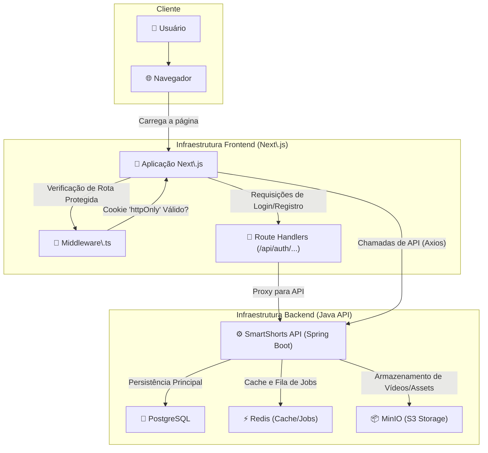

### 🚀 SmartShorts UI: Migração Estratégica para Next.js e TypeScript

#### 🎯 Visão Geral e Arquitetura da Solução

O **SmartShorts** é um SaaS inovador projetado para a geração automatizada de vídeos, atendendo criadores de conteúdo e agências de marketing. O desafio era evoluir sua interface de uma Single Page Application (SPA) tradicional em React/Vite para uma solução mais robusta, performática e segura.

A decisão estratégica foi realizar uma migração completa para **Next.js com TypeScript**. A nova arquitetura aproveita o poder do Next.js para renderização híbrida (SSR e CSR), resultando em uma performance superior e melhor SEO. A interface permite que os usuários se autentiquem de forma segura, criem jobs de renderização de vídeo a partir de simples prompts de texto ou estruturas JSON complexas, e monitorem o status de cada job em tempo real através de um dashboard interativo.

A autenticação foi reimaginada para máxima segurança: em vez de usar `localStorage`, implementei um fluxo server-side. Os **Route Handlers** do Next.js atuam como um proxy seguro para a API de backend (Java/Spring Boot), armazenando o token JWT em um **cookie `httpOnly`**. O acesso às rotas protegidas é gerenciado de forma elegante e eficiente por um **Middleware**, que valida o token no lado do servidor antes de renderizar a página.

#### 👨‍💻 Meu Papel no Projeto

Atuei como **Arquiteto da Solução Frontend e Desenvolvedor Principal**, liderando a modernização da plataforma. Minhas responsabilidades incluíram:

  * **Planejamento e Execução:** Estruturei o plano de migração da SPA Vite/React para Next.js/TypeScript, garantindo uma transição suave e controlada.
  * **Arquitetura Frontend:** Desenhei a nova arquitetura da aplicação, focando em segurança, escalabilidade e performance, com a implementação de um fluxo de autenticação server-side.
  * **Desenvolvimento Full-Cycle:** Fui responsável por reescrever componentes, tipar toda a base de código com TypeScript, configurar o ambiente de build e testes, e integrar a UI com a API backend.
  * **Resolução de Desafios Técnicos:** Identifiquei e solucionei proativamente os desafios complexos que surgiram durante a migração, desde a configuração de ferramentas até a adaptação de paradigmas de desenvolvimento.

#### ✨ Pontos Fortes e Desafios Superados

O maior triunfo deste projeto foi transformar desafios técnicos em pontos fortes da aplicação.

  * **Do Paradigma SPA para o Server-Centric:** O desafio inicial foi adaptar o fluxo da aplicação, que era totalmente client-side, para o modelo do Next.js. Superamos isso ao redesenhar a autenticação para ser server-side, eliminando a dependência do `localStorage` e adotando cookies `httpOnly` com um middleware de proteção. O resultado é uma aplicação significativamente mais segura e alinhada com as melhores práticas modernas.
  * **Garantia de Contrato entre UI e API:** Durante a integração, enfrentei um erro `403 Forbidden` devido a uma incompatibilidade silenciosa entre o formato JSON enviado pelo frontend e o DTO esperado pela API Java. A solução foi criar uma função "tradutora" no frontend, utilizando **interfaces TypeScript específicas** para ambos os formatos de dados. Isso não apenas resolveu o problema, mas também fortaleceu a robustez do código, prevenindo erros futuros e demonstrando o poder da tipagem estática para garantir a integridade dos dados.

#### 🌱 Pontos para Evolução Futura

O projeto está em uma base sólida, mas existem caminhos claros para evolução:

1.  **Real-time Job Status:** Substituir o polling HTTP (`useJobPolling`) por uma conexão **WebSockets** para atualizações de status dos jobs em tempo real, reduzindo a latência e a carga no servidor.
2.  **Testes E2E Automatizados:** Expandir a suíte de testes com ferramentas como Playwright ou Cypress para automatizar a validação dos fluxos críticos do usuário, garantindo a estabilidade em futuras implantações.

-----

#### 🛠️ Pilha de Tecnologias (Tech Stack)

  * **Frontend:** Next.js, React, TypeScript, Tailwind CSS, Axios
  * **Backend (Contexto):** Java (17+), Spring Boot 3, PostgreSQL, Redis, MinIO (S3)
  * **Ferramentas e DevOps:** Node.js (18+), npm, Vitest, Docker

-----

#### 🗺️ Diagrama da Arquitetura

---
### RESUMO TÉCNICO PARA EMBEDDING

O projeto consiste na migração e desenvolvimento de uma interface de usuário (UI) para um SaaS de geração de vídeo, o SmartShorts, evoluindo de uma SPA Vite/React para uma arquitetura moderna com Next.js e TypeScript. A nova implementação utiliza o App Router do Next.js, adotando um modelo de renderização híbrido (SSR e CSR). Um desafio central superado foi a re-arquitetura do fluxo de autenticação, substituindo o `localStorage` por uma solução server-side mais segura, que utiliza Route Handlers como um proxy para a API backend (Java/Spring Boot), armazena o token JWT em um cookie `httpOnly` e protege rotas com Middleware (`middleware.ts`). A migração enfrentou e solucionou problemas de incompatibilidade de versão do Tailwind CSS (v3 vs v4), configurou o ambiente de testes com Vitest e `jsdom` para a React Testing Library, e resolveu um erro `403 Forbidden` implementando uma camada de tradução de dados no frontend. Essa camada converte um payload JSON legado (formato Python) para o DTO esperado pela API Java, garantindo a type-safety através de interfaces TypeScript específicas (`OldSegment`, `OldData`). A comunicação com a API RESTful é gerenciada pelo Axios, e o estado da UI é tipado com genéricos no `useState` e em hooks customizados como `useJobPolling`.

### CLASSIFICAÇÃO DE TECNOLOGIAS E CONCEITOS

| Categoria | Tecnologias e Conceitos |
| :--- | :--- |
| **AI & Machine Learning** | N/A |
| **Software Development** | TypeScript, JavaScript, Node.js (v18+), JSON, DTO (Data Transfer Object), `package.json`, `npm`, Git |
| **Architecture**| SPA (Single Page Application), Server-Side Rendering (SSR), Client-Side Rendering (CSR), App Router (Next.js), Middleware, Proxy Pattern (via Route Handlers), JWT (JSON Web Token), `httpOnly` Cookies, Re-arquitetura de Software, Migração de Framework |
| **Cloud Computing** | SaaS (Software as a Service) |
| **API RESTFul development** | API Consumption, Axios, Route Handlers (Next.js), `POST`, `GET`, `Request`, `NextResponse`, `403 Forbidden` |
| **Frontend Development** | Next.js, React, TypeScript, Tailwind CSS, Vite, Hooks (`useState`, Custom Hooks), `react-router-dom`, React Testing Library, Vitest, `jsdom`, `npx create-next-app`, PostCSS, `autoprefixer` |
| **Mobile Development** | N/A |
| **Database** | N/A |
| **Data Management** | Type Safety, Data Validation, Data Mapping/Translation, Interfaces (TypeScript) |
| **Content Management - CMS** | N/A |
| **System Administration** | NVM (Node Version Manager) |
| **DevOps** | Build Process, Dependency Management, Test Scripts (`vitest`) |
| **Leadership** | N/A |
| **Coaching** | N/A |
| **Agile Project Management** | Post-mortem, Migration Plan (Fases 0-4) |