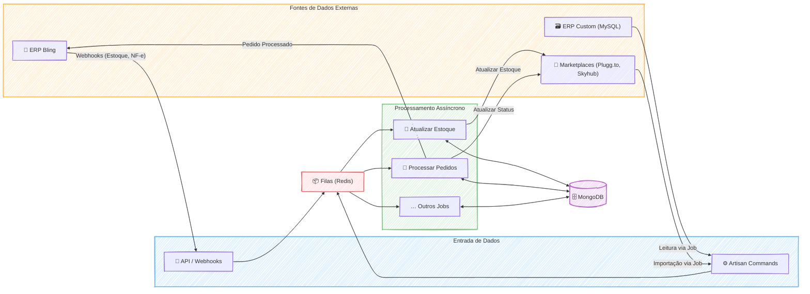

### 🚀 Projeto Spider - Hub de Integração E-commerce

#### 🎯 Visão Geral e Arquitetura da Solução

No coração de um ecossistema de e-commerce complexo e multifacetado, o projeto Spider nasceu como a espinha dorsal de automação, um hub de integração projetado para orquestrar o fluxo de operações para múltiplos clientes. O objetivo era claro: conectar de forma transparente e confiável sistemas de ERP (como Bling e bancos de dados customizados), plataformas de marketplace (Plugg.to, Skyhub, B2W) e ferramentas de gestão, garantindo um fluxo de dados à prova de falhas para produtos, estoque, preços e pedidos.

A solução foi arquitetada como um sistema centralizado, construído em **PHP/Laravel**, que adota uma abordagem orientada a serviços e eventos. Do ponto de vista funcional, o Spider opera como o cérebro da operação:

  * **Recebe Dados:** Ele ingere informações de diversas fontes, utilizando **webhooks** para notificações em tempo real (ex: uma nota fiscal emitida no Bling) e **Artisan Commands** agendados para importações em lote (ex: buscar novos pedidos da Plugg.to).
  * **Processa de Forma Inteligente:** Ao receber os dados, o Spider não apenas os armazena. Ele os enriquece e processa. Um pedido, por exemplo, passa por um job que identifica o cliente correto com base nos SKUs dos produtos antes de ser enviado ao ERP adequado.
  * **Garante a Consistência:** Para tarefas críticas como atualizações de estoque e preço, o sistema utiliza um robusto mecanismo de **filas em Redis**. Isso garante que as operações sejam processadas de forma assíncrona, resiliente e controlada, evitando sobrecarga nas APIs externas e garantindo que as informações fluam de maneira ordenada para todos os canais de venda.
  * **Centraliza a Informação:** Todas as operações, dados e logs são persistidos em um banco de dados **MongoDB**, que serve como a única fonte da verdade para o estado de pedidos, produtos e transações financeiras.

#### 👨‍💻 Meu Papel no Projeto

Como **Engenheiro de Integração**, minha atuação foi central na concepção, desenvolvimento e manutenção deste ecossistema. Minhas principais responsabilidades incluíram:

  * **Arquitetura de Integração:** Desenhar os fluxos de dados, modelar entidades críticas no MongoDB (como a de `checking_account` para controle financeiro) e definir a arquitetura de webhooks para processamento de eventos em tempo real.
  * **Desenvolvimento Back-End:** Construir e manter os pilares da plataforma, incluindo Artisan Commands para importação, Jobs para processamento assíncrono e a lógica de integração com APIs de terceiros como Bling, Plugg.to e Skyhub.
  * **Orquestração do Ciclo de Pedidos:** Automatizar o fluxo completo de um pedido, desde sua criação no marketplace, passando pelo envio ao ERP, até a atualização de seu status após o faturamento, tratando inclusive cancelamentos.
  * **Sincronização Multi-plataforma:** Implementar a complexa lógica de sincronização de estoque e preços, garantindo consistência entre o "dono" do estoque (ERP) e múltiplos canais de venda para evitar overselling.
  * **Onboarding e Migração de Clientes:** Liderar os processos técnicos para integrar novos clientes à plataforma, incluindo a migração massiva de produtos e pedidos de sistemas como Magento e Plugg.to.
  * **Manutenção e Qualidade:** Criar ferramentas internas, como o `LogTrait` para padronizar logs, e executar scripts de manutenção no MongoDB para garantir a qualidade e a integridade dos dados.

#### ✨ Pontos Fortes e Desafios Superados

O maior ponto forte da solução é sua **arquitetura assíncrona e resiliente**. O uso intensivo de filas (Queues) não apenas tornou a plataforma mais responsiva, mas também permitiu escalar o processamento de um volume massivo de dados sem comprometer a estabilidade.

Um dos desafios mais significativos foi **garantir a sincronização de estoque em tempo real**. Vender um produto que não existe no estoque (overselling) é um dos maiores problemas do e-commerce. Superamos isso abandonando o polling ineficiente e implementando uma **arquitetura reativa a eventos**. Ao configurar webhooks no Bling, o Spider passou a ser notificado instantaneamente sobre qualquer mudança, disparando jobs para filas dedicadas (`pluggto`, `skyhub`) que atualizavam os marketplaces de forma quase imediata e controlada. Essa mudança transformou um ponto de fragilidade em uma fortaleza da plataforma.

Outro grande desafio foi lidar com a **inconsistência de dados** provenientes de múltiplas fontes. Enfrentamos SKUs inválidos, produtos duplicados e pedidos sem associação clara de cliente. A vitória aqui foi conquistada através da engenharia: desenvolvi scripts e rotinas de tratamento, como o job `ProcessCodeOrders`, que implementou uma lógica robusta para **identificar e associar corretamente os pedidos aos seus respectivos clientes**, utilizando os SKUs dos itens como chave primária. Essa automação eliminou um processo manual e propenso a erros, garantindo a fluidez da operação.

#### 🌱 Pontos para Evolução Futura

Apesar da robustez da solução, sempre há espaço para melhorias. Duas evoluções naturais seriam:

1.  **Dashboard de Observabilidade:** Implementar um painel de controle visual para monitorar em tempo real a saúde das filas, o status dos jobs e as métricas de integração, oferecendo uma visão proativa sobre possíveis gargalos.
2.  **Centralização de Logs Avançada:** Expandir o `LogTrait` para integrar-se a uma plataforma de observabilidade como Datadog ou ELK Stack, permitindo buscas complexas e criação de alertas inteligentes sobre o comportamento das integrações.

-----

#### 🛠️ Pilha de Tecnologias (Tech Stack)

| Componente | Tecnologia Utilizada | Papel na Arquitetura |
| :--- | :--- | :--- |
| **Backend & Lógica** | **PHP / Laravel** | Framework principal para toda a aplicação, incluindo Artisan Commands para tarefas agendadas e Jobs para processamento em segundo plano. |
| **Banco de Dados Principal** | **MongoDB** | Banco de dados NoSQL central para armazenar produtos, pedidos, clientes e logs, oferecendo flexibilidade para modelos de dados complexos. |
| **Filas Assíncronas** | **Redis** | Utilizado como o motor do sistema de filas (Queues), garantindo o processamento assíncrono e resiliente de tarefas como atualizações de estoque e importações. |
| **Integrações (APIs)** | **REST & Webhooks** | Protocolos usados para comunicação com sistemas externos, tanto para buscar dados (REST) quanto para receber notificações em tempo real (Webhooks). |
| **Plataformas Conectadas** | **Plugg.to, Skyhub, Bling** | Principais sistemas de e-commerce (marketplaces e ERP) com os quais o Spider se integrava para orquestrar as operações. |
| **Infraestrutura & DevOps** | **Docker, AWS S3, SSH** | Docker para conteinerização do ambiente, S3 para armazenamento de arquivos (ex: planilhas de importação) e SSH para gerenciamento do servidor. |
| **Bancos de Dados Legados** | **MySQL** | Utilizado para integração direta com o sistema ERP de clientes específicos que não possuíam uma API moderna, como o Novo Século. |

-----

#### 🗺️ Diagrama da Arquitetura

---
### RESUMO TÉCNICO PARA EMBEDDING

Desenvolvimento e arquitetura do "Spider", um hub de integração de e-commerce centralizado, construído em **PHP/Laravel** para orquestrar operações entre múltiplos sistemas. A arquitetura é orientada a serviços e eventos, utilizando **processamento assíncrono** com **Jobs** e **filas em Redis** para garantir resiliência e escalabilidade. O sistema ingere dados via **APIs REST** e **Webhooks** de plataformas como **Bling**, **Plugg.to**, e **Skyhub**, além de realizar extrações de bancos de dados legados **MySQL**. As operações de **ETL (Extract, Transform, Load)** são executadas por **Artisan Commands** para migração e importação em massa. Todos os dados operacionais (pedidos, produtos, logs) são persistidos em um banco de dados **MongoDB**, que funciona como fonte única da verdade. Desafios de sincronização de estoque e preço foram solucionados implementando uma **arquitetura reativa a eventos**, abandonando o polling em favor de webhooks que disparam jobs para filas dedicadas, prevenindo overselling. A inconsistência de dados foi tratada com rotinas de normalização e enriquecimento, como o `ProcessCodeOrders`. A infraestrutura utiliza **Docker** para conteinerização, **AWS S3** para armazenamento e **SSH** para gerenciamento, com processos agendados via **cron**. A gestão do projeto foi feita com **Jira**, e a padronização de logs foi implementada com um `LogTrait` customizado.

### CLASSIFICAÇÃO DE TECNOLOGIAS E CONCEITOS

| Categoria | Tecnologias e Conceitos |
| :--- | :--- |
| **AI & Machine Learning** | N/A |
| **Software Development** | PHP, Laravel, Artisan Commands, Jobs, Traits (`LogTrait`), Controllers, Backend Development |
| **Architecture**| Arquitetura Orientada a Serviços, Arquitetura Orientada a Eventos, Arquitetura Assíncrona, Arquitetura Reativa, Hub de Integração, Modelagem de Entidades, Fluxos de Dados |
| **Cloud Computing** | AWS S3 |
| **API RESTFul development** | API REST, Webhooks, Consumo de API (Bling, Plugg.to, Skyhub) |
| **Frontend Development** | N/A |
| **Mobile Development** | N/A |
| **Database** | MongoDB, Redis, MySQL, SQLite, NoSQL |
| **Data Management** | ETL (Extração, Transformação, Carga), Migração de Dados (Magento, Plugg.to), Sincronização de Dados (Estoque, Preço), Qualidade de Dados, Normalização de Dados, Logs (`LogTrait`) |
| **Content Management - CMS** | N/A |
| **System Administration** | Gerenciamento de Servidor (SSH), Cron Jobs |
| **DevOps** | Docker, Docker Compose, Monitoramento, Logging, Automação de Tarefas |
| **Leadership** | Liderança Técnica, Documentação Técnica, Mentoria (Coaching) |
| **Coaching** | N/A |
| **Agile Project Management** | Jira, Gestão de Tarefas, Acompanhamento de Status |

---

