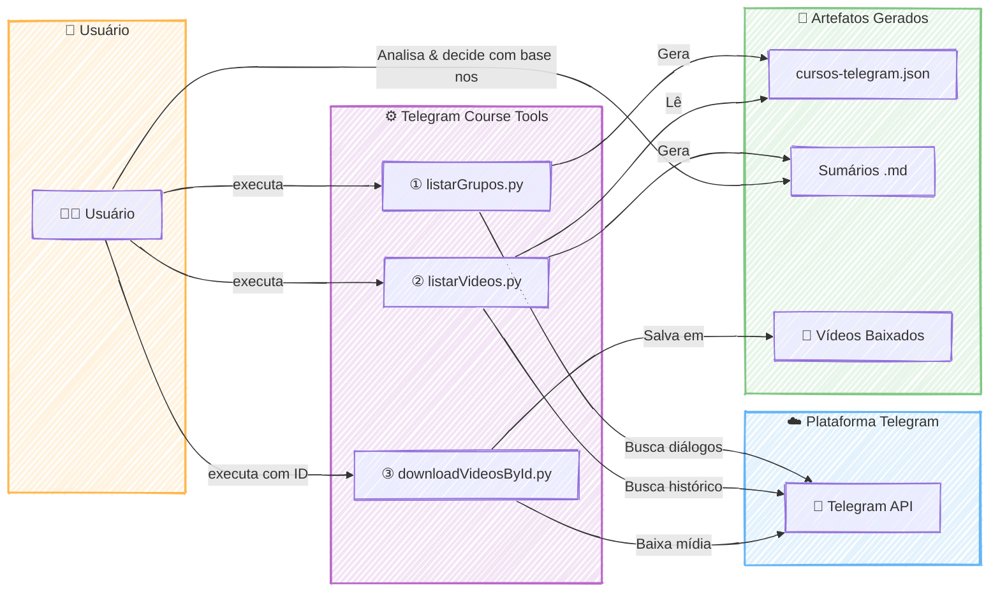

### 🚀 Telegram Course Tools

#### 🎯 Visão Geral e Arquitetura da Solução

Em um cenário onde o Telegram se tornou um vasto repositório de conhecimento, o projeto **Telegram Course Tools** emerge como uma solução estratégica para um desafio comum: a desorganização. A plataforma, embora excelente para comunicação, não foi projetada para e-learning, transformando o acompanhamento de múltiplos cursos em uma tarefa frustrante.

Para resolver isso, projetei uma suíte de automação modular em Python, que transforma coleções dispersas de mensagens em uma biblioteca de aprendizado pessoal, organizada e pronta para consumo. A arquitetura foi pensada em um fluxo de trabalho de três etapas independentes e sequenciais, garantindo clareza e manutenibilidade:

1.  **Descoberta e Mapeamento (`listarGrupos.py`):** A primeira etapa atua como um radar, conectando-se à API do Telegram para catalogar todos os cursos em que o usuário está inscrito. O resultado é um "mapa" em formato JSON (`cursos-telegram.json`), que serve como a fonte da verdade para o restante do processo.
2.  **Indexação e Estruturação (`listarVideos.py`):** O coração da solução. Este módulo consome o mapa gerado e, para cada curso, extrai meticulosamente o histórico de mensagens. Usando expressões regulares para identificar padrões como "Módulo" e "Aula", ele estrutura o conteúdo bruto e o converte em sumários elegantes em formato Markdown, um para cada curso.
3.  **Consumo e Download (`downloadVideosById.py`):** Com os sumários em mãos, o usuário pode tomar decisões estratégicas sobre o que estudar. Esta etapa final permite o download sob demanda de todo o conteúdo de vídeo de um curso específico, de forma otimizada para evitar duplicatas e com uma barra de progresso (`tqdm`) para uma experiência de usuário aprimorada.

O resultado final é o empoderamento do usuário, que agora possui uma biblioteca de aprendizado curada, acessível e pronta para consumo offline.

#### 👨‍💻 Meu Papel no Projeto

Como idealizador e único desenvolvedor deste projeto, minhas responsabilidades abrangeram todo o ciclo de vida da solução:

  * **Arquiteto da Solução:** Defini a arquitetura modular em três etapas, garantindo que cada componente tivesse uma responsabilidade única e que o fluxo de dados entre eles fosse limpo e eficiente.
  * **Desenvolvedor Python:** Escrevi todo o código para os scripts de automação, desde a interação com a API do Telegram usando a biblioteca `Telethon` até a lógica de parsing com expressões regulares e a manipulação do sistema de arquivos.
  * **Engenheiro de Dados (em pequena escala):** Modelei o fluxo de dados, definindo como as informações seriam extraídas (dados brutos), armazenadas temporariamente (JSON) e transformadas em um produto final de valor (sumários em Markdown).
  * **Product Owner:** Identifiquei a dor inicial (minha própria necessidade), defini os objetivos e requisitos do projeto e validei que a solução final atendia efetivamente ao problema proposto.

#### ✨ Pontos Fortes e Desafios Superados

A principal força do projeto reside em sua capacidade de **transformar caos em clareza**. O maior desafio era lidar com conteúdo valioso, porém totalmente não estruturado, dentro do Telegram.

  * **Superação do Caos com Inteligência de Parsing:** O ponto de virada técnico foi a implementação de uma lógica de parsing robusta com expressões regulares (`re`). Essa "inteligência" permitiu que o script `listarVideos.py` lesse textos de formato livre e os organizasse em uma hierarquia lógica de módulos e aulas, criando os sumários que são o principal entregável de valor do projeto.
  * **Eficiência e Experiência do Usuário:** Em vez de uma abordagem simplista, o script de download foi projetado para ser eficiente. Ele verifica a existência e o tamanho dos arquivos antes de iniciar o download, economizando tempo e banda. A inclusão da biblioteca `tqdm` foi uma decisão consciente para melhorar a experiência do usuário em processos demorados, fornecendo feedback visual claro e profissional.
  * **Arquitetura Modular:** A separação em três scripts distintos não só organiza o código, mas também permite a execução seletiva. O usuário pode apenas atualizar o mapa de cursos ou re-gerar um sumário sem precisar executar o fluxo completo, tornando a ferramenta flexível e ágil.

#### 🌱 Pontos para Evolução Futura

Embora a solução seja totalmente funcional para seu propósito inicial, existem caminhos claros para evolução:

1.  **Interface Gráfica (UI):** Desenvolver uma interface de usuário simples (Web com Flask/Streamlit ou Desktop com PyQt) para eliminar a necessidade de executar scripts manualmente via terminal, tornando a ferramenta acessível a um público menos técnico.
2.  **Busca Avançada:** Implementar uma funcionalidade de busca que permita ao usuário pesquisar por palavras-chave em todos os sumários gerados, ajudando a encontrar aulas específicas sobre um determinado tópico em toda a sua biblioteca de cursos.

-----

#### 🛠️ Pilha de Tecnologias (Tech Stack)

| Componente | Tecnologia Utilizada | Papel na Arquitetura |
| :--- | :--- | :--- |
| **Linguagem Principal** | **Python 3.8+** | A base para toda a automação, orquestrando a lógica, a interação com APIs e a manipulação de arquivos. |
| **Comunicação com API** | **Telethon** | Cliente assíncrono para interagir com a API do Telegram, permitindo buscar históricos e baixar mídias de forma robusta. |
| **Interface de Usuário (CLI)** | **tqdm** | Fornece feedback visual com barras de progresso durante os downloads, melhorando significativamente a experiência do usuário. |
| **Estruturação de Conteúdo** | **`re` (Expressões Regulares)** | O motor de inteligência para identificar padrões em texto não-estruturado e organizar as aulas em módulos nos sumários. |
| **Manipulação de Dados** | **`json`** | Utilizado como o formato de intercâmbio de dados entre a etapa de mapeamento e a de indexação, garantindo um "contrato" claro. |
| **Gestão do Sistema** | **`os`** | Essencial para interações com o sistema de arquivos, como criar diretórios para os cursos e verificar a existência de vídeos. |
| **Programação Assíncrona** | **`asyncio`** | Usado implicitamente pelo Telethon para otimizar a comunicação de rede com a API do Telegram, tornando as operações mais rápidas. |

-----

#### 🗺️ Diagrama da Arquitetura

---
### RESUMO TÉCNICO PARA EMBEDDING

Este projeto implementa uma suíte de automação em Python para organizar conteúdo de cursos dispersos no Telegram. A arquitetura é modular e sequencial, composta por três scripts independentes. O primeiro (`listarGrupos.py`), usando a biblioteca `Telethon` e `asyncio`, conecta-se à API do Telegram para mapear os cursos do usuário, gerando um inventário em formato `JSON`. O segundo script (`listarVideos.py`) consome o `JSON`, extrai o histórico de mensagens e aplica expressões regulares (`re`) para fazer o parsing do conteúdo não-estruturado, identificando módulos e aulas para gerar sumários estruturados em `Markdown`. A etapa final (`downloadVideosById.py`) permite o download sob demanda dos vídeos, utilizando a biblioteca `tqdm` para exibir uma barra de progresso e o módulo `os` para gerenciar o sistema de arquivos, evitando downloads duplicados. A solução efetivamente transforma dados caóticos em uma biblioteca de aprendizado organizada, exemplificando um fluxo de ETL (Extract, Transform, Load) em pequena escala, focado em automação, parsing de dados e melhoria da experiência do usuário (UX) em uma interface de linha de comando (CLI).

### CLASSIFICAÇÃO DE TECNOLOGIAS E CONCEITOS

| Categoria | Tecnologias e Conceitos |
| :--- | :--- |
| **AI & Machine Learning** | N/A |
| **Software Development** | Python, Automação de Scripts, Programação Assíncrona (asyncio), Manipulação de Sistema de Arquivos (os), Expressões Regulares (re), Modularidade, CLI (Command-Line Interface) |
| **Architecture**| Arquitetura Modular, Arquitetura de Solução, Fluxo de Dados (ETL), Design de Componentes Independentes |
| **Cloud Computing** | Consumo de API de Plataforma (Telegram API) |
| **API RESTFul development** | Consumo de API (Telethon) |
| **Frontend Development** | CLI User Experience (tqdm) |
| **Mobile Development** | N/A |
| **Database** | N/A |
| **Data Management** | Extração de Dados, Transformação de Dados (Parsing), JSON, Markdown, Dados Não-Estruturados |
| **Content Management - CMS** | N/A |
| **System Administration** | Gerenciamento de Arquivos e Diretórios |
| **DevOps** | N/A |
| **Leadership** | Arquitetura de Solução, Product Ownership, Tomada de Decisão Técnica |
| **Coaching** | N/A |
| **Agile Project Management** | Definição de Requisitos, Validação de Solução, Product Owner |