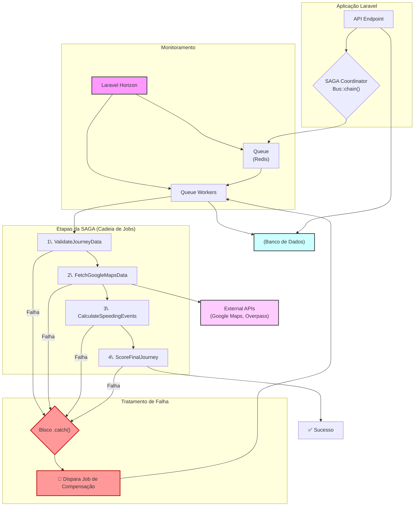

### 🚀 Toot: Resiliência no Processamento de Jornadas Longas

#### 🎯 Visão Geral e Arquitetura da Solução

No projeto Toot, o desafio inicial parecia ser apenas performance: otimizamos um processo de síncrono para assíncrono com filas, alcançando uma aceleração de **500x**. Contudo, essa vitória revelou um adversário mais complexo: a fragilidade no processamento de jornadas de dados muito longas.

O sistema original, mesmo sendo rápido, operava como um job monolítico. Uma única falha em qualquer etapa — uma API externa indisponível ou um cálculo imprevisto — resultava na perda total do processamento e, pior, na inconsistência dos dados. A depuração era um processo reativo e ineficiente, uma verdadeira "caixa-preta".

Para resolver essa questão fundamental, a solução foi redesenhar a arquitetura de processamento aplicando o **Padrão de Design SAGA**. Em vez de um único job gigante, a lógica foi decomposta em uma cadeia de micro-jobs granulares e com responsabilidade única. Utilizando o `Bus::chain()` do Laravel como um orquestrador (Coordenador SAGA), garantimos que cada etapa da jornada — validação, chamadas a APIs como Google Maps, cálculos e pontuação — fosse executada em uma sequência transacional. Se qualquer elo dessa corrente falhasse, a execução era imediatamente interrompida e, através de transações de compensação (`.catch()`), o sistema revertia seu estado, garantindo a atomicidade e a integridade dos dados.

#### 👨‍💻 Meu Papel no Projeto

Como **Arquiteto de Soluções e Desenvolvedor Sênior**, minhas principais responsabilidades foram:

  * **Diagnosticar** a causa raiz dos problemas de processamento, identificando que a falta de resiliência era mais crítica do que a velocidade.
  * **Desenhar a nova arquitetura** baseada no padrão SAGA para orquestrar os jobs de forma transacional e resiliente.
  * **Implementar a solução** de ponta a ponta utilizando PHP e Laravel, com foco no sistema de filas `Bus::chain()` para o encadeamento e `.catch()` para as ações de compensação.
  * **Estruturar a observabilidade** do processo com o Laravel Horizon, transformando a depuração de reativa para proativa.

#### ✨ Pontos Fortes e Desafios Superados

O maior triunfo deste projeto foi transformar um processo frágil em um workflow robusto e transparente. Os pontos fortes da solução são:

  * **Resiliência e Recuperação de Falhas:** O maior desafio era a falha em cascata. Com a SAGA, falhas pontuais (ex: timeout de uma API) não destroem mais todo o processamento. A cadeia simplesmente para, permitindo uma análise precisa do erro.
  * **Consistência Absoluta dos Dados:** Superamos o risco de dados parciais. A natureza da SAGA garante que ou a jornada é 100% processada com sucesso, ou o sistema é revertido a um estado limpo e consistente através das ações de compensação.
  * **Observabilidade e Depuração Simplificada:** O desafio da "caixa-preta" foi eliminado. Com o Laravel Horizon, ganhamos uma visão granular de cada micro-job na cadeia. Identificar, analisar e até mesmo reprocessar uma etapa específica tornou-se uma tarefa trivial, otimizando drasticamente o tempo de manutenção.

#### 🌱 Pontos para Evolução Futura

A arquitetura atual é sólida, mas poderia evoluir com:

1.  **Dead Letter Queue (DLQ) Sofisticada:** Implementar uma fila dedicada para jobs que falharam repetidamente, permitindo uma análise assíncrona e um processo de re-tentativa manual mais estruturado.
2.  **Transações de Compensação Granulares:** Evoluir a lógica de `.catch()` para disparar jobs de compensação específicos para a etapa que falhou, em vez de um rollback genérico, tornando a reversão ainda mais precisa.

-----

#### 🛠️ Pilha de Tecnologias (Tech Stack)

  * **Linguagem:** PHP
  * **Framework:** Laravel
  * **Ferramentas e Bibliotecas:** Laravel Horizon, Laravel Queues (`Bus::chain`)
  * **Infraestrutura de Fila:** Redis
  * **Banco de Dados:** PostgreSQL / MySQL
  * **Integrações de API:** Google Maps API, Overpass API

-----

#### 🗺️ Diagrama da Arquitetura

---
### RESUMO TÉCNICO PARA EMBEDDING

O projeto implementou uma arquitetura resiliente para processamento de jornadas de dados longas, migrando de um job monolítico e frágil para um sistema assíncrono baseado no Padrão de Design SAGA. A orquestração foi realizada com o `Bus::chain()` do Laravel, funcionando como um Coordenador SAGA que encadeia uma sequência de micro-jobs transacionais (validação, chamadas a APIs, cálculos, pontuação). Para garantir a atomicidade e a consistência dos dados, transações de compensação foram implementadas com blocos `.catch()`, revertendo o estado do sistema em caso de falha em qualquer etapa, como timeouts na integração com Google Maps API ou Overpass API. A solução, desenvolvida em PHP com o framework Laravel, utiliza Redis para a infraestrutura de filas e PostgreSQL/MySQL como banco de dados. A observabilidade do processo foi alcançada com o Laravel Horizon, permitindo um monitoramento e depuração proativa dos queue workers, eliminando a natureza de "caixa-preta" do sistema anterior e garantindo a recuperação de falhas de forma robusta.

### CLASSIFICAÇÃO DE TECNOLOGIAS E CONCEITOS

| Categoria | Tecnologias e Conceitos |
| :--- | :--- |
| **AI & Machine Learning** | N/A |
| **Software Development** | PHP, Laravel, Laravel Queues (`Bus::chain`), `.catch()`, Depuração Proativa |
| **Architecture**| Padrão de Design SAGA, Arquitetura Assíncrona, Micro-Jobs, Coordenador SAGA, Transações de Compensação, Resiliência, Recuperação de Falhas, Dead Letter Queue (DLQ), Job Monolítico |
| **Cloud Computing** | N/A |
| **API RESTFul development** | Google Maps API, Overpass API |
| **Frontend Development** | N/A |
| **Mobile Development** | N/A |
| **Database** | PostgreSQL, MySQL, Redis |
| **Data Management** | Atomicidade, Consistência de Dados, Integridade de Dados |
| **Content Management - CMS** | N/A |
| **System Administration** | N/A |
| **DevOps** | Laravel Horizon, Observabilidade, Gerenciamento de Filas (Queues), Queue Workers |
| **Leadership** | Arquiteto de Soluções, Desenvolvedor Sênior |
| **Coaching** | N/A |
| **Agile Project Management** | N/A |