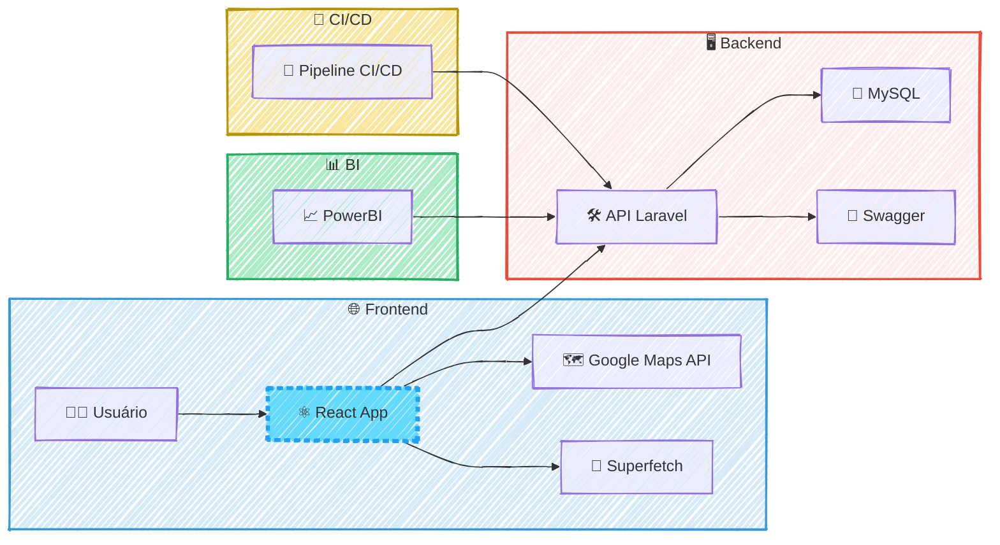

### 🚀 Toot 🚘 Otimização de Geodata (30x) e API para Market Intelligence

#### 🎯 Visão Geral e Arquitetura da Solução

Este projeto nasceu da necessidade de transformar uma vasta quantidade de dados geoespaciais brutos em insights acionáveis para inteligência de mercado. O desafio era claro: como visualizar mais de 200.000 pontos de dados em um mapa interativo sem comprometer a performance? A solução foi arquitetada em torno de uma API robusta em Laravel, que não apenas servia os dados para um frontend em React, mas também replicava a complexa lógica de filtragem de relatórios do PowerBI, garantindo uma análise de dados consistente e poderosa. A arquitetura foi projetada para ser altamente eficiente, utilizando a biblioteca Superfetch para carregamento progressivo e renderização inteligente dos dados, o que permitiu uma experiência de usuário fluida e responsiva.

#### 👨‍💻 Meu Papel no Projeto

Como desenvolvedor backend da equipe, minhas principais responsabilidades foram:

  * **Desenvolvimento da API:** Criei os endpoints em Laravel/MySQL que serviam como a espinha dorsal da plataforma, fornecendo os dados para os dashboards e mapas geoespaciais.
  * **Otimização de Performance:** Identifiquei e resolvi um gargalo crítico de performance, aumentando a velocidade de interação com os mapas em 30 vezes.
  * **Documentação da API:** Utilizei o Swagger para documentar a API, facilitando a integração com o frontend em React.
  * **Colaboração Full-Stack:** Trabalhei em estreita colaboração com os desenvolvedores React e a equipe de QA para garantir a entrega contínua de uma plataforma estável e de alta qualidade.

#### ✨ Pontos Fortes e Desafios Superados

O ponto mais forte da solução foi, sem dúvida, a **otimização de performance geoespacial**. Aumentar em 30 vezes a velocidade de interação com os mapas, reduzindo o tempo de resposta de \~15s para \~0.5s, foi uma vitória técnica que transformou a experiência do usuário. Outro ponto de destaque foi o desenvolvimento de uma API que replicava com sucesso a complexa lógica de filtragem de relatórios do PowerBI, fornecendo uma base de dados sólida e confiável para a plataforma de Market Intelligence.

#### 🌱 Pontos para Evolução Futura

Para evoluir o projeto, poderíamos explorar a implementação de um sistema de cache mais avançado, como o Redis, para otimizar ainda mais as consultas à API. Além disso, a plataforma de Market Intelligence poderia ser expandida para incluir mais fontes de dados e análises preditivas, agregando ainda mais valor ao negócio.

-----

#### 🛠️ Pilha de Tecnologias (Tech Stack)

| Componente | Tecnologia Utilizada | Papel na Arquitetura |
| :--- | :--- | :--- |
| **Backend** | **Laravel (PHP)** | Desenvolvimento da API para servir os dados geoespaciais e de BI. |
| **Banco de Dados** | **MySQL** | Armazenamento e consulta dos dados da plataforma. |
| **Frontend** | **React** | Construção da interface de usuário, incluindo os mapas interativos. |
| **Mapas** | **Google Maps API** | Renderização dos mapas e visualização dos dados geoespaciais. |
| **Otimização de Performance**| **Superfetch** | Carregamento progressivo e renderização inteligente dos dados nos mapas. |
| **Business Intelligence** | **PowerBI (integração)** | Análise e visualização de dados, com lógica de filtragem replicada na API. |
| **Testes** | **PHPUnit** | Testes unitários para garantir a qualidade e a estabilidade da API. |
| **Documentação da API**| **Swagger** | Documentação dos endpoints da API para facilitar a integração. |
| **DevOps** | **CI/CD** | Entrega contínua de novas features e correções de bugs. |

-----

#### 🗺️ Diagrama da Arquitetura

---
### RESUMO TÉCNICO PARA EMBEDDING

Desenvolvimento de uma API backend em Laravel e MySQL para uma plataforma de Market Intelligence, focada na otimização de performance para visualização de mais de 200.000 pontos de geodata. A solução resolveu um gargalo crítico, aumentando a velocidade de interação em 30x (de ~15s para ~0.5s) em um frontend React com Google Maps API, utilizando a biblioteca Superfetch para carregamento progressivo. A API foi documentada com Swagger, testada com PHPUnit, e replicava a complexa lógica de filtragem de relatórios do PowerBI, sendo entregue via um pipeline de CI/CD. A arquitetura foi desenhada para ser responsiva e escalável, com futuras evoluções considerando a implementação de cache com Redis e análises preditivas.

### CLASSIFICAÇÃO DE TECNOLOGIAS E CONCEITOS

| Categoria | Tecnologias e Conceitos |
| :--- | :--- |
| **AI & Machine Learning** | Análises Preditivas (Evolução Futura) |
| **Software Development** | Laravel (PHP), PHPUnit |
| **Architecture**| Otimização de Performance Geoespacial, Arquitetura de API, Cache (Redis - Evolução Futura) |
| **Cloud Computing** | N/A |
| **API RESTFul development** | API RESTFul, Laravel, Swagger, Integração com PowerBI |
| **Frontend Development** | React, Google Maps API, Superfetch |
| **Mobile Development** | N/A |
| **Database** | MySQL |
| **Data Management** | Geodata, Market Intelligence, Lógica de Filtragem de Dados |
| **Content Management - CMS** | N/A |
| **System Administration** | N/A |
| **DevOps** | CI/CD |
| **Leadership** | N/A |
| **Coaching** | N/A |
| **Agile Project Management** | Colaboração com QA, Entrega Contínua |