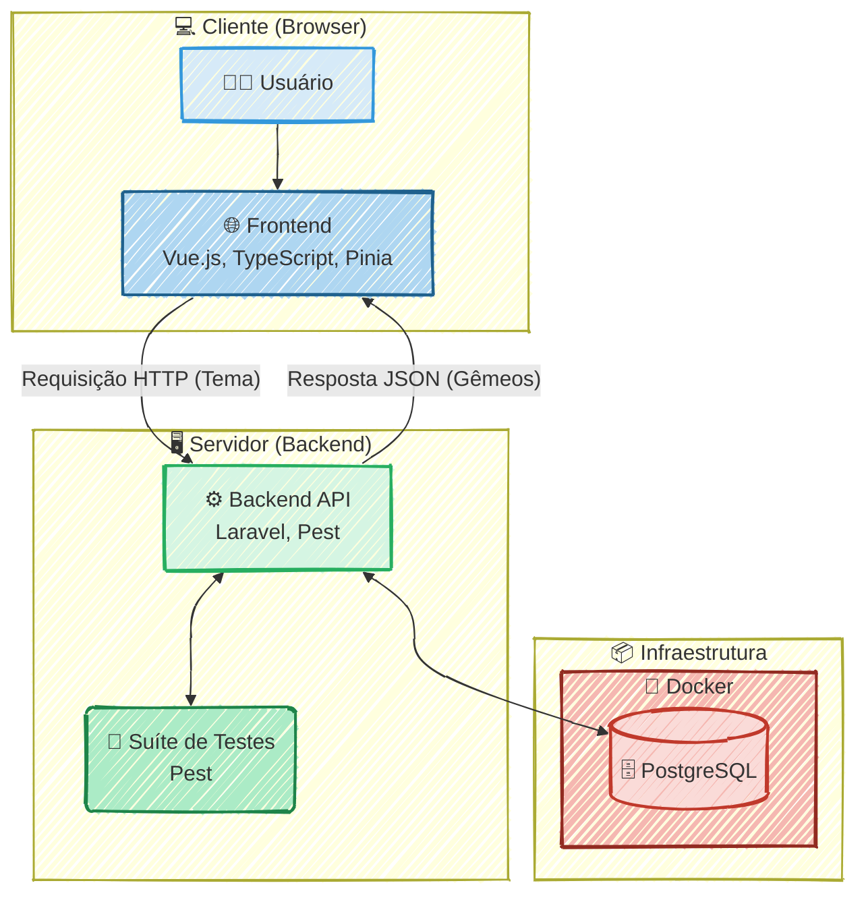

### 🚀 Twin Quest: Desafio Full-Stack 

#### 🎯 Visão Geral e Arquitetura da Solução

O "Twin Quest" nasceu como uma resposta criativa a um desafio, a arquitetura foi desenhada para ser moderna, robusta e reativa. O coração da aplicação é um **backend em Laravel** que serve uma API RESTful segura e eficiente. Ele é o maestro que orquestra a comunicação com a API. No frontend, uma interface limpa e fluida, construída com **Vue 3 (Composition API) e TypeScript**, oferece uma experiência de usuário impecável. O estado da aplicação é gerenciado de forma centralizada pelo **Pinia**, garantindo que os dados fluam de maneira reativa e instantânea da API para a tela do usuário.

#### 👨‍💻 Meu Papel no Projeto

Como idealizador e único desenvolvedor deste projeto, atuei em todas as frentes como **Desenvolvedor Full-Stack**, com as seguintes responsabilidades:

  * **Arquitetura e Desenvolvimento Back-End:** Construí toda a API RESTful com Laravel, definindo os endpoints, a lógica de negócio e a orquestração da comunicação com o serviço de IA.
  * **Desenvolvimento Front-End:** Criei a interface de usuário reativa utilizando Vue 3, TypeScript e a Composition API, focando em uma experiência limpa e intuitiva.
  * **Gestão de Estado:** Implementei o Pinia para um gerenciamento de estado global eficiente e previsível no lado do cliente.
  * **Qualidade de Código e Testes:** Garanti a estabilidade e a confiabilidade da API escrevendo uma suíte de testes completa com Pest, adotando uma abordagem TDD.

#### ✨ Pontos Fortes e Desafios Superados

O maior trunfo do projeto é a sua **execução técnica coesa e moderna**, integrando perfeitamente o frontend e o backend. A utilização de TypeScript de ponta a ponta trouxe uma camada extra de segurança e manutenibilidade ao código.

Um desafio significativo foi implementação de uma **suíte de testes robusta com Pest** foi crucial para garantir que a lógica de negócio da API fosse à prova de falhas, um pilar para a qualidade do projeto.

#### 🌱 Pontos para Evolução Futura

Para o futuro, a aplicação poderia evoluir com a implementação de um **sistema de cache (como Redis)** para temas populares, otimizando custos de API e a velocidade de resposta. Outra melhoria seria adicionar **autenticação de usuários** para que eles possam salvar e revisitar seu histórico de "quests".

-----

#### 🛠️ Pilha de Tecnologias (Tech Stack)

| Componente                  | Tecnologia Utilizada        | Papel na Arquitetura                                                                                                |
| :-------------------------- | :-------------------------- | :------------------------------------------------------------------------------------------------------------------ |
| **Backend (API)**           | **Laravel**                 | Orquestra a lógica de negócio, gerencia as rotas da API e se comunica com o serviço de IA Generativa.               |
| **Frontend (UI)**           | **Vue 3 (Composition API)** | Constrói a interface de usuário reativa e dinâmica, permitindo uma interação fluida com o usuário.                  |
| **Tipagem de Código**       | **TypeScript**              | Garante a segurança de tipos em todo o projeto, tanto no frontend quanto no backend (se aplicável), reduzindo bugs. |
| **Gerenciamento de Estado** | **Pinia**                   | Centraliza e gerencia o estado da aplicação no frontend de forma simples, reativa e eficiente.                      |
| **Testes Automatizados**    | **Pest**                    | Garante a confiabilidade e a qualidade da API do Laravel através de uma suíte de testes elegante e poderosa (TDD).  |

-----

#### 🗺️ Diagrama da Arquitetura

---
### RESUMO TÉCNICO PARA EMBEDDING

Desenvolvimento de uma aplicação web full-stack, "Twin Quest", a arquitetura da solução é baseada em um backend com Laravel que serve uma API RESTful. O frontend é uma interface de usuário reativa construída com Vue 3, Composition API e TypeScript para garantir tipagem segura. O gerenciamento de estado global no lado do cliente é realizado de forma centralizada pelo Pinia. A qualidade e estabilidade da API foram asseguradas através de uma suíte de testes automatizados com Pest, adotando uma abordagem TDD (Test-Driven Development). A infraestrutura inclui PostgreSQL, com planos de evolução para implementar um sistema de cache com Redis e autenticação de usuários.

### CLASSIFICAÇÃO DE TECNOLOGIAS E CONCEITOS

| Categoria                    | Tecnologias e Conceitos                                                                                               |
| :--------------------------- | :-------------------------------------------------------------------------------------------------------------------- |
| **Software Development**     | Desenvolvedor Full-Stack, Laravel, Vue 3, TypeScript, Pinia, Pest, Test-Driven Development (TDD), Qualidade de Código |
| **Architecture**             | Arquitetura Full-Stack, API RESTful, Gestão de Estado (Pinia), Sistema de Cache (Redis), Autenticação de Usuários     |
| **Cloud Computing**          | N/A                                                                                                                   |
| **API RESTFul development**  | API RESTful, Laravel, Endpoints, Requisição HTTP, Resposta JSON                                                       |
| **Frontend Development**     | Vue 3 (Composition API), TypeScript, Pinia, Interface de Usuário Reativa                                              |
| **Mobile Development**       | N/A                                                                                                                   |
| **Database**                 | PostgreSQL, Redis                                                                                                     |
| **Data Management**          | N/A                                                                                                                   |
| **Content Management - CMS** | N/A                                                                                                                   |
| **System Administration**    | N/A                                                                                                                   |
| **DevOps**                   | Testes Automatizados, Pest, Docker                                                                                    |
| **Leadership**               | Liderança Técnica (Idealizador e único desenvolvedor)                                                                 |
| **Coaching**                 | N/A                                                                                                                   |
| **Agile Project Management** | N/A                                                                                                                   |