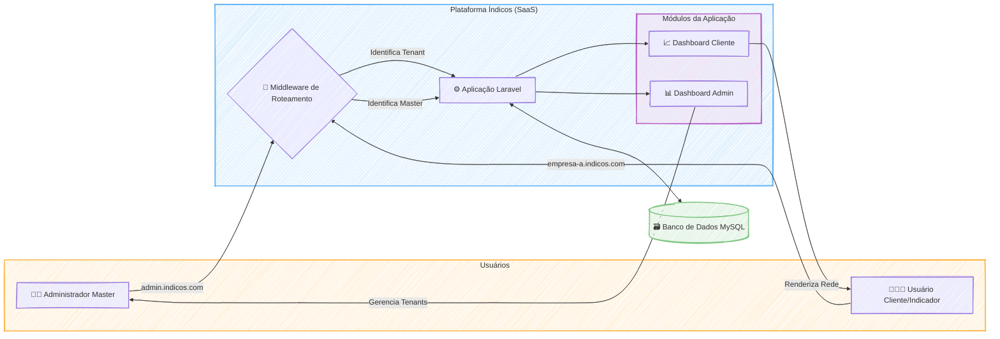

### 🚀 Índicos: Plataforma SaaS de Marketing de Indicação

#### 🎯 Visão Geral e Arquitetura da Solução

O projeto Índicos nasceu de uma visão ambiciosa: democratizar o marketing de indicação, permitindo que qualquer empresa, independentemente do seu tamanho, pudesse implementar um programa de recompensas multinível de forma autônoma e escalável. O desafio era criar uma plataforma SaaS **multi-tenant**, onde cada cliente (tenant) operasse em um ambiente seguro e isolado, mas sob a gestão de uma única aplicação centralizada.

A arquitetura foi concebida para ser robusta e flexível. Cada cliente acessava sua própria versão da plataforma através de um subdomínio exclusivo (ex: `empresa.indicos.com.br`). Um sistema de **middlewares personalizados** em Laravel atuava como o cérebro do roteamento, identificando o tenant a cada requisição. Isso garantia que todas as operações, desde a autenticação de usuários até as consultas no banco de dados **MySQL**, fossem rigorosamente segmentadas, prevenindo qualquer tipo de vazamento de dados entre os clientes. A solução final entregou um sistema onde cada empresa podia customizar suas próprias regras de negócio, produtos e comissões, gerenciando sua rede de indicadores com total autonomia.

#### 👨‍💻 Meu Papel no Projeto

Como arquiteto e desenvolvedor principal desta solução, minhas responsabilidades foram da concepção à entrega final. Atuei em frentes como:

  * **Arquitetura da Solução:** Desenhei e implementei toda a estrutura multi-tenant do zero, garantindo a segurança e o isolamento dos dados dos clientes.
  * **Desenvolvimento Back-End:** Codifiquei a complexa lógica de negócio para o sistema de comissionamento multinível, a automação de distribuição de prêmios e a gestão de produtos customizáveis por tenant.
  * **Desenvolvimento Front-End:** Criei os dashboards interativos, com destaque para a visualização dinâmica da rede de indicações, permitindo que os usuários acompanhassem o crescimento de suas hierarquias em tempo real.
  * **Infraestrutura e Resolução de Problemas:** Liderei a depuração de desafios de implantação, incluindo a investigação e superação de limitações no ambiente de hospedagem para habilitar funcionalidades críticas como os subdomínios dinâmicos.

#### ✨ Pontos Fortes e Desafios Superados

O maior ponto forte do Índicos reside em sua **arquitetura multi-tenant robusta**, que provou ser segura e escalável. No entanto, a jornada para alcançar esse resultado foi marcada por desafios que se tornaram grandes vitórias técnicas:

  * **O Mistério dos Subdomínios:** Um dos obstáculos mais frustrantes foi a falha na configuração de subdomínios dinâmicos no host contratado. Após uma exaustiva investigação que parecia apontar para uma falha no código, a persistência na depuração revelou a verdadeira causa: uma limitação da própria infraestrutura. Superar isso não foi apenas uma correção, mas uma lição valiosa sobre a importância de entender profundamente todo o ecossistema de deploy, transformando frustração em expertise.

  * **Visualizando a Complexidade:** Representar uma rede de indicação multinível de forma clara e intuitiva era um desafio por si só. A solução foi desenvolver um componente de visualização de diagramas dinâmicos, que renderizava a hierarquia de cada usuário em tempo real, exibindo os níveis e as porcentagens de ganho. Essa funcionalidade se tornou um diferencial da plataforma, transformando dados complexos em uma experiência de usuário engajadora.

#### 🌱 Pontos para Evolução Futura

Para o futuro, o projeto Índicos poderia evoluir com a implementação de duas frentes principais:

1.  **Integração com plataformas de e-commerce e CRMs** para automatizar ainda mais o ciclo de vendas e indicações.
2.  Um **módulo de analytics avançado** para que os clientes pudessem medir o ROI de seus programas de indicação com mais precisão.

-----

#### 🛠️ Pilha de Tecnologias (Tech Stack)

| Componente | Tecnologia Utilizada | Papel na Arquitetura |
| :--- | :--- | :--- |
| **Backend & Core da Aplicação** | **Laravel** | Responsável por toda a lógica de negócio, arquitetura multi-tenant, roteamento por subdomínios, autenticação dupla (master e tenants) e APIs. |
| **Banco de Dados** | **MySQL** | Persistência dos dados de todos os tenants, incluindo usuários, redes de indicação e configurações, com isolamento garantido por tenant. |
| **Frontend & Dinamismo** | **JavaScript / jQuery** | Utilizado para criar os diagramas de hierarquia dinâmicos no dashboard do usuário, proporcionando uma visualização interativa e em tempo real da rede. |
| **Ambiente de Deploy** | **Host Umbler** | Ambiente de nuvem onde a aplicação foi implantada. O entendimento de suas limitações foi crucial para a resolução de desafios de infraestrutura. |

-----

#### 🗺️ Diagrama da Arquitetura

---
### RESUMO TÉCNICO PARA EMBEDDING

A plataforma Índicos é um SaaS de marketing de indicação com uma arquitetura multi-tenant robusta, desenvolvida em Laravel. O core da solução reside em middlewares personalizados que gerenciam o roteamento por subdomínios dinâmicos, garantindo o total isolamento de dados de cada tenant em um banco de dados MySQL. O desenvolvimento back-end abrange a complexa lógica de negócio para um sistema de comissionamento multinível e automação de prêmios. No front-end, JavaScript e jQuery foram utilizados para criar dashboards interativos, destacando-se um componente de visualização de diagramas dinâmicos que renderiza a hierarquia da rede de indicações em tempo real. Um desafio técnico significativo superado foi a depuração e resolução de problemas de implantação relacionados a limitações da infraestrutura de hospedagem (Host Umbler) na configuração dos subdomínios, o que exigiu uma análise profunda do ambiente de deploy. A arquitetura foi projetada para ser escalável, com futuras evoluções planejadas para integração via API com CRMs e plataformas de e-commerce, além de um módulo de analytics avançado.

### CLASSIFICAÇÃO DE TECNOLOGIAS E CONCEITOS

| Categoria | Tecnologias e Conceitos |
| :--- | :--- |
| **AI & Machine Learning** | Módulo de analytics avançado (evolução futura) |
| **Software Development** | Laravel, Middlewares personalizados, Lógica de comissionamento multinível, Automação de distribuição de prêmios, Depuração (Debugging) |
| **Architecture**| Arquitetura multi-tenant, SaaS (Software as a Service), Roteamento por subdomínios, Isolamento de dados, Integração com plataformas externas |
| **Cloud Computing** | Host Umbler, Infraestrutura de hospedagem |
| **API RESTFul development** | APIs para integração (evolução futura) |
| **Frontend Development** | JavaScript, jQuery, Dashboards interativos, Visualização de diagramas dinâmicos |
| **Mobile Development** | N/A |
| **Database** | MySQL |
| **Data Management** | Segmentação de dados por tenant, Visualização de dados hierárquicos |
| **Content Management - CMS** | N/A |
| **System Administration** | Configuração de subdomínios dinâmicos, Gestão de ambiente de hospedagem |
| **DevOps** | Implantação (Deploy), Resolução de problemas de infraestrutura |
| **Leadership** | Arquiteto de Soluções, Desenvolvedor Principal |
| **Coaching** | N/A |
| **Agile Project Management** | Gestão do ciclo de vida do projeto (concepção à entrega) |