### 🚀 Robo de Atendimento por Voz - BRNow

#### 🎯 Visão Geral e Arquitetura da Solução

Em um cenário onde a agilidade e a eficiência são cruciais para restaurantes e pizzarias, o "Robo de Atendimento por Voz - BRNow" surge como uma solução inovadora para automatizar o recebimento de pedidos. O objetivo é claro: reduzir custos operacionais e otimizar o tempo, enquanto se oferece uma experiência fluida e acolhedora ao cliente, simulando um atendente humano simpático e eficiente.

A arquitetura foi concebida para ser robusta, escalável e, principalmente, **multi-tenant**. A cada nova chamada, o sistema inicia uma sessão de atendimento personalizada. Através de uma API RESTful, o restaurante envia uma imagem do seu cardápio, que é processada em tempo real com tecnologia OCR (Pytesseract) para extrair os itens e preços. Essa informação é usada para construir um prompt dinâmico que contextualiza o agente de IA (GPT-4o-mini), permitindo que ele conduza o pedido de forma precisa. A comunicação de voz acontece em tempo real através do LiveKit, que gerencia o fluxo de áudio entre o cliente e o agente de IA, garantindo uma interação natural e de baixa latência.

#### 👨‍💻 Meu Papel no Projeto

Como arquiteto e desenvolvedor principal desta solução, minhas responsabilidades abrangeram todo o ciclo de vida do projeto:

  * **Arquitetura da Solução:** Projetei a arquitetura end-to-end, focada em comunicação de voz em tempo real e processamento de IA de baixa latência.
  * **Desenvolvimento Back-End:** Implementei a API RESTful com Flask para gerenciar o ciclo de vida dos agentes, incluindo a orquestração da inicialização e finalização das sessões.
  * **Integração de IA e Serviços:** Fui responsável por integrar e orquestrar o pipeline de serviços de IA, conectando o reconhecimento de fala (Deepgram), a lógica de conversação (OpenAI) e a síntese de voz (ElevenLabs).
  * **Implementação da Lógica Multi-Tenant:** Desenvolvi o sistema de personalização dinâmica que utiliza OCR para adaptar o agente a diferentes cardápios, garantindo que cada restaurante tivesse um atendente virtual exclusivo.

#### ✨ Pontos Fortes e Desafios Superados

O maior ponto forte da solução é sua capacidade de oferecer uma interação de voz natural e quase instantânea. Um dos principais desafios técnicos foi **garantir a baixa latência no ciclo "fala-processamento-resposta"**. Superamos isso ao selecionar um conjunto de tecnologias de ponta e orquestrá-las de forma eficiente: LiveKit para o transporte de mídia via WebRTC, Deepgram para transcrição em tempo real, GPT-4o-mini para respostas rápidas e ElevenLabs para uma síntese de voz natural.

Outro desafio significativo foi **tornar o sistema facilmente adaptável a qualquer restaurante sem a necessidade de configuração manual complexa**. A solução foi a implementação de um fluxo de onboarding automatizado, onde o sistema utiliza OCR para "ler" uma imagem do cardápio e, a partir dela, gerar dinamicamente o roteiro e o contexto para a IA. Isso transformou um processo complexo em uma simples chamada de API, tornando a plataforma extremamente escalável.

#### 🌱 Pontos para Evolução Futura

Embora a solução atual seja robusta, existem caminhos claros para evolução, como a **integração direta com sistemas de PDV (Ponto de Venda)** para automatizar o envio do pedido à cozinha e a implementação de um **sistema de reconhecimento de clientes recorrentes** para oferecer um atendimento ainda mais personalizado.

-----

#### 🛠️ Pilha de Tecnologias (Tech Stack)

| Componente | Tecnologia Utilizada | Papel na Arquitetura |
| :--- | :--- | :--- |
| **Orquestração e Backend** | **Python (Flask)** | Fornece a API RESTful para gerenciar o ciclo de vida do agente de voz. |
| **Comunicação em Tempo Real** | **LiveKit Voice Agents** | Gerencia a conexão WebRTC/SIP e o transporte de mídia entre o cliente e o agente. |
| **Inteligência Artificial (LLM)** | **OpenAI (GPT-4o-mini)** | Gera respostas inteligentes e contextuais para guiar o cliente durante o pedido. |
| **Reconhecimento de Fala (STT)**| **Deepgram** | Transcreve a fala do cliente em texto com alta precisão e baixa latência. |
| **Síntese de Voz (TTS)** | **ElevenLabs** | Converte as respostas de texto do LLM em áudio com voz natural e personalizada. |
| **Detecção de Fala (VAD)** | **Silero VAD** | Detecta quando o usuário está falando, otimizando o fluxo da conversação. |
| **Processamento de Imagem (OCR)**| **Pytesseract & Pillow** | Extrai o texto de imagens de cardápios para personalizar o prompt do agente. |

-----

#### 🗺️ Diagrama da Arquitetura

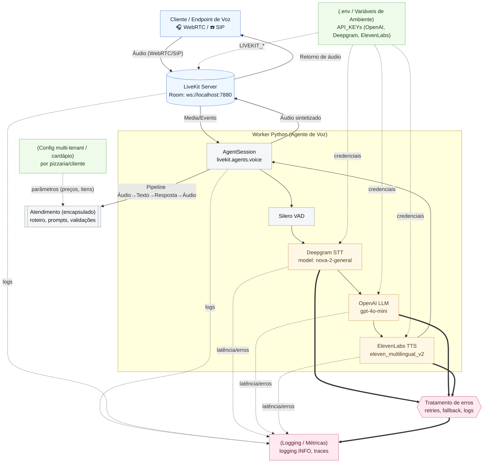

#### RESUMO TÉCNICO PARA EMBEDDING

Este projeto implementa um robô de atendimento por voz multi-tenant para restaurantes, desenvolvido em Python 3.12 com um backend Flask que expõe uma API RESTful para gerenciamento de sessões. A arquitetura centraliza-se no LiveKit Voice Agents para comunicação em tempo real via WebRTC/SIP. O pipeline de processamento de voz integra Silero VAD para detecção de atividade de fala, Deepgram (modelo nova-2-general) para Speech-to-Text (STT), OpenAI GPT-4o-mini como Large Language Model (LLM) para geração de respostas inteligentes, e ElevenLabs (modelo eleven_multilingual_v2) para Text-to-Speech (TTS) customizável. A solução é multi-tenant, permitindo a personalização de cardápios através de um sistema de OCR com Pytesseract e Pillow, que extrai texto de imagens para construir prompts dinâmicos. A qualidade do código é garantida por uma suíte de DevOps utilizando Makefile para automação de tarefas como linting com `ruff`, verificação de tipos com `mypy` e testes com `pytest`. O sistema é projetado para ser observável, com logging e monitoramento de tráfego SIP via `sngrep` e CLI do LiveKit.

#### CLASSIFICAÇÃO DE TECNOLOGIAS E CONCEITOS

| Categoria                       | Tecnologias e Conceitos                                                                                                                            |
| :------------------------------ | :------------------------------------------------------------------------------------------------------------------------------------------------- |
| 🤖 **AI & Machine Learning**    | OpenAI GPT-4o-mini, Deepgram (STT), ElevenLabs (TTS), Silero VAD (Voice Activity Detection), Pytesseract (OCR), Pillow (Image Processing), LLM     |
| 💻 **Software Development**     | Python 3.12, Flask, Makefile, Ruff (linter/formatter), MyPy (type checking), Pytest, virtual environment (venv)                                    |
| 🏗️ **Architecture**            | Arquitetura Multi-tenant, Voice Agents, WebRTC, SIP, Worker (Agent Pattern)                                                                        |
| ☁️ **Cloud Computing**          | LiveKit (Real-time voice/video infrastructure)                                                                                                     |
| 🌐 **API RESTFul development**  | Flask, multipart/form-data, POST /create-voice-support, GET /api/agent-status/, POST /api/stop-agent                                               |
| 🎨 **Frontend Development**     | Interação via formulário de navegador (HTML)                                                                                                       |
| 📱 **Mobile Development**       | N/A                                                                                                                                                |
| 🗃️ **Database**                | N/A                                                                                                                                                |
| 📊 **Data Management**          | OCR de imagem, Processamento de áudio em tempo real                                                                                                |
| 📰 **Content Management - CMS** | N/A                                                                                                                                                |
| ⚙️ **System Administration**    | Tesseract OCR (instalação), sngrep (monitoramento de rede SIP)                                                                                     |
| 🚀 **DevOps**                   | Makefile (run, fix, lint, type, test, quality, ci), CI/CD pipeline, Gerenciamento de dependências (requirements.txt), Variáveis de Ambiente (.env) |
| 👨‍💼 **Leadership**            | N/A                                                                                                                                                |
| 👨‍🏫 **Coaching**              | N/A                                                                                                                                                |
| 📈 **Agile Project Management** | N/A                                                                                                                                                |
### 🚀 Ask Richter: Meu CV Interativo com IA

#### 🎯 Visão Geral e Arquitetura da Solução

O projeto "Ask Richter" nasceu da ideia de transformar um currículo tradicional em uma experiência de diálogo interativa e inteligente. O objetivo principal é permitir que recrutadores e líderes técnicos explorem minha trajetória profissional de forma conversacional, fazendo perguntas em linguagem natural e recebendo respostas precisas, baseadas em meus dados profissionais consolidados. Mais do que um portfólio, é uma demonstração prática de competências em arquitetura de software moderna e integração com Inteligência Artificial.

A solução foi construída sobre uma arquitetura full-stack robusta e desacoplada:

  * **Frontend:** Uma interface de chat limpa e reativa, desenvolvida com **Next.js** e hospedada na **Vercel**, proporciona um diálogo fluido ao usuário.
  * **Backend:** Uma API em **Node.js/Express**, hospedada no **Render.com**, orquestra a lógica de IA.
  * **Inteligência (RAG):** A técnica de *Retrieval-Augmented Generation* (RAG) é o coração do sistema. Ao iniciar, o backend carrega um índice vetorial **FAISS**, previamente gerado e armazenado no **Supabase Storage**. Quando uma pergunta é recebida, o sistema a converte em um vetor, busca os trechos mais relevantes do meu currículo no índice FAISS e envia esse contexto para um Modelo de Linguagem Ampla (LLM) — como **Ollama** em ambiente local ou **Hugging Face** em produção — para gerar uma resposta precisa e contextual.

Toda a estrutura é organizada em um **Monorepo com Turborepo**, garantindo um desenvolvimento integrado e eficiente entre os diferentes serviços.

#### 👨‍💻 Meu Papel no Projeto

Como idealizador e único desenvolvedor deste projeto, atuei em todas as frentes, assumindo os papéis de:

  * **Arquiteto de Soluções:** Desenhei toda a arquitetura do sistema, desde a interação do usuário no frontend até o fluxo de dados no backend, incluindo a integração com serviços de nuvem como Vercel, Render e Supabase.
  * **Desenvolvedor Full-Stack:** Implementei o frontend em Next.js/React, o backend em Node.js/Express e gerenciei a integração entre eles.
  * **Engenheiro de IA/Dados:** Fui responsável por toda a pipeline de RAG, incluindo a criação e o gerenciamento do banco de dados vetorial FAISS, a integração com a API de embeddings da OpenAI e a orquestração dos LLMs.
  * **Engenheiro de DevOps:** Configurei todo o processo de CI/CD para deploy automatizado na Vercel e no Render, além de gerenciar a infraestrutura de armazenamento no Supabase.

#### ✨ Pontos Fortes e Desafios Superados

A robustez do "Ask Richter" reside na sua arquitetura moderna e na resolução criativa de desafios complexos. O maior trunfo foi transformar uma série de obstáculos técnicos em vitórias que solidificaram a qualidade do projeto.

Entre os **12 a 17 horas de debugging intensivo**, três desafios se destacaram:

1.  **A Saga do Armazenamento no Supabase (RLS):** O desafio era persistir o índice FAISS na nuvem. A tentativa de upload para o Supabase Storage falhava com um enigmático erro de `new row violates row-level security policy`. Após tentativas frustradas com o SDK da AWS e diversas configurações de políticas de segurança (RLS), a solução veio ao criar, via script SQL, uma política de acesso mais abrangente para a `service_role`, permitindo todas as operações (`FOR ALL`) no bucket. Isso revelou que serviços gerenciados possuem limitações não óbvias, e às vezes, a configuração via painel ou uma API direta é mais confiável.

2.  **O Loop Infinito do `useChat`:** No frontend, o hook `useChat` da Vercel AI SDK, que deveria simplificar a interface, causava um loop infinito de requisições. Ele realizava uma chamada automática para uma rota padrão (`/api/chat`) que entrava em conflito com a nossa implementação manual. A superação veio ao abandonar a abstração e retornar aos fundamentos: substituímos o hook por um controle de estado manual com `useState` puro, o que nos deu controle total e previsibilidade sobre as chamadas à API, ensinando a valiosa lição de que abstrações "mágicas" podem esconder comportamentos críticos.

3.  **O Erro Fantasma de Build na Vercel:** O frontend, que funcionava perfeitamente em ambiente local, falhava sistematicamente no build de produção da Vercel com erros de tipo como `Cannot find namespace 'JSX'`. A jornada de depuração foi extensa: troca de versões de bibliotecas, configuração de `tsconfig.json`, `next/dynamic` e até a substituição da biblioteca `react-markdown`. Nenhuma solução convencional funcionou. A vitória pragmática foi instruir o TypeScript a ignorar erros de build (`ignoreBuildErrors: true`), um risco calculado que desbloqueou o deploy e provou que, em cenários complexos de monorepo, problemas podem residir na ferramenta de build, e não no código.

#### 🌱 Pontos para Evolução Futura

Embora a solução atual seja robusta, existem pontos para evolução:

1.  **Cache Inteligente:** Implementar um cache (ex: Redis) para as perguntas mais frequentes, reduzindo a latência e o custo com chamadas às APIs de IA.
2.  **Dashboard de Análise:** Criar um painel administrativo para visualizar as perguntas mais feitas pelos usuários, permitindo refinar a base de conhecimento e entender melhor as necessidades dos recrutadores.

-----

#### 🛠️ Pilha de Tecnologias (Tech Stack)

| Camada | Tecnologia |
| :--- | :--- |
| **Arquitetura** | Turborepo, npm Workspaces |
| **Backend** | Node.js, Express.js, TypeScript, tsx |
| **Frontend** | Next.js (App Router), React (`useState`), Tailwind CSS, Shadcn/ui, markdown-to-jsx |
| **IA & Dados** | FAISS (`faiss-node`), OpenAI Embeddings, LangChain.js, Ollama, Hugging Face API |
| **Nuvem & DevOps** | Vercel, Render.com, Supabase Storage, GitHub |

-----

#### 🗺️ Diagrama da Arquitetura

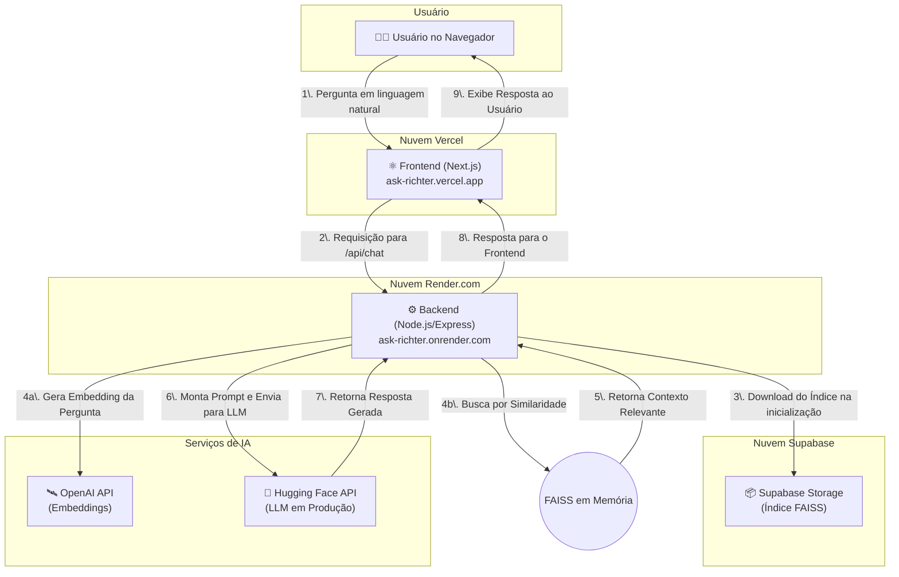

---

#### RESUMO TÉCNICO PARA EMBEDDING

Este projeto, "Ask Richter", implementa um chatbot de CV interativo utilizando uma arquitetura RAG (Retrieval-Augmented Generation) full-stack. O backend, construído com Node.js, Express.js e TypeScript, é responsável pela lógica de IA, incluindo um script para indexação de documentos de conhecimento (`.md`) em um banco de dados vetorial FAISS. Este script usa LangChain.js para carregamento (`DirectoryLoader`), fragmentação de texto (`RecursiveCharacterTextSplitter`) e geração de embeddings com o modelo `text-embedding-3-small` da OpenAI. O índice FAISS gerado é armazenado no Supabase Storage para persistência. Em tempo de execução, o backend carrega o índice em memória, realiza buscas por similaridade semântica nas perguntas do usuário e injeta o contexto relevante em prompts enviados a LLMs através da API da Hugging Face em produção ou Ollama (com modelos como Llama 3 e Mistral 7B) localmente. A API RESTful expõe endpoints para chat (`/api/chat`) e health check (`/api/health`). O frontend é uma SPA reativa construída com Next.js (App Router), React, e TypeScript, estilizada com Tailwind CSS e componentes Shadcn/ui. O gerenciamento de estado é feito com React Hooks (`useState`). A comunicação com o backend é realizada via requisições `fetch` para a API. A renderização de respostas em Markdown é tratada com `markdown-to-jsx` e `react-syntax-highlighter`. O projeto é estruturado como um monorepo gerenciado pelo Turborepo e npm Workspaces. O deploy é automatizado via CI/CD do GitHub, com o frontend na Vercel e o backend conteinerizado com Docker no Render.com, utilizando Infrastructure as Code (`render.yaml`). A segurança no Supabase é garantida por políticas de Row Level Security (RLS).

#### CLASSIFICAÇÃO DE TECNOLOGIAS E CONCEITOS

| Categoria                    | Tecnologias e Conceitos                                                                                                                                                                                                                                                                 |
| :--------------------------- | :-------------------------------------------------------------------------------------------------------------------------------------------------------------------------------------------------------------------------------------------------------------------------------------- |
| **AI & Machine Learning**    | Retrieval-Augmented Generation (RAG), FAISS, `faiss-node`, LangChain.js, OpenAI Embeddings (`text-embedding-3-small`), LLMs, Ollama, Llama 3, Mistral 7B, Hugging Face API, `DirectoryLoader`, `RecursiveCharacterTextSplitter`, Busca por Similaridade Semântica, Embeddings Vetoriais |
| **Software Development**     | Node.js, TypeScript, `tsx`, npm Workspaces, ESM (`"type": "module"`), `markdown-to-jsx`, `react-syntax-highlighter`, `dotenv`                                                                                                                                                           |
| **Architecture**             | Arquitetura Full-Stack, Monorepo, Microservices (Frontend/Backend desacoplados), RAG (Retrieval-Augmented Generation), Single Page Application (SPA)                                                                                                                                    |
| **Cloud Computing**          | Vercel, Render.com, Supabase, Supabase Storage, Hugging Face API                                                                                                                                                                                                                        |
| **API RESTFul development**  | Express.js, Node.js, Health Check Endpoint (`/api/health`)                                                                                                                                                                                                                              |
| **Frontend Development**     | Next.js (App Router), React, React Hooks (`useState`, `useEffect`), Tailwind CSS, Shadcn/ui, Lucide React, Design Responsivo                                                                                                                                                            |
| **Mobile Development**       | N/A                                                                                                                                                                                                                                                                                     |
| **Database**                 | FAISS                                                                                                                                                                                                                                                                                   |
| **Data Management**          | Chunking (Fragmentação de Texto), Indexação Vetorial, Supabase Storage, Row Level Security (RLS)                                                                                                                                                                                        |
| **Content Management - CMS** | N/A                                                                                                                                                                                                                                                                                     |
| **System Administration**    | N/A                                                                                                                                                                                                                                                                                     |
| **DevOps**                   | Turborepo, Docker, CI/CD, Vercel, Render.com, GitHub, Infrastructure as Code (`render.yaml`), Variáveis de Ambiente                                                                                                                                                                     |
| **Leadership**               | N/A                                                                                                                                                                                                                                                                                     |
| **Coaching**                 | N/A                                                                                                                                                                                                                                                                                     |
| **Agile Project Management** | N/A                                                                                                                                                                                                                                                                                     |
### 🚀 SmartShorts: SaaS de Geração de Vídeos Automatizados

#### 🎯 Visão Geral e Arquitetura da Solução

O SmartShorts nasceu para resolver um desafio central para criadores de conteúdo e agências de marketing: a produção de vídeos para redes sociais em escala. O objetivo é transformar uma simples ideia ou prompt de texto em um vídeo completo e otimizado (curto ou longo), com narração, imagens, legendas e música, de forma totalmente automatizada.

Para construir uma base sólida, escalável e de fácil manutenção, a solução foi projetada sobre os pilares da **Clean Architecture**. Esta abordagem garante que a lógica de negócio — nosso ativo mais valioso — permaneça pura e independente de frameworks e tecnologias externas. Adotamos uma estratégia de **"Monolito Modular"**, que nos oferece a velocidade de desenvolvimento de um monólito, mas com as fronteiras bem definidas dos **Contextos Delimitados (Bounded Contexts)** do DDD, como `Video Generation Core`, `User & Access Management` e `Content Sourcing`. Isso nos dá um caminho claro para evoluir para microserviços no futuro, sem a complexidade prematura.

O fluxo do sistema é orquestrado de forma assíncrona. Ao receber uma requisição, um `RenderJob` é criado e colocado em uma fila. Workers especializados consomem essa fila, interagindo com diversas APIs de IA (OpenAI para roteiros, ElevenLabs para narração, Replicate/Pixabay para imagens) para coletar os "ingredientes" do vídeo. Ao final, o FFmpeg é utilizado para montar todos os ativos em um arquivo de vídeo final, que é armazenado em um object storage (MinIO/S3) e entregue ao usuário.

#### 👨‍💻 Meu Papel no Projeto

Atuei em múltiplas frentes, combinando liderança técnica com desenvolvimento prático, principalmente como **Arquiteto de Soluções e Desenvolvedor Back-End Sênior**. Minhas principais responsabilidades incluíram:

  * **Definição da Arquitetura:** Idealizei e documentei a estrutura do sistema usando Clean Architecture e DDD-Lite, garantindo a separação de responsabilidades e a testabilidade.
  * **Liderança Técnica e Mentoria:** Estabeleci as diretrizes de desenvolvimento, como a estratégia de testes em camadas (TDD, Integração e E2E) e o guia de contribuição para o projeto.
  * **Desenvolvimento do Core:** Implementei os principais casos de uso do sistema em Java e Spring Boot, incluindo o ciclo de vida dos `RenderJobs`, a integração com APIs externas e a configuração de segurança com Spring Security e JWT.
  * **Resolução de Desafios Complexos:** Liderei a investigação e solução de problemas críticos, desde a configuração do ambiente Docker até a resolução de referências circulares e conflitos de dependência no ecossistema Spring.
  * **Cultura de Qualidade:** Fomentei a prática de TDD para o domínio e a utilização de Testcontainers para testes de integração, assegurando que o software fosse robusto e confiável desde o início.

#### ✨ Pontos Fortes e Desafios Superados

A robustez da solução é seu maior ponto forte, fundamentada em uma arquitetura limpa e uma estratégia de testes completa. A utilização do padrão **Adapter** permitiu que o core do sistema se mantivesse isolado das instabilidades de APIs externas, enquanto o uso do padrão **State** no agregado `RenderJob` garantiu a consistência do ciclo de vida da geração de vídeos.

No entanto, a jornada teve seus desafios, que se transformaram em grandes aprendizados:

  * **O desafio era a complexidade da segurança:** Ao implementar a autenticação, enfrentamos erros de `403 Forbidden` em endpoints públicos e uma paralização da aplicação por uma **Referência Circular** na configuração do Spring Security. Superamos isso centralizando toda a configuração de segurança em uma única classe (`SecurityConfig`), ajustando a ordem das regras e quebrando o ciclo de dependência ao instanciar o filtro de JWT manualmente dentro do método de configuração. Isso resultou em uma configuração de segurança mais clara, robusta e manutenível.

  * **O desafio era a "gestão do inferno de dependências":** O build falhava repetidamente devido a conflitos de versão entre Spring Boot e Spring Cloud. A vitória veio ao adotar uma abordagem metódica: pesquisamos a matriz de compatibilidade oficial do Spring, definimos as versões corretas no `pom.xml` e utilizamos o **BOM (Bill of Materials)** do Spring Cloud para que ele gerenciasse as versões transitivas. Essa lição foi formalizada no guia de contribuição do projeto.

#### 🌱 Pontos para Evolução Futura

O projeto foi desenhado para crescer. Os próximos passos naturais seriam:

1.  **Observabilidade Avançada:** Implementar a coleta centralizada de logs e métricas com o ELK Stack e Prometheus/Grafana para obter uma visão profunda da saúde e performance do sistema em produção.
2.  **Extração de Microserviços:** Com base nos Bounded Contexts já definidos, o contexto de `User & Access Management` é o principal candidato a ser extraído como um microserviço de identidade e pagamentos, conforme o sistema escala.

-----

#### 🛠️ Pilha de Tecnologias (Tech Stack)

  * **Backend:** Java 17+, Spring Boot 3+
  * **Persistência:** PostgreSQL, Redis
  * **Armazenamento de Objetos:** MinIO / S3
  * **Mensageria:** RabbitMQ (evolução do `@Async` do Spring)
  * **Segurança:** Spring Security + JWT
  * **Testes:** JUnit 5, Mockito, Testcontainers, WireMock
  * **Infraestrutura Local:** Docker + Docker Compose
  * **APIs Externas:** OpenAI, ElevenLabs, Replicate, Pixabay, YouTube API, FFmpeg
  * **Cliente MVP:** Electron

-----

#### 🗺️ Diagrama da Arquitetura

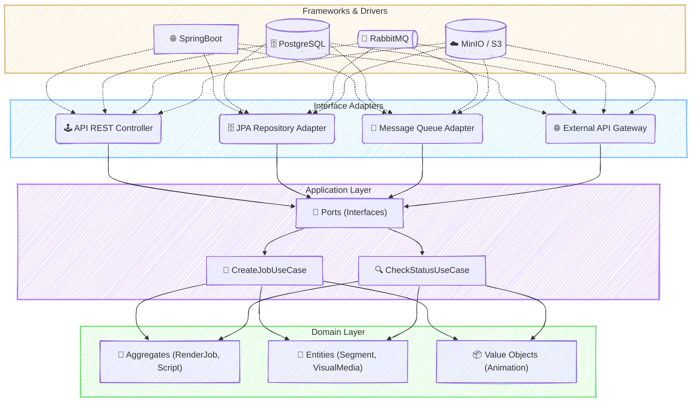
---
#### RESUMO TÉCNICO PARA EMBEDDING

Este projeto é um SaaS para geração automatizada de vídeos, construído sobre uma **Clean Architecture** e princípios de **DDD-Lite**, com uma abordagem de **Monolito Modular** projetada para evoluir para **Microservices**. O backend, desenvolvido em **Java 17+** e **Spring Boot 3+**, orquestra um fluxo assíncrono de criação de vídeo (`RenderJob`). O processo utiliza **RabbitMQ** para enfileirar tarefas que interagem com APIs externas de IA como **OpenAI** (roteiros), **ElevenLabs** (narração) e **Replicate** (imagens), com o **FFmpeg** realizando a montagem final. A persistência é gerenciada por **PostgreSQL** com **JPA/Hibernate** e o armazenamento de objetos por **MinIO/S3**. A segurança é garantida por **Spring Security** com **JWT** e RBAC. O ambiente de desenvolvimento é padronizado com **Docker** e **Docker Compose**, e a qualidade do código é assegurada por uma estratégia de testes em camadas com **TDD**, **JUnit 5**, **Mockito** e **Testcontainers** para testes de integração. Desafios técnicos críticos foram superados, incluindo a resolução de referências circulares no Spring Security, gerenciamento de dependências complexas no Maven com **BOM (Bill of Materials)**, e o mapeamento de `Value Objects` embutidos no Hibernate com `@AttributeOverrides`.

#### CLASSIFICAÇÃO DE TECNOLOGIAS E CONCEITOS

| Categoria                    | Tecnologias e Conceitos                                                                                                                                                |
| :--------------------------- | :--------------------------------------------------------------------------------------------------------------------------------------------------------------------- |
| **AI & Machine Learning**    | 🤖 OpenAI, ElevenLabs, Replicate, Whisper, Text-to-Speech (TTS), SDXL                                                                                                  |
| **Software Development**     | ☕ Java 17+, Lombok, Maven, TDD (Test-Driven Development), Design Patterns (Adapter, Strategy, Factory, Singleton, Facade, Repository, State), FFmpeg, JUnit 5, Mockito |
| **Architecture**             | 🏛️ Clean Architecture, Hexagonal (Ports & Adapters), DDD-Lite, Modular Monolith, Microservices, Bounded Contexts, State Machine, Circuit Breaker, Resilience4j        |
| **Cloud Computing**          | ☁️ AWS (RDS, S3), MinIO, Object Storage                                                                                                                                |
| **API RESTFul development**  | 🔌 Spring Web, Spring WebClient, API Contract-First, OpenAPI, Swagger, REST, JWT, RBAC, CSRF                                                                           |
| **Frontend Development**     | 💻 Electron, React, Vue                                                                                                                                                |
| **Mobile Development**       | 📱 N/A                                                                                                                                                                 |
| **Database**                 | 🗄️ PostgreSQL, Redis, JPA, Hibernate, `@AttributeOverrides`, `@Embedded`                                                                                              |
| **Data Management**          | 📨 RabbitMQ, AMQP                                                                                                                                                      |
| **Content Management - CMS** | 📝 N/A                                                                                                                                                                 |
| **System Administration**    | ⚙️ N/A                                                                                                                                                                 |
| **DevOps**                   | 🚀 Docker, Docker Compose, CI/CD, GitHub Actions, Spring Boot Actuator, Micrometer, Prometheus, Grafana, ELK Stack, Testcontainers, WireMock                           |
| **Leadership**               | 👨‍🏫 Liderança Técnica, Definição de Arquitetura                                                                                                                      |
| **Coaching**                 | 🤝 Mentoria, Criação de Guia de Contribuição                                                                                                                           |
| **Agile Project Management** | 🔄 Agile, TDD, Planejamento em Fases                                                                                                                                   |
### 🚀 SmartShorts UI: Migração Estratégica para Next.js e TypeScript

#### 🎯 Visão Geral e Arquitetura da Solução

O **SmartShorts** é um SaaS inovador projetado para a geração automatizada de vídeos, atendendo criadores de conteúdo e agências de marketing. O desafio era evoluir sua interface de uma Single Page Application (SPA) tradicional em React/Vite para uma solução mais robusta, performática e segura.

A decisão estratégica foi realizar uma migração completa para **Next.js com TypeScript**. A nova arquitetura aproveita o poder do Next.js para renderização híbrida (SSR e CSR), resultando em uma performance superior e melhor SEO. A interface permite que os usuários se autentiquem de forma segura, criem jobs de renderização de vídeo a partir de simples prompts de texto ou estruturas JSON complexas, e monitorem o status de cada job em tempo real através de um dashboard interativo.

A autenticação foi reimaginada para máxima segurança: em vez de usar `localStorage`, implementei um fluxo server-side. Os **Route Handlers** do Next.js atuam como um proxy seguro para a API de backend (Java/Spring Boot), armazenando o token JWT em um **cookie `httpOnly`**. O acesso às rotas protegidas é gerenciado de forma elegante e eficiente por um **Middleware**, que valida o token no lado do servidor antes de renderizar a página.

#### 👨‍💻 Meu Papel no Projeto

Atuei como **Arquiteto da Solução Frontend e Desenvolvedor Principal**, liderando a modernização da plataforma. Minhas responsabilidades incluíram:

  * **Planejamento e Execução:** Estruturei o plano de migração da SPA Vite/React para Next.js/TypeScript, garantindo uma transição suave e controlada.
  * **Arquitetura Frontend:** Desenhei a nova arquitetura da aplicação, focando em segurança, escalabilidade e performance, com a implementação de um fluxo de autenticação server-side.
  * **Desenvolvimento Full-Cycle:** Fui responsável por reescrever componentes, tipar toda a base de código com TypeScript, configurar o ambiente de build e testes, e integrar a UI com a API backend.
  * **Resolução de Desafios Técnicos:** Identifiquei e solucionei proativamente os desafios complexos que surgiram durante a migração, desde a configuração de ferramentas até a adaptação de paradigmas de desenvolvimento.

#### ✨ Pontos Fortes e Desafios Superados

O maior triunfo deste projeto foi transformar desafios técnicos em pontos fortes da aplicação.

  * **Do Paradigma SPA para o Server-Centric:** O desafio inicial foi adaptar o fluxo da aplicação, que era totalmente client-side, para o modelo do Next.js. Superamos isso ao redesenhar a autenticação para ser server-side, eliminando a dependência do `localStorage` e adotando cookies `httpOnly` com um middleware de proteção. O resultado é uma aplicação significativamente mais segura e alinhada com as melhores práticas modernas.
  * **Garantia de Contrato entre UI e API:** Durante a integração, enfrentei um erro `403 Forbidden` devido a uma incompatibilidade silenciosa entre o formato JSON enviado pelo frontend e o DTO esperado pela API Java. A solução foi criar uma função "tradutora" no frontend, utilizando **interfaces TypeScript específicas** para ambos os formatos de dados. Isso não apenas resolveu o problema, mas também fortaleceu a robustez do código, prevenindo erros futuros e demonstrando o poder da tipagem estática para garantir a integridade dos dados.

#### 🌱 Pontos para Evolução Futura

O projeto está em uma base sólida, mas existem caminhos claros para evolução:

1.  **Real-time Job Status:** Substituir o polling HTTP (`useJobPolling`) por uma conexão **WebSockets** para atualizações de status dos jobs em tempo real, reduzindo a latência e a carga no servidor.
2.  **Testes E2E Automatizados:** Expandir a suíte de testes com ferramentas como Playwright ou Cypress para automatizar a validação dos fluxos críticos do usuário, garantindo a estabilidade em futuras implantações.

-----

#### 🛠️ Pilha de Tecnologias (Tech Stack)

  * **Frontend:** Next.js, React, TypeScript, Tailwind CSS, Axios
  * **Backend (Contexto):** Java (17+), Spring Boot 3, PostgreSQL, Redis, MinIO (S3)
  * **Ferramentas e DevOps:** Node.js (18+), npm, Vitest, Docker

-----

#### 🗺️ Diagrama da Arquitetura

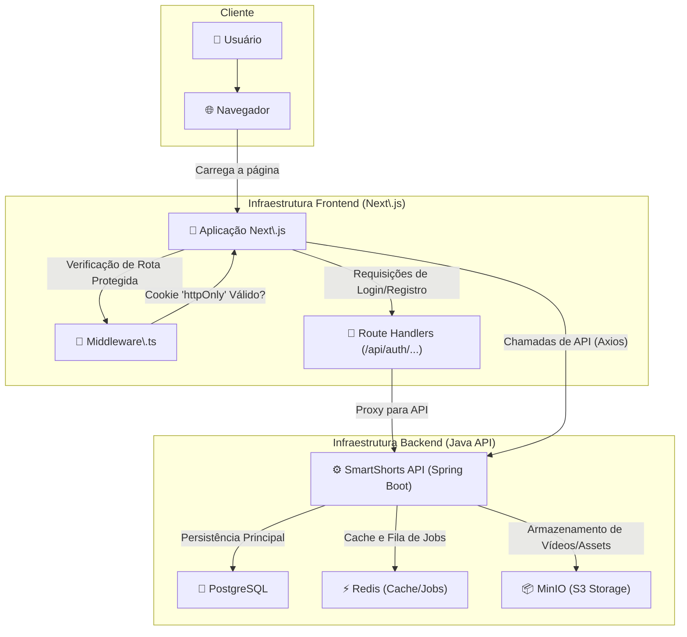

---
#### RESUMO TÉCNICO PARA EMBEDDING

O projeto consiste na migração e desenvolvimento de uma interface de usuário (UI) para um SaaS de geração de vídeo, o SmartShorts, evoluindo de uma SPA Vite/React para uma arquitetura moderna com Next.js e TypeScript. A nova implementação utiliza o App Router do Next.js, adotando um modelo de renderização híbrido (SSR e CSR). Um desafio central superado foi a re-arquitetura do fluxo de autenticação, substituindo o `localStorage` por uma solução server-side mais segura, que utiliza Route Handlers como um proxy para a API backend (Java/Spring Boot), armazena o token JWT em um cookie `httpOnly` e protege rotas com Middleware (`middleware.ts`). A migração enfrentou e solucionou problemas de incompatibilidade de versão do Tailwind CSS (v3 vs v4), configurou o ambiente de testes com Vitest e `jsdom` para a React Testing Library, e resolveu um erro `403 Forbidden` implementando uma camada de tradução de dados no frontend. Essa camada converte um payload JSON legado (formato Python) para o DTO esperado pela API Java, garantindo a type-safety através de interfaces TypeScript específicas (`OldSegment`, `OldData`). A comunicação com a API RESTful é gerenciada pelo Axios, e o estado da UI é tipado com genéricos no `useState` e em hooks customizados como `useJobPolling`.

#### CLASSIFICAÇÃO DE TECNOLOGIAS E CONCEITOS

| Categoria                    | Tecnologias e Conceitos                                                                                                                                                                                                                                    |
| :--------------------------- | :--------------------------------------------------------------------------------------------------------------------------------------------------------------------------------------------------------------------------------------------------------- |
| **AI & Machine Learning**    | N/A                                                                                                                                                                                                                                                        |
| **Software Development**     | TypeScript, JavaScript, Node.js (v18+), JSON, DTO (Data Transfer Object), `package.json`, `npm`, Git                                                                                                                                                       |
| **Architecture**             | SPA (Single Page Application), Server-Side Rendering (SSR), Client-Side Rendering (CSR), App Router (Next.js), Middleware, Proxy Pattern (via Route Handlers), JWT (JSON Web Token), `httpOnly` Cookies, Re-arquitetura de Software, Migração de Framework |
| **Cloud Computing**          | SaaS (Software as a Service)                                                                                                                                                                                                                               |
| **API RESTFul development**  | API Consumption, Axios, Route Handlers (Next.js), `POST`, `GET`, `Request`, `NextResponse`, `403 Forbidden`                                                                                                                                                |
| **Frontend Development**     | Next.js, React, TypeScript, Tailwind CSS, Vite, Hooks (`useState`, Custom Hooks), `react-router-dom`, React Testing Library, Vitest, `jsdom`, `npx create-next-app`, PostCSS, `autoprefixer`                                                               |
| **Mobile Development**       | N/A                                                                                                                                                                                                                                                        |
| **Database**                 | N/A                                                                                                                                                                                                                                                        |
| **Data Management**          | Type Safety, Data Validation, Data Mapping/Translation, Interfaces (TypeScript)                                                                                                                                                                            |
| **Content Management - CMS** | N/A                                                                                                                                                                                                                                                        |
| **System Administration**    | NVM (Node Version Manager)                                                                                                                                                                                                                                 |
| **DevOps**                   | Build Process, Dependency Management, Test Scripts (`vitest`)                                                                                                                                                                                              |
| **Leadership**               | N/A                                                                                                                                                                                                                                                        |
| **Coaching**                 | N/A                                                                                                                                                                                                                                                        |
| **Agile Project Management** | Post-mortem, Migration Plan (Fases 0-4)                                                                                                                                                                                                                    |
### 🚀 Fábrica de Vídeos Automatizada para YouTube

#### 🎯 Visão Geral e Arquitetura da Solução

Em um cenário onde a criação de conteúdo em vídeo é um processo manual, demorado e caro, este projeto surge como uma solução de automação de ponta a ponta. O objetivo é uma "Fábrica de Vídeos" completa, capaz de gerar conteúdo para o YouTube, tanto em formato curto quanto longo, com intervenção humana mínima.

A arquitetura foi desenhada como um orquestrador em Python que segue um pipeline robusto e flexível:

1.  **Ingestão de Conteúdo**: O fluxo inicia com a leitura de um roteiro ou frase de um banco de dados central em formato `content.json`. Este arquivo gerencia o ciclo de vida de cada vídeo, desde "Pendente" até "Publicado".
2.  **Geração de Mídia**: O sistema se conecta a um ecossistema de APIs e modelos locais para criar os componentes do vídeo. A narração é gerada com vozes de alta qualidade via **ElevenLabs API** ou uma instância local de **Coqui TTS** para personalização total. O visual é criado por modelos de IA como **SDXL (via Replicate)** ou buscado em bancos de imagem como **Pixabay** para maior flexibilidade de custo. Uma trilha sonora é automaticamente adicionada através da **API do Jamendo**.
3.  **Montagem e Finalização**: Com todos os recursos prontos, as legendas são geradas com precisão por uma instância local do **OpenAI Whisper**. A montagem final é orquestrada pelo **FFmpeg**, que combina imagem, narração, música de fundo e legendas, aplicando animações dinâmicas.
4.  **Publicação**: Opcionalmente, o vídeo finalizado é enviado diretamente para o YouTube através da API oficial, completando o ciclo de automação.

Adicionalmente, o projeto expõe suas funcionalidades de geração de mídia através de uma **API REST com Flask**, permitindo que outros sistemas solicitem a criação de narrações ou legendas como um microserviço desacoplado.

#### 👨‍💻 Meu Papel no Projeto

Como **Arquiteto de Soluções e Desenvolvedor Principal**, minhas responsabilidades foram abrangentes, cobrindo todo o ciclo de vida do projeto:

  * **Desenvolvimento End-to-End**: Projetei e implementei o fluxo de automação completo, desde a concepção da ideia até a publicação final no YouTube.
  * **Arquitetura de Software**: Defini a arquitetura modular baseada em "passos" e "utilitários", garantindo a manutenibilidade e escalabilidade do sistema. Criei um gerenciador de conteúdo central (`ContentManager`) para abstrair o acesso aos dados e estruturei o projeto para suportar múltiplos provedores de IA.
  * **Resolução de Desafios Técnicos Complexos**: Investiguei e solucionei problemas críticos de baixo nível, como instabilidade em motores de TTS, e artefatos visuais (tremor e centralização) em vídeos renderizados com FFmpeg.
  * **Integração de APIs**: Orquestrei a integração de diversas APIs externas e modelos locais, incluindo OpenAI, ElevenLabs, Coqui TTS, Replicate, Pixabay, Jamendo e YouTube.
  * **Desenvolvimento de API**: Construí um microserviço com Flask para expor a lógica de geração de mídia, desacoplando as funcionalidades de IA para serem reutilizadas por outras aplicações.
  * **Qualidade e Documentação**: Estabeleci padrões de código, criei testes automatizados com Pytest e documentei extensivamente o projeto, incluindo guias de contribuição e planos de implementação detalhados.

#### ✨ Pontos Fortes e Desafios Superados

A força deste projeto reside em sua **flexibilidade e robustez**. A capacidade de alternar entre provedores de IA (ex: Replicate vs. Pixabay, ElevenLabs vs. Coqui TTS) permite um controle fino sobre custos e qualidade. A arquitetura modular e a API de microserviço tornam o sistema não apenas uma ferramenta, mas uma plataforma de geração de mídia.

Durante o desenvolvimento, enfrentei desafios técnicos significativos que foram transformados em vitórias de engenharia:

  * **Desafio 1: Tremor (Judder) na Animação de Vídeo:** O uso inicial do filtro `zoompan` do FFmpeg causava um tremor visual irritante nas animações.

      * **Superação:** Após uma investigação metódica documentada no plano de ação, a solução foi refatorar a montagem de vídeo em um **processo de duas etapas**. Primeiro, um clipe de vídeo mudo e perfeitamente estável é renderizado usando a combinação dos filtros `scale` e `crop`. Somente depois, em uma segunda etapa, o áudio e as legendas são mesclados (mux). Isso isolou a complexidade da animação da sincronização de áudio, eliminando completamente o tremor.

  * **Desafio 2: Falha na Centralização da Animação:** O efeito de zoom e panorâmica estava sempre se deslocando para o canto superior esquerdo da imagem, em vez de focar no centro.

      * **Superação:** O problema foi diagnosticado como uma falha do FFmpeg em avaliar dinamicamente as coordenadas de corte. A solução foi implementar uma **fórmula de centralização robusta** (`x='(iw-out_w)/2'`) que utiliza variáveis explícitas de saída. Essa lógica foi encapsulada em uma classe `MovementFilterGenerator` para garantir que todas as animações fossem consistentes e fáceis de manter.

  * **Desafio 3: Instabilidade do Motor TTS Local:** A integração com o Coqui TTS apresentava falhas de compatibilidade com suas dependências (especialmente a biblioteca `transformers`), resultando em travamentos.

      * [cite\_start]**Superação:** A estabilidade foi alcançada ao **travar a versão da biblioteca `transformers`** para uma versão anterior e comprovadamente compatível (`4.36.2`). [cite: 1] Além disso, o processo foi otimizado para gerar o áudio em memória (com NumPy) e carregá-lo diretamente no `pydub`, evitando um deadlock de I/O no disco que causava o travamento do script.

- **Desafio 4: Flexibilidade de Provedores (Plug-and-Play)**: Você não apenas integrou serviços, mas criou uma arquitetura que permite escolher entre diferentes provedores para a mesma função. Isso é um diferencial imenso.
	  * **Síntese de Voz**: Mencione que o sistema suporta tanto a **API da ElevenLabs (nuvem)** quanto uma instância local de **Coqui TTS**, permitindo alternar entre uma solução gerenciada e uma solução offline com clonagem de voz personalizada.
	  * **Geração Visual**: Destaque que, além da **Replicate API (SDXL)**, você integrou a **Pixabay API** como uma alternativa gratuita, oferecendo controle de custos e resiliência.
	  * **Trilha Sonora**: Adicione a integração com a **Jamendo API** para buscar e adicionar música de fundo automaticamente, resolvendo a questão dos direitos autorais de forma programática.

- **Desafio 5: API como Microserviço (Reutilização)**: Um dos pontos mais fortes do seu projeto é a API Flask. Isso transforma a solução de um simples script para uma plataforma reutilizável.

    * Adicione um parágrafo mencionando que o projeto também expõe suas capacidades de IA (geração de áudio, legendas e montagem de vídeo) através de uma **API REST com Flask**. Isso demonstra sua habilidade de pensar em termos de serviços desacoplados e reutilizáveis, permitindo que qualquer outra aplicação consuma essas funcionalidades.

- **Desafio 6: Evolução da Arquitetura (Refatoração Estratégica)**: O texto atual menciona os gerenciadores `frases_manager.py` e `reflexao_manager.py`. No entanto, os planos de migração mostram que você evoluiu o projeto.

    * Mencione a refatoração que unificou múltiplos arquivos (`frases.json`, `reflexao.json`) em um único `content.json` gerenciado por um `ContentManager` centralizado. Isso demonstra sua capacidade de identificar débitos técnicos e melhorar a manutenibilidade e a coesão do sistema ao longo do tempo.

#### **4. Resultados e Impacto Quantificável**

  * **Redução Drástica do Tempo de Produção**: Automatizou um processo que levaria de **2 a 3 horas** de trabalho manual por vídeo para menos de **5 minutos** de processamento autônomo.
  * **Escalabilidade de Conteúdo**: Capacitou a produção e agendamento de dezenas de vídeos em lote, permitindo uma frequência de publicação diária que seria insustentável manualmente. O projeto inclui scripts para agendamento automático no macOS (`launchd`).
  * **Otimização de Custos**: A implementação de provedores alternativos e gratuitos (Coqui TTS, Pixabay) e a otimização de chamadas de API reduziram significativamente os custos operacionais de geração de conteúdo.

#### 🌱 Pontos para Evolução Futura

Apesar de sua automação completa, o projeto tem potencial para crescer ainda mais:

1.  **Interface de Gerenciamento Web**: Desenvolver uma interface de usuário simples (com Flask ou FastAPI) para gerenciar o `content.json`, permitindo adicionar, editar e agendar vídeos sem interagir diretamente com o arquivo JSON.
2.  **Expansão para Outras Plataformas**: Adaptar o formato de saída do vídeo (ex: 1:1 para Instagram, 16:9 padrão) e criar módulos de upload para outras plataformas como Instagram Reels ou TikTok.

-----

#### 🛠️ Pilha de Tecnologias (Tech Stack)

| Componente                   | Tecnologia Utilizada                          | Papel na Arquitetura                                                                                                                                                                                                    |
| :--------------------------- | :-------------------------------------------- | :---------------------------------------------------------------------------------------------------------------------------------------------------------------------------------------------------------------------- |
| **Backend e Orquestração**   | **Python**, **Flask**                         | Linguagem principal do projeto e framework para a API de microserviço.                                                                                                                                                  |
| **Geração de Conteúdo e IA** | **OpenAI API (GPT)**, **Replicate (SDXL)**    | Geração de roteiros e imagens de fundo a partir de prompts.                                                                                                                                                             |
| **Síntese de Voz (TTS)**     | **ElevenLabs API**, **Coqui TTS**             | Converte texto em narração de áudio, oferecendo opções de nuvem ou local.                                                                                                                                               |
| **Transcrição e Legendas**   | **OpenAI Whisper (Local)**                    | Gera legendas com timestamps precisos a partir do áudio da narração.                                                                                                                                                    |
| **Mídia e Recursos**         | **Pixabay API**, **Jamendo API**              | Fontes alternativas e gratuitas para imagens de fundo e trilhas sonoras.                                                                                                                                                |
| **Manipulação de Mídia**     | **FFmpeg**, **Pydub**, **Pillow**, **OpenCV** | Ferramentas essenciais para montagem de vídeo, manipulação de áudio e processamento de imagem.                                                                                                                          |
| **Automação Web**            | **Playwright**, **Selenium**                  | Utilizados para automação de navegador em scripts de coleta de dados ou imagens.                                                                                                                                        |
| **Testes e Ambiente**        | **Pytest**, **python-dotenv**                 | Framework de testes para garantir a qualidade do código e gerenciamento de variáveis de ambiente.                                                                                                                       |
| **Publicação**               | **YouTube Data API v3**                       | Conclui o fluxo fazendo o upload do vídeo finalizado para um canal específico, incluindo metadados (título, descrição, tags) gerenciados programaticamente.                                                             |

-----

#### 🗺️ Diagrama da Arquitetura

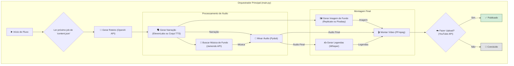

#### Diagrama da API

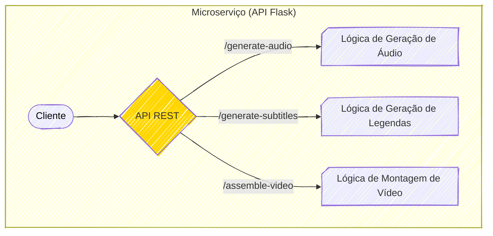

#### Fluxo da geração de vídeo

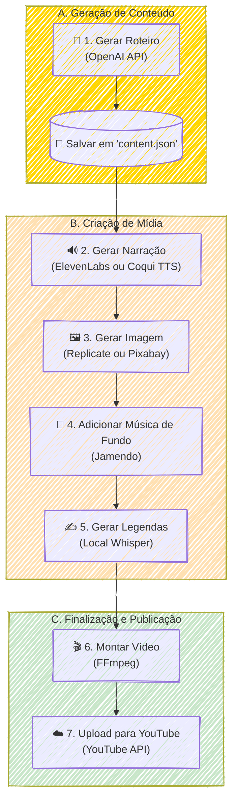

---

#### RESUMO TÉCNICO PARA EMBEDDING

Este projeto é uma fábrica de automação de vídeo end-to-end desenvolvida em Python, orquestrando um pipeline que abrange desde a ingestão de conteúdo via `content.json` até a publicação no YouTube. A arquitetura modular suporta múltiplos provedores de IA em um modelo plug-and-play, utilizando ElevenLabs API ou Coqui TTS local para síntese de voz, e Replicate (SDXL) ou Pixabay API para geração de imagens. A solução supera desafios técnicos complexos de manipulação de mídia, como a eliminação de tremor (judder) em animações FFmpeg através de um processo de renderização estável em duas etapas com filtros `scale`/`crop`, e a correção de centralização com fórmulas de coordenadas robustas (`(iw-out_w)/2`). A estabilidade do motor Coqui TTS foi alcançada travando a versão da biblioteca `transformers` (`4.36.2`) e otimizando o processamento de áudio em memória com NumPy e Pydub para evitar deadlocks de I/O. O sistema também inclui transcrição de áudio via OpenAI Whisper local, adição de trilha sonora pela Jamendo API, e expõe suas funcionalidades de IA como um microserviço desacoplado através de uma API RESTful construída com Flask. A gestão de configuração é feita via `python-dotenv` e testes automatizados com Pytest garantem a qualidade do código.

#### CLASSIFICAÇÃO DE TECNOLOGIAS E CONCEITOS

| Categoria                    | Tecnologias e Conceitos                                                                                                                                                            |
| :--------------------------- | :--------------------------------------------------------------------------------------------------------------------------------------------------------------------------------- |
| **AI & Machine Learning**    | 🧠 OpenAI API (GPT), Replicate (SDXL), Coqui TTS, OpenAI Whisper, `transformers`, NumPy                                                                                            |
| **Software Development**     | 💻 Python, `subprocess`, Pydub, Pillow, OpenCV, `python-dotenv`, Pytest, SOLID, Clean Code                                                                                         |
| **Architecture**             | 🏛️ Arquitetura Modular, Microserviços, Plug-and-Play (Provedores de IA), `ContentManager` (Repositório Central), Renderização em Duas Etapas, `MovementFilterGenerator` (Factory) |
| **Cloud Computing**          | ☁️ ElevenLabs API, Replicate API, Pixabay API, Jamendo API, YouTube Data API v3, OpenAI API                                                                                        |
| **API RESTFul development**  | 🌐 Flask, Integração de APIs REST                                                                                                                                                  |
| **Frontend Development**     | N/A                                                                                                                                                                                |
| **Mobile Development**       | N/A                                                                                                                                                                                |
| **Database**                 | 🗄️ JSON (utilizado como banco de dados de arquivos)                                                                                                                               |
| **Data Management**          | 📊 `ContentManager` (Abstração de Dados), Gerenciamento de JSON                                                                                                                    |
| **Content Management - CMS** | N/A                                                                                                                                                                                |
| **System Administration**    | ⚙️ `launchd` (Agendamento de tarefas no macOS)                                                                                                                                     |
| **DevOps**                   | 🚀 Gerenciamento de Ambiente (venv), Gerenciamento de Dependências (`requirements.txt`), Testes Automatizados (Pytest), Agendamento de Publicação                                  |
| **Leadership**               | 👨‍🏫 Arquiteto de Soluções, Desenvolvedor Principal, Documentação Técnica                                                                                                         |
| **Coaching**                 | N/A                                                                                                                                                                                |
| **Agile Project Management** | 🔄 Desenvolvimento Incremental, Refatoração Estratégica, Resolução de Débito Técnico                                                                                               |

---
### Documentos
Aqui está uma descrição de cada arquivo:

#### 📄 `README.md`
Este é o documento principal do projeto, a "Fábrica de vídeos automatizada". Ele descreve de forma completa o sistema, que automatiza a criação e publicação de vídeos curtos e longos para o YouTube. O `README` detalha:
* **Tecnologias Usadas**: Python, ElevenLabs, Coqui TTS, Replicate, Pixabay, Jamendo, Whisper, FFmpeg e a API do YouTube.
* **Fluxo de Trabalho**: Desde a geração do roteiro até o upload do vídeo finalizado.
* **Estrutura de Pastas**: Uma visão geral da organização modular do código.
* **Integrações**: Explica o papel de cada ferramenta e API no processo.
* **Microserviço API**: Detalha uma API REST (com Flask) que expõe funcionalidades como geração de áudio e legendas para outras aplicações.
* **Instruções de Uso**: Como configurar o ambiente, instalar dependências, usar as chaves de API e executar o projeto com diferentes argumentos de linha de comando.
* **Diagramas**: Inclui um fluxograma e um diagrama de sequência para ilustrar o processo.

#### 🧠 `CONTRIBUTING.md`
Este é o guia de contribuição e padrões de código. É um documento essencial para garantir a qualidade e a manutenibilidade do projeto. Ele estabelece regras rígidas sobre:
* **Ambiente de Desenvolvimento**: Exige Python 3.11/3.12 e um ambiente virtual (`venv`).
* **Segurança**: Proíbe o uso de chaves de API diretamente no código, exigindo o uso de arquivos `.env`.
* **Modularidade e Clean Code**: Define o Princípio da Responsabilidade Única, com exemplos de código certo e errado.
* **Robustez**: Como lidar com processos externos (como FFmpeg) de forma segura usando `subprocess`.
* **Testes e Debugging**: Enfatiza a importância de testes incrementais e sistemáticos.
* **Proibições**: Lista práticas estritamente proibidas para manter a consistência.

#### 📝 `plano-de-migracao-content-json.md`
Este arquivo detalha um plano de refatoração para centralizar a gestão de conteúdo. O objetivo é substituir dois arquivos (`frases.json` e `reflexao.json`) por um único `content.json` com uma estrutura de dados padronizada. O plano é dividido em etapas claras:
1.  Criação de um novo módulo `ContentManager`.
2.  Refatoração do script principal (`main.py`) para usar o novo gerenciador.
3.  Atualização de todos os scripts dependentes.
4.  Limpeza de arquivos antigos e atualização da documentação.

#### 🎶 `plano-de-implementacao-bg-musical.md`
Este documento descreve o plano para adicionar trilhas sonoras aos vídeos. A estratégia é integrar a API do **Jamendo** para buscar e baixar músicas livres de direitos autorais. O plano inclui:
* **Configuração Inicial**: Adicionar chaves de API ao `.env` e criar um módulo `music_manager.py`.
* **Integração com a API**: Funções para buscar e baixar as faixas.
* **Lógica de Mesclagem**: Como usar a biblioteca `pydub` para combinar a narração com a música de fundo.
* **Testes e Documentação**: Etapas para validar a funcionalidade e atualizar o `README.md`.

#### 🖼️ `plano-de-integracao-pixabay-imagens.md`
Este é um plano para integrar o **Pixabay** como uma fonte alternativa e gratuita para as imagens de fundo dos vídeos, complementando o gerador de IA (Replicate/SDXL). O plano cobre:
* Implementação da função de busca e download de imagens via API do Pixabay.
* Adição de controle via arquivo `.env` e argumentos de linha de comando.
* Criação de testes automatizados.
* Atualização da documentação para refletir a nova opção.

#### 🔧 `video_ajuste.md`
Este é um plano de ação técnico para corrigir um problema de "tremor" (judder) nas animações dos vídeos. É um exemplo excelente de debugging sistemático, detalhando:
* **Estratégia de Teste**: Isolar cada tentativa de solução e reverter o código antes de tentar a próxima.
* **Fases de Implementação**: Desde o diagnóstico até a validação, testando múltiplas soluções com FFmpeg, como renderização em duas etapas, uso do filtro `setpts`, e a troca do instável `zoompan` pela combinação estável de `scale`/`crop`.

#### 🎯 `video_centralizar.md`
Similar ao plano de ajuste, este documento foca em resolver um problema específico: o movimento de zoom e panorâmica não estava centralizado na imagem. O plano segue uma estrutura de fases:
* **Diagnóstico**: Adicionar logs para inspecionar variáveis e dimensões.
* **Correção Rápida**: Forçar um movimento central para uma solução imediata.
* **Solução Robusta**: Refatorar o código para uma classe `MovementFilterGenerator`, tornando-o mais limpo e centralizado.
* **Testes e Validação**: Inclui a criação de um script de teste visual com uma imagem de referência para validar a centralização de forma precisa.

#### 🔊 `Audio Gen - Fix Plan.md` e `Fix-Plan-TTS.md`
Estes dois documentos abordam problemas de instabilidade com a biblioteca de geração de áudio **Coqui TTS**.
* **`Fix-Plan-TTS.md`**: Diagnostica um erro de validação que impedia o uso da língua portuguesa (`pt`). A solução proposta é aplicar um "patch" no código da biblioteca em tempo de execução para permitir o idioma.
* **`Audio Gen - Fix Plan.md`**: Resolve um problema mais profundo de compatibilidade entre as bibliotecas `TTS` e `transformers`. A solução definitiva encontrada foi travar as versões das bibliotecas no arquivo `requirements.txt`. Além disso, o documento diagnostica e corrige um "deadlock" (travamento) que ocorria ao manipular o áudio, otimizando o processo para ser executado totalmente em memória, o que é mais rápido e seguro.

Em resumo, os arquivos mostram um projeto de automação maduro, com documentação robusta, planejamento cuidadoso de novas funcionalidades e uma abordagem metódica e profissional para a resolução de problemas técnicos.

### 🚀 Cache Semântico de Alta Performance para Otimização de LLMs (PoC)

#### 🎯 Visão Geral e Arquitetura da Solução

Em um cenário onde a eficiência e a velocidade das interações com Grandes Modelos de Linguagem (LLMs) são cruciais, este projeto nasceu como uma Prova de Conceito (PoC) para um desafio claro: como reduzir a latência e os custos operacionais sem sacrificar a qualidade das respostas? A solução foi arquitetar um sistema de cache semântico de alta performance, projetado para operar de forma 100% local, garantindo privacidade total dos dados e eliminando dependências de APIs externas.

A arquitetura funciona de maneira elegante: ao receber uma pergunta, o sistema utiliza o **Ollama** para gerar localmente um vetor de embedding, que é uma representação numérica do significado daquela pergunta. Em seguida, esse vetor é usado para consultar um índice **FAISS** em memória, que realiza uma busca por similaridade em velocidade quasi-instantânea. Se uma pergunta semanticamente equivalente é encontrada acima de um limiar de confiança (um "Cache Hit"), a resposta armazenada é devolvida imediatamente. Caso contrário (um "Cache Miss"), a requisição prossegue para o LLM, e a nova resposta é então adicionada ao cache, enriquecendo o sistema para futuras interações.

#### 👨‍💻 Meu Papel no Projeto

Como idealizador e desenvolvedor principal desta Prova de Conceito, minhas responsabilidades foram:

  * **Arquitetura da Solução:** Desenhar o fluxo completo do sistema, desde a entrada do prompt até a decisão de hit/miss do cache.
  * **Implementação do Core:** Desenvolver a lógica central em Python, integrando as bibliotecas para busca vetorial e geração de embeddings.
  * **Integração de Tecnologias:** Orquestrar a comunicação entre o **Ollama** para a vetorização local e o **FAISS** para a busca por similaridade, garantindo uma operação coesa e performática.
  * **Validação e Performance:** Executar testes para validar a eficácia da PoC, comprovando a redução drástica na latência para perguntas recorrentes e o impacto positivo na otimização de recursos.

#### ✨ Pontos Fortes e Desafios Superados

O maior ponto forte desta solução é sua **autonomia e eficiência**. O principal desafio era construir um sistema de cache inteligente que não dependesse de serviços de terceiros para a geração de embeddings, que geralmente representam um gargalo de custo e privacidade.

A superação veio através da combinação estratégica de tecnologias de ponta:

  * **FAISS (Facebook AI Similarity Search):** Garantiu que a busca por similaridade, o coração do cache, fosse realizada em milissegundos, diretamente na memória.
  * **Ollama:** Permitiu a geração de embeddings de alta qualidade de forma totalmente local e gratuita, eliminando chamadas de API externas e assegurando que os dados nunca saíssem do ambiente de execução.

O resultado foi uma PoC que não apenas validou uma tese, mas demonstrou um caminho viável para otimizar sistemas de IA de forma significativa, melhorando a experiência do usuário e a sustentabilidade financeira da operação.

#### 🌱 Pontos para Evolução Futura

Para evoluir esta PoC para um sistema em produção, os próximos passos poderiam incluir a implementação de uma camada de persistência para o índice vetorial (ex: usando um banco de dados vetorial como Milvus ou Weaviate) e a criação de uma API robusta para servir o cache a múltiplas aplicações.

-----

#### 🛠️ Pilha de Tecnologias (Tech Stack)

| Componente | Tecnologia Utilizada | Papel na Arquitetura |
| :--- | :--- | :--- |
| **Linguagem Principal** | **Python** | Orquestra todo o fluxo de dados e a lógica de cache (Hit/Miss). |
| **Busca por Similaridade** | **FAISS** | Cria e gerencia um índice vetorial em memória para buscas semânticas de altíssima velocidade. |
| **Geração de Embeddings** | **Ollama** | Gera os vetores (embeddings) das perguntas de forma 100% local, garantindo privacidade e custo zero. |
| **Computação Numérica** | **NumPy** | Fornece a base para manipulação eficiente de vetores e matrizes, essencial para o FAISS. |

-----

#### 🗺️ Diagrama da Arquitetura

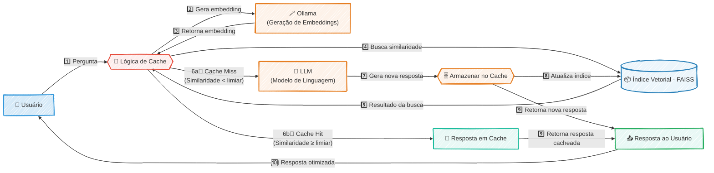

---
#### RESUMO TÉCNICO PARA EMBEDDING

Este projeto é uma Prova de Conceito (PoC) de um cache semântico de alta performance para otimização de Grandes Modelos de Linguagem (LLMs), focado em redução de latência e custos. A arquitetura, implementada em Python, opera de forma 100% local para garantir privacidade. O fluxo consiste em receber uma query, gerar um vetor de embedding localmente com Ollama e realizar uma busca por similaridade em um índice vetorial em memória gerenciado por FAISS. A lógica de "Cache Hit" retorna uma resposta pré-existente se a similaridade ultrapassa um limiar, enquanto um "Cache Miss" encaminha a requisição ao LLM, e a nova resposta é vetorizada e adicionada ao índice FAISS. A solução utiliza NumPy para computação numérica e valida a eficácia na otimização de recursos e na melhoria da experiência do usuário, superando o desafio de criar um sistema autônomo sem dependência de APIs externas de embedding.

#### CLASSIFICAÇÃO DE TECNOLOGIAS E CONCEITOS

| Categoria                    | Tecnologias e Conceitos                                                                                                                                              |
| :--------------------------- | :------------------------------------------------------------------------------------------------------------------------------------------------------------------- |
| **AI & Machine Learning**    | Cache Semântico, LLMs (Grandes Modelos de Linguagem), Vetor de Embedding, Busca por Similaridade, FAISS (Facebook AI Similarity Search), Ollama, Limiar de Confiança |
| **Software Development**     | Python, NumPy                                                                                                                                                        |
| **Architecture**             | Prova de Conceito (PoC), Sistema de Cache, Cache Hit/Miss, Arquitetura Local, Otimização de Performance, Redução de Latência, Índice em Memória                      |
| **Cloud Computing**          | N/A                                                                                                                                                                  |
| **API RESTFul development**  | N/A                                                                                                                                                                  |
| **Frontend Development**     | N/A                                                                                                                                                                  |
| **Mobile Development**       | N/A                                                                                                                                                                  |
| **Database**                 | N/A                                                                                                                                                                  |
| **Data Management**          | Índice Vetorial                                                                                                                                                      |
| **Content Management - CMS** | N/A                                                                                                                                                                  |
| **System Administration**    | N/A                                                                                                                                                                  |
| **DevOps**                   | N/A                                                                                                                                                                  |
| **Leadership**               | Idealizador, Desenvolvedor Principal                                                                                                                                 |
| **Coaching**                 | N/A                                                                                                                                                                  |
| **Agile Project Management** | Prova de Conceito (PoC)                                                                                                                                              |

### 🚀 Telegram Course Tools

##### 🎯 Visão Geral e Arquitetura da Solução

Em um cenário onde o Telegram se tornou um vasto repositório de conhecimento, o projeto **Telegram Course Tools** emerge como uma solução estratégica para um desafio comum: a desorganização. A plataforma, embora excelente para comunicação, não foi projetada para e-learning, transformando o acompanhamento de múltiplos cursos em uma tarefa frustrante.

Para resolver isso, projetei uma suíte de automação modular em Python, que transforma coleções dispersas de mensagens em uma biblioteca de aprendizado pessoal, organizada e pronta para consumo. A arquitetura foi pensada em um fluxo de trabalho de três etapas independentes e sequenciais, garantindo clareza e manutenibilidade:

1.  **Descoberta e Mapeamento (`listarGrupos.py`):** A primeira etapa atua como um radar, conectando-se à API do Telegram para catalogar todos os cursos em que o usuário está inscrito. O resultado é um "mapa" em formato JSON (`cursos-telegram.json`), que serve como a fonte da verdade para o restante do processo.
2.  **Indexação e Estruturação (`listarVideos.py`):** O coração da solução. Este módulo consome o mapa gerado e, para cada curso, extrai meticulosamente o histórico de mensagens. Usando expressões regulares para identificar padrões como "Módulo" e "Aula", ele estrutura o conteúdo bruto e o converte em sumários elegantes em formato Markdown, um para cada curso.
3.  **Consumo e Download (`downloadVideosById.py`):** Com os sumários em mãos, o usuário pode tomar decisões estratégicas sobre o que estudar. Esta etapa final permite o download sob demanda de todo o conteúdo de vídeo de um curso específico, de forma otimizada para evitar duplicatas e com uma barra de progresso (`tqdm`) para uma experiência de usuário aprimorada.

O resultado final é o empoderamento do usuário, que agora possui uma biblioteca de aprendizado curada, acessível e pronta para consumo offline.

#### 👨‍💻 Meu Papel no Projeto

Como idealizador e único desenvolvedor deste projeto, minhas responsabilidades abrangeram todo o ciclo de vida da solução:

  * **Arquiteto da Solução:** Defini a arquitetura modular em três etapas, garantindo que cada componente tivesse uma responsabilidade única e que o fluxo de dados entre eles fosse limpo e eficiente.
  * **Desenvolvedor Python:** Escrevi todo o código para os scripts de automação, desde a interação com a API do Telegram usando a biblioteca `Telethon` até a lógica de parsing com expressões regulares e a manipulação do sistema de arquivos.
  * **Engenheiro de Dados (em pequena escala):** Modelei o fluxo de dados, definindo como as informações seriam extraídas (dados brutos), armazenadas temporariamente (JSON) e transformadas em um produto final de valor (sumários em Markdown).
  * **Product Owner:** Identifiquei a dor inicial (minha própria necessidade), defini os objetivos e requisitos do projeto e validei que a solução final atendia efetivamente ao problema proposto.

#### ✨ Pontos Fortes e Desafios Superados

A principal força do projeto reside em sua capacidade de **transformar caos em clareza**. O maior desafio era lidar com conteúdo valioso, porém totalmente não estruturado, dentro do Telegram.

  * **Superação do Caos com Inteligência de Parsing:** O ponto de virada técnico foi a implementação de uma lógica de parsing robusta com expressões regulares (`re`). Essa "inteligência" permitiu que o script `listarVideos.py` lesse textos de formato livre e os organizasse em uma hierarquia lógica de módulos e aulas, criando os sumários que são o principal entregável de valor do projeto.
  * **Eficiência e Experiência do Usuário:** Em vez de uma abordagem simplista, o script de download foi projetado para ser eficiente. Ele verifica a existência e o tamanho dos arquivos antes de iniciar o download, economizando tempo e banda. A inclusão da biblioteca `tqdm` foi uma decisão consciente para melhorar a experiência do usuário em processos demorados, fornecendo feedback visual claro e profissional.
  * **Arquitetura Modular:** A separação em três scripts distintos não só organiza o código, mas também permite a execução seletiva. O usuário pode apenas atualizar o mapa de cursos ou re-gerar um sumário sem precisar executar o fluxo completo, tornando a ferramenta flexível e ágil.

#### 🌱 Pontos para Evolução Futura

Embora a solução seja totalmente funcional para seu propósito inicial, existem caminhos claros para evolução:

1.  **Interface Gráfica (UI):** Desenvolver uma interface de usuário simples (Web com Flask/Streamlit ou Desktop com PyQt) para eliminar a necessidade de executar scripts manualmente via terminal, tornando a ferramenta acessível a um público menos técnico.
2.  **Busca Avançada:** Implementar uma funcionalidade de busca que permita ao usuário pesquisar por palavras-chave em todos os sumários gerados, ajudando a encontrar aulas específicas sobre um determinado tópico em toda a sua biblioteca de cursos.

-----

#### 🛠️ Pilha de Tecnologias (Tech Stack)

| Componente | Tecnologia Utilizada | Papel na Arquitetura |
| :--- | :--- | :--- |
| **Linguagem Principal** | **Python 3.8+** | A base para toda a automação, orquestrando a lógica, a interação com APIs e a manipulação de arquivos. |
| **Comunicação com API** | **Telethon** | Cliente assíncrono para interagir com a API do Telegram, permitindo buscar históricos e baixar mídias de forma robusta. |
| **Interface de Usuário (CLI)** | **tqdm** | Fornece feedback visual com barras de progresso durante os downloads, melhorando significativamente a experiência do usuário. |
| **Estruturação de Conteúdo** | **`re` (Expressões Regulares)** | O motor de inteligência para identificar padrões em texto não-estruturado e organizar as aulas em módulos nos sumários. |
| **Manipulação de Dados** | **`json`** | Utilizado como o formato de intercâmbio de dados entre a etapa de mapeamento e a de indexação, garantindo um "contrato" claro. |
| **Gestão do Sistema** | **`os`** | Essencial para interações com o sistema de arquivos, como criar diretórios para os cursos e verificar a existência de vídeos. |
| **Programação Assíncrona** | **`asyncio`** | Usado implicitamente pelo Telethon para otimizar a comunicação de rede com a API do Telegram, tornando as operações mais rápidas. |

-----

#### 🗺️ Diagrama da Arquitetura

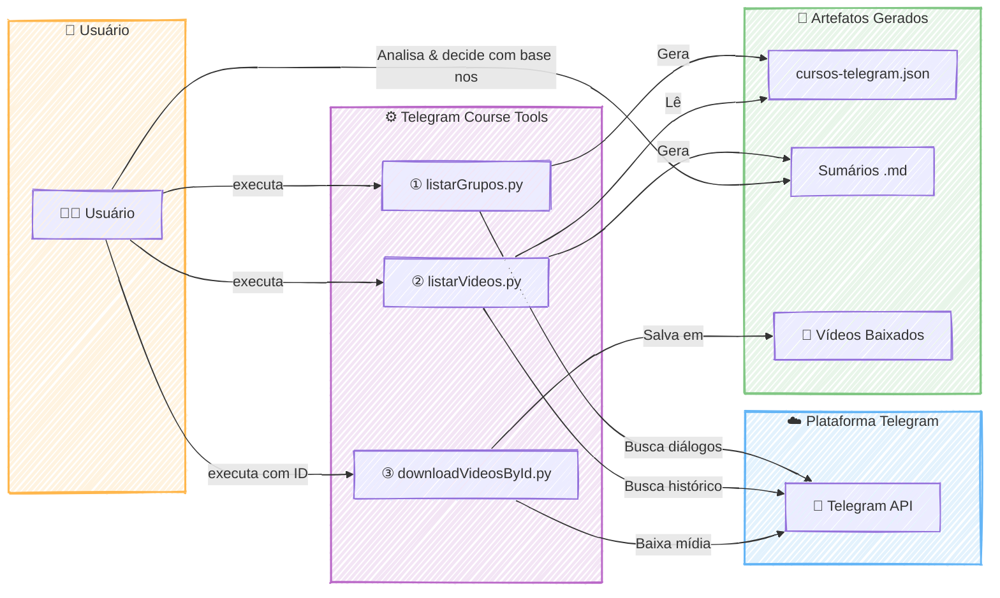

---
#### RESUMO TÉCNICO PARA EMBEDDING

Este projeto implementa uma suíte de automação em Python para organizar conteúdo de cursos dispersos no Telegram. A arquitetura é modular e sequencial, composta por três scripts independentes. O primeiro (`listarGrupos.py`), usando a biblioteca `Telethon` e `asyncio`, conecta-se à API do Telegram para mapear os cursos do usuário, gerando um inventário em formato `JSON`. O segundo script (`listarVideos.py`) consome o `JSON`, extrai o histórico de mensagens e aplica expressões regulares (`re`) para fazer o parsing do conteúdo não-estruturado, identificando módulos e aulas para gerar sumários estruturados em `Markdown`. A etapa final (`downloadVideosById.py`) permite o download sob demanda dos vídeos, utilizando a biblioteca `tqdm` para exibir uma barra de progresso e o módulo `os` para gerenciar o sistema de arquivos, evitando downloads duplicados. A solução efetivamente transforma dados caóticos em uma biblioteca de aprendizado organizada, exemplificando um fluxo de ETL (Extract, Transform, Load) em pequena escala, focado em automação, parsing de dados e melhoria da experiência do usuário (UX) em uma interface de linha de comando (CLI).

#### CLASSIFICAÇÃO DE TECNOLOGIAS E CONCEITOS

| Categoria                    | Tecnologias e Conceitos                                                                                                                                                        |
| :--------------------------- | :----------------------------------------------------------------------------------------------------------------------------------------------------------------------------- |
| **AI & Machine Learning**    | N/A                                                                                                                                                                            |
| **Software Development**     | Python, Automação de Scripts, Programação Assíncrona (asyncio), Manipulação de Sistema de Arquivos (os), Expressões Regulares (re), Modularidade, CLI (Command-Line Interface) |
| **Architecture**             | Arquitetura Modular, Arquitetura de Solução, Fluxo de Dados (ETL), Design de Componentes Independentes                                                                         |
| **Cloud Computing**          | Consumo de API de Plataforma (Telegram API)                                                                                                                                    |
| **API RESTFul development**  | Consumo de API (Telethon)                                                                                                                                                      |
| **Frontend Development**     | CLI User Experience (tqdm)                                                                                                                                                     |
| **Mobile Development**       | N/A                                                                                                                                                                            |
| **Database**                 | N/A                                                                                                                                                                            |
| **Data Management**          | Extração de Dados, Transformação de Dados (Parsing), JSON, Markdown, Dados Não-Estruturados                                                                                    |
| **Content Management - CMS** | N/A                                                                                                                                                                            |
| **System Administration**    | Gerenciamento de Arquivos e Diretórios                                                                                                                                         |
| **DevOps**                   | N/A                                                                                                                                                                            |
| **Leadership**               | Arquitetura de Solução, Product Ownership, Tomada de Decisão Técnica                                                                                                           |
| **Coaching**                 | N/A                                                                                                                                                                            |
| **Agile Project Management** | Definição de Requisitos, Validação de Solução, Product Owner                                                                                                                   |
### 🚀 Gerenciador de Tarefas Conversacional via E-mail 📥 Postmark Challenge

##### 🎯 Visão Geral e Arquitetura da Solução

Este projeto nasceu para solucionar uma dor comum no dia a dia de qualquer profissional: a fricção de transformar e-mails em tarefas acionáveis. Em vez de alternar entre a caixa de entrada e um aplicativo de To-Do, a solução transforma o próprio e-mail em uma poderosa interface de gerenciamento. O usuário pode criar, atualizar, comentar e concluir tarefas simplesmente enviando um e-mail para um endereço dedicado ou respondendo a uma conversa existente, utilizando comandos simples e intuitivos como `#prioridade` ou `#concluir`.

A arquitetura foi desenhada para ser ágil e orientada a eventos. O fluxo se inicia quando o **Postmark API** recebe um e-mail e, através de um **Inbound Webhook**, notifica a aplicação **Laravel** em tempo real. Um motor de comandos customizado entra em ação, analisando o corpo do e-mail em busca de "hashtags" de ação. Cada comando aciona a lógica de negócio correspondente, atualizando o estado da tarefa no banco de dados. Para a visualização, uma interface web reativa, construída com **Livewire** e **Tailwind CSS**, exibe a lista de tarefas, que se atualiza dinamicamente sem a necessidade de recarregar a página, proporcionando uma experiência de usuário fluida e moderna.

#### 👨‍💻 Meu Papel no Projeto

Como idealizador e desenvolvedor da solução, minhas principais responsabilidades foram:

  * **Arquitetura do Processamento de E-mails:** Implementar a lógica de recebimento e interpretação de e-mails em tempo real utilizando Postmark Inbound Webhooks, que servem como gatilho para todo o fluxo da aplicação.
  * **Desenvolvimento do Motor de Comandos:** Criar um processador de comandos em Laravel para analisar o corpo do e-mail, identificar hashtags de ação (ex: `#comentario`, `#concluir`) e executar as operações de negócio correspondentes.
  * **Construção do Frontend Reativo:** Desenvolver a interface de usuário para visualização das tarefas com Livewire e Tailwind CSS, garantindo atualizações dinâmicas e uma experiência moderna sem a complexidade de uma Single Page Application (SPA).
  * **Garantia de Qualidade:** Assegurar a robustez e a confiabilidade do sistema, especialmente do motor de comandos, através de uma suíte de testes completa escrita com Pest.

#### ✨ Pontos Fortes e Desafios Superados

O grande trunfo do projeto é sua simplicidade e elegância: ele se integra a um fluxo de trabalho que o usuário já domina — o e-mail. A solução elimina a necessidade de um novo software, transformando uma ferramenta de comunicação em uma plataforma de produtividade.

O principal desafio técnico foi criar um sistema robusto para "traduzir" o texto não estruturado de um e-mail em comandos de sistema precisos e confiáveis. Superamos isso com o **desenvolvimento de um motor de comandos customizado**, capaz de analisar o conteúdo de forma inteligente. Outra vitória foi a escolha do **Livewire**, que permitiu construir uma interface reativa e performática com a produtividade do ecossistema Laravel, evitando a complexidade de gerenciar um frontend desacoplado.

#### 🌱 Pontos para Evolução Futura

Para o futuro, a solução poderia evoluir com a implementação de um processamento de linguagem natural (PLN) mais avançado, permitindo que os usuários escrevam comandos de forma mais livre, sem a rigidez das hashtags. Outra evolução seria a integração com calendários (Google Calendar, Outlook) para agendar tarefas com datas de vencimento.

-----

#### 🛠️ Pilha de Tecnologias (Tech Stack)

| Componente | Tecnologia Utilizada | Papel na Arquitetura |
| :--- | :--- | :--- |
| **Backend** | **Laravel** | Orquestra toda a lógica de negócio, rotas, processamento de webhooks e interação com o banco de dados. |
| **Frontend Reativo** | **Livewire & Tailwind CSS** | Constrói uma interface de usuário dinâmica e moderna para a visualização das tarefas, com atualizações em tempo real. |
| **Testes Automatizados**| **Pest** | Garante a confiabilidade e a robustez das regras de negócio e do motor de comandos com uma suíte de testes limpa. |
| **Gateway de E-mail** | **Postmark API & Webhooks** | Recebe os e-mails, dispara os eventos via webhook para a aplicação e gerencia o envio de respostas. |
| **Modelo Arquitetural** | **Arquitetura Orientada a Eventos** | Permite que a aplicação reaja de forma assíncrona aos e-mails recebidos, garantindo um fluxo desacoplado e escalável. |

-----

#### 🔗 Links e Recursos
* **🎬 Apresentação em Vídeo:** [Assista no YouTube](https://www.youtube.com/watch?v=NDFgcH2X1ZI)
* **📂 Repositório Open Source:** [Veja o código no GitHub](https://github.com/lfrichter/Interactive-email-management)

---

#### 🗺️ Diagrama da Arquitetura

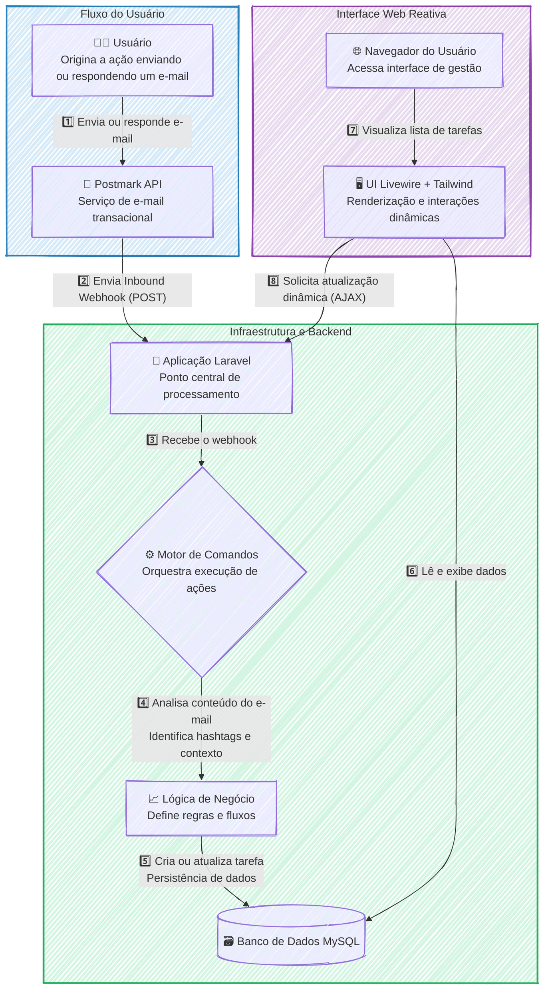

---
#### RESUMO TÉCNICO PARA EMBEDDING

A solução é um gerenciador de tarefas conversacional implementado em uma arquitetura orientada a eventos, acionada por e-mails. O fluxo é iniciado por um Inbound Webhook da Postmark API, que notifica uma aplicação backend em Laravel. Um motor de comandos customizado, com lógica de negócio robusta validada por testes automatizados em Pest, processa o corpo do e-mail para identificar e executar ações baseadas em hashtags, como `#prioridade` ou `#concluir`. O estado das tarefas é persistido em um banco de dados MySQL. A interface de usuário para visualização é um frontend reativo construído com Livewire e Tailwind CSS, garantindo atualizações dinâmicas da lista de tarefas sem a necessidade de recarregar a página. O principal desafio superado foi a tradução de texto não estruturado de e-mails em comandos de sistema precisos através do motor de comandos, evitando a complexidade de uma SPA desacoplada ao utilizar a stack TALL (Tailwind, Alpine, Livewire, Laravel). Futuras evoluções contemplam o uso de processamento de linguagem natural (PLN).

#### CLASSIFICAÇÃO DE TECNOLOGIAS E CONCEITOS

| Categoria                    | Tecnologias e Conceitos                                                                      |
| :--------------------------- | :------------------------------------------------------------------------------------------- |
| **AI & Machine Learning**    | 🧠 Processamento de Linguagem Natural (PLN)                                                  |
| **Software Development**     | 👨‍💻 Laravel, Pest, Motor de Comandos Customizado                                           |
| **Architecture**             | 🏗️ Arquitetura Orientada a Eventos, Inbound Webhook, Sistema Desacoplado, Sistema Escalável |
| **Cloud Computing**          | ☁️ Postmark API (SaaS)                                                                       |
| **API RESTFul development**  | 🔄 Postmark API, Webhooks                                                                    |
| **Frontend Development**     | 🖥️ Livewire, Tailwind CSS, Interface Reativa                                                |
| **Mobile Development**       | 📱 N/A                                                                                       |
| **Database**                 | 🗃️ MySQL                                                                                    |
| **Data Management**          | 💾 Persistência de Dados                                                                     |
| **Content Management - CMS** | 📄 N/A                                                                                       |
| **System Administration**    | ⚙️ N/A                                                                                       |
| **DevOps**                   | 🔁 Testes Automatizados                                                                      |
| **Leadership**               | 🚀 Idealizador, Desenvolvedor da Solução                                                     |
| **Coaching**                 | 🤝 N/A                                                                                       |
| **Agile Project Management** | scrum N/A                                                                                    |

### 🚀 Twin Quest: Desafio Full-Stack 

#### 🎯 Visão Geral e Arquitetura da Solução

O "Twin Quest" nasceu como uma resposta criativa a um desafio, a arquitetura foi desenhada para ser moderna, robusta e reativa. O coração da aplicação é um **backend em Laravel** que serve uma API RESTful segura e eficiente. Ele é o maestro que orquestra a comunicação com a API. No frontend, uma interface limpa e fluida, construída com **Vue 3 (Composition API) e TypeScript**, oferece uma experiência de usuário impecável. O estado da aplicação é gerenciado de forma centralizada pelo **Pinia**, garantindo que os dados fluam de maneira reativa e instantânea da API para a tela do usuário.

#### 👨‍💻 Meu Papel no Projeto

Como idealizador e único desenvolvedor deste projeto, atuei em todas as frentes como **Desenvolvedor Full-Stack**, com as seguintes responsabilidades:

  * **Arquitetura e Desenvolvimento Back-End:** Construí toda a API RESTful com Laravel, definindo os endpoints, a lógica de negócio e a orquestração da comunicação com o serviço de IA.
  * **Desenvolvimento Front-End:** Criei a interface de usuário reativa utilizando Vue 3, TypeScript e a Composition API, focando em uma experiência limpa e intuitiva.
  * **Gestão de Estado:** Implementei o Pinia para um gerenciamento de estado global eficiente e previsível no lado do cliente.
  * **Qualidade de Código e Testes:** Garanti a estabilidade e a confiabilidade da API escrevendo uma suíte de testes completa com Pest, adotando uma abordagem TDD.

#### ✨ Pontos Fortes e Desafios Superados

O maior trunfo do projeto é a sua **execução técnica coesa e moderna**, integrando perfeitamente o frontend e o backend. A utilização de TypeScript de ponta a ponta trouxe uma camada extra de segurança e manutenibilidade ao código.

Um desafio significativo foi implementação de uma **suíte de testes robusta com Pest** foi crucial para garantir que a lógica de negócio da API fosse à prova de falhas, um pilar para a qualidade do projeto.

#### 🌱 Pontos para Evolução Futura

Para o futuro, a aplicação poderia evoluir com a implementação de um **sistema de cache (como Redis)** para temas populares, otimizando custos de API e a velocidade de resposta. Outra melhoria seria adicionar **autenticação de usuários** para que eles possam salvar e revisitar seu histórico de "quests".

-----

#### 🛠️ Pilha de Tecnologias (Tech Stack)

| Componente                  | Tecnologia Utilizada        | Papel na Arquitetura                                                                                                |
| :-------------------------- | :-------------------------- | :------------------------------------------------------------------------------------------------------------------ |
| **Backend (API)**           | **Laravel**                 | Orquestra a lógica de negócio, gerencia as rotas da API e se comunica com o serviço de IA Generativa.               |
| **Frontend (UI)**           | **Vue 3 (Composition API)** | Constrói a interface de usuário reativa e dinâmica, permitindo uma interação fluida com o usuário.                  |
| **Tipagem de Código**       | **TypeScript**              | Garante a segurança de tipos em todo o projeto, tanto no frontend quanto no backend (se aplicável), reduzindo bugs. |
| **Gerenciamento de Estado** | **Pinia**                   | Centraliza e gerencia o estado da aplicação no frontend de forma simples, reativa e eficiente.                      |
| **Testes Automatizados**    | **Pest**                    | Garante a confiabilidade e a qualidade da API do Laravel através de uma suíte de testes elegante e poderosa (TDD).  |

-----

#### 🗺️ Diagrama da Arquitetura

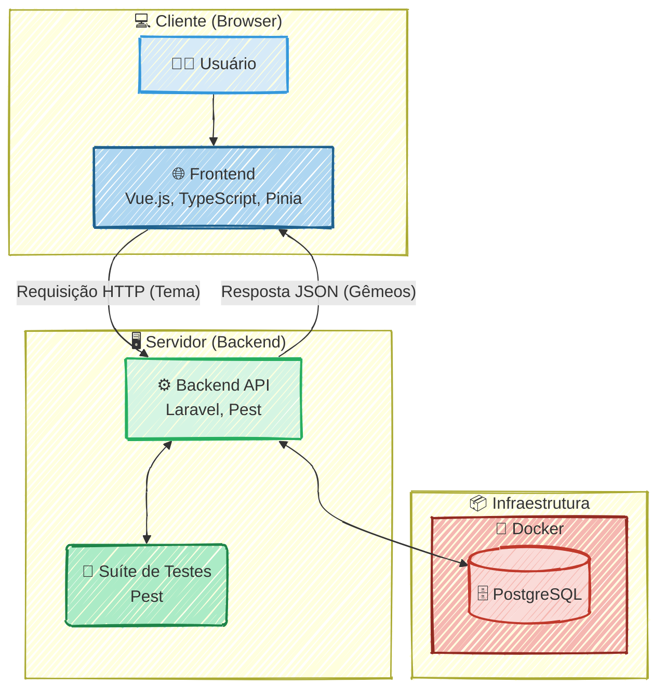

---
#### RESUMO TÉCNICO PARA EMBEDDING

Desenvolvimento de uma aplicação web full-stack, "Twin Quest", a arquitetura da solução é baseada em um backend com Laravel que serve uma API RESTful. O frontend é uma interface de usuário reativa construída com Vue 3, Composition API e TypeScript para garantir tipagem segura. O gerenciamento de estado global no lado do cliente é realizado de forma centralizada pelo Pinia. A qualidade e estabilidade da API foram asseguradas através de uma suíte de testes automatizados com Pest, adotando uma abordagem TDD (Test-Driven Development). A infraestrutura inclui PostgreSQL, com planos de evolução para implementar um sistema de cache com Redis e autenticação de usuários.

#### CLASSIFICAÇÃO DE TECNOLOGIAS E CONCEITOS

| Categoria                    | Tecnologias e Conceitos                                                                                               |
| :--------------------------- | :-------------------------------------------------------------------------------------------------------------------- |
| **Software Development**     | Desenvolvedor Full-Stack, Laravel, Vue 3, TypeScript, Pinia, Pest, Test-Driven Development (TDD), Qualidade de Código |
| **Architecture**             | Arquitetura Full-Stack, API RESTful, Gestão de Estado (Pinia), Sistema de Cache (Redis), Autenticação de Usuários     |
| **Cloud Computing**          | N/A                                                                                                                   |
| **API RESTFul development**  | API RESTful, Laravel, Endpoints, Requisição HTTP, Resposta JSON                                                       |
| **Frontend Development**     | Vue 3 (Composition API), TypeScript, Pinia, Interface de Usuário Reativa                                              |
| **Mobile Development**       | N/A                                                                                                                   |
| **Database**                 | PostgreSQL, Redis                                                                                                     |
| **Data Management**          | N/A                                                                                                                   |
| **Content Management - CMS** | N/A                                                                                                                   |
| **System Administration**    | N/A                                                                                                                   |
| **DevOps**                   | Testes Automatizados, Pest, Docker                                                                                    |
| **Leadership**               | Liderança Técnica (Idealizador e único desenvolvedor)                                                                 |
| **Coaching**                 | N/A                                                                                                                   |
| **Agile Project Management** | N/A                                                                                                                   |

### 🚀 Air Combat 3D: Um Estudo de Caso sobre Produtividade com IAs

#### 🎯 Visão Geral e Arquitetura da Solução

Este projeto nasceu de uma questão estratégica: qual o impacto real de ferramentas de IA generativa na produtividade de um desenvolvedor full-stack? Para responder a isso, conduzi um estudo de caso prático, desenvolvendo do zero um jogo 3D de combate aéreo multiplayer. O objetivo não era apenas criar um jogo, mas sim mensurar a aceleração no ciclo de vida do desenvolvimento.

A solução é uma aplicação web onde jogadores podem entrar em uma arena e pilotar aviões de combate em tempo real. O frontend, construído com **Three.js**, é responsável por toda a renderização 3D, desde os modelos das aeronaves até o ambiente de batalha e os controles interativos. A comunicação em tempo real, coração da experiência multiplayer, é garantida por um backend robusto em **Node.js** e **Express**, utilizando **WebSockets** para sincronizar as ações dos jogadores com latência mínima. Toda a aplicação foi conteinerizada com **Docker**, garantindo a portabilidade e a consistência do ambiente, e implantada na nuvem através do **Render.com**.

O resultado mais expressivo foi a validação da hipótese inicial: o uso de IDEs assistidas por IA (Cursor, Trae) resultou em uma **redução de aproximadamente 40% no tempo total de desenvolvimento**, desde a concepção até a entrega final.

#### 👨‍💻 Meu Papel no Projeto

Como único desenvolvedor e pesquisador neste estudo de caso, atuei de ponta a ponta, assumindo os seguintes papéis:

  * **Arquiteto e Desenvolvedor Full-Stack:** Idealizei a arquitetura, desenvolvi o frontend interativo com Three.js, construí o servidor de backend em Node.js para a lógica de jogo e comunicação em tempo real via WebSockets.
  * **Engenheiro DevOps:** Fui responsável por todo o ciclo de vida da infraestrutura, incluindo a conteinerização da aplicação com Docker e a automação do processo de deploy contínuo na plataforma Render.com.
  * **Pesquisador de Fluxo de Trabalho:** Defini a metodologia para o estudo, integrei as ferramentas de IA generativa no meu fluxo de trabalho diário e mensurei ativamente o ganho de produtividade em comparação com métodos tradicionais.

#### ✨ Pontos Fortes e Desafios Superados

O principal ponto forte do projeto é a demonstração clara e quantificável do poder da IA como uma ferramenta de alavancagem para desenvolvedores. O jogo funcional é a prova de conceito que materializa essa conclusão.

  * **Desafio Superado:** O maior desafio técnico foi garantir a **sincronização de estado em tempo real** entre múltiplos jogadores. Manter a posição e as ações de cada avião consistentes para todos os clientes, com baixa latência, é complexo. Superei isso implementando um loop de jogo eficiente no servidor Node.js que processa as entradas dos jogadores e transmite o estado atualizado do jogo de volta aos clientes através de uma conexão WebSocket estável.
  * **Vitória Estratégica:** A maior vitória, no entanto, foi a **validação bem-sucedida do fluxo de trabalho assistido por IA**. Provar uma redução de 40% no tempo de desenvolvimento transformou uma crença intuitiva em um dado concreto, oferecendo um forte argumento para a adoção moderna de ferramentas no ciclo de desenvolvimento de software.

#### 🌱 Pontos para Evolução Futura

Embora o projeto tenha cumprido seu objetivo principal, ele possui um grande potencial para evolução. Como próximos passos, poderíamos implementar um sistema de **persistência de pontuação e ranking de jogadores**, utilizando um banco de dados como PostgreSQL ou Redis. Outra melhoria seria a criação de **salas de jogo privadas e diferentes modos de batalha** (como "Team Deathmatch"), enriquecendo a experiência multiplayer.

-----

#### 🛠️ Pilha de Tecnologias (Tech Stack)

| Componente | Tecnologia Utilizada | Papel na Arquitetura |
| :--- | :--- | :--- |
| **Renderização e Interação 3D** | **Three.js** | Criação do ambiente 3D, renderização dos aviões e gerenciamento da câmera e controles do jogador no navegador. |
| **Servidor de Aplicação** | **Node.js com Express** | Orquestra a lógica de negócio, gerencia o matchmaking e serve como a base para a comunicação em tempo real. |
| **Comunicação em Tempo Real** | **WebSockets** | Estabelece um canal de comunicação bidirecional e de baixa latência entre o cliente e o servidor para sincronizar as ações. |
| **Conteinerização** | **Docker** | Empacota a aplicação e suas dependências em um contêiner, garantindo consistência entre os ambientes de desenvolvimento e produção. |
| **Hospedagem e Deploy** | **Render.com** | Plataforma de nuvem utilizada para hospedar a aplicação conteinerizada e disponibilizá-la publicamente online. |
| **Aceleração de Código** | **IA Generativa (Cursor, Trae)** | Ferramentas integradas à IDE para acelerar a escrita de código, prototipagem de funcionalidades e resolução de problemas. |

-----

#### 🗺️ Diagrama da Arquitetura

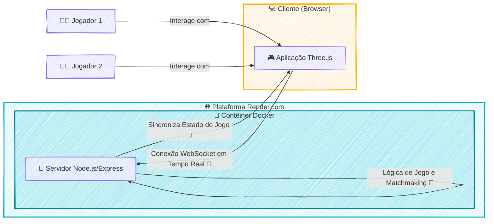

---
#### RESUMO TÉCNICO PARA EMBEDDING

Estudo de caso prático sobre o impacto de IA generativa na produtividade, materializado no desenvolvimento de um jogo 3D multiplayer de combate aéreo. A arquitetura da solução emprega um frontend em **Three.js** para renderização 3D e um backend em **Node.js** com **Express** para a lógica de jogo. O principal desafio técnico, a **sincronização de estado em tempo real** entre múltiplos jogadores, foi solucionado com **WebSockets** para comunicação de baixa latência. A aplicação foi conteinerizada com **Docker**, garantindo portabilidade e consistência, com o ciclo de **deploy contínuo** automatizado na plataforma de nuvem **Render.com**. O uso de IDEs assistidas por **IA generativa (Cursor, Trae)** validou uma redução de 40% no tempo de desenvolvimento. Evoluções futuras planejadas incluem a implementação de persistência de dados com **PostgreSQL** ou **Redis** para rankings e pontuações.

#### CLASSIFICAÇÃO DE TECNOLOGIAS E CONCEITOS

| Categoria                    | Tecnologias e Conceitos                                                                       |
| :--------------------------- | :-------------------------------------------------------------------------------------------- |
| **AI & Machine Learning**    | IA Generativa, Cursor, Trae                                                                   |
| **Software Development**     | Desenvolvedor Full-Stack, Loop de jogo, Prototipagem, Ciclo de vida do desenvolvimento        |
| **Architecture**             | Arquitetura de aplicação web, Multiplayer em tempo real, Sincronização de estado, Matchmaking |
| **Cloud Computing**          | Render.com, Hospedagem em nuvem                                                               |
| **API RESTFul development**  | Node.js, Express                                                                              |
| **Frontend Development**     | Three.js, Renderização 3D, Controles interativos                                              |
| **Mobile Development**       | N/A                                                                                           |
| **Database**                 | PostgreSQL, Redis                                                                             |
| **Data Management**          | Persistência de pontuação                                                                     |
| **Content Management - CMS** | N/A                                                                                           |
| **System Administration**    | N/A                                                                                           |
| **DevOps**                   | Docker, Conteinerização, Deploy Contínuo                                                      |
| **Leadership**               | N/A                                                                                           |
| **Coaching**                 | N/A                                                                                           |
| **Agile Project Management** | N/A                                                                                           |
### 🚀 Kpro After Sales: API para Otimização de Processos de Pós-Venda

#### 🎯 Visão Geral e Arquitetura da Solução

Em um cenário onde os processos de pós-venda da Kpro — abrangendo aluguéis, vendas e compras compartilhadas — precisavam de coesão e eficiência, a solução foi arquitetar e construir um núcleo digital central: uma **API RESTful robusta e escalável**. Este projeto nasceu para ser o "cérebro" da operação, orquestrando todo o ciclo de vida dos equipamentos, desde a gestão de checklists e documentos até o controle de status e histórico.

A API foi desenvolvida em **Laravel Lumen**, servindo como o backend desacoplado para uma moderna interface de usuário em Vue.js. Essa arquitetura garantiu não apenas uma separação clara de responsabilidades, mas também uma agilidade ímpar para as equipes de frontend e backend trabalharem em paralelo, conectadas por um contrato de API bem definido e documentado.

#### 👨‍💻 Meu Papel no Projeto

Atuando como **Desenvolvedor Back-End**, em estreita colaboração com o Arquiteto de Soluções, minhas principais responsabilidades foram:

  * **Construção da API:** Desenvolver os endpoints, implementar as regras de negócio e realizar a integração com serviços externos utilizando o framework Laravel Lumen.
  * **Otimização de Performance:** Realizar *query tuning* no banco de dados MySQL e implementar estratégias de cache para garantir a velocidade da aplicação.
  * **Garantia de Qualidade:** Criar uma suíte sólida de testes automatizados com PHPUnit para assegurar a estabilidade e evitar regressões.
  * **Facilitação da Integração:** Elaborar a documentação completa da API com Swagger/OpenAPI para acelerar o desenvolvimento e a integração com a equipe de frontend.

#### ✨ Pontos Fortes e Desafios Superados

O maior triunfo deste projeto foi transformar desafios técnicos complexos em vitórias mensuráveis para o negócio.

  * **Performance como Prioridade:** Um dos principais desafios era garantir que a API respondesse com baixa latência, mesmo sob carga. Enfrentei isso com uma otimização criteriosa das consultas ao banco de dados e a implementação de uma camada de cache inteligente. O resultado? Uma **melhora de 30% no tempo de resposta** dos endpoints críticos, impactando diretamente a experiência do usuário final.
  * **Qualidade e Estabilidade Inegociáveis:** Para construir uma base sólida e confiável, a estratégia foi investir pesado em automação de testes. O desafio era cobrir a complexidade das regras de negócio. Superamos isso ao desenvolver uma suíte de testes com **cobertura de código de aproximadamente 80%** usando PHPUnit, o que blindou a API contra bugs e regressões.
  * **Colaboração Acelerada por Documentação:** A sinergia entre backend e frontend é crucial. Para eliminar qualquer atrito, produzi uma documentação interativa e detalhada com **Swagger/OpenAPI**. Isso não apenas serviu como um contrato claro, mas também **acelerou o onboarding e a produtividade da equipe de frontend** em Vue.js, permitindo que eles consumissem os endpoints com total autonomia e clareza.

#### 🌱 Pontos para Evolução Futura

Como próximos passos para evoluir a maturidade da solução, poderíamos considerar:

1.  A implementação de um **pipeline de CI/CD** para automatizar os processos de build, teste e deploy.
2.  Adoção de uma ferramenta de **monitoramento e observabilidade** (como Prometheus/Grafana) para acompanhar a saúde da API em tempo real.

-----

#### 🛠️ Pilha de Tecnologias (Tech Stack)

| Componente | Tecnologia Utilizada | Papel na Arquitetura |
| :--- | :--- | :--- |
| **Backend API** | **Laravel Lumen (PHP)** | Núcleo da aplicação, responsável por toda a lógica de negócio, regras e exposição dos dados via endpoints RESTful. |
| **Banco de Dados** | **MySQL** | Sistema de gerenciamento de banco de dados relacional para a persistência de todas as informações da plataforma. |
| **Testes Automatizados**| **PHPUnit** | Ferramenta utilizada para criar a suíte de testes unitários e de integração, garantindo a qualidade e estabilidade do código. |
| **Documentação da API**| **Swagger (OpenAPI)** | Padrão utilizado para desenhar, construir e documentar a API, servindo como um contrato claro para os consumidores (frontend). |

-----

#### 🗺️ Diagrama da Arquitetura

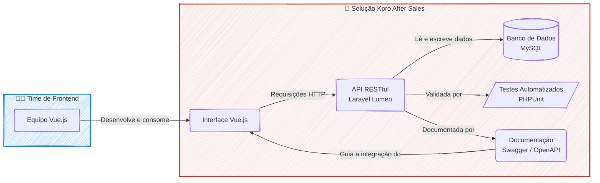

---
#### RESUMO TÉCNICO PARA EMBEDDING

Desenvolvimento de uma API RESTful em Laravel Lumen como núcleo de uma arquitetura desacoplada para otimização de processos de pós-venda (aluguéis, vendas, compras). A solução, com backend em PHP, orquestra o ciclo de vida de equipamentos, incluindo checklists e documentos, servindo uma interface em Vue.js. O foco foi em performance, com otimização via query tuning em MySQL e implementação de cache, resultando em 30% de melhora na latência. A qualidade foi assegurada por uma suíte de testes automatizados em PHPUnit com 80% de cobertura de código para evitar regressões. A integração com o frontend foi acelerada pela documentação da API com Swagger/OpenAPI, que serviu como contrato entre as equipes. Propostas de evolução incluem a implementação de um pipeline de CI/CD e a adoção de ferramentas de monitoramento e observabilidade como Prometheus/Grafana.

#### CLASSIFICAÇÃO DE TECNOLOGIAS E CONCEITOS

| Categoria                    | Tecnologias e Conceitos                                                                                        |
| :--------------------------- | :------------------------------------------------------------------------------------------------------------- |
| **AI & Machine Learning**    | N/A                                                                                                            |
| **Software Development**     | 👨‍💻 Laravel Lumen (PHP), PHPUnit, Testes Automatizados, Cobertura de Código, Regras de Negócio, Query Tuning |
| **Architecture**             | 🏗️ Arquitetura Desacoplada, API RESTful, Cache, Baixa Latência                                                |
| **Cloud Computing**          | N/A                                                                                                            |
| **API RESTFul development**  | 🔌 API RESTful, Endpoints, Swagger (OpenAPI), Documentação da API                                              |
| **Frontend Development**     | 🖥️ Vue.js                                                                                                     |
| **Mobile Development**       | N/A                                                                                                            |
| **Database**                 | 🗃️ MySQL, Query Tuning                                                                                        |
| **Data Management**          | N/A                                                                                                            |
| **Content Management - CMS** | N/A                                                                                                            |
| **System Administration**    | ⚙️ Monitoramento e Observabilidade (Proposto), Prometheus/Grafana (Proposto)                                   |
| **DevOps**                   | 🚀 CI/CD (Proposto), Monitoramento e Observabilidade (Proposto)                                                |
| **Leadership**               | 👨‍🏫 Arquiteto de Soluções                                                                                    |
| **Coaching**                 | N/A                                                                                                            |
| **Agile Project Management** | N/A                                                                                                            |

### 🚀 Shosales Review: Otimização de Performance (10x) e Implantação de Testes E2E

#### 🎯 Visão Geral e Arquitetura da Solução

O projeto Shosales Review enfrentava um desafio clássico em sistemas legados: uma experiência de usuário lenta e uma base de código que a equipe hesitava em modificar por medo de introduzir bugs. A página de visualização de imóveis, um ponto crucial da jornada do usuário, levava longos 5 segundos para carregar, comprometendo a usabilidade e a satisfação do cliente.

A solução foi arquitetada em duas frentes estratégicas e complementares:

1.  **Otimização Cirúrgica de Performance:** Realizei um diagnóstico profundo na aplicação Laravel, identificando que a lentidão era causada por um excesso de 37 consultas ao banco de dados para renderizar uma única página. A estratégia foi refatorar a camada de acesso a dados, otimizando as queries com o Eloquent ORM, implementando índices estratégicos no MySQL e, como resultado, **reduzindo o número de consultas para apenas 4**. Essa intervenção resultou em uma **melhora de 10x na performance**, diminuindo o tempo de carregamento para aproximadamente 0.5 segundos.

2.  **Escudo de Qualidade Automatizado:** Para dar segurança à equipe e viabilizar futuras evoluções, implementei uma suíte completa de testes de ponta-a-ponta (E2E) com Laravel Dusk. Esses testes simulam os fluxos de usuário mais críticos e foram integrados a um pipeline de CI/CD (GitHub Actions/Jenkins), rodando automaticamente a cada nova alteração no código. Com a integração do CrossBrowserTesting, garantimos que a aplicação funcionava de forma consistente em múltiplos navegadores e dispositivos, eliminando regressões em produção.

#### 👨‍💻 Meu Papel no Projeto

Como o principal responsável pela modernização e garantia de qualidade da plataforma, minhas responsabilidades foram:

  * **Análise de Performance:** Liderar a investigação e o diagnóstico dos gargalos de performance da aplicação, utilizando ferramentas de profiling para identificar as queries ineficientes.
  * **Engenharia de Backend:** Refatorar o código PHP/Laravel, otimizar as interações com o banco de dados (MySQL) e ajustar o uso do ORM para alcançar a máxima eficiência.
  * **Automação de Testes (QA):** Desenhar, codificar e manter a suíte de testes E2E com Laravel Dusk, definindo os cenários críticos a serem cobertos.
  * **Cultura DevOps:** Estruturar e integrar a execução dos testes automatizados ao pipeline de CI/CD, garantindo que nenhuma alteração que quebrasse a funcionalidade existente chegasse à produção.

#### ✨ Pontos Fortes e Desafios Superados

O maior triunfo deste projeto foi transformar um ponto de grande frustração em um case de sucesso. O desafio não era apenas técnico, mas também cultural. A equipe tinha receio de mexer no código legado.

  * **Superação da Lentidão:** O ganho de performance de 10x não foi apenas uma métrica; foi uma mudança radical na experiência do usuário, visível e comprovável.
  * **Construindo Confiança com Código:** A suíte de testes E2E funcionou como uma "rede de segurança". Ao automatizar a validação dos fluxos críticos, demos à equipe a confiança necessária para refatorar e melhorar o sistema continuamente, sabendo que qualquer regressão seria detectada de forma imediata pelo pipeline. Isso quebrou o ciclo de medo e estagnação.

#### 🌱 Pontos para Evolução Futura

Com a base sólida de performance e qualidade estabelecida, os próximos passos naturais para evoluir o projeto seriam:

1.  **Cache Inteligente:** Expandir o uso do Redis para implementar cache em camadas mais altas da aplicação, como em fragmentos de views e resultados de API, para ganhos de performance ainda mais expressivos.
2.  **Testes de Regressão Visual:** Adicionar testes de regressão visual ao pipeline para detectar automaticamente quebras de layout na interface, garantindo consistência visual a cada deploy.

-----

#### 🛠️ Pilha de Tecnologias (Tech Stack)

| Componente | Tecnologia Utilizada | Papel na Arquitetura |
| :--- | :--- | :--- |
| **Backend** | **Laravel (PHP)** | Framework principal da aplicação, orquestrando as regras de negócio e a lógica de apresentação. |
| **Banco de Dados** | **MySQL** | Armazenamento persistente de todos os dados relacionados a imóveis e avaliações. |
| **Cache** | **Redis** | Utilizado para cache de sessão e otimizações pontuais de performance. |
| **Testes E2E** | **Laravel Dusk** | Ferramenta para automação de testes de ponta-a-ponta, simulando a interação do usuário no navegador. |
| **Testes Cross-Browser** | **CrossBrowserTesting** | Plataforma em nuvem para executar os testes do Dusk em múltiplos navegadores e sistemas operacionais. |
| **CI/CD** | **GitHub Actions / Jenkins** | Orquestradores do pipeline de integração e entrega contínua, automatizando build, testes e deploy. |

-----

#### 🗺️ Diagrama da Arquitetura de Qualidade e CI/CD

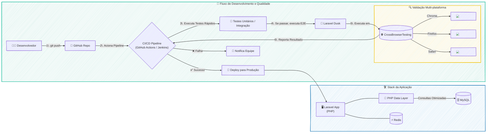

---
#### RESUMO TÉCNICO PARA EMBEDDING

O projeto consistiu na otimização de performance e implementação de um escudo de qualidade para uma aplicação legada em Laravel (PHP), o Shosales Review. O principal desafio foi a lentidão na renderização de páginas, causada por 37 consultas ineficientes ao banco de dados MySQL via Eloquent ORM. A solução envolveu uma refatoração profunda da camada de acesso a dados, com a otimização de queries e a criação de índices estratégicos no MySQL, resultando em uma redução para apenas 4 consultas e um ganho de performance de 10x. Para garantir a estabilidade e dar confiança à equipe para futuras modificações, foi implementada uma suíte de testes de ponta-a-ponta (E2E) com Laravel Dusk. Esses testes foram integrados a um pipeline de CI/CD utilizando GitHub Actions e Jenkins, com validação em múltiplos navegadores através da plataforma em nuvem CrossBrowserTesting. A automação de QA funcionou como uma rede de segurança contra regressões, fomentando uma cultura de melhoria contínua e superando o receio de modificar o código legado. As evoluções futuras planejadas incluem a implementação de cache com Redis e testes de regressão visual.

#### CLASSIFICAÇÃO DE TECNOLOGIAS E CONCEITOS

| Categoria                          | Tecnologias e Conceitos                                                    |
| :--------------------------------- | :------------------------------------------------------------------------- |
| 🤖 **AI & Machine Learning**       | N/A                                                                        |
| 💻 **Software Development**        | Laravel, PHP, Eloquent ORM, Legacy Code Refactoring, Performance Profiling |
| 🏛️ **Architecture**               | Legacy System Modernization, Data Access Layer Optimization                |
| ☁️ **Cloud Computing**             | CrossBrowserTesting                                                        |
| 🌐 **API RESTFul development**     | N/A                                                                        |
| 🎨 **Frontend Development**        | User Experience (UX) Optimization, Visual Regression Testing (future work) |
| 📱 **Mobile Development**          | N/A                                                                        |
| 🗃️ **Database**                   | MySQL, Query Optimization, Database Indexing                               |
| 📊 **Data Management**             | N/A                                                                        |
| 📝 **Content Management - CMS**    | N/A                                                                        |
| 🖥️ **System Administration**      | N/A                                                                        |
| 🚀 **DevOps**                      | CI/CD, GitHub Actions, Jenkins, QA Automation, E2E Testing, Laravel Dusk   |
| 👨‍💼 **Leadership**               | Technical Leadership, Project Modernization                                |
| 🤝 **Coaching**                    | Team Confidence Building, Cultural Change Management                       |
| agile **Agile Project Management** | Continuous Improvement, Regression Prevention                              |

### 🚀 Toot 🚘 Otimização de Geodata (30x) e API para Market Intelligence

#### 🎯 Visão Geral e Arquitetura da Solução

Este projeto nasceu da necessidade de transformar uma vasta quantidade de dados geoespaciais brutos em insights acionáveis para inteligência de mercado. O desafio era claro: como visualizar mais de 200.000 pontos de dados em um mapa interativo sem comprometer a performance? A solução foi arquitetada em torno de uma API robusta em Laravel, que não apenas servia os dados para um frontend em React, mas também replicava a complexa lógica de filtragem de relatórios do PowerBI, garantindo uma análise de dados consistente e poderosa. A arquitetura foi projetada para ser altamente eficiente, utilizando a biblioteca Superfetch para carregamento progressivo e renderização inteligente dos dados, o que permitiu uma experiência de usuário fluida e responsiva.

#### 👨‍💻 Meu Papel no Projeto

Como desenvolvedor backend da equipe, minhas principais responsabilidades foram:

  * **Desenvolvimento da API:** Criei os endpoints em Laravel/MySQL que serviam como a espinha dorsal da plataforma, fornecendo os dados para os dashboards e mapas geoespaciais.
  * **Otimização de Performance:** Identifiquei e resolvi um gargalo crítico de performance, aumentando a velocidade de interação com os mapas em 30 vezes.
  * **Documentação da API:** Utilizei o Swagger para documentar a API, facilitando a integração com o frontend em React.
  * **Colaboração Full-Stack:** Trabalhei em estreita colaboração com os desenvolvedores React e a equipe de QA para garantir a entrega contínua de uma plataforma estável e de alta qualidade.

#### ✨ Pontos Fortes e Desafios Superados

O ponto mais forte da solução foi, sem dúvida, a **otimização de performance geoespacial**. Aumentar em 30 vezes a velocidade de interação com os mapas, reduzindo o tempo de resposta de \~15s para \~0.5s, foi uma vitória técnica que transformou a experiência do usuário. Outro ponto de destaque foi o desenvolvimento de uma API que replicava com sucesso a complexa lógica de filtragem de relatórios do PowerBI, fornecendo uma base de dados sólida e confiável para a plataforma de Market Intelligence.

#### 🌱 Pontos para Evolução Futura

Para evoluir o projeto, poderíamos explorar a implementação de um sistema de cache mais avançado, como o Redis, para otimizar ainda mais as consultas à API. Além disso, a plataforma de Market Intelligence poderia ser expandida para incluir mais fontes de dados e análises preditivas, agregando ainda mais valor ao negócio.

-----

#### 🛠️ Pilha de Tecnologias (Tech Stack)

| Componente | Tecnologia Utilizada | Papel na Arquitetura |
| :--- | :--- | :--- |
| **Backend** | **Laravel (PHP)** | Desenvolvimento da API para servir os dados geoespaciais e de BI. |
| **Banco de Dados** | **MySQL** | Armazenamento e consulta dos dados da plataforma. |
| **Frontend** | **React** | Construção da interface de usuário, incluindo os mapas interativos. |
| **Mapas** | **Google Maps API** | Renderização dos mapas e visualização dos dados geoespaciais. |
| **Otimização de Performance**| **Superfetch** | Carregamento progressivo e renderização inteligente dos dados nos mapas. |
| **Business Intelligence** | **PowerBI (integração)** | Análise e visualização de dados, com lógica de filtragem replicada na API. |
| **Testes** | **PHPUnit** | Testes unitários para garantir a qualidade e a estabilidade da API. |
| **Documentação da API**| **Swagger** | Documentação dos endpoints da API para facilitar a integração. |
| **DevOps** | **CI/CD** | Entrega contínua de novas features e correções de bugs. |

-----

#### 🗺️ Diagrama da Arquitetura

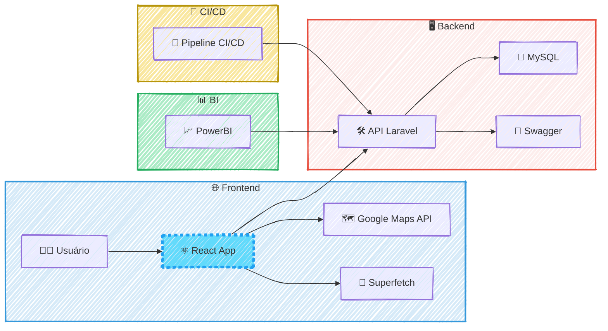

---
#### RESUMO TÉCNICO PARA EMBEDDING

Desenvolvimento de uma API backend em Laravel e MySQL para uma plataforma de Market Intelligence, focada na otimização de performance para visualização de mais de 200.000 pontos de geodata. A solução resolveu um gargalo crítico, aumentando a velocidade de interação em 30x (de ~15s para ~0.5s) em um frontend React com Google Maps API, utilizando a biblioteca Superfetch para carregamento progressivo. A API foi documentada com Swagger, testada com PHPUnit, e replicava a complexa lógica de filtragem de relatórios do PowerBI, sendo entregue via um pipeline de CI/CD. A arquitetura foi desenhada para ser responsiva e escalável, com futuras evoluções considerando a implementação de cache com Redis e análises preditivas.

#### CLASSIFICAÇÃO DE TECNOLOGIAS E CONCEITOS

| Categoria                    | Tecnologias e Conceitos                                                                    |
| :--------------------------- | :----------------------------------------------------------------------------------------- |
| **AI & Machine Learning**    | Análises Preditivas (Evolução Futura)                                                      |
| **Software Development**     | Laravel (PHP), PHPUnit                                                                     |
| **Architecture**             | Otimização de Performance Geoespacial, Arquitetura de API, Cache (Redis - Evolução Futura) |
| **Cloud Computing**          | N/A                                                                                        |
| **API RESTFul development**  | API RESTFul, Laravel, Swagger, Integração com PowerBI                                      |
| **Frontend Development**     | React, Google Maps API, Superfetch                                                         |
| **Mobile Development**       | N/A                                                                                        |
| **Database**                 | MySQL                                                                                      |
| **Data Management**          | Geodata, Market Intelligence, Lógica de Filtragem de Dados                                 |
| **Content Management - CMS** | N/A                                                                                        |
| **System Administration**    | N/A                                                                                        |
| **DevOps**                   | CI/CD                                                                                      |
| **Leadership**               | N/A                                                                                        |
| **Coaching**                 | N/A                                                                                        |
| **Agile Project Management** | Colaboração com QA, Entrega Contínua                                                       |

### 🚀 Toot: Resiliência no Processamento de Jornadas Longas

#### 🎯 Visão Geral e Arquitetura da Solução

No projeto Toot, o desafio inicial parecia ser apenas performance: otimizamos um processo de síncrono para assíncrono com filas, alcançando uma aceleração de **500x**. Contudo, essa vitória revelou um adversário mais complexo: a fragilidade no processamento de jornadas de dados muito longas.

O sistema original, mesmo sendo rápido, operava como um job monolítico. Uma única falha em qualquer etapa — uma API externa indisponível ou um cálculo imprevisto — resultava na perda total do processamento e, pior, na inconsistência dos dados. A depuração era um processo reativo e ineficiente, uma verdadeira "caixa-preta".

Para resolver essa questão fundamental, a solução foi redesenhar a arquitetura de processamento aplicando o **Padrão de Design SAGA**. Em vez de um único job gigante, a lógica foi decomposta em uma cadeia de micro-jobs granulares e com responsabilidade única. Utilizando o `Bus::chain()` do Laravel como um orquestrador (Coordenador SAGA), garantimos que cada etapa da jornada — validação, chamadas a APIs como Google Maps, cálculos e pontuação — fosse executada em uma sequência transacional. Se qualquer elo dessa corrente falhasse, a execução era imediatamente interrompida e, através de transações de compensação (`.catch()`), o sistema revertia seu estado, garantindo a atomicidade e a integridade dos dados.

#### 👨‍💻 Meu Papel no Projeto

Como **Arquiteto de Soluções e Desenvolvedor Sênior**, minhas principais responsabilidades foram:

  * **Diagnosticar** a causa raiz dos problemas de processamento, identificando que a falta de resiliência era mais crítica do que a velocidade.
  * **Desenhar a nova arquitetura** baseada no padrão SAGA para orquestrar os jobs de forma transacional e resiliente.
  * **Implementar a solução** de ponta a ponta utilizando PHP e Laravel, com foco no sistema de filas `Bus::chain()` para o encadeamento e `.catch()` para as ações de compensação.
  * **Estruturar a observabilidade** do processo com o Laravel Horizon, transformando a depuração de reativa para proativa.

#### ✨ Pontos Fortes e Desafios Superados

O maior triunfo deste projeto foi transformar um processo frágil em um workflow robusto e transparente. Os pontos fortes da solução são:

  * **Resiliência e Recuperação de Falhas:** O maior desafio era a falha em cascata. Com a SAGA, falhas pontuais (ex: timeout de uma API) não destroem mais todo o processamento. A cadeia simplesmente para, permitindo uma análise precisa do erro.
  * **Consistência Absoluta dos Dados:** Superamos o risco de dados parciais. A natureza da SAGA garante que ou a jornada é 100% processada com sucesso, ou o sistema é revertido a um estado limpo e consistente através das ações de compensação.
  * **Observabilidade e Depuração Simplificada:** O desafio da "caixa-preta" foi eliminado. Com o Laravel Horizon, ganhamos uma visão granular de cada micro-job na cadeia. Identificar, analisar e até mesmo reprocessar uma etapa específica tornou-se uma tarefa trivial, otimizando drasticamente o tempo de manutenção.

#### 🌱 Pontos para Evolução Futura

A arquitetura atual é sólida, mas poderia evoluir com:

1.  **Dead Letter Queue (DLQ) Sofisticada:** Implementar uma fila dedicada para jobs que falharam repetidamente, permitindo uma análise assíncrona e um processo de re-tentativa manual mais estruturado.
2.  **Transações de Compensação Granulares:** Evoluir a lógica de `.catch()` para disparar jobs de compensação específicos para a etapa que falhou, em vez de um rollback genérico, tornando a reversão ainda mais precisa.

-----

#### 🛠️ Pilha de Tecnologias (Tech Stack)

  * **Linguagem:** PHP
  * **Framework:** Laravel
  * **Ferramentas e Bibliotecas:** Laravel Horizon, Laravel Queues (`Bus::chain`)
  * **Infraestrutura de Fila:** Redis
  * **Banco de Dados:** PostgreSQL / MySQL
  * **Integrações de API:** Google Maps API, Overpass API

-----

#### 🗺️ Diagrama da Arquitetura

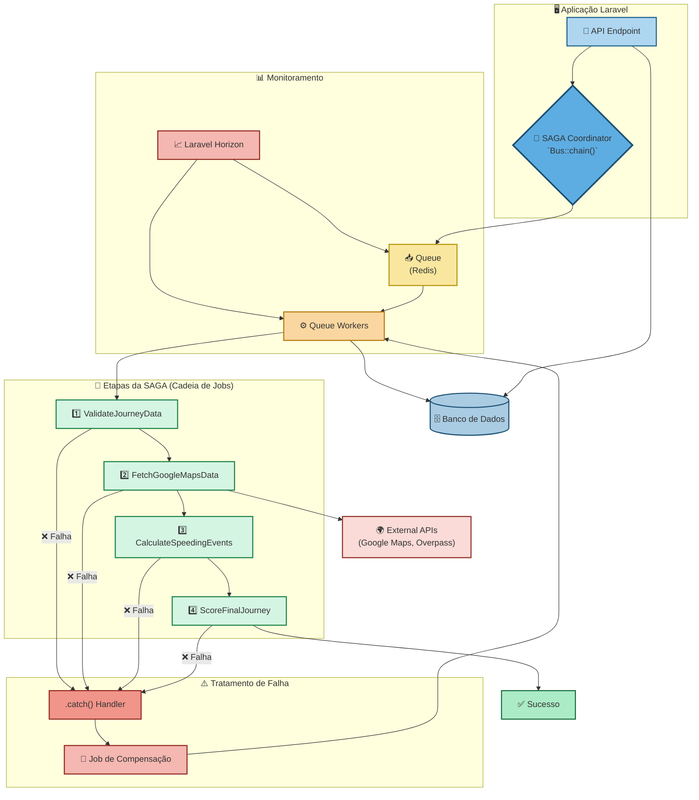
#### RESUMO TÉCNICO PARA EMBEDDING

O projeto implementou uma arquitetura resiliente para processamento de jornadas de dados longas, migrando de um job monolítico e frágil para um sistema assíncrono baseado no Padrão de Design SAGA. A orquestração foi realizada com o `Bus::chain()` do Laravel, funcionando como um Coordenador SAGA que encadeia uma sequência de micro-jobs transacionais (validação, chamadas a APIs, cálculos, pontuação). Para garantir a atomicidade e a consistência dos dados, transações de compensação foram implementadas com blocos `.catch()`, revertendo o estado do sistema em caso de falha em qualquer etapa, como timeouts na integração com Google Maps API ou Overpass API. A solução, desenvolvida em PHP com o framework Laravel, utiliza Redis para a infraestrutura de filas e PostgreSQL/MySQL como banco de dados. A observabilidade do processo foi alcançada com o Laravel Horizon, permitindo um monitoramento e depuração proativa dos queue workers, eliminando a natureza de "caixa-preta" do sistema anterior e garantindo a recuperação de falhas de forma robusta.

#### CLASSIFICAÇÃO DE TECNOLOGIAS E CONCEITOS

| Categoria                    | Tecnologias e Conceitos                                                                                                                                                             |
| ---------------------------- | ----------------------------------------------------------------------------------------------------------------------------------------------------------------------------------- |
| **AI & Machine Learning**    | N/A                                                                                                                                                                                 |
| **Software Development**     | PHP, Laravel, Laravel Queues (`Bus::chain`), `.catch()`, Depuração Proativa                                                                                                         |
| **Architecture**             | Padrão de Design SAGA, Arquitetura Assíncrona, Micro-Jobs, Coordenador SAGA, Transações de Compensação, Resiliência, Recuperação de Falhas, Dead Letter Queue (DLQ), Job Monolítico |
| **Cloud Computing**          | N/A                                                                                                                                                                                 |
| **API RESTFul development**  | Google Maps API, Overpass API                                                                                                                                                       |
| **Frontend Development**     | N/A                                                                                                                                                                                 |
| **Mobile Development**       | N/A                                                                                                                                                                                 |
| **Database**                 | PostgreSQL, MySQL, Redis                                                                                                                                                            |
| **Data Management**          | Atomicidade, Consistência de Dados, Integridade de Dados                                                                                                                            |
| **Content Management - CMS** | N/A                                                                                                                                                                                 |
| **System Administration**    | N/A                                                                                                                                                                                 |
| **DevOps**                   | Laravel Horizon, Observabilidade, Gerenciamento de Filas (Queues), Queue Workers                                                                                                    |
| **Leadership**               | Arquiteto de Soluções, Desenvolvedor Sênior                                                                                                                                         |
| **Coaching**                 | N/A                                                                                                                                                                                 |
| **Agile Project Management** | N/A                                                                                                                                                                                 |

### 🚀 Huktup: Plataforma de Agendamento e Gestão para Provedores de Serviço

#### 🎯 Visão Geral e Arquitetura da Solução

No cenário de serviços, a gestão descentralizada de agendamentos, pagamentos e comunicação com clientes é um grande obstáculo para o crescimento. O Huktup nasceu para resolver exatamente essa dor, oferecendo um ecossistema completo onde provedores de serviço podem centralizar toda a sua operação.

A solução foi arquitetada em torno de uma **API RESTful robusta, construída com Laravel (PHP)**, que serve como o cérebro de toda a plataforma. Esta API orquestra desde a criação de um agendamento até a análise de performance financeira. Para os provedores, desenvolvi um **dashboard analítico interativo com Vue.js e Chart.js**, que transforma dados brutos de faturamento e aquisição de clientes em insights visuais e acionáveis, permitindo filtros dinâmicos para uma análise aprofundada. A comunicação com o cliente final é automatizada e eficiente, graças à integração com a **Twilio API**, que gerencia o envio de lembretes, alertas e a coleta de feedbacks via SMS, reduzindo o não comparecimento e melhorando o engajamento.

#### 👨‍💻 Meu Papel no Projeto

Atuando como o principal desenvolvedor backend, minhas responsabilidades foram cruciais para a fundação e o sucesso da plataforma:

  * **Desenvolvimento do Core:** Construí a API RESTful em Laravel, que centraliza todas as regras de negócio, desde o agendamento até a gestão de ofertas.
  * **Criação do Dashboard Analítico:** Desenvolvi a interface de gestão para os provedores utilizando Vue.js, com foco na visualização de dados com Chart.js para apresentar métricas de negócio de forma clara e objetiva.
  * **Integração de Serviços:** Implementei integrações essenciais com a **Twilio API** para automação da comunicação via SMS e com o **Firebase Authentication** para garantir um processo de onboarding e login seguro (incluindo SSO).
  * **Garantia de Qualidade e Colaboração:** Colaborei ativamente com a equipe de QA para definir cenários de teste e validar a qualidade das entregas. Elaborei a documentação completa da API no padrão **Swagger**, o que foi fundamental para alinhar e acelerar o trabalho da equipe de frontend.

#### ✨ Pontos Fortes e Desafios Superados

O maior trunfo da plataforma é sua capacidade de **unificar a jornada do provedor em um único lugar**. A combinação de uma API sólida com um dashboard intuitivo oferece um controle sem precedentes sobre o negócio.

Um dos principais desafios foi **garantir uma comunicação confiável e automatizada em escala**. Superamos isso ao desenhar fluxos de conversa inteligentes com a Twilio, não apenas enviando lembretes, mas criando um canal de mão dupla para feedback. Outro desafio significativo foi **criar um ambiente seguro e colaborativo para as equipes de desenvolvimento**. A padronização da documentação da API com Swagger foi uma vitória, pois eliminou ambiguidades e permitiu que as equipes de frontend e backend trabalhassem em paralelo com muito mais eficiência.

#### 🌱 Pontos para Evolução Futura

Para o futuro, a plataforma poderia evoluir com a implementação de duas funcionalidades de alto valor:

1.  Um módulo de **notificações push** no aplicativo para complementar a comunicação via SMS.
2.  A integração de um sistema de **Inteligência Artificial** para analisar padrões de agendamento e sugerir horários de maior rentabilidade para os provedores.

-----

#### 🛠️ Pilha de Tecnologias (Tech Stack)

| Componente | Tecnologia Utilizada | Papel na Arquitetura |
| :--- | :--- | :--- |
| **Backend (API Core)** | **Laravel (PHP)** | Orquestra todas as regras de negócio, dados e integrações como o núcleo da plataforma. |
| **Frontend (Dashboard)** | **Vue.js** | Constrói a interface reativa e interativa para os provedores de serviço gerenciarem seus negócios. |
| **Visualização de Dados** | **Chart.js** | Renderiza gráficos dinâmicos no dashboard para análise de faturamento, reservas e clientes. |
| **Banco de Dados** | **MySQL** | Armazena de forma persistente todos os dados relacionais da aplicação (agendamentos, usuários, etc.). |
| **Autenticação de Usuários**| **Firebase Authentication** | Gerencia o onboarding, login e segurança dos usuários (provedores) com suporte a SSO. |
| **Comunicação por SMS** | **Twilio API** | Automatiza o envio de lembretes, alertas transacionais e coleta de feedback dos clientes finais. |
| **Documentação da API** | **Swagger (OpenAPI)** | Padroniza e documenta os endpoints da API para facilitar a integração entre equipes. |
| **Ambiente de Dev** | **Docker** | Garante a consistência e portabilidade do ambiente de desenvolvimento e produção. |

-----

#### 🗺️ Diagrama da Arquitetura

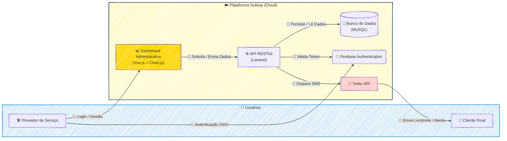

---
#### RESUMO TÉCNICO PARA EMBEDDING

Desenvolvimento de uma plataforma de agendamento, Huktup, com arquitetura centrada em uma API RESTful em Laravel (PHP) atuando como core para todas as regras de negócio. O frontend consiste em um dashboard analítico reativo para provedores de serviço, construído com Vue.js e utilizando Chart.js para visualização de dados e métricas de faturamento e aquisição de clientes. A solução integra serviços de terceiros para funcionalidades críticas: Firebase Authentication para onboarding, login e segurança com suporte a SSO, e a Twilio API para automação da comunicação via SMS, incluindo lembretes e coleta de feedback. A persistência de dados é garantida por um banco de dados MySQL. O ambiente de desenvolvimento é padronizado com Docker, garantindo portabilidade. A colaboração entre equipes de backend e frontend foi otimizada pela documentação da API no padrão Swagger (OpenAPI), permitindo o desenvolvimento paralelo e a validação de entregas com a equipe de QA. Desafios superados incluem a criação de fluxos de comunicação escaláveis e a eliminação de ambiguidades no desenvolvimento através de documentação padronizada.

#### CLASSIFICAÇÃO DE TECNOLOGIAS E CONCEITOS

| Categoria                    | Tecnologias e Conceitos                                                |
| :--------------------------- | :--------------------------------------------------------------------- |
| **AI & Machine Learning**    | Sugestão de IA para otimização de agendamentos (evolução futura)       |
| **Software Development**     | Laravel, PHP, Vue.js, Docker, Chart.js                                 |
| **Architecture**             | Arquitetura baseada em API, Single Sign-On (SSO)                       |
| **Cloud Computing**          | Firebase Authentication, Plataforma em Nuvem                           |
| **API RESTFul development**  | API RESTful, Laravel, Twilio API, Swagger, OpenAPI                     |
| **Frontend Development**     | Vue.js, Chart.js, Dashboard Analítico, Visualização de Dados           |
| **Mobile Development**       | Notificações Push (evolução futura)                                    |
| **Database**                 | MySQL                                                                  |
| **Data Management**          | Análise de métricas financeiras, Visualização de dados                 |
| **Content Management - CMS** | N/A                                                                    |
| **System Administration**    | N/A                                                                    |
| **DevOps**                   | Docker, Documentação de API (Swagger), Colaboração com QA              |
| **Leadership**               | Desenvolvedor principal, Alinhamento de equipes                        |
| **Coaching**                 | N/A                                                                    |
| **Agile Project Management** | Desenvolvimento paralelo (Backend/Frontend), Colaboração entre equipes |

### 🚀 Sisporta: Sincronização Inteligente de Dados

#### 🎯 Visão Geral e Arquitetura da Solução

O projeto Sisporta nasceu de um desafio clássico no mundo do software: a necessidade de modernizar sem poder tocar no legado. Uma empresa especialista em portões de garagem precisava de um sistema ágil para gerar orçamentos personalizados, mas seus dados vitais (produtos, revendedores) residiam em um ERP com um banco de dados SQL Server intocável.

A solução foi arquitetar um **pipeline de dados desacoplado e resiliente**. O coração da operação é um script Python que atua como um agente de extração, lendo os dados do SQL Server e os enviando em formato JSON para uma API na nova aplicação Laravel. Para não sobrecarregar nenhum dos sistemas, a API não processa os dados imediatamente; ela os enfileira usando o **Laravel Horizon**. Essa abordagem assíncrona permite que *workers* em segundo plano processem as informações em lotes, garantindo alto desempenho e escalabilidade. O resultado é um fluxo de dados contínuo e eficiente, que alimenta o novo sistema de orçamentos com informações sempre atualizadas, sem comprometer a performance do ERP legado.

#### 👨‍💻 Meu Papel no Projeto

Neste projeto, atuei como a principal força de engenharia, combinando as funções de **Arquiteto de Soluções e Desenvolvedor Full-Stack**. Minhas responsabilidades incluíram:

  * **Idealizar e desenhar** a arquitetura de integração assíncrona para garantir performance e desacoplamento.
  * **Desenvolver o script de extração** em Python, responsável por coletar e formatar os dados do sistema legado.
  * **Implementar a aplicação Laravel**, incluindo o endpoint da API de ingestão e os jobs de processamento em background com Laravel Horizon.
  * **Garantir a qualidade do código** através da criação de testes unitários e de integração.
  * **Configurar o pipeline de CI/CD** no Bitbucket para automatizar testes e deploys.

#### ✨ Pontos Fortes e Desafios Superados

O maior desafio era a restrição de não poder modificar o sistema ERP. A superação veio com a **arquitetura de processamento assíncrono**, que transformou essa limitação em um ponto forte. A solução se destaca por:

  * **Alto Desempenho e Resiliência:** A utilização de filas (Laravel Horizon) evita gargalos. Se a aplicação de destino ficasse offline, os dados simplesmente aguardariam na fila para serem processados, sem perdas.
  * **Consistência de Dados Inteligente:** Um dos triunfos do projeto foi a criação de um job de "limpeza". Ele remove automaticamente registros que não existem mais no sistema de origem, garantindo que o sistema de orçamentos seja um espelho fiel do ERP, sem acumular dados obsoletos.
  * **Automação e Qualidade:** Com testes automatizados e um pipeline de CI/CD no Bitbucket, o processo de manutenção e evolução tornou-se seguro e ágil.

#### 🌱 Pontos para Evolução Futura

Para evoluir ainda mais a solução, poderíamos implementar um **dashboard de monitoramento avançado** para observar a saúde das filas e o tempo de processamento dos jobs, além de configurar um mecanismo de ***Dead Letter Queue*** para tratar falhas de processamento de forma isolada, sem interromper o fluxo principal.

-----

#### 🛠️ Pilha de Tecnologias (Tech Stack)

  * **Linguagens:** Python, PHP
  * **Framework:** Laravel
  * **Bancos de Dados:** SQL Server, MySQL
  * **Filas e Jobs:** Laravel Horizon
  * **DevOps:** Bitbucket Pipelines

-----

#### 🗺️ Diagrama da Arquitetura

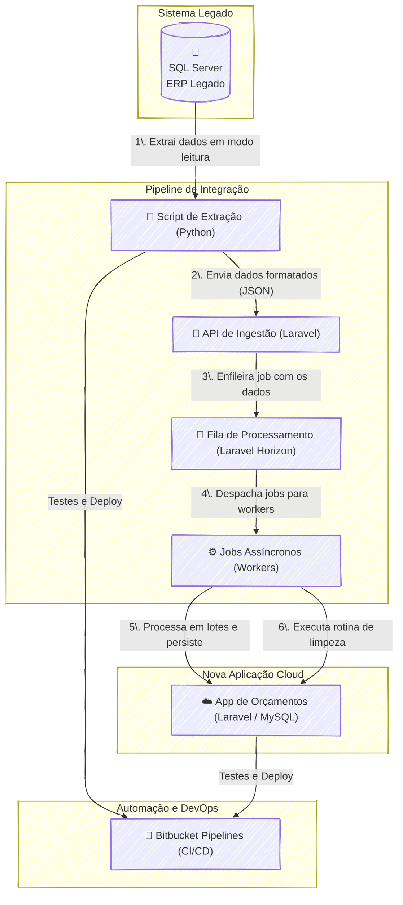

---
#### RESUMO TÉCNICO PARA EMBEDDING

O projeto implementa um pipeline de dados desacoplado para integração entre um sistema ERP legado com banco de dados SQL Server e uma aplicação moderna em Laravel (PHP) com MySQL, ambos hospedados em nuvem. A solução resolve o desafio da sincronização de dados sem acesso para modificação do ERP. Um script Python atua como agente de ETL, extraindo dados, formatando-os em JSON e enviando para um endpoint de API RESTful na aplicação Laravel. Para garantir alta performance e evitar gargalos, a ingestão é assíncrona, utilizando Laravel Horizon para enfileirar e gerenciar jobs de processamento. Esses jobs processam os dados em lotes (batches), otimizando a persistência no MySQL. A consistência de dados é mantida através de uma rotina de limpeza que remove registros obsoletos. Todo o ciclo de desenvolvimento é automatizado por um pipeline de CI/CD no Bitbucket Pipelines, que executa testes unitários e de integração para garantir a qualidade e a resiliência da arquitetura.

#### CLASSIFICAÇÃO DE TECNOLOGIAS E CONCEITOS

| Categoria                    | Tecnologias e Conceitos                                                                                                                                                                |
| :--------------------------- | :------------------------------------------------------------------------------------------------------------------------------------------------------------------------------------- |
| **AI & Machine Learning**    | N/A                                                                                                                                                                                    |
| **Software Development**     | 🐍 Python, 🐘 PHP, ✨ Laravel, 📄 JSON, 🧪 Testes Unitários, 🧪 Testes de Integração                                                                                                    |
| **Architecture**             | 🔗 Arquitetura Desacoplada, 🔄 Processamento Assíncrono, 📦 Processamento em Lotes, 🛡️ Resiliência, 📈 Escalabilidade, ⚙️ Pipeline de Dados, 🎯 Sincronização Unidirecional           |
| **Cloud Computing**          | ☁️ Aplicação Cloud, ☁️ Banco de dados hospedado na nuvem                                                                                                                               |
| **API RESTFul development**  | 🔌 Endpoint de API, 📩 Ingestão de Dados via API                                                                                                                                       |
| **Frontend Development**     | N/A                                                                                                                                                                                    |
| **Mobile Development**       | N/A                                                                                                                                                                                    |
| **Database**                 | 💾 SQL Server, 💾 MySQL                                                                                                                                                                |
| **Data Management**          | 🚚 ETL (Extração, Transformação e Carga), 🔄 Sincronização de Dados, ✅ Integridade de Dados, ✅ Consistência de Dados, ✨ Limpeza de Dados (Data Cleansing)                              |
| **Content Management - CMS** | N/A                                                                                                                                                                                    |
| **System Administration**    | N/A                                                                                                                                                                                    |
| **DevOps**                   | 🛠️ Bitbucket Pipelines, 🔄 CI/CD (Integração Contínua, Implantação Contínua), 🚦 Laravel Horizon, ⚙️ Background Workers, 📜 Gerenciamento de Filas (Queueing), 🚀 Automação de Deploy |
| **Leadership**               | N/A                                                                                                                                                                                    |
| **Coaching**                 | N/A                                                                                                                                                                                    |
| **Agile Project Management** | N/A                                                                                                                                                                                    |

### 🚀 Projeto Spider - Hub de Integração E-commerce

#### 🎯 Visão Geral e Arquitetura da Solução

No coração de um ecossistema de e-commerce complexo e multifacetado, o projeto Spider nasceu como a espinha dorsal de automação, um hub de integração projetado para orquestrar o fluxo de operações para múltiplos clientes. O objetivo era claro: conectar de forma transparente e confiável sistemas de ERP (como Bling e bancos de dados customizados), plataformas de marketplace (Plugg.to, Skyhub, B2W) e ferramentas de gestão, garantindo um fluxo de dados à prova de falhas para produtos, estoque, preços e pedidos.

A solução foi arquitetada como um sistema centralizado, construído em **PHP/Laravel**, que adota uma abordagem orientada a serviços e eventos. Do ponto de vista funcional, o Spider opera como o cérebro da operação:

  * **Recebe Dados:** Ele ingere informações de diversas fontes, utilizando **webhooks** para notificações em tempo real (ex: uma nota fiscal emitida no Bling) e **Artisan Commands** agendados para importações em lote (ex: buscar novos pedidos da Plugg.to).
  * **Processa de Forma Inteligente:** Ao receber os dados, o Spider não apenas os armazena. Ele os enriquece e processa. Um pedido, por exemplo, passa por um job que identifica o cliente correto com base nos SKUs dos produtos antes de ser enviado ao ERP adequado.
  * **Garante a Consistência:** Para tarefas críticas como atualizações de estoque e preço, o sistema utiliza um robusto mecanismo de **filas em Redis**. Isso garante que as operações sejam processadas de forma assíncrona, resiliente e controlada, evitando sobrecarga nas APIs externas e garantindo que as informações fluam de maneira ordenada para todos os canais de venda.
  * **Centraliza a Informação:** Todas as operações, dados e logs são persistidos em um banco de dados **MongoDB**, que serve como a única fonte da verdade para o estado de pedidos, produtos e transações financeiras.

#### 👨‍💻 Meu Papel no Projeto

Como **Engenheiro de Integração**, minha atuação foi central na concepção, desenvolvimento e manutenção deste ecossistema. Minhas principais responsabilidades incluíram:

  * **Arquitetura de Integração:** Desenhar os fluxos de dados, modelar entidades críticas no MongoDB (como a de `checking_account` para controle financeiro) e definir a arquitetura de webhooks para processamento de eventos em tempo real.
  * **Desenvolvimento Back-End:** Construir e manter os pilares da plataforma, incluindo Artisan Commands para importação, Jobs para processamento assíncrono e a lógica de integração com APIs de terceiros como Bling, Plugg.to e Skyhub.
  * **Orquestração do Ciclo de Pedidos:** Automatizar o fluxo completo de um pedido, desde sua criação no marketplace, passando pelo envio ao ERP, até a atualização de seu status após o faturamento, tratando inclusive cancelamentos.
  * **Sincronização Multi-plataforma:** Implementar a complexa lógica de sincronização de estoque e preços, garantindo consistência entre o "dono" do estoque (ERP) e múltiplos canais de venda para evitar overselling.
  * **Onboarding e Migração de Clientes:** Liderar os processos técnicos para integrar novos clientes à plataforma, incluindo a migração massiva de produtos e pedidos de sistemas como Magento e Plugg.to.
  * **Manutenção e Qualidade:** Criar ferramentas internas, como o `LogTrait` para padronizar logs, e executar scripts de manutenção no MongoDB para garantir a qualidade e a integridade dos dados.

#### ✨ Pontos Fortes e Desafios Superados

O maior ponto forte da solução é sua **arquitetura assíncrona e resiliente**. O uso intensivo de filas (Queues) não apenas tornou a plataforma mais responsiva, mas também permitiu escalar o processamento de um volume massivo de dados sem comprometer a estabilidade.

Um dos desafios mais significativos foi **garantir a sincronização de estoque em tempo real**. Vender um produto que não existe no estoque (overselling) é um dos maiores problemas do e-commerce. Superamos isso abandonando o polling ineficiente e implementando uma **arquitetura reativa a eventos**. Ao configurar webhooks no Bling, o Spider passou a ser notificado instantaneamente sobre qualquer mudança, disparando jobs para filas dedicadas (`pluggto`, `skyhub`) que atualizavam os marketplaces de forma quase imediata e controlada. Essa mudança transformou um ponto de fragilidade em uma fortaleza da plataforma.

Outro grande desafio foi lidar com a **inconsistência de dados** provenientes de múltiplas fontes. Enfrentamos SKUs inválidos, produtos duplicados e pedidos sem associação clara de cliente. A vitória aqui foi conquistada através da engenharia: desenvolvi scripts e rotinas de tratamento, como o job `ProcessCodeOrders`, que implementou uma lógica robusta para **identificar e associar corretamente os pedidos aos seus respectivos clientes**, utilizando os SKUs dos itens como chave primária. Essa automação eliminou um processo manual e propenso a erros, garantindo a fluidez da operação.

#### 🌱 Pontos para Evolução Futura

Apesar da robustez da solução, sempre há espaço para melhorias. Duas evoluções naturais seriam:

1.  **Dashboard de Observabilidade:** Implementar um painel de controle visual para monitorar em tempo real a saúde das filas, o status dos jobs e as métricas de integração, oferecendo uma visão proativa sobre possíveis gargalos.
2.  **Centralização de Logs Avançada:** Expandir o `LogTrait` para integrar-se a uma plataforma de observabilidade como Datadog ou ELK Stack, permitindo buscas complexas e criação de alertas inteligentes sobre o comportamento das integrações.

-----

#### 🛠️ Pilha de Tecnologias (Tech Stack)

| Componente | Tecnologia Utilizada | Papel na Arquitetura |
| :--- | :--- | :--- |
| **Backend & Lógica** | **PHP / Laravel** | Framework principal para toda a aplicação, incluindo Artisan Commands para tarefas agendadas e Jobs para processamento em segundo plano. |
| **Banco de Dados Principal** | **MongoDB** | Banco de dados NoSQL central para armazenar produtos, pedidos, clientes e logs, oferecendo flexibilidade para modelos de dados complexos. |
| **Filas Assíncronas** | **Redis** | Utilizado como o motor do sistema de filas (Queues), garantindo o processamento assíncrono e resiliente de tarefas como atualizações de estoque e importações. |
| **Integrações (APIs)** | **REST & Webhooks** | Protocolos usados para comunicação com sistemas externos, tanto para buscar dados (REST) quanto para receber notificações em tempo real (Webhooks). |
| **Plataformas Conectadas** | **Plugg.to, Skyhub, Bling** | Principais sistemas de e-commerce (marketplaces e ERP) com os quais o Spider se integrava para orquestrar as operações. |
| **Infraestrutura & DevOps** | **Docker, AWS S3, SSH** | Docker para conteinerização do ambiente, S3 para armazenamento de arquivos (ex: planilhas de importação) e SSH para gerenciamento do servidor. |
| **Bancos de Dados Legados** | **MySQL** | Utilizado para integração direta com o sistema ERP de clientes específicos que não possuíam uma API moderna, como o Novo Século. |

-----

#### 🗺️ Diagrama da Arquitetura

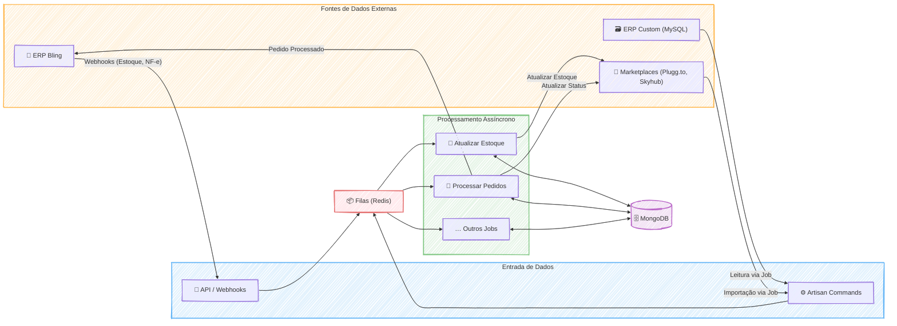

---
#### RESUMO TÉCNICO PARA EMBEDDING

Desenvolvimento e arquitetura do "Spider", um hub de integração de e-commerce centralizado, construído em **PHP/Laravel** para orquestrar operações entre múltiplos sistemas. A arquitetura é orientada a serviços e eventos, utilizando **processamento assíncrono** com **Jobs** e **filas em Redis** para garantir resiliência e escalabilidade. O sistema ingere dados via **APIs REST** e **Webhooks** de plataformas como **Bling**, **Plugg.to**, e **Skyhub**, além de realizar extrações de bancos de dados legados **MySQL**. As operações de **ETL (Extract, Transform, Load)** são executadas por **Artisan Commands** para migração e importação em massa. Todos os dados operacionais (pedidos, produtos, logs) são persistidos em um banco de dados **MongoDB**, que funciona como fonte única da verdade. Desafios de sincronização de estoque e preço foram solucionados implementando uma **arquitetura reativa a eventos**, abandonando o polling em favor de webhooks que disparam jobs para filas dedicadas, prevenindo overselling. A inconsistência de dados foi tratada com rotinas de normalização e enriquecimento, como o `ProcessCodeOrders`. A infraestrutura utiliza **Docker** para conteinerização, **AWS S3** para armazenamento e **SSH** para gerenciamento, com processos agendados via **cron**. A gestão do projeto foi feita com **Jira**, e a padronização de logs foi implementada com um `LogTrait` customizado.

#### CLASSIFICAÇÃO DE TECNOLOGIAS E CONCEITOS

| Categoria | Tecnologias e Conceitos |
| :--- | :--- |
| **AI & Machine Learning** | N/A |
| **Software Development** | PHP, Laravel, Artisan Commands, Jobs, Traits (`LogTrait`), Controllers, Backend Development |
| **Architecture**| Arquitetura Orientada a Serviços, Arquitetura Orientada a Eventos, Arquitetura Assíncrona, Arquitetura Reativa, Hub de Integração, Modelagem de Entidades, Fluxos de Dados |
| **Cloud Computing** | AWS S3 |
| **API RESTFul development** | API REST, Webhooks, Consumo de API (Bling, Plugg.to, Skyhub) |
| **Frontend Development** | N/A |
| **Mobile Development** | N/A |
| **Database** | MongoDB, Redis, MySQL, SQLite, NoSQL |
| **Data Management** | ETL (Extração, Transformação, Carga), Migração de Dados (Magento, Plugg.to), Sincronização de Dados (Estoque, Preço), Qualidade de Dados, Normalização de Dados, Logs (`LogTrait`) |
| **Content Management - CMS** | N/A |
| **System Administration** | Gerenciamento de Servidor (SSH), Cron Jobs |
| **DevOps** | Docker, Docker Compose, Monitoramento, Logging, Automação de Tarefas |
| **Leadership** | Liderança Técnica, Documentação Técnica, Mentoria (Coaching) |
| **Coaching** | N/A |
| **Agile Project Management** | Jira, Gestão de Tarefas, Acompanhamento de Status |

---

### 🚀 Índicos: Plataforma SaaS de Marketing de Indicação

#### 🎯 Visão Geral e Arquitetura da Solução

O projeto Índicos nasceu de uma visão ambiciosa: democratizar o marketing de indicação, permitindo que qualquer empresa, independentemente do seu tamanho, pudesse implementar um programa de recompensas multinível de forma autônoma e escalável. O desafio era criar uma plataforma SaaS **multi-tenant**, onde cada cliente (tenant) operasse em um ambiente seguro e isolado, mas sob a gestão de uma única aplicação centralizada.

A arquitetura foi concebida para ser robusta e flexível. Cada cliente acessava sua própria versão da plataforma através de um subdomínio exclusivo (ex: `empresa.indicos.com.br`). Um sistema de **middlewares personalizados** em Laravel atuava como o cérebro do roteamento, identificando o tenant a cada requisição. Isso garantia que todas as operações, desde a autenticação de usuários até as consultas no banco de dados **MySQL**, fossem rigorosamente segmentadas, prevenindo qualquer tipo de vazamento de dados entre os clientes. A solução final entregou um sistema onde cada empresa podia customizar suas próprias regras de negócio, produtos e comissões, gerenciando sua rede de indicadores com total autonomia.

#### 👨‍💻 Meu Papel no Projeto

Como arquiteto e desenvolvedor principal desta solução, minhas responsabilidades foram da concepção à entrega final. Atuei em frentes como:

  * **Arquitetura da Solução:** Desenhei e implementei toda a estrutura multi-tenant do zero, garantindo a segurança e o isolamento dos dados dos clientes.
  * **Desenvolvimento Back-End:** Codifiquei a complexa lógica de negócio para o sistema de comissionamento multinível, a automação de distribuição de prêmios e a gestão de produtos customizáveis por tenant.
  * **Desenvolvimento Front-End:** Criei os dashboards interativos, com destaque para a visualização dinâmica da rede de indicações, permitindo que os usuários acompanhassem o crescimento de suas hierarquias em tempo real.
  * **Infraestrutura e Resolução de Problemas:** Liderei a depuração de desafios de implantação, incluindo a investigação e superação de limitações no ambiente de hospedagem para habilitar funcionalidades críticas como os subdomínios dinâmicos.

#### ✨ Pontos Fortes e Desafios Superados

O maior ponto forte do Índicos reside em sua **arquitetura multi-tenant robusta**, que provou ser segura e escalável. No entanto, a jornada para alcançar esse resultado foi marcada por desafios que se tornaram grandes vitórias técnicas:

  * **O Mistério dos Subdomínios:** Um dos obstáculos mais frustrantes foi a falha na configuração de subdomínios dinâmicos no host contratado. Após uma exaustiva investigação que parecia apontar para uma falha no código, a persistência na depuração revelou a verdadeira causa: uma limitação da própria infraestrutura. Superar isso não foi apenas uma correção, mas uma lição valiosa sobre a importância de entender profundamente todo o ecossistema de deploy, transformando frustração em expertise.

  * **Visualizando a Complexidade:** Representar uma rede de indicação multinível de forma clara e intuitiva era um desafio por si só. A solução foi desenvolver um componente de visualização de diagramas dinâmicos, que renderizava a hierarquia de cada usuário em tempo real, exibindo os níveis e as porcentagens de ganho. Essa funcionalidade se tornou um diferencial da plataforma, transformando dados complexos em uma experiência de usuário engajadora.

#### 🌱 Pontos para Evolução Futura

Para o futuro, o projeto Índicos poderia evoluir com a implementação de duas frentes principais:

1.  **Integração com plataformas de e-commerce e CRMs** para automatizar ainda mais o ciclo de vendas e indicações.
2.  Um **módulo de analytics avançado** para que os clientes pudessem medir o ROI de seus programas de indicação com mais precisão.

-----

#### 🛠️ Pilha de Tecnologias (Tech Stack)

| Componente | Tecnologia Utilizada | Papel na Arquitetura |
| :--- | :--- | :--- |
| **Backend & Core da Aplicação** | **Laravel** | Responsável por toda a lógica de negócio, arquitetura multi-tenant, roteamento por subdomínios, autenticação dupla (master e tenants) e APIs. |
| **Banco de Dados** | **MySQL** | Persistência dos dados de todos os tenants, incluindo usuários, redes de indicação e configurações, com isolamento garantido por tenant. |
| **Frontend & Dinamismo** | **JavaScript / jQuery** | Utilizado para criar os diagramas de hierarquia dinâmicos no dashboard do usuário, proporcionando uma visualização interativa e em tempo real da rede. |
| **Ambiente de Deploy** | **Host Umbler** | Ambiente de nuvem onde a aplicação foi implantada. O entendimento de suas limitações foi crucial para a resolução de desafios de infraestrutura. |

-----

#### 🗺️ Diagrama da Arquitetura

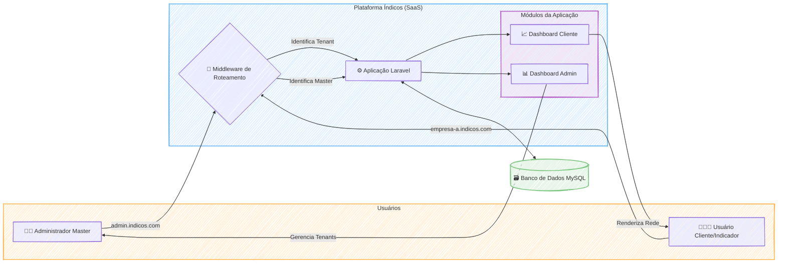

---
#### RESUMO TÉCNICO PARA EMBEDDING

A plataforma Índicos é um SaaS de marketing de indicação com uma arquitetura multi-tenant robusta, desenvolvida em Laravel. O core da solução reside em middlewares personalizados que gerenciam o roteamento por subdomínios dinâmicos, garantindo o total isolamento de dados de cada tenant em um banco de dados MySQL. O desenvolvimento back-end abrange a complexa lógica de negócio para um sistema de comissionamento multinível e automação de prêmios. No front-end, JavaScript e jQuery foram utilizados para criar dashboards interativos, destacando-se um componente de visualização de diagramas dinâmicos que renderiza a hierarquia da rede de indicações em tempo real. Um desafio técnico significativo superado foi a depuração e resolução de problemas de implantação relacionados a limitações da infraestrutura de hospedagem (Host Umbler) na configuração dos subdomínios, o que exigiu uma análise profunda do ambiente de deploy. A arquitetura foi projetada para ser escalável, com futuras evoluções planejadas para integração via API com CRMs e plataformas de e-commerce, além de um módulo de analytics avançado.

#### CLASSIFICAÇÃO DE TECNOLOGIAS E CONCEITOS

| Categoria                    | Tecnologias e Conceitos                                                                                                                      |
| :--------------------------- | :------------------------------------------------------------------------------------------------------------------------------------------- |
| **AI & Machine Learning**    | Módulo de analytics avançado (evolução futura)                                                                                               |
| **Software Development**     | Laravel, Middlewares personalizados, Lógica de comissionamento multinível, Automação de distribuição de prêmios, Depuração (Debugging)       |
| **Architecture**             | Arquitetura multi-tenant, SaaS (Software as a Service), Roteamento por subdomínios, Isolamento de dados, Integração com plataformas externas |
| **Cloud Computing**          | Host Umbler, Infraestrutura de hospedagem                                                                                                    |
| **API RESTFul development**  | APIs para integração (evolução futura)                                                                                                       |
| **Frontend Development**     | JavaScript, jQuery, Dashboards interativos, Visualização de diagramas dinâmicos                                                              |
| **Mobile Development**       | N/A                                                                                                                                          |
| **Database**                 | MySQL                                                                                                                                        |
| **Data Management**          | Segmentação de dados por tenant, Visualização de dados hierárquicos                                                                          |
| **Content Management - CMS** | N/A                                                                                                                                          |
| **System Administration**    | Configuração de subdomínios dinâmicos, Gestão de ambiente de hospedagem                                                                      |
| **DevOps**                   | Implantação (Deploy), Resolução de problemas de infraestrutura                                                                               |
| **Leadership**               | Arquiteto de Soluções, Desenvolvedor Principal                                                                                               |
| **Coaching**                 | N/A                                                                                                                                          |
| **Agile Project Management** | Gestão do ciclo de vida do projeto (concepção à entrega)                                                                                     |

