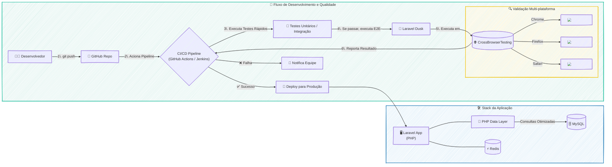

### 🚀 Shosales Review: Otimização de Performance (10x) e Implantação de Testes E2E

#### 🎯 Visão Geral e Arquitetura da Solução

O projeto Shosales Review enfrentava um desafio clássico em sistemas legados: uma experiência de usuário lenta e uma base de código que a equipe hesitava em modificar por medo de introduzir bugs. A página de visualização de imóveis, um ponto crucial da jornada do usuário, levava longos 5 segundos para carregar, comprometendo a usabilidade e a satisfação do cliente.

A solução foi arquitetada em duas frentes estratégicas e complementares:

1.  **Otimização Cirúrgica de Performance:** Realizei um diagnóstico profundo na aplicação Laravel, identificando que a lentidão era causada por um excesso de 37 consultas ao banco de dados para renderizar uma única página. A estratégia foi refatorar a camada de acesso a dados, otimizando as queries com o Eloquent ORM, implementando índices estratégicos no MySQL e, como resultado, **reduzindo o número de consultas para apenas 4**. Essa intervenção resultou em uma **melhora de 10x na performance**, diminuindo o tempo de carregamento para aproximadamente 0.5 segundos.

2.  **Escudo de Qualidade Automatizado:** Para dar segurança à equipe e viabilizar futuras evoluções, implementei uma suíte completa de testes de ponta-a-ponta (E2E) com Laravel Dusk. Esses testes simulam os fluxos de usuário mais críticos e foram integrados a um pipeline de CI/CD (GitHub Actions/Jenkins), rodando automaticamente a cada nova alteração no código. Com a integração do CrossBrowserTesting, garantimos que a aplicação funcionava de forma consistente em múltiplos navegadores e dispositivos, eliminando regressões em produção.

#### 👨‍💻 Meu Papel no Projeto

Como o principal responsável pela modernização e garantia de qualidade da plataforma, minhas responsabilidades foram:

  * **Análise de Performance:** Liderar a investigação e o diagnóstico dos gargalos de performance da aplicação, utilizando ferramentas de profiling para identificar as queries ineficientes.
  * **Engenharia de Backend:** Refatorar o código PHP/Laravel, otimizar as interações com o banco de dados (MySQL) e ajustar o uso do ORM para alcançar a máxima eficiência.
  * **Automação de Testes (QA):** Desenhar, codificar e manter a suíte de testes E2E com Laravel Dusk, definindo os cenários críticos a serem cobertos.
  * **Cultura DevOps:** Estruturar e integrar a execução dos testes automatizados ao pipeline de CI/CD, garantindo que nenhuma alteração que quebrasse a funcionalidade existente chegasse à produção.

#### ✨ Pontos Fortes e Desafios Superados

O maior triunfo deste projeto foi transformar um ponto de grande frustração em um case de sucesso. O desafio não era apenas técnico, mas também cultural. A equipe tinha receio de mexer no código legado.

  * **Superação da Lentidão:** O ganho de performance de 10x não foi apenas uma métrica; foi uma mudança radical na experiência do usuário, visível e comprovável.
  * **Construindo Confiança com Código:** A suíte de testes E2E funcionou como uma "rede de segurança". Ao automatizar a validação dos fluxos críticos, demos à equipe a confiança necessária para refatorar e melhorar o sistema continuamente, sabendo que qualquer regressão seria detectada de forma imediata pelo pipeline. Isso quebrou o ciclo de medo e estagnação.

#### 🌱 Pontos para Evolução Futura

Com a base sólida de performance e qualidade estabelecida, os próximos passos naturais para evoluir o projeto seriam:

1.  **Cache Inteligente:** Expandir o uso do Redis para implementar cache em camadas mais altas da aplicação, como em fragmentos de views e resultados de API, para ganhos de performance ainda mais expressivos.
2.  **Testes de Regressão Visual:** Adicionar testes de regressão visual ao pipeline para detectar automaticamente quebras de layout na interface, garantindo consistência visual a cada deploy.

-----

#### 🛠️ Pilha de Tecnologias (Tech Stack)

| Componente | Tecnologia Utilizada | Papel na Arquitetura |
| :--- | :--- | :--- |
| **Backend** | **Laravel (PHP)** | Framework principal da aplicação, orquestrando as regras de negócio e a lógica de apresentação. |
| **Banco de Dados** | **MySQL** | Armazenamento persistente de todos os dados relacionados a imóveis e avaliações. |
| **Cache** | **Redis** | Utilizado para cache de sessão e otimizações pontuais de performance. |
| **Testes E2E** | **Laravel Dusk** | Ferramenta para automação de testes de ponta-a-ponta, simulando a interação do usuário no navegador. |
| **Testes Cross-Browser** | **CrossBrowserTesting** | Plataforma em nuvem para executar os testes do Dusk em múltiplos navegadores e sistemas operacionais. |
| **CI/CD** | **GitHub Actions / Jenkins** | Orquestradores do pipeline de integração e entrega contínua, automatizando build, testes e deploy. |

-----

#### 🗺️ Diagrama da Arquitetura de Qualidade e CI/CD

---
### RESUMO TÉCNICO PARA EMBEDDING

O projeto consistiu na otimização de performance e implementação de um escudo de qualidade para uma aplicação legada em Laravel (PHP), o Shosales Review. O principal desafio foi a lentidão na renderização de páginas, causada por 37 consultas ineficientes ao banco de dados MySQL via Eloquent ORM. A solução envolveu uma refatoração profunda da camada de acesso a dados, com a otimização de queries e a criação de índices estratégicos no MySQL, resultando em uma redução para apenas 4 consultas e um ganho de performance de 10x. Para garantir a estabilidade e dar confiança à equipe para futuras modificações, foi implementada uma suíte de testes de ponta-a-ponta (E2E) com Laravel Dusk. Esses testes foram integrados a um pipeline de CI/CD utilizando GitHub Actions e Jenkins, com validação em múltiplos navegadores através da plataforma em nuvem CrossBrowserTesting. A automação de QA funcionou como uma rede de segurança contra regressões, fomentando uma cultura de melhoria contínua e superando o receio de modificar o código legado. As evoluções futuras planejadas incluem a implementação de cache com Redis e testes de regressão visual.

### CLASSIFICAÇÃO DE TECNOLOGIAS E CONCEITOS

| Categoria | Tecnologias e Conceitos |
| :--- | :--- |
| 🤖 **AI & Machine Learning** | N/A |
| 💻 **Software Development** | Laravel, PHP, Eloquent ORM, Legacy Code Refactoring, Performance Profiling |
| 🏛️ **Architecture**| Legacy System Modernization, Data Access Layer Optimization |
| ☁️ **Cloud Computing** | CrossBrowserTesting |
| 🌐 **API RESTFul development** | N/A |
| 🎨 **Frontend Development** | User Experience (UX) Optimization, Visual Regression Testing (future work) |
| 📱 **Mobile Development** | N/A |
| 🗃️ **Database** | MySQL, Query Optimization, Database Indexing |
| 📊 **Data Management** | N/A |
| 📝 **Content Management - CMS** | N/A |
| 🖥️ **System Administration** | N/A |
| 🚀 **DevOps** | CI/CD, GitHub Actions, Jenkins, QA Automation, E2E Testing, Laravel Dusk |
| 👨‍💼 **Leadership** | Technical Leadership, Project Modernization |
| 🤝 **Coaching** | Team Confidence Building, Cultural Change Management |
|  agile **Agile Project Management** | Continuous Improvement, Regression Prevention |