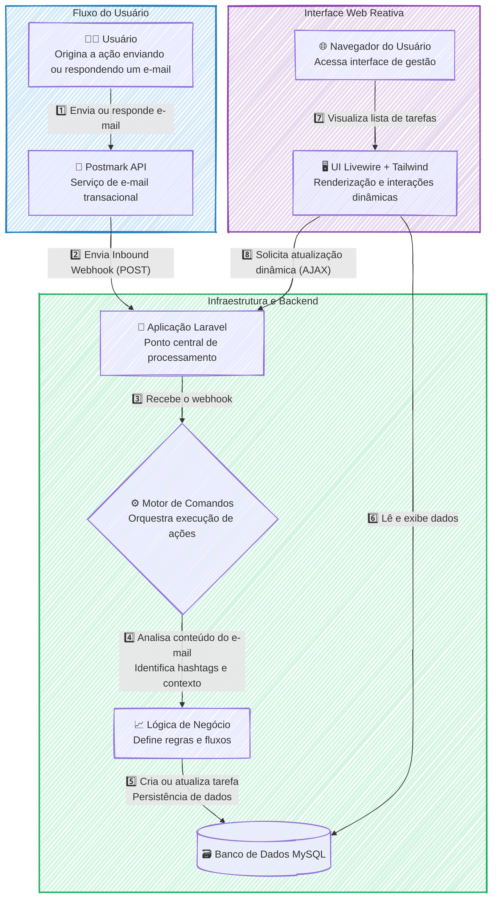

### 🚀 Gerenciador de Tarefas Conversacional via E-mail 📥 Postmark Challenge

#### 🎯 Visão Geral e Arquitetura da Solução

Este projeto nasceu para solucionar uma dor comum no dia a dia de qualquer profissional: a fricção de transformar e-mails em tarefas acionáveis. Em vez de alternar entre a caixa de entrada e um aplicativo de To-Do, a solução transforma o próprio e-mail em uma poderosa interface de gerenciamento. O usuário pode criar, atualizar, comentar e concluir tarefas simplesmente enviando um e-mail para um endereço dedicado ou respondendo a uma conversa existente, utilizando comandos simples e intuitivos como `#prioridade` ou `#concluir`.

A arquitetura foi desenhada para ser ágil e orientada a eventos. O fluxo se inicia quando o **Postmark API** recebe um e-mail e, através de um **Inbound Webhook**, notifica a aplicação **Laravel** em tempo real. Um motor de comandos customizado entra em ação, analisando o corpo do e-mail em busca de "hashtags" de ação. Cada comando aciona a lógica de negócio correspondente, atualizando o estado da tarefa no banco de dados. Para a visualização, uma interface web reativa, construída com **Livewire** e **Tailwind CSS**, exibe a lista de tarefas, que se atualiza dinamicamente sem a necessidade de recarregar a página, proporcionando uma experiência de usuário fluida e moderna.

#### 👨‍💻 Meu Papel no Projeto

Como idealizador e desenvolvedor da solução, minhas principais responsabilidades foram:

  * **Arquitetura do Processamento de E-mails:** Implementar a lógica de recebimento e interpretação de e-mails em tempo real utilizando Postmark Inbound Webhooks, que servem como gatilho para todo o fluxo da aplicação.
  * **Desenvolvimento do Motor de Comandos:** Criar um processador de comandos em Laravel para analisar o corpo do e-mail, identificar hashtags de ação (ex: `#comentario`, `#concluir`) e executar as operações de negócio correspondentes.
  * **Construção do Frontend Reativo:** Desenvolver a interface de usuário para visualização das tarefas com Livewire e Tailwind CSS, garantindo atualizações dinâmicas e uma experiência moderna sem a complexidade de uma Single Page Application (SPA).
  * **Garantia de Qualidade:** Assegurar a robustez e a confiabilidade do sistema, especialmente do motor de comandos, através de uma suíte de testes completa escrita com Pest.

#### ✨ Pontos Fortes e Desafios Superados

O grande trunfo do projeto é sua simplicidade e elegância: ele se integra a um fluxo de trabalho que o usuário já domina — o e-mail. A solução elimina a necessidade de um novo software, transformando uma ferramenta de comunicação em uma plataforma de produtividade.

O principal desafio técnico foi criar um sistema robusto para "traduzir" o texto não estruturado de um e-mail em comandos de sistema precisos e confiáveis. Superamos isso com o **desenvolvimento de um motor de comandos customizado**, capaz de analisar o conteúdo de forma inteligente. Outra vitória foi a escolha do **Livewire**, que permitiu construir uma interface reativa e performática com a produtividade do ecossistema Laravel, evitando a complexidade de gerenciar um frontend desacoplado.

#### 🌱 Pontos para Evolução Futura

Para o futuro, a solução poderia evoluir com a implementação de um processamento de linguagem natural (PLN) mais avançado, permitindo que os usuários escrevam comandos de forma mais livre, sem a rigidez das hashtags. Outra evolução seria a integração com calendários (Google Calendar, Outlook) para agendar tarefas com datas de vencimento.

-----

#### 🛠️ Pilha de Tecnologias (Tech Stack)

| Componente | Tecnologia Utilizada | Papel na Arquitetura |
| :--- | :--- | :--- |
| **Backend** | **Laravel** | Orquestra toda a lógica de negócio, rotas, processamento de webhooks e interação com o banco de dados. |
| **Frontend Reativo** | **Livewire & Tailwind CSS** | Constrói uma interface de usuário dinâmica e moderna para a visualização das tarefas, com atualizações em tempo real. |
| **Testes Automatizados**| **Pest** | Garante a confiabilidade e a robustez das regras de negócio e do motor de comandos com uma suíte de testes limpa. |
| **Gateway de E-mail** | **Postmark API & Webhooks** | Recebe os e-mails, dispara os eventos via webhook para a aplicação e gerencia o envio de respostas. |
| **Modelo Arquitetural** | **Arquitetura Orientada a Eventos** | Permite que a aplicação reaja de forma assíncrona aos e-mails recebidos, garantindo um fluxo desacoplado e escalável. |

-----

#### 🔗 Links e Recursos
* **🎬 Apresentação em Vídeo:** [Assista no YouTube](https://www.youtube.com/watch?v=NDFgcH2X1ZI)
* **📂 Repositório Open Source:** [Veja o código no GitHub](https://github.com/lfrichter/Interactive-email-management)

---

#### 🗺️ Diagrama da Arquitetura

---
### RESUMO TÉCNICO PARA EMBEDDING

A solução é um gerenciador de tarefas conversacional implementado em uma arquitetura orientada a eventos, acionada por e-mails. O fluxo é iniciado por um Inbound Webhook da Postmark API, que notifica uma aplicação backend em Laravel. Um motor de comandos customizado, com lógica de negócio robusta validada por testes automatizados em Pest, processa o corpo do e-mail para identificar e executar ações baseadas em hashtags, como `#prioridade` ou `#concluir`. O estado das tarefas é persistido em um banco de dados MySQL. A interface de usuário para visualização é um frontend reativo construído com Livewire e Tailwind CSS, garantindo atualizações dinâmicas da lista de tarefas sem a necessidade de recarregar a página. O principal desafio superado foi a tradução de texto não estruturado de e-mails em comandos de sistema precisos através do motor de comandos, evitando a complexidade de uma SPA desacoplada ao utilizar a stack TALL (Tailwind, Alpine, Livewire, Laravel). Futuras evoluções contemplam o uso de processamento de linguagem natural (PLN).

### CLASSIFICAÇÃO DE TECNOLOGIAS E CONCEITOS

| Categoria | Tecnologias e Conceitos |
| :--- | :--- |
| **AI & Machine Learning** | 🧠 Processamento de Linguagem Natural (PLN) |
| **Software Development** | 👨‍💻 Laravel, Pest, Motor de Comandos Customizado |
| **Architecture**| 🏗️ Arquitetura Orientada a Eventos, Inbound Webhook, Sistema Desacoplado, Sistema Escalável |
| **Cloud Computing** | ☁️ Postmark API (SaaS) |
| **API RESTFul development** | 🔄 Postmark API, Webhooks |
| **Frontend Development** | 🖥️ Livewire, Tailwind CSS, Interface Reativa |
| **Mobile Development** | 📱 N/A |
| **Database** | 🗃️ MySQL |
| **Data Management** | 💾 Persistência de Dados |
| **Content Management - CMS** | 📄 N/A |
| **System Administration** | ⚙️ N/A |
| **DevOps** | 🔁 Testes Automatizados |
| **Leadership** | 🚀 Idealizador, Desenvolvedor da Solução |
| **Coaching** | 🤝 N/A |
| **Agile Project Management** |  scrum N/A |